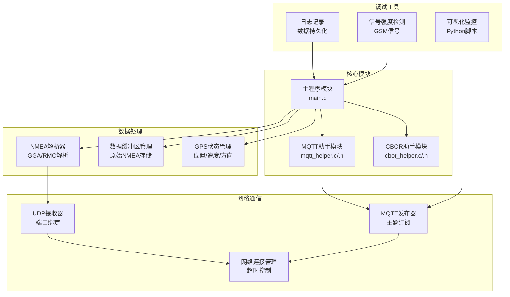
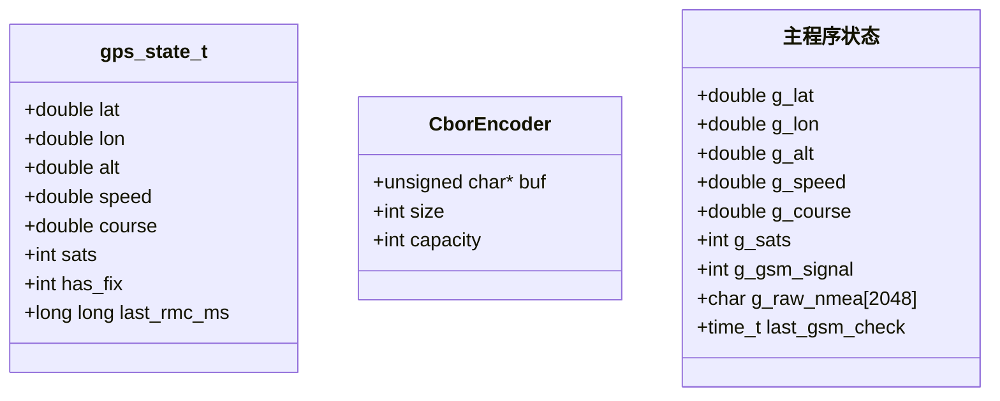
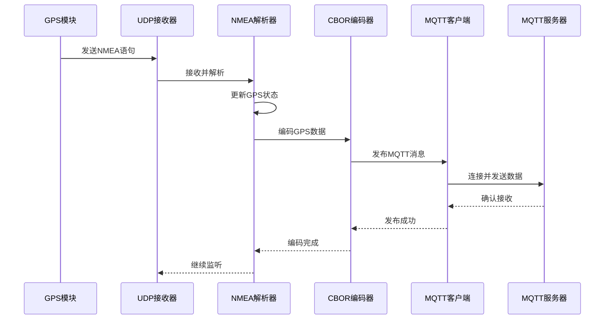
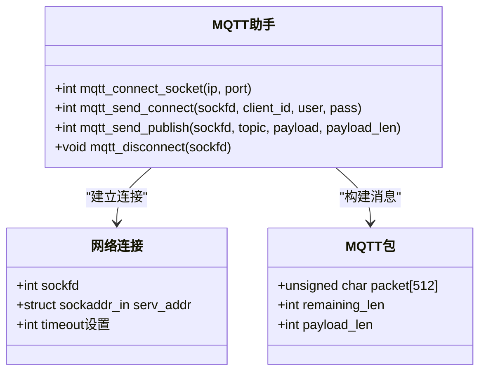
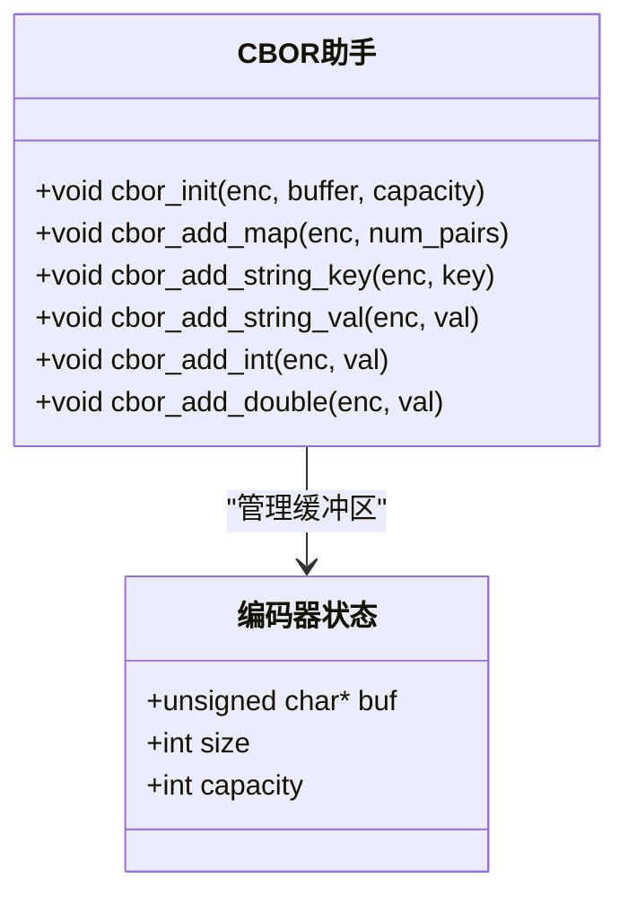
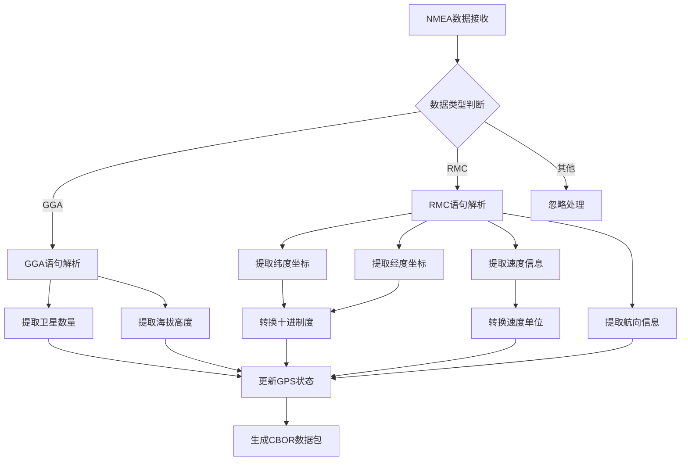
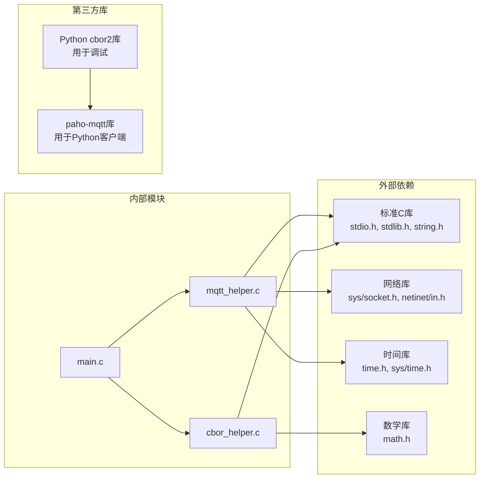

# API参考手册

<cite>
**本文档引用的文件**
- [main.c](file://dev_code/dev_code/mqtt_project_16_ver1_based-on-9/main.c)
- [mqtt_helper.h](file://dev_code/dev_code/mqtt_project_16_ver1_based-on-9/mqtt_helper.h)
- [mqtt_helper.c](file://dev_code/dev_code/mqtt_project_16_ver1_based-on-9/mqtt_helper.c)
- [cbor_helper.h](file://dev_code/dev_code/mqtt_project_16_ver1_based-on-9/cbor_helper.h)
- [cbor_helper.c](file://dev_code/dev_code/mqtt_project_16_ver1_based-on-9/cbor_helper.c)
- [main.c](file://dev_code/dev_code/mqtt_project_16_ver2_based-on-15/main.c)
- [main.c](file://dev_code/dev_code/mqtt_project_9/main.c)
- [visual_mqtt_poc-brt-solo_2_hongdian.py](file://OPENSDT_none-armhf_plugin_mqtt-dummy-16-based-on-15_nmea-debug_16.15.0_2602051525-带rawdata/visual_mqtt_poc-brt-solo_2_hongdian.py)
- [visual_mqtt_poc-brt-solo_2_hongdian.py](file://visual_mqtt_poc-brt-solo_2_hongdian-不带rawdata/visual_mqtt_poc-brt-solo_2_hongdian.py)
- [gps_local.raw](file://gps_local.raw)
</cite>

## 目录
1. [简介](#简介)
2. [项目结构](#项目结构)
3. [核心组件](#核心组件)
4. [架构概览](#架构概览)
5. [详细组件分析](#详细组件分析)
6. [依赖关系分析](#依赖关系分析)
7. [性能考虑](#性能考虑)
8. [故障排除指南](#故障排除指南)
9. [结论](#结论)
10. [附录](#附录)

## 简介

印尼GPS追踪系统是一个基于NMEA 0183协议的实时GPS数据采集和传输系统。该系统通过UDP接收GPS模块输出的NMEA语句，解析GPS数据，使用CBOR编码格式进行数据压缩，然后通过MQTT协议发送到服务器。系统支持多种版本，从基础版本到增强版本，提供了完整的GPS数据处理、编码和传输功能。

## 项目结构

该项目采用模块化设计，主要包含以下核心模块：



**图表来源**
- [main.c](file://dev_code/dev_code/mqtt_project_16_ver1_based-on-9/main.c#L182-L259)
- [mqtt_helper.h](file://dev_code/dev_code/mqtt_project_16_ver1_based-on-9/mqtt_helper.h#L1-L13)
- [cbor_helper.h](file://dev_code/dev_code/mqtt_project_16_ver1_based-on-9/cbor_helper.h#L1-L27)

**章节来源**
- [main.c](file://dev_code/dev_code/mqtt_project_16_ver1_based-on-9/main.c#L1-L50)
- [Readme.md.txt](file://dev_code/dev_code/Readme.md.txt#L1-L12)

## 核心组件

### 配置参数

系统使用预处理器宏定义进行配置，所有配置参数都位于源代码文件中：

#### 硬编码参数（编译时固定）
- **MQTT服务器配置**
  - `MQTT_BROKER`: MQTT服务器地址
  - `MQTT_PORT`: MQTT服务器端口
  - `MQTT_USER`: MQTT认证用户名
  - `MQTT_PASS`: MQTT认证密码

- **车辆信息配置**
  - `BUS_NO`: 车辆编号
  - `BUS_NO_TAG`: 车辆标签标识
  - `PROVIDER_ID`: 运营商ID
  - `KORIDOR_ID`: 路线ID

- **网络配置**
  - `UDP_PORT`: UDP监听端口
  - `MODEM_INFO_FILE`: 模块信息文件路径

#### 可配置参数（运行时可修改）
- **缓冲区大小**: 2048字节（原始NMEA缓冲区）
- **心跳间隔**: 150毫秒（select超时设置）
- **信号检查间隔**: 2秒（GSM信号更新频率）

**章节来源**
- [main.c](file://dev_code/dev_code/mqtt_project_16_ver1_based-on-9/main.c#L13-L26)
- [main.c](file://dev_code/dev_code/mqtt_project_16_ver2_based-on-15/main.c#L14-L27)

### 数据结构定义

#### 全局状态结构体


**图表来源**
- [main.c](file://dev_code/dev_code/mqtt_project_16_ver2_based-on-15/main.c#L30-L46)
- [cbor_helper.h](file://dev_code/dev_code/mqtt_project_16_ver1_based-on-9/cbor_helper.h#L7-L12)

#### CBOR编码器结构
- **CborEncoder**: 包含缓冲区指针、已写入字节数和容量
- **缓冲区管理**: 支持动态增长的编码缓冲区

**章节来源**
- [cbor_helper.h](file://dev_code/dev_code/mqtt_project_16_ver1_based-on-9/cbor_helper.h#L7-L12)
- [main.c](file://dev_code/dev_code/mqtt_project_16_ver1_based-on-9/main.c#L28-L40)

## 架构概览

系统采用事件驱动的异步架构，主要处理流程如下：



**图表来源**
- [main.c](file://dev_code/dev_code/mqtt_project_16_ver1_based-on-9/main.c#L201-L256)
- [mqtt_helper.c](file://dev_code/dev_code/mqtt_project_16_ver1_based-on-9/mqtt_helper.c#L38-L86)
- [cbor_helper.c](file://dev_code/dev_code/mqtt_project_16_ver1_based-on-9/cbor_helper.c#L38-L89)

## 详细组件分析

### MQTT通信函数

#### 函数接口定义



**图表来源**
- [mqtt_helper.h](file://dev_code/dev_code/mqtt_project_16_ver1_based-on-9/mqtt_helper.h#L4-L10)
- [mqtt_helper.c](file://dev_code/dev_code/mqtt_project_16_ver1_based-on-9/mqtt_helper.c#L38-L115)

#### 核心函数详解

##### mqtt_connect_socket函数
- **功能**: 建立TCP连接到MQTT服务器
- **参数**: 
  - `ip`: 服务器IP地址字符串
  - `port`: 服务器端口号
- **返回值**: 成功返回套接字描述符，失败返回-1
- **实现细节**: 设置10秒超时，使用IPv4地址族

##### mqtt_send_connect函数
- **功能**: 发送MQTT CONNECT包
- **参数**: 
  - `sockfd`: 已建立的套接字
  - `client_id`: 客户端ID
  - `user`: 用户名
  - `pass`: 密码
- **返回值**: 成功返回0，失败返回-1
- **实现细节**: 构建MQTT协议CONNECT包，包含协议头和可变头部

##### mqtt_send_publish函数
- **功能**: 发送MQTT PUBLISH包
- **参数**: 
  - `sockfd`: 已建立的套接字
  - `topic`: MQTT主题
  - `payload`: 负载数据
  - `payload_len`: 负载长度
- **返回值**: 成功返回0，失败返回-1
- **实现细节**: 支持二进制负载，使用payload_len参数

##### mqtt_disconnect函数
- **功能**: 发送MQTT DISCONNECT包并关闭连接
- **参数**: `sockfd`: 套接字描述符
- **返回值**: 无返回值

**章节来源**
- [mqtt_helper.h](file://dev_code/dev_code/mqtt_project_16_ver1_based-on-9/mqtt_helper.h#L4-L10)
- [mqtt_helper.c](file://dev_code/dev_code/mqtt_project_16_ver1_based-on-9/mqtt_helper.c#L38-L115)

### CBOR编码函数

#### 函数接口定义



**图表来源**
- [cbor_helper.h](file://dev_code/dev_code/mqtt_project_16_ver1_based-on-9/cbor_helper.h#L14-L26)
- [cbor_helper.c](file://dev_code/dev_code/mqtt_project_16_ver1_based-on-9/cbor_helper.c#L38-L89)

#### 核心函数详解

##### cbor_init函数
- **功能**: 初始化CBOR编码器
- **参数**: 
  - `enc`: 编码器指针
  - `buffer`: 输出缓冲区
  - `capacity`: 缓冲区容量
- **返回值**: 无返回值
- **实现细节**: 设置缓冲区指针、容量和当前大小

##### cbor_add_map函数
- **功能**: 添加CBOR映射类型
- **参数**: 
  - `enc`: 编码器指针
  - `num_pairs`: 键值对数量
- **返回值**: 无返回值
- **实现细节**: 写入映射头，支持0-31个键值对的紧凑编码

##### cbor_add_string_key函数
- **功能**: 添加字符串键
- **参数**: 
  - `enc`: 编码器指针
  - `key`: 键字符串
- **返回值**: 无返回值
- **实现细节**: 支持不同长度的字符串编码

##### cbor_add_int函数
- **功能**: 添加整数
- **参数**: 
  - `enc`: 编码器指针
  - `val`: 整数值
- **返回值**: 无返回值
- **实现细节**: 支持正负整数的CBOR编码

##### cbor_add_double函数
- **功能**: 添加双精度浮点数
- **参数**: 
  - `enc`: 编码器指针
  - `val`: 浮点数值
- **返回值**: 无返回值
- **实现细节**: 使用64位IEEE 754格式，进行字节序转换

**章节来源**
- [cbor_helper.h](file://dev_code/dev_code/mqtt_project_16_ver1_based-on-9/cbor_helper.h#L14-L26)
- [cbor_helper.c](file://dev_code/dev_code/mqtt_project_16_ver1_based-on-9/cbor_helper.c#L38-L89)

### GPS数据处理函数

#### NMEA解析逻辑



**图表来源**
- [main.c](file://dev_code/dev_code/mqtt_project_16_ver1_based-on-9/main.c#L86-L133)
- [main.c](file://dev_code/dev_code/mqtt_project_16_ver2_based-on-15/main.c#L116-L165)

#### 核心处理函数

##### parse_gngga函数
- **功能**: 解析GGA语句，提取卫星信息和海拔数据
- **输入**: NMEA GGA语句字符串
- **输出**: 更新全局卫星数量和海拔高度变量
- **实现细节**: 使用令牌化方法解析语句字段

##### parse_gnrmc函数
- **功能**: 解析RMC语句，提取位置和运动数据
- **输入**: NMEA RMC语句字符串
- **输出**: 返回解析结果，更新位置、速度、航向数据
- **实现细节**: 支持原始速度值直接使用，无需单位转换

##### convert_nmea_to_decimal函数
- **功能**: 将NMEA格式坐标转换为十进制度
- **输入**: NMEA格式坐标字符串
- **输出**: 十进制度坐标值
- **实现细节**: 处理度分格式，转换为小数度

**章节来源**
- [main.c](file://dev_code/dev_code/mqtt_project_16_ver1_based-on-9/main.c#L86-L133)
- [main.c](file://dev_code/dev_code/mqtt_project_16_ver2_based-on-15/main.c#L116-L165)

### 数据结构定义

#### GPS状态结构
- **位置信息**: 纬度、经度、海拔
- **运动信息**: 速度、航向角
- **卫星信息**: 卫星数量、定位状态
- **时间戳**: 最后RMC更新时间

#### CBOR编码结构
- **缓冲区管理**: 动态增长的编码缓冲区
- **类型支持**: 字符串、整数、双精度浮点数
- **映射结构**: 支持嵌套对象和数组

**章节来源**
- [main.c](file://dev_code/dev_code/mqtt_project_16_ver2_based-on-15/main.c#L30-L46)
- [cbor_helper.h](file://dev_code/dev_code/mqtt_project_16_ver1_based-on-9/cbor_helper.h#L7-L12)

## 依赖关系分析



**图表来源**
- [main.c](file://dev_code/dev_code/mqtt_project_16_ver1_based-on-9/main.c#L1-L11)
- [mqtt_helper.c](file://dev_code/dev_code/mqtt_project_16_ver1_based-on-9/mqtt_helper.c#L1-L8)
- [visual_mqtt_poc-brt-solo_2_hongdian.py](file://OPENSDT_none-armhf_plugin_mqtt-dummy-16-based-on-15_nmea-debug_16.15.0_2602051525-带rawdata/visual_mqtt_poc-brt-solo_2_hongdian.py#L1-L17)

**章节来源**
- [main.c](file://dev_code/dev_code/mqtt_project_16_ver1_based-on-9/main.c#L1-L11)
- [mqtt_helper.c](file://dev_code/dev_code/mqtt_project_16_ver1_based-on-9/mqtt_helper.c#L1-L8)

## 性能考虑

### 编码效率
- **CBOR优势**: 相比JSON更紧凑的数据表示，减少网络传输开销
- **缓冲区管理**: 动态增长的缓冲区避免内存溢出
- **批量处理**: 支持多条NMEA语句的累积处理

### 网络优化
- **连接复用**: MQTT连接在单次发布后保持，减少连接开销
- **超时控制**: 10秒连接超时，防止长时间阻塞
- **心跳机制**: 150毫秒选择超时，平衡响应性和CPU使用

### 内存管理
- **缓冲区限制**: 2048字节原始NMEA缓冲区，防止内存泄漏
- **状态重置**: 发布后清空缓冲区，避免数据累积
- **信号检测**: 2秒间隔检查，平衡准确性与性能

## 故障排除指南

### 常见错误代码

| 错误码 | 含义 | 可能原因 | 解决方案 |
|--------|------|----------|----------|
| -1 | 连接失败 | 网络不可达或服务器拒绝 | 检查MQTT服务器配置和网络连通性 |
| -2 | 编码失败 | CBOR缓冲区不足 | 增大CBOR缓冲区容量 |
| -3 | 解析失败 | NMEA语句格式错误 | 验证GPS模块输出格式 |
| -4 | 发送失败 | 网络中断或权限问题 | 检查网络连接和MQTT权限 |

### 调试接口

#### Python可视化监控
系统提供了完整的Python调试工具：
- **实时监控**: WebSocket连接显示GPS轨迹
- **数据验证**: CBOR解码验证原始数据
- **日志记录**: 自动保存数据到文件
- **地图集成**: Leaflet地图显示GPS点

#### 日志记录功能
- **原始数据日志**: 记录完整的NMEA语句
- **解析结果日志**: 记录解析后的GPS数据
- **网络状态日志**: 记录MQTT连接状态
- **错误日志**: 记录解析和传输过程中的错误

**章节来源**
- [visual_mqtt_poc-brt-solo_2_hongdian.py](file://OPENSDT_none-armhf_plugin_mqtt-dummy-16-based-on-15_nmea-debug_16.15.0_2602051525-带rawdata/visual_mqtt_poc-brt-solo_2_hongdian.py#L132-L187)
- [gps_local.raw](file://gps_local.raw#L1-L50)

## 结论

印尼GPS追踪系统提供了完整的GPS数据采集、处理和传输解决方案。系统具有以下特点：

### 技术优势
- **模块化设计**: 清晰的功能分离，便于维护和扩展
- **高效编码**: CBOR格式确保数据传输效率
- **实时处理**: 异步架构支持高频率数据更新
- **完整监控**: 提供端到端的数据流可视化

### 开发建议
- **参数优化**: 根据实际部署环境调整缓冲区大小和超时设置
- **错误处理**: 增强异常处理机制，提高系统稳定性
- **性能调优**: 根据硬件能力优化编码和网络参数
- **安全加固**: 实施更严格的认证和授权机制

该系统为印尼地区的GPS追踪应用提供了坚实的技术基础，支持二次开发和系统集成需求。

## 附录

### 版本对比

| 特性 | 版本9 | 版本16_ver1 | 版本16_ver2 |
|------|-------|-------------|-------------|
| NMEA处理 | 基础解析 | 增强解析 | 改进解析 |
| CBOR支持 | 基础编码 | 完整编码 | 完整编码 |
| 网络优化 | 基础连接 | 连接复用 | 连接复用 |
| 调试工具 | 基础日志 | Python监控 | Python监控 |
| 错误处理 | 基础处理 | 增强处理 | 完善处理 |

### 使用示例

#### 基本配置
```c
// 配置MQTT服务器
#define MQTT_BROKER "your.mqtt.server"
#define MQTT_PORT 1883
#define MQTT_USER "username"
#define MQTT_PASS "password"

// 配置车辆信息
#define BUS_NO "BUS001"
#define BUS_NO_TAG "TAG001"
#define PROVIDER_ID 1
#define KORIDOR_ID 10
```

#### 数据发布流程
1. 接收NMEA语句
2. 解析GPS数据
3. 编码CBOR格式
4. 连接MQTT服务器
5. 发布GPS数据
6. 关闭连接

**章节来源**
- [main.c](file://dev_code/dev_code/mqtt_project_16_ver1_based-on-9/main.c#L13-L26)
- [main.c](file://dev_code/dev_code/mqtt_project_16_ver1_based-on-9/main.c#L135-L180)