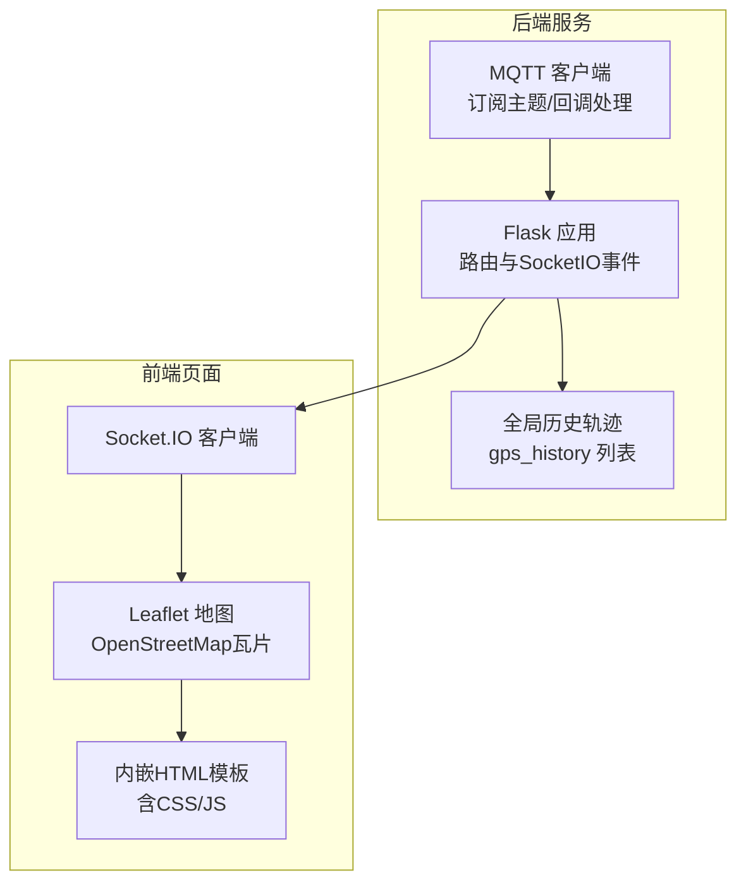
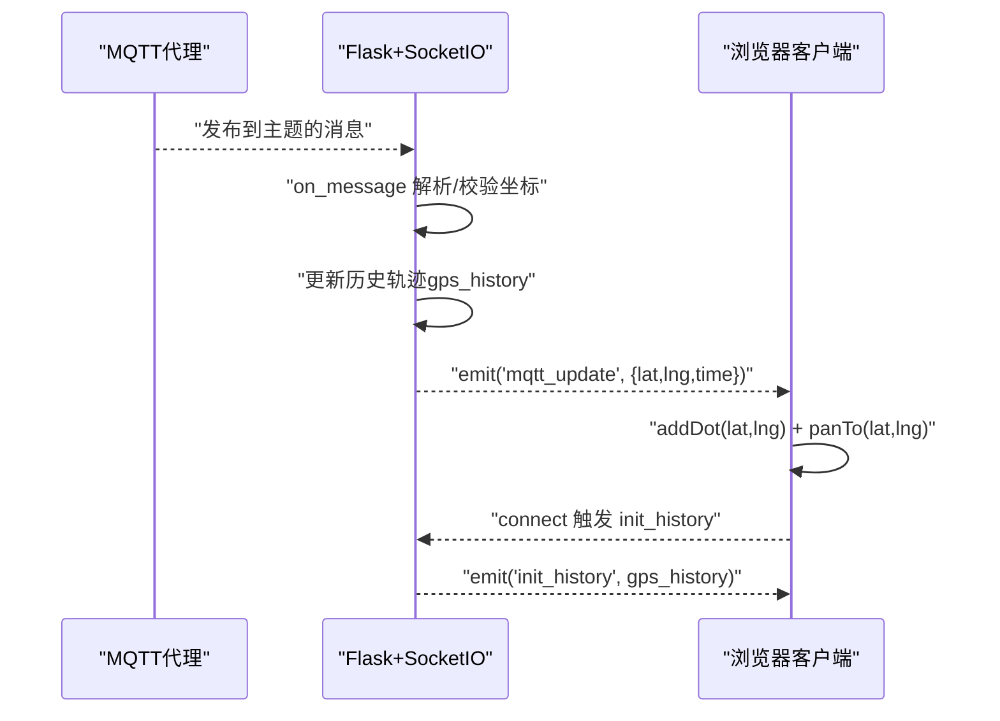
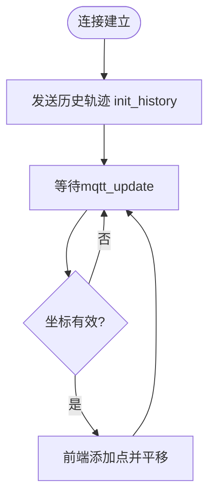
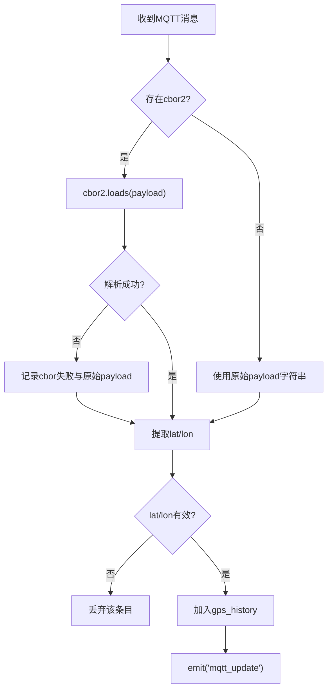
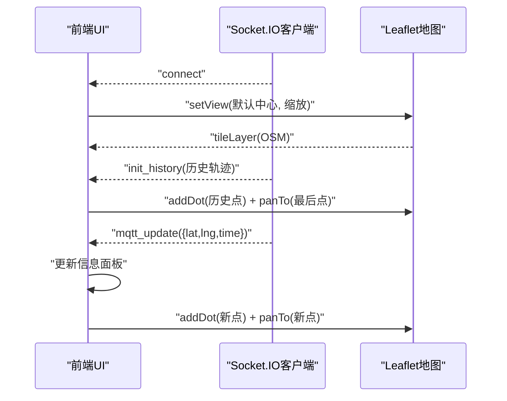
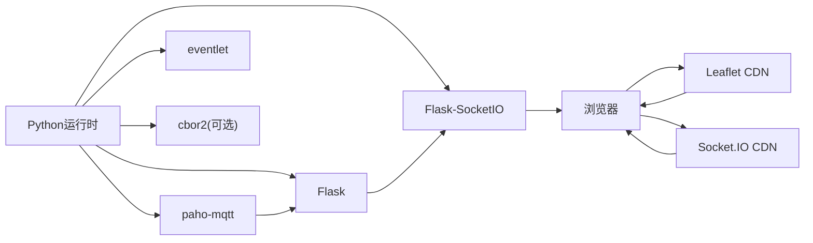

# Web可视化系统

<cite>
**本文引用的文件**
- [visual_mqtt_poc-brt-solo_2_hongdian.py（带rawdata）](file://OPENSDT_none-armhf_plugin_mqtt-dummy-16-based-on-15_nmea-debug_16.15.0_2602051525-带rawdata/visual_mqtt_poc-brt-solo_2_hongdian.py)
- [visual_mqtt_poc-brt-solo_2_hongdian.py（不带rawdata）](file://visual_mqtt_poc-brt-solo_2_hongdian-不带rawdata/visual_mqtt_poc-brt-solo_2_hongdian.py)
- [Readme.md.txt](file://dev_code/dev_code/Readme.md.txt)
- [gps_local.raw](file://gps_local.raw)
</cite>

## 目录
1. [简介](#简介)
2. [项目结构](#项目结构)
3. [核心组件](#核心组件)
4. [架构总览](#架构总览)
5. [详细组件分析](#详细组件分析)
6. [依赖关系分析](#依赖关系分析)
7. [性能考虑](#性能考虑)
8. [故障排除指南](#故障排除指南)
9. [结论](#结论)
10. [附录](#附录)

## 简介
本项目是为印尼GPS追踪系统构建的Web可视化监控系统，采用Flask + SocketIO实现实时数据推送，并通过Leaflet地图展示轨迹点。系统从MQTT主题订阅GPS数据，解析NMEA/二进制载荷，将有效坐标以“点”形式在地图上动态渲染，同时提供历史轨迹加载与实时跟随功能。系统支持CBOR解码与原始载荷回退处理，具备基础日志记录能力。

## 项目结构
- 后端核心：两套几乎相同的Python脚本，分别用于演示“带rawdata”和“不带rawdata”的运行模式，均包含Flask路由、SocketIO事件、MQTT订阅与消息处理、前端HTML模板内嵌等模块。
- 前端集成：内嵌HTML模板，使用Leaflet地图库与Socket.IO客户端，实现地图初始化、瓦片图层加载、点标记渲染、连接状态提示与历史轨迹加载。
- 开发说明：dev_code目录下的说明文档概述了不同版本的改进方向与问题记录。
- 数据样例：gps_local.raw提供NMEA语料样本，便于理解数据格式与验证解析逻辑。

**图表来源**
- [visual_mqtt_poc-brt-solo_2_hongdian.py（带rawdata）](file://OPENSDT_none-armhf_plugin_mqtt-dummy-16-based-on-15_nmea-debug_16.15.0_2602051525-带rawdata/visual_mqtt_poc-brt-solo_2_hongdian.py#L38-L130)
- [visual_mqtt_poc-brt-solo_2_hongdian.py（不带rawdata）](file://visual_mqtt_poc-brt-solo_2_hongdian-不带rawdata/visual_mqtt_poc-brt-solo_2_hongdian.py#L38-L130)

**章节来源**
- [visual_mqtt_poc-brt-solo_2_hongdian.py（带rawdata）](file://OPENSDT_none-armhf_plugin_mqtt-dummy-16-based-on-15_nmea-debug_16.15.0_2602051525-带rawdata/visual_mqtt_poc-brt-solo_2_hongdian.py#L1-L217)
- [visual_mqtt_poc-brt-solo_2_hongdian.py（不带rawdata）](file://visual_mqtt_poc-brt-solo_2_hongdian-不带rawdata/visual_mqtt_poc-brt-solo_2_hongdian.py#L1-L217)
- [Readme.md.txt](file://dev_code/dev_code/Readme.md.txt#L1-L12)

## 核心组件
- Flask + SocketIO
  - 使用Flask作为Web框架，SocketIO负责WebSocket双向通信，支持跨域与eventlet异步模式。
  - 提供根路由返回内嵌HTML模板；连接建立时向客户端发送历史轨迹。
- MQTT订阅与消息处理
  - 订阅指定主题，支持CBOR与字符串两种载荷解析；提取经纬度，过滤无效坐标(0,0)，更新历史轨迹并广播实时事件。
  - 支持可选的日志写入，记录原始载荷与解析结果。
- 前端渲染
  - 初始化地图中心与OSM瓦片；首次连接时接收历史轨迹并渲染为点；新数据到达时添加点并自动平移至最新位置。
  - 显示连接状态、当前经纬度、时间戳与累计点数。

**章节来源**
- [visual_mqtt_poc-brt-solo_2_hongdian.py（带rawdata）](file://OPENSDT_none-armhf_plugin_mqtt-dummy-16-based-on-15_nmea-debug_16.15.0_2602051525-带rawdata/visual_mqtt_poc-brt-solo_2_hongdian.py#L32-L34)
- [visual_mqtt_poc-brt-solo_2_hongdian.py（带rawdata）](file://OPENSDT_none-armhf_plugin_mqtt-dummy-16-based-on-15_nmea-debug_16.15.0_2602051525-带rawdata/visual_mqtt_poc-brt-solo_2_hongdian.py#L142-L187)
- [visual_mqtt_poc-brt-solo_2_hongdian.py（带rawdata）](file://OPENSDT_none-armhf_plugin_mqtt-dummy-16-based-on-15_nmea-debug_16.15.0_2602051525-带rawdata/visual_mqtt_poc-brt-solo_2_hongdian.py#L201-L209)
- [visual_mqtt_poc-brt-solo_2_hongdian.py（带rawdata）](file://OPENSDT_none-armhf_plugin_mqtt-dummy-16-based-on-15_nmea-debug_16.15.0_2602051525-带rawdata/visual_mqtt_poc-brt-solo_2_hongdian.py#L38-L130)

## 架构总览
系统采用“MQTT -> Flask -> SocketIO -> 前端”的数据流，整体为单机部署模式，适合小规模实时监控场景。

**图表来源**
- [visual_mqtt_poc-brt-solo_2_hongdian.py（带rawdata）](file://OPENSDT_none-armhf_plugin_mqtt-dummy-16-based-on-15_nmea-debug_16.15.0_2602051525-带rawdata/visual_mqtt_poc-brt-solo_2_hongdian.py#L142-L187)
- [visual_mqtt_poc-brt-solo_2_hongdian.py（带rawdata）](file://OPENSDT_none-armhf_plugin_mqtt-dummy-16-based-on-15_nmea-debug_16.15.0_2602051525-带rawdata/visual_mqtt_poc-brt-solo_2_hongdian.py#L206-L209)

## 详细组件分析

### Flask + SocketIO 实时通信
- 配置与启动
  - 创建Flask应用与SocketIO实例，启用跨域与eventlet异步模式。
  - 主进程启动独立线程运行MQTT客户端，主线程启动socketio.run监听本地端口。
- 事件处理
  - 客户端连接时，向其发送历史轨迹，确保首次打开即有历史点位。
  - 消息处理中，仅当坐标有效时才广播实时事件，避免无效数据污染UI。

**图表来源**
- [visual_mqtt_poc-brt-solo_2_hongdian.py（带rawdata）](file://OPENSDT_none-armhf_plugin_mqtt-dummy-16-based-on-15_nmea-debug_16.15.0_2602051525-带rawdata/visual_mqtt_poc-brt-solo_2_hongdian.py#L206-L209)
- [visual_mqtt_poc-brt-solo_2_hongdian.py（带rawdata）](file://OPENSDT_none-armhf_plugin_mqtt-dummy-16-based-on-15_nmea-debug_16.15.0_2602051525-带rawdata/visual_mqtt_poc-brt-solo_2_hongdian.py#L171-L178)

**章节来源**
- [visual_mqtt_poc-brt-solo_2_hongdian.py（带rawdata）](file://OPENSDT_none-armhf_plugin_mqtt-dummy-16-based-on-15_nmea-debug_16.15.0_2602051525-带rawdata/visual_mqtt_poc-brt-solo_2_hongdian.py#L32-L34)
- [visual_mqtt_poc-brt-solo_2_hongdian.py（带rawdata）](file://OPENSDT_none-armhf_plugin_mqtt-dummy-16-based-on-15_nmea-debug_16.15.0_2602051525-带rawdata/visual_mqtt_poc-brt-solo_2_hongdian.py#L211-L217)

### MQTT 数据接收与处理
- 连接与订阅
  - 使用用户名密码认证，订阅固定主题；连接成功后开始接收消息。
- 载荷解析
  - 优先尝试CBOR解码；若失败则记录错误并保留原始payload。
  - 将解析后的字典写入日志文件（可选），便于问题排查。
- 坐标提取与过滤
  - 从载荷中提取纬度/经度字段，转换为浮点数；过滤(0,0)无效坐标。
  - 有效坐标加入历史列表并触发实时事件广播。

**图表来源**
- [visual_mqtt_poc-brt-solo_2_hongdian.py（带rawdata）](file://OPENSDT_none-armhf_plugin_mqtt-dummy-16-based-on-15_nmea-debug_16.15.0_2602051525-带rawdata/visual_mqtt_poc-brt-solo_2_hongdian.py#L13-L17)
- [visual_mqtt_poc-brt-solo_2_hongdian.py（带rawdata）](file://OPENSDT_none-armhf_plugin_mqtt-dummy-16-based-on-15_nmea-debug_16.15.0_2602051525-带rawdata/visual_mqtt_poc-brt-solo_2_hongdian.py#L150-L187)
- [visual_mqtt_poc-brt-solo_2_hongdian.py（带rawdata）](file://OPENSDT_none-armhf_plugin_mqtt-dummy-16-based-on-15_nmea-debug_16.15.0_2602051525-带rawdata/visual_mqtt_poc-brt-solo_2_hongdian.py#L132-L141)

**章节来源**
- [visual_mqtt_poc-brt-solo_2_hongdian.py（带rawdata）](file://OPENSDT_none-armhf_plugin_mqtt-dummy-16-based-on-15_nmea-debug_16.15.0_2602051525-带rawdata/visual_mqtt_poc-brt-solo_2_hongdian.py#L19-L27)
- [visual_mqtt_poc-brt-solo_2_hongdian.py（带rawdata）](file://OPENSDT_none-armhf_plugin_mqtt-dummy-16-based-on-15_nmea-debug_16.15.0_2602051525-带rawdata/visual_mqtt_poc-brt-solo_2_hongdian.py#L142-L187)

### 前端地图与交互
- 地图初始化
  - 设置默认视图中心与缩放级别，加载OpenStreetMap瓦片图层。
- 历史加载
  - 首次连接时接收历史轨迹数组，逐个渲染为圆点标记，并在有历史时将视图平移到最后一个点。
- 实时更新
  - 新数据到达时，更新信息面板（状态、经纬度、时间、点数），添加新点并平移视图跟随最新位置。
- 用户界面
  - 右上角信息面板显示连接状态、坐标、计数与时序信息；地图全屏覆盖。

**图表来源**
- [visual_mqtt_poc-brt-solo_2_hongdian.py（带rawdata）](file://OPENSDT_none-armhf_plugin_mqtt-dummy-16-based-on-15_nmea-debug_16.15.0_2602051525-带rawdata/visual_mqtt_poc-brt-solo_2_hongdian.py#L38-L130)

**章节来源**
- [visual_mqtt_poc-brt-solo_2_hongdian.py（带rawdata）](file://OPENSDT_none-armhf_plugin_mqtt-dummy-16-based-on-15_nmea-debug_16.15.0_2602051525-带rawdata/visual_mqtt_poc-brt-solo_2_hongdian.py#L38-L130)

## 依赖关系分析
- Python运行时
  - Flask、Flask-SocketIO、paho-mqtt、eventlet（猴子补丁）、可选cbor2。
- 前端资源
  - Leaflet 1.9.4、Socket.IO 4.0.1 CDN。
- 外部接口
  - MQTT代理地址、端口、账号、主题由配置常量定义。

**图表来源**
- [visual_mqtt_poc-brt-solo_2_hongdian.py（带rawdata）](file://OPENSDT_none-armhf_plugin_mqtt-dummy-16-based-on-15_nmea-debug_16.15.0_2602051525-带rawdata/visual_mqtt_poc-brt-solo_2_hongdian.py#L1-L11)
- [visual_mqtt_poc-brt-solo_2_hongdian.py（带rawdata）](file://OPENSDT_none-armhf_plugin_mqtt-dummy-16-based-on-15_nmea-debug_16.15.0_2602051525-带rawdata/visual_mqtt_poc-brt-solo_2_hongdian.py#L45-L70)

**章节来源**
- [visual_mqtt_poc-brt-solo_2_hongdian.py（带rawdata）](file://OPENSDT_none-armhf_plugin_mqtt-dummy-16-based-on-15_nmea-debug_16.15.0_2602051525-带rawdata/visual_mqtt_poc-brt-solo_2_hongdian.py#L1-L11)

## 性能考虑
- 异步与并发
  - 使用eventlet异步模式提升SocketIO吞吐；MQTT在独立线程运行，避免阻塞主事件循环。
- 数据处理
  - 仅在坐标有效时更新历史与广播，减少无意义渲染与网络开销。
- 前端渲染
  - 当前实现为“点聚合”，未绘制折线路径，降低DOM节点数量与重绘成本；如需折线，应限制历史长度或采用分段渲染策略。
- 网络与资源
  - 前端静态资源来自CDN，减少服务器带宽压力；建议生产环境替换为自有CDN或内嵌版本以增强稳定性。

[本节为通用性能建议，无需特定文件引用]

## 故障排除指南
- 无法连接MQTT
  - 检查代理地址、端口、账号密码是否正确；确认网络连通性与防火墙策略。
  - 查看控制台输出的连接返回码与异常信息。
- 无实时点位显示
  - 确认订阅主题是否正确；检查消息载荷是否包含有效坐标字段。
  - 若启用CBOR，确认目标设备确为CBOR编码；否则将回退到字符串解析。
- 日志文件未生成
  - 确认日志文件名与路径权限；检查写入异常捕获输出。
- 页面空白或地图不显示
  - 检查CDN资源加载情况；确认浏览器控制台无跨域错误；确保SocketIO与Leaflet脚本版本兼容。
- 历史轨迹缺失
  - 首次连接会拉取历史；若历史为空，需等待有效数据到达或检查历史列表更新逻辑。

**章节来源**
- [visual_mqtt_poc-brt-solo_2_hongdian.py（带rawdata）](file://OPENSDT_none-armhf_plugin_mqtt-dummy-16-based-on-15_nmea-debug_16.15.0_2602051525-带rawdata/visual_mqtt_poc-brt-solo_2_hongdian.py#L142-L187)
- [visual_mqtt_poc-brt-solo_2_hongdian.py（带rawdata）](file://OPENSDT_none-armhf_plugin_mqtt-dummy-16-based-on-15_nmea-debug_16.15.0_2602051525-带rawdata/visual_mqtt_poc-brt-solo_2_hongdian.py#L132-L141)
- [visual_mqtt_poc-brt-solo_2_hongdian.py（带rawdata）](file://OPENSDT_none-armhf_plugin_mqtt-dummy-16-based-on-15_nmea-debug_16.15.0_2602051525-带rawdata/visual_mqtt_poc-brt-solo_2_hongdian.py#L19-L27)

## 结论
该系统以轻量级方式实现了印尼GPS追踪的Web可视化监控，具备良好的实时性与可维护性。通过Flask+SocketIO与Leaflet的组合，前端交互简洁直观；通过CBOR与字符串双通道解析，增强了对不同载荷格式的兼容性。建议在生产环境中引入更完善的日志与监控、CDN资源内嵌与缓存策略，并根据业务需求扩展为折线轨迹与多车管理。

[本节为总结性内容，无需特定文件引用]

## 附录

### 部署指导（基于现有脚本）
- 环境准备
  - Python运行时与pip工具。
  - 安装依赖：Flask、Flask-SocketIO、paho-mqtt、eventlet；如需CBOR支持，安装cbor2。
- 启动服务
  - 在脚本所在目录执行Python入口文件，服务将在本地端口监听。
  - 默认监听地址为0.0.0.0，端口为5001。
- 前端资源
  - 项目内嵌HTML模板，直接通过浏览器访问根路径即可；CDN资源来自公共网络。
- 日志与数据
  - 启用日志记录时，会在同目录生成日志文件；可结合NMEA样例文件进行调试。

**章节来源**
- [visual_mqtt_poc-brt-solo_2_hongdian.py（带rawdata）](file://OPENSDT_none-armhf_plugin_mqtt-dummy-16-based-on-15_nmea-debug_16.15.0_2602051525-带rawdata/visual_mqtt_poc-brt-solo_2_hongdian.py#L211-L217)
- [visual_mqtt_poc-brt-solo_2_hongdian.py（带rawdata）](file://OPENSDT_none-armhf_plugin_mqtt-dummy-16-based-on-15_nmea-debug_16.15.0_2602051525-带rawdata/visual_mqtt_poc-brt-solo_2_hongdian.py#L26-L27)

### 自定义开发指南
- 扩展监控指标
  - 在消息处理处增加对其他字段的提取与广播，例如速度、方向、卫星数等；前端相应更新信息面板。
- 增加折线轨迹
  - 在前端维护折线索引数组，按阈值截断或合并；在后端维护更长的历史缓冲区并定期清理。
- 多车管理
  - 为每个设备维护独立的历史列表与SocketIO房间；根据设备标识区分数据源。
- 地图样式与图层
  - 替换或新增底图图层（如卫星、地形）；调整点样式与尺寸以适配高密度轨迹。
- 稳定性与性能
  - 前端渲染优化：批量更新DOM、虚拟滚动、抽稀策略；
  - 后端限流：速率限制与队列缓冲，避免瞬时洪峰导致UI卡顿。

[本节为通用开发建议，无需特定文件引用]

### 数据格式参考
- NMEA样例
  - 提供典型GNSS句子（RMC/GGA/VTG等）片段，可用于理解字段含义与解析边界。
- MQTT载荷
  - 支持CBOR与字符串两种格式；脚本已内置回退逻辑。

**章节来源**
- [gps_local.raw](file://gps_local.raw#L1-L800)
- [visual_mqtt_poc-brt-solo_2_hongdian.py（带rawdata）](file://OPENSDT_none-armhf_plugin_mqtt-dummy-16-based-on-15_nmea-debug_16.15.0_2602051525-带rawdata/visual_mqtt_poc-brt-solo_2_hongdian.py#L156-L163)