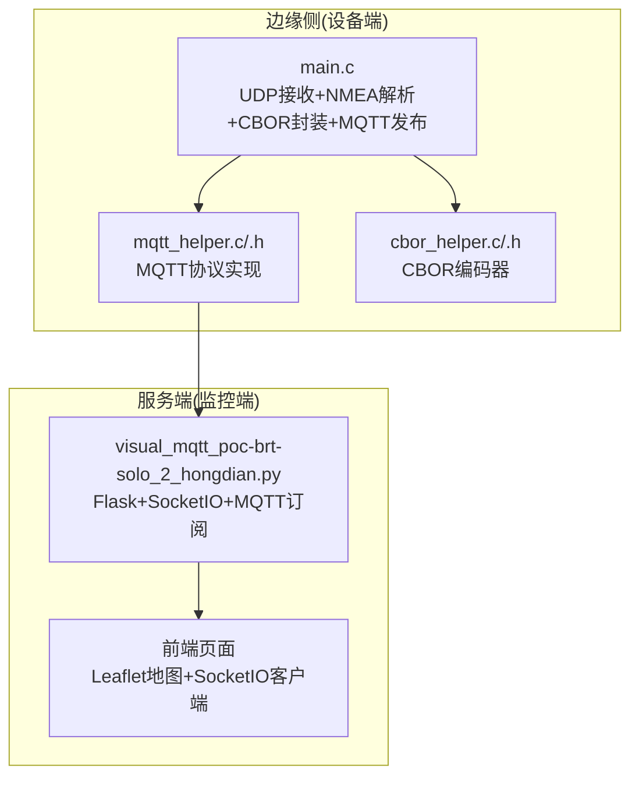
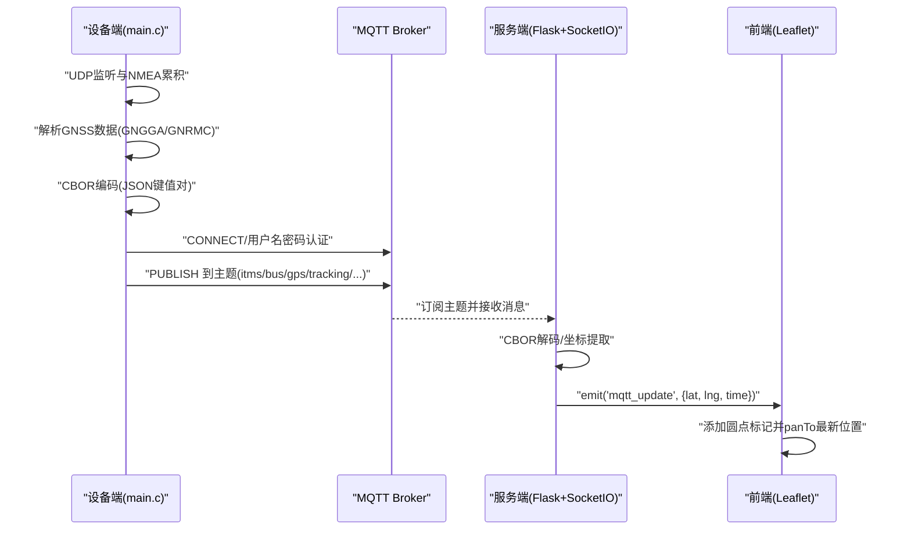
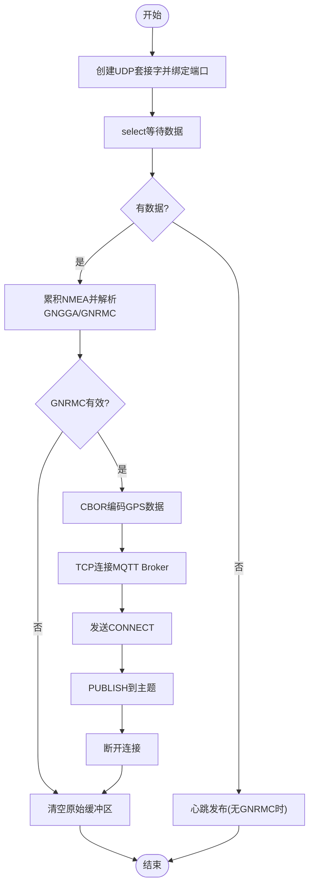
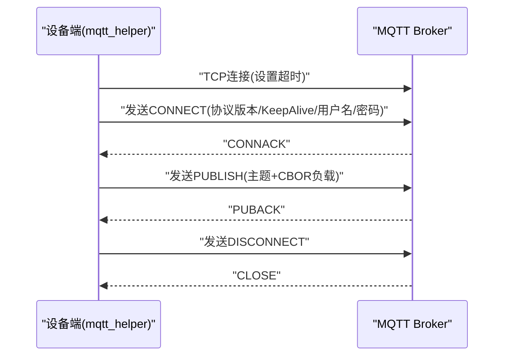
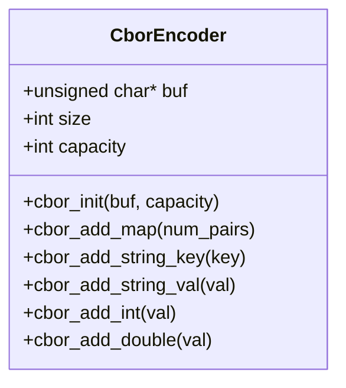
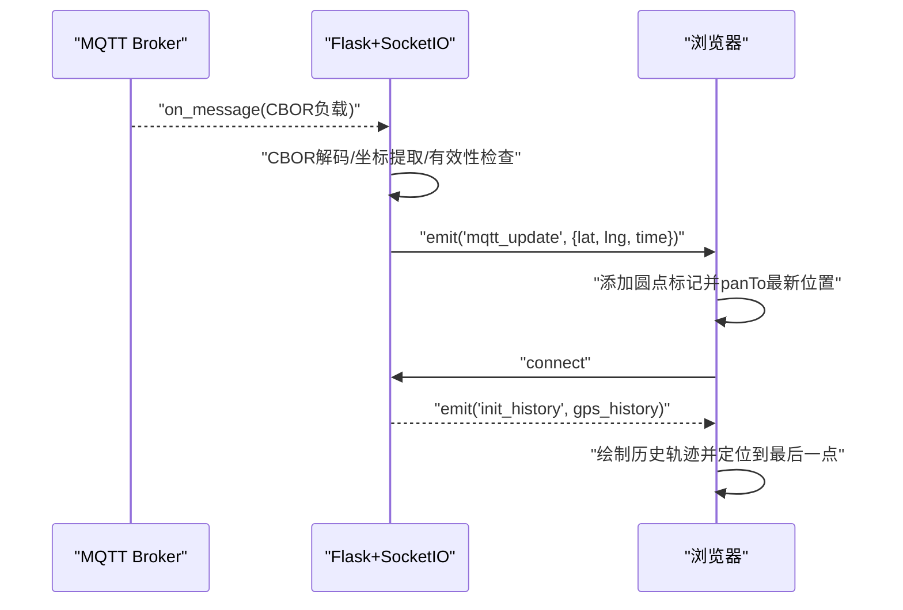
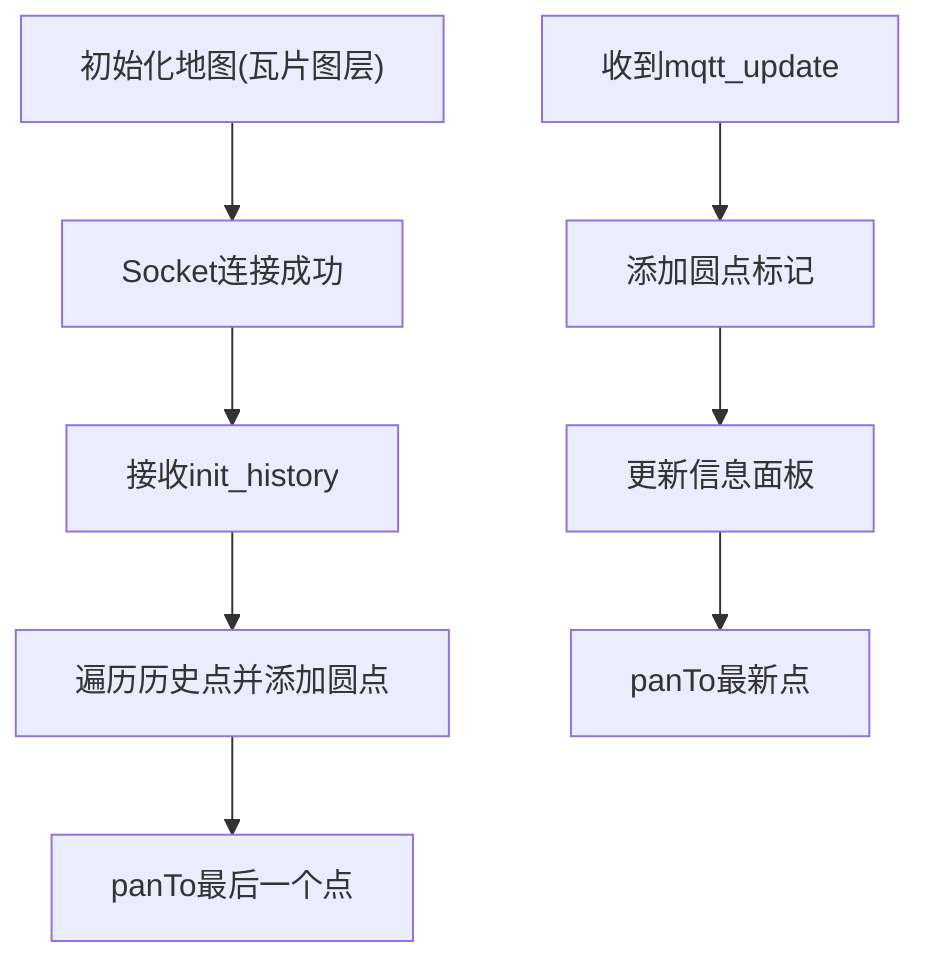
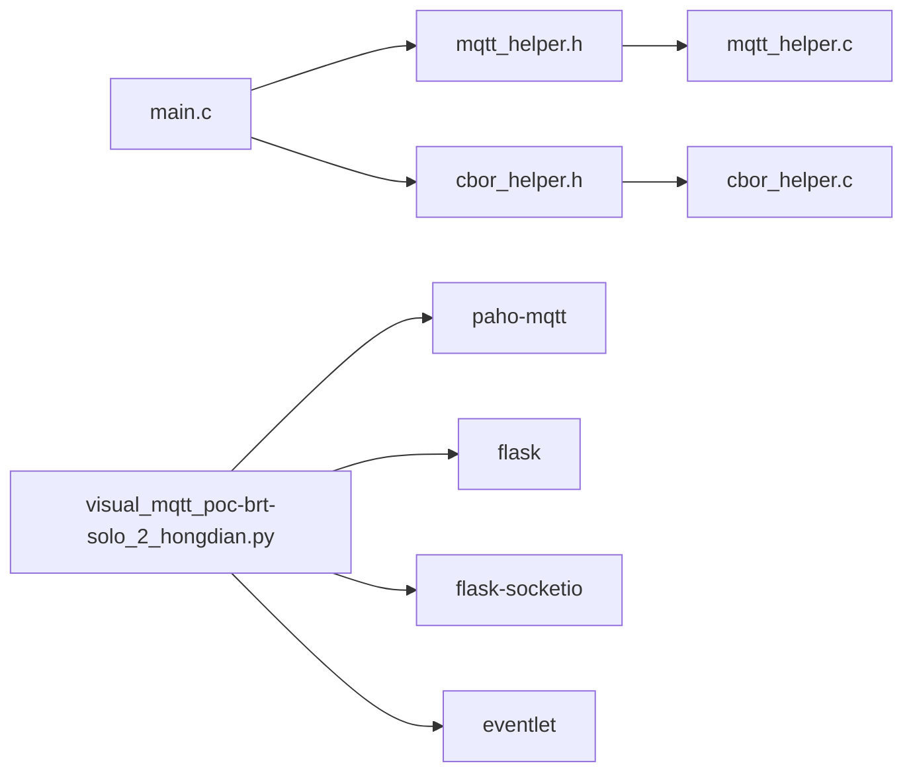

# 实时监控功能

<cite>
**本文引用的文件**
- [main.c](file://dev_code/dev_code/mqtt_project_16_ver1_based-on-9/main.c)
- [mqtt_helper.c](file://dev_code/dev_code/mqtt_project_16_ver1_based-on-9/mqtt_helper.c)
- [mqtt_helper.h](file://dev_code/dev_code/mqtt_project_16_ver1_based-on-9/mqtt_helper.h)
- [cbor_helper.c](file://dev_code/dev_code/mqtt_project_16_ver1_based-on-9/cbor_helper.c)
- [cbor_helper.h](file://dev_code/dev_code/mqtt_project_16_ver1_based-on-9/cbor_helper.h)
- [visual_mqtt_poc-brt-solo_2_hongdian.py](file://visual_mqtt_poc-brt-solo_2_hongdian-不带rawdata/visual_mqtt_poc-brt-solo_2_hongdian.py)
- [visual_mqtt_poc-brt-solo_2_hongdian-带rawdata.py](file://OPENSDT_none-armhf_plugin_mqtt-dummy-16-based-on-15_nmea-debug_16.15.0_2602051525-带rawdata/visual_mqtt_poc-brt-solo_2_hongdian.py)
- [Readme.md.txt](file://dev_code/dev_code/Readme.md.txt)
- [gps_local.raw](file://gps_local.raw)
</cite>

## 目录
1. [简介](#简介)
2. [项目结构](#项目结构)
3. [核心组件](#核心组件)
4. [架构总览](#架构总览)
5. [详细组件分析](#详细组件分析)
6. [依赖关系分析](#依赖关系分析)
7. [性能考虑](#性能考虑)
8. [故障排查指南](#故障排查指南)
9. [结论](#结论)
10. [附录](#附录)

## 简介
本文件面向印尼GPS追踪系统的实时监控功能，围绕以下目标展开：
- 深入解释MQTT消息处理机制：连接建立、订阅管理与消息解码流程
- 详细描述GPS数据解析逻辑：坐标提取、有效性验证与异常处理
- 解释SocketIO实时通信实现：数据推送、状态同步与客户端事件处理
- 提供前端地图集成技术：Leaflet地图配置、点标记渲染与视图自动跟踪
- 包含监控界面的用户交互设计与响应式布局实现

该系统由两部分组成：
- 边缘侧（设备端）：基于UDP接收NMEA语句，解析GNSS数据，使用CBOR编码后通过MQTT发布到Broker
- 服务端（监控端）：订阅MQTT主题，解码CBOR，通过SocketIO向Web前端推送实时轨迹点

## 项目结构
仓库包含多个版本的工程与演示脚本，核心代码位于dev_code目录下的C语言工程，以及Python演示脚本用于前端地图展示与SocketIO通信。

图表来源
- [main.c](file://dev_code/dev_code/mqtt_project_16_ver1_based-on-9/main.c#L182-L259)
- [mqtt_helper.c](file://dev_code/dev_code/mqtt_project_16_ver1_based-on-9/mqtt_helper.c#L38-L115)
- [cbor_helper.c](file://dev_code/dev_code/mqtt_project_16_ver1_based-on-9/cbor_helper.c#L38-L89)
- [visual_mqtt_poc-brt-solo_2_hongdian.py](file://visual_mqtt_poc-brt-solo_2_hongdian-不带rawdata/visual_mqtt_poc-brt-solo_2_hongdian.py#L1-L217)

章节来源
- [Readme.md.txt](file://dev_code/dev_code/Readme.md.txt#L1-L12)

## 核心组件
- 设备端主循环与数据采集：负责UDP监听、NMEA语句累积与解析、周期性心跳发布
- MQTT传输层：封装CONNECT/PUBLISH包，支持二进制CBOR负载
- CBOR序列化：将JSON风格键值对编码为紧凑二进制格式
- 服务端订阅与转发：订阅MQTT主题，解码CBOR，通过SocketIO推送到前端
- 前端地图与交互：使用Leaflet渲染点标记，自动跟踪最新位置

章节来源
- [main.c](file://dev_code/dev_code/mqtt_project_16_ver1_based-on-9/main.c#L182-L259)
- [mqtt_helper.c](file://dev_code/dev_code/mqtt_project_16_ver1_based-on-9/mqtt_helper.c#L38-L115)
- [cbor_helper.c](file://dev_code/dev_code/mqtt_project_16_ver1_based-on-9/cbor_helper.c#L38-L89)
- [visual_mqtt_poc-brt-solo_2_hongdian.py](file://visual_mqtt_poc-brt-solo_2_hongdian-不带rawdata/visual_mqtt_poc-brt-solo_2_hongdian.py#L142-L217)

## 架构总览
系统采用“边缘采集—MQTT传输—服务端转发—前端展示”的分层架构。边缘侧以UDP接收NMEA语句，解析出经纬度、速度、方向等信息，使用CBOR编码后通过MQTT发布；服务端订阅主题，解码CBOR，将坐标点通过SocketIO推送给前端；前端使用Leaflet地图渲染点标记并自动跟踪最新位置。

图表来源
- [main.c](file://dev_code/dev_code/mqtt_project_16_ver1_based-on-9/main.c#L201-L256)
- [mqtt_helper.c](file://dev_code/dev_code/mqtt_project_16_ver1_based-on-9/mqtt_helper.c#L59-L108)
- [visual_mqtt_poc-brt-solo_2_hongdian.py](file://visual_mqtt_poc-brt-solo_2_hongdian-不带rawdata/visual_mqtt_poc-brt-solo_2_hongdian.py#L142-L217)

## 详细组件分析

### 设备端：UDP接收与NMEA解析
- UDP监听与累积
  - 创建UDP套接字并绑定端口，使用select等待数据到达
  - 收到数据后去除换行符，追加到全局缓冲区，形成完整的NMEA句子流
- NMEA解析
  - GNGGA：提取卫星数与海拔高度
  - GNRMC：提取纬度、经度、速度、航向；支持南半球与西半球符号修正
  - 仅当GNRMC有效时触发发布，避免无效数据
- 发布流程
  - 使用CBOR编码包含provider_id、koridor_id、bus_no、lat/lon/alt、avg_speed、datetime_log、direction、satelite、gsm_signal、nmea_raw等字段
  - 建立TCP连接到MQTT Broker，发送CONNECT，随后PUBLISH到指定主题，最后断开连接

图表来源
- [main.c](file://dev_code/dev_code/mqtt_project_16_ver1_based-on-9/main.c#L182-L256)

章节来源
- [main.c](file://dev_code/dev_code/mqtt_project_16_ver1_based-on-9/main.c#L63-L133)
- [main.c](file://dev_code/dev_code/mqtt_project_16_ver1_based-on-9/main.c#L135-L180)

### MQTT传输层：连接与发布
- 连接建立
  - 创建TCP套接字，设置超时，连接到Broker地址与端口
  - 组装CONNECT包，包含协议版本、KeepAlive、用户名与密码
- 发布消息
  - 组装PUBLISH包，包含主题长度、主题字符串与二进制负载（CBOR）
  - 使用send_all确保完整发送
- 断开连接
  - 发送DISCONNECT包并关闭套接字

图表来源
- [mqtt_helper.c](file://dev_code/dev_code/mqtt_project_16_ver1_based-on-9/mqtt_helper.c#L38-L115)

章节来源
- [mqtt_helper.c](file://dev_code/dev_code/mqtt_project_16_ver1_based-on-9/mqtt_helper.c#L38-L115)
- [mqtt_helper.h](file://dev_code/dev_code/mqtt_project_16_ver1_based-on-9/mqtt_helper.h#L4-L12)

### CBOR序列化：紧凑二进制编码
- 编码器接口
  - 初始化缓冲区与容量
  - 写入类型头与长度编码（支持小整型到64位整型）
  - 添加键值对：字符串键、字符串值、整数、双精度浮点
- 字节序与对齐
  - 双精度浮点按网络字节序写入（大端）

图表来源
- [cbor_helper.h](file://dev_code/dev_code/mqtt_project_16_ver1_based-on-9/cbor_helper.h#L7-L26)
- [cbor_helper.c](file://dev_code/dev_code/mqtt_project_16_ver1_based-on-9/cbor_helper.c#L38-L89)

章节来源
- [cbor_helper.c](file://dev_code/dev_code/mqtt_project_16_ver1_based-on-9/cbor_helper.c#L38-L89)
- [cbor_helper.h](file://dev_code/dev_code/mqtt_project_16_ver1_based-on-9/cbor_helper.h#L7-L26)

### 服务端：MQTT订阅与SocketIO推送
- MQTT订阅
  - 使用paho-mqtt连接Broker，订阅目标主题
  - on_message回调中尝试CBOR解码，失败则记录原始负载
  - 提取lat/lon，过滤(0,0)，加入历史列表并emit到前端
- SocketIO初始化
  - 客户端连接时发送历史轨迹作为初始渲染
  - 前端收到init_history后绘制所有点并定位到最后一个点
- 日志记录
  - 将每次解码后的数据写入日志文件，便于调试与回放

图表来源
- [visual_mqtt_poc-brt-solo_2_hongdian.py](file://visual_mqtt_poc-brt-solo_2_hongdian-不带rawdata/visual_mqtt_poc-brt-solo_2_hongdian.py#L142-L217)

章节来源
- [visual_mqtt_poc-brt-solo_2_hongdian.py](file://visual_mqtt_poc-brt-solo_2_hongdian-不带rawdata/visual_mqtt_poc-brt-solo_2_hongdian.py#L142-L217)

### 前端地图集成：Leaflet与SocketIO
- 地图初始化
  - 使用OpenStreetMap瓦片图层，设置默认中心点与缩放级别
- 轨迹渲染
  - 使用circleMarker绘制红色实心圆点，半径5像素
  - 每次收到新点时增加计数并在右上角显示
- 自动跟踪
  - 收到新点后调用panTo将视图移动到最新坐标
  - 首次连接时根据历史轨迹定位到最后一个点

图表来源
- [visual_mqtt_poc-brt-solo_2_hongdian.py](file://visual_mqtt_poc-brt-solo_2_hongdian-不带rawdata/visual_mqtt_poc-brt-solo_2_hongdian.py#L36-L130)

章节来源
- [visual_mqtt_poc-brt-solo_2_hongdian.py](file://visual_mqtt_poc-brt-solo_2_hongdian-不带rawdata/visual_mqtt_poc-brt-solo_2_hongdian.py#L36-L130)

## 依赖关系分析
- 设备端
  - main.c依赖mqtt_helper.h与cbor_helper.h
  - mqtt_helper.c实现MQTT协议细节
  - cbor_helper.c实现CBOR编码细节
- 服务端
  - Python脚本依赖paho-mqtt、flask、flask-socketio、eventlet
  - 前端依赖leaflet与socket.io客户端

图表来源
- [main.c](file://dev_code/dev_code/mqtt_project_16_ver1_based-on-9/main.c#L10-L11)
- [mqtt_helper.h](file://dev_code/dev_code/mqtt_project_16_ver1_based-on-9/mqtt_helper.h#L4-L12)
- [cbor_helper.h](file://dev_code/dev_code/mqtt_project_16_ver1_based-on-9/cbor_helper.h#L7-L26)
- [visual_mqtt_poc-brt-solo_2_hongdian.py](file://visual_mqtt_poc-brt-solo_2_hongdian-不带rawdata/visual_mqtt_poc-brt-solo_2_hongdian.py#L1-L11)

章节来源
- [main.c](file://dev_code/dev_code/mqtt_project_16_ver1_based-on-9/main.c#L10-L11)
- [mqtt_helper.h](file://dev_code/dev_code/mqtt_project_16_ver1_based-on-9/mqtt_helper.h#L4-L12)
- [cbor_helper.h](file://dev_code/dev_code/mqtt_project_16_ver1_based-on-9/cbor_helper.h#L7-L26)
- [visual_mqtt_poc-brt-solo_2_hongdian.py](file://visual_mqtt_poc-brt-solo_2_hongdian-不带rawdata/visual_mqtt_poc-brt-solo_2_hongdian.py#L1-L11)

## 性能考虑
- UDP接收与解析
  - 使用select设置超时，避免阻塞；在无数据时进行心跳发布，保持连接活跃
  - 全局缓冲区限制长度，防止内存无限增长
- CBOR编码
  - 一次性分配足够大的缓冲区，减少重分配开销
  - 双精度浮点按网络字节序写入，保证跨平台一致性
- MQTT发布
  - 每次发布前建立连接，发布后立即断开，降低长连接维护成本
  - 使用send_all确保完整发送，避免半包丢失
- 前端渲染
  - 使用circleMarker绘制点，半径较小，适合高密度轨迹
  - panTo仅在新点到达时触发，避免频繁重绘

[本节为通用指导，无需列出具体文件来源]

## 故障排查指南
- MQTT连接失败
  - 检查Broker地址、端口、用户名与密码是否正确
  - 查看返回码，确认认证与协议版本匹配
- CBOR解码失败
  - 服务端会记录原始负载，便于比对设备端编码
  - 确认设备端CBOR键名与顺序一致
- 无效坐标
  - 服务端过滤(0,0)，检查设备端NMEA解析逻辑
  - 确认GNRMC状态位为A且经纬度符号正确
- 前端不显示轨迹
  - 检查SocketIO连接状态与主题订阅
  - 确认init_history事件已发送且前端正确渲染
- 日志文件
  - 服务端会将每次解码后的数据写入日志文件，便于问题复现与分析

章节来源
- [visual_mqtt_poc-brt-solo_2_hongdian.py](file://visual_mqtt_poc-brt-solo_2_hongdian-不带rawdata/visual_mqtt_poc-brt-solo_2_hongdian.py#L132-L186)
- [main.c](file://dev_code/dev_code/mqtt_project_16_ver1_based-on-9/main.c#L112-L133)

## 结论
本系统通过边缘侧UDP+NMEA解析、CBOR编码与MQTT发布的轻量级方案，结合服务端SocketIO与前端Leaflet的地图渲染，实现了低延迟、高可靠性的实时GPS监控。设备端关注数据采集与传输的稳定性，服务端专注于解码与可视化，整体架构清晰、扩展性强。

[本节为总结性内容，无需列出具体文件来源]

## 附录
- 示例NMEA数据
  - 文件gps_local.raw包含大量GNSS语句，可用于测试解析与可视化
- 版本说明
  - Readme.md.txt记录了不同版本的改进与问题，便于对比与选择

章节来源
- [gps_local.raw](file://gps_local.raw#L1-L800)
- [Readme.md.txt](file://dev_code/dev_code/Readme.md.txt#L1-L12)