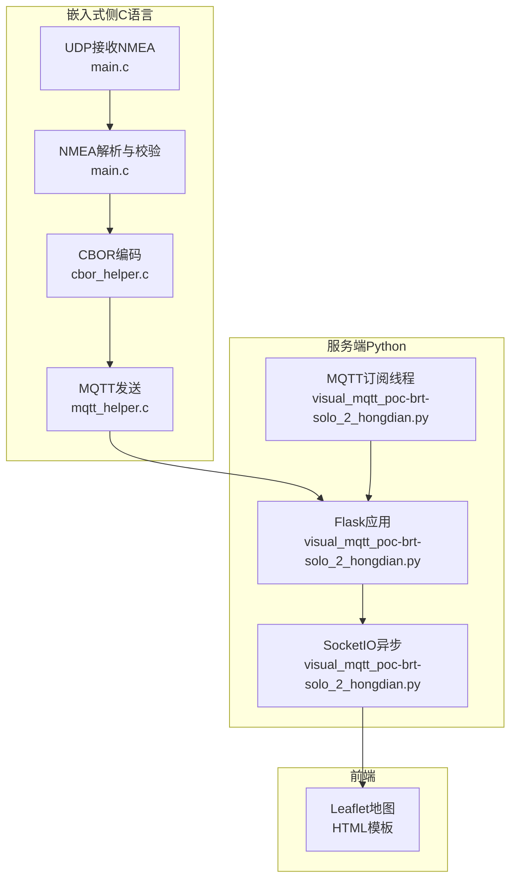
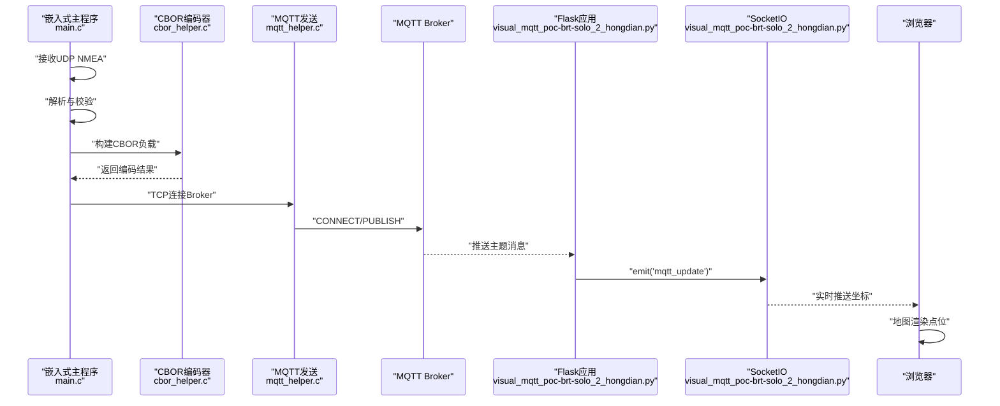
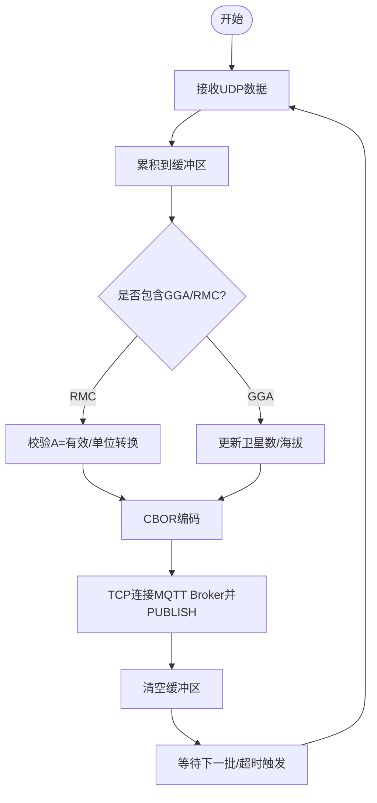
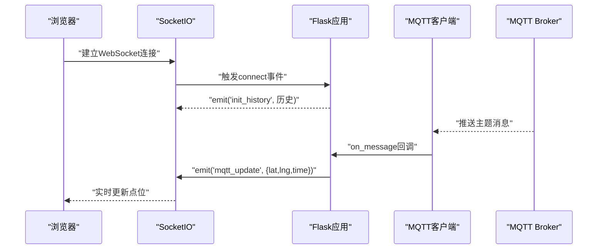
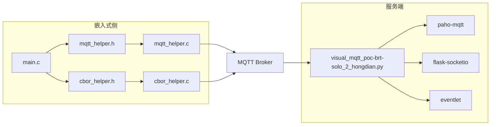

# 系统架构设计

<cite>
**本文档引用的文件**
- [visual_mqtt_poc-brt-solo_2_hongdian.py（带原始数据）](file://OPENSDT_none-armhf_plugin_mqtt-dummy-16-based-on-15_nmea-debug_16.15.0_2602051525-带rawdata/visual_mqtt_poc-brt-solo_2_hongdian.py)
- [visual_mqtt_poc-brt-solo_2_hongdian.py（不带原始数据）](file://visual_mqtt_poc-brt-solo_2_hongdian-不带rawdata/visual_mqtt_poc-brt-solo_2_hongdian.py)
- [main.c（版本16_基于9）](file://dev_code/dev_code/mqtt_project_16_ver1_based-on-9/main.c)
- [mqtt_helper.c（版本16_基于9）](file://dev_code/dev_code/mqtt_project_16_ver1_based-on-9/mqtt_helper.c)
- [cbor_helper.c（版本16_基于9）](file://dev_code/dev_code/mqtt_project_16_ver1_based-on-9/cbor_helper.c)
- [main.c（版本16_基于15）](file://dev_code/dev_code/mqtt_project_16_ver2_based-on-15/main.c)
- [main.c（版本9）](file://dev_code/dev_code/mqtt_project_9/main.c)
- [mqtt_helper.h（版本16_基于9）](file://dev_code/dev_code/mqtt_project_16_ver1_based-on-9/mqtt_helper.h)
- [cbor_helper.h（版本16_基于9）](file://dev_code/dev_code/mqtt_project_16_ver1_based-on-9/cbor_helper.h)
</cite>

## 目录
1. [引言](#引言)
2. [项目结构](#项目结构)
3. [核心组件](#核心组件)
4. [架构总览](#架构总览)
5. [详细组件分析](#详细组件分析)
6. [依赖关系分析](#依赖关系分析)
7. [性能考虑](#性能考虑)
8. [故障排查指南](#故障排查指南)
9. [结论](#结论)
10. [附录](#附录)

## 引言
本文件针对印尼GPS追踪系统的Web可视化监控系统进行系统性架构设计说明。该系统由三部分组成：嵌入式/边缘侧的NMEA数据采集与MQTT发布模块（C语言实现）、服务端Web应用（Flask + SocketIO + Eventlet）以及前端Leaflet地图展示。系统采用事件驱动与异步处理模式，通过MQTT承载实时GPS数据，SocketIO负责浏览器端的实时推送与状态同步。

## 项目结构
- 嵌入式侧（C语言）
  - 主程序：从UDP接收NMEA句子，解析并累积，使用CBOR编码后通过TCP发送至MQTT Broker
  - 协议辅助：自实现MQTT TCP握手与Publish封装，保证二进制安全
  - 数据编码：CBOR编码器，支持键值对与数值类型
- 服务端（Python）
  - 使用Flask + SocketIO + Eventlet异步模式，后台线程订阅MQTT主题，收到消息后通过SocketIO广播到前端
  - 前端：基于Leaflet的地图渲染，仅绘制轨迹点（Dots Only），无折线路径
- 可视化POC（Python）
  - 提供简化版Web界面，演示实时点位展示与历史回放

图表来源
- [main.c（版本16_基于9）](file://dev_code/dev_code/mqtt_project_16_ver1_based-on-9/main.c#L182-L259)
- [mqtt_helper.c（版本16_基于9）](file://dev_code/dev_code/mqtt_project_16_ver1_based-on-9/mqtt_helper.c#L38-L114)
- [cbor_helper.c（版本16_基于9）](file://dev_code/dev_code/mqtt_project_16_ver1_based-on-9/cbor_helper.c#L38-L89)
- [visual_mqtt_poc-brt-solo_2_hongdian.py（带原始数据）](file://OPENSDT_none-armhf_plugin_mqtt-dummy-16-based-on-15_nmea-debug_16.15.0_2602051525-带rawdata/visual_mqtt_poc-brt-solo_2_hongdian.py#L1-L217)

章节来源
- [visual_mqtt_poc-brt-solo_2_hongdian.py（带原始数据）](file://OPENSDT_none-armhf_plugin_mqtt-dummy-16-based-on-15_nmea-debug_16.15.0_2602051525-带rawdata/visual_mqtt_poc-brt-solo_2_hongdian.py#L1-L217)
- [main.c（版本16_基于9）](file://dev_code/dev_code/mqtt_project_16_ver1_based-on-9/main.c#L1-L259)

## 核心组件
- 嵌入式NMEA采集与发布模块
  - UDP接收与缓冲管理，按行切分与校验，累积多句NMEA
  - 解析GGA/RMC等语句，提取经纬度、海拔、速度、航向、卫星数等
  - 使用CBOR编码关键字段，并附加完整原始NMEA字符串
  - 通过TCP连接MQTT Broker，发送CONNECT与PUBLISH
- 服务端Web应用
  - Flask + SocketIO（Eventlet异步模式）提供WebSocket实时通信
  - 后台线程订阅MQTT主题，解析CBOR负载，提取坐标并推送到前端
  - 维护历史轨迹列表，首次连接时下发历史点位
- 前端可视化
  - Leaflet地图渲染，仅绘制轨迹点，自动跟随最新点位并更新信息面板

章节来源
- [visual_mqtt_poc-brt-solo_2_hongdian.py（带原始数据）](file://OPENSDT_none-armhf_plugin_mqtt-dummy-16-based-on-15_nmea-debug_16.15.0_2602051525-带rawdata/visual_mqtt_poc-brt-solo_2_hongdian.py#L142-L208)
- [main.c（版本16_基于9）](file://dev_code/dev_code/mqtt_project_16_ver1_based-on-9/main.c#L135-L180)

## 架构总览
系统采用“边缘采集-协议封装-消息传输-服务端转发-前端渲染”的链路。边缘侧负责高可靠的数据采集与编码；服务端负责协议解码与实时分发；前端负责地图渲染与用户交互。

图表来源
- [main.c（版本16_基于9）](file://dev_code/dev_code/mqtt_project_16_ver1_based-on-9/main.c#L135-L180)
- [mqtt_helper.c（版本16_基于9）](file://dev_code/dev_code/mqtt_project_16_ver1_based-on-9/mqtt_helper.c#L59-L108)
- [visual_mqtt_poc-brt-solo_2_hongdian.py（带原始数据）](file://OPENSDT_none-armhf_plugin_mqtt-dummy-16-based-on-15_nmea-debug_16.15.0_2602051525-带rawdata/visual_mqtt_poc-brt-solo_2_hongdian.py#L142-L177)

## 详细组件分析

### 嵌入式NMEA采集与发布模块（C语言）
- 数据接收与缓冲
  - 使用UDP套接字接收NMEA句子，按行累积到缓冲区，避免丢句
  - 超时或收到RMC句时触发发布流程
- 解析逻辑
  - GGA：提取卫星数与海拔
  - RMC：提取经纬度、速度（节）、航向，进行有效性校验与单位转换
- 编码与发布
  - CBOR编码关键字段（含原始NMEA字符串），确保二进制安全
  - TCP连接MQTT Broker，发送CONNECT与PUBLISH，断开连接

图表来源
- [main.c（版本16_基于9）](file://dev_code/dev_code/mqtt_project_16_ver1_based-on-9/main.c#L201-L259)
- [cbor_helper.c（版本16_基于9）](file://dev_code/dev_code/mqtt_project_16_ver1_based-on-9/cbor_helper.c#L38-L89)

章节来源
- [main.c（版本16_基于9）](file://dev_code/dev_code/mqtt_project_16_ver1_based-on-9/main.c#L63-L180)
- [cbor_helper.c（版本16_基于9）](file://dev_code/dev_code/mqtt_project_16_ver1_based-on-9/cbor_helper.c#L38-L89)
- [mqtt_helper.c（版本16_基于9）](file://dev_code/dev_code/mqtt_project_16_ver1_based-on-9/mqtt_helper.c#L38-L114)

### 服务端Web应用（Flask + SocketIO + Eventlet）
- 异步与事件驱动
  - 使用Eventlet异步模式，提升并发处理能力
  - SocketIO负责WebSocket连接管理与消息路由
- MQTT订阅与消息处理
  - 后台线程订阅指定主题，回调中解析负载（优先CBOR，失败则降级）
  - 过滤无效坐标，维护历史轨迹列表并广播到前端
- 首次连接与状态同步
  - 客户端连接时下发历史轨迹，确保地图初始状态一致

图表来源
- [visual_mqtt_poc-brt-solo_2_hongdian.py（带原始数据）](file://OPENSDT_none-armhf_plugin_mqtt-dummy-16-based-on-15_nmea-debug_16.15.0_2602051525-带rawdata/visual_mqtt_poc-brt-solo_2_hongdian.py#L206-L208)
- [visual_mqtt_poc-brt-solo_2_hongdian.py（带原始数据）](file://OPENSDT_none-armhf_plugin_mqtt-dummy-16-based-on-15_nmea-debug_16.15.0_2602051525-带rawdata/visual_mqtt_poc-brt-solo_2_hongdian.py#L142-L187)

章节来源
- [visual_mqtt_poc-brt-solo_2_hongdian.py（带原始数据）](file://OPENSDT_none-armhf_plugin_mqtt-dummy-16-based-on-15_nmea-debug_16.15.0_2602051525-带rawdata/visual_mqtt_poc-brt-solo_2_hongdian.py#L1-L217)

### 前端可视化（Leaflet地图）
- 地图初始化与瓦片加载
- 实时点位绘制：每次收到坐标后添加圆形标记，累计总数
- 视口跟随：新点位到达后自动平移至最新位置
- 信息面板：显示连接状态、经纬度、时间戳与点位计数

章节来源
- [visual_mqtt_poc-brt-solo_2_hongdian.py（带原始数据）](file://OPENSDT_none-armhf_plugin_mqtt-dummy-16-based-on-15_nmea-debug_16.15.0_2602051525-带rawdata/visual_mqtt_poc-brt-solo_2_hongdian.py#L36-L130)

## 依赖关系分析
- 嵌入式侧
  - main.c 依赖 mqtt_helper.h 与 cbor_helper.h
  - mqtt_helper.c 实现TCP连接、MQTT CONNECT与PUBLISH
  - cbor_helper.c 实现CBOR编码器
- 服务端
  - visual_mqtt_poc-brt-solo_2_hongdian.py 依赖 Flask、SocketIO、paho-mqtt、eventlet
  - 通过后台线程订阅MQTT，回调中调用SocketIO广播

图表来源
- [main.c（版本16_基于9）](file://dev_code/dev_code/mqtt_project_16_ver1_based-on-9/main.c#L10-L11)
- [mqtt_helper.h（版本16_基于9）](file://dev_code/dev_code/mqtt_project_16_ver1_based-on-9/mqtt_helper.h#L1-L12)
- [cbor_helper.h（版本16_基于9）](file://dev_code/dev_code/mqtt_project_16_ver1_based-on-9/cbor_helper.h#L1-L27)
- [visual_mqtt_poc-brt-solo_2_hongdian.py（带原始数据）](file://OPENSDT_none-armhf_plugin_mqtt-dummy-16-based-on-15_nmea-debug_16.15.0_2602051525-带rawdata/visual_mqtt_poc-brt-solo_2_hongdian.py#L4-L6)

章节来源
- [main.c（版本16_基于9）](file://dev_code/dev_code/mqtt_project_16_ver1_based-on-9/main.c#L1-L12)
- [mqtt_helper.h（版本16_基于9）](file://dev_code/dev_code/mqtt_project_16_ver1_based-on-9/mqtt_helper.h#L1-L12)
- [cbor_helper.h（版本16_基于9）](file://dev_code/dev_code/mqtt_project_16_ver1_based-on-9/cbor_helper.h#L1-L27)
- [visual_mqtt_poc-brt-solo_2_hongdian.py（带原始数据）](file://OPENSDT_none-armhf_plugin_mqtt-dummy-16-based-on-15_nmea-debug_16.15.0_2602051525-带rawdata/visual_mqtt_poc-brt-solo_2_hongdian.py#L1-L10)

## 性能考虑
- 异步与并发
  - 服务端使用Eventlet异步模式，降低阻塞，提升并发吞吐
- I/O与网络
  - 嵌入式侧使用select/超时机制，避免长时间阻塞；MQTT发送前短延迟确保握手完成
  - 服务端后台线程订阅，避免阻塞主线程
- 编码与传输
  - CBOR二进制编码，体积小、解析快；服务端优先尝试CBOR解码，失败再降级
- 内存与缓冲
  - 嵌入式侧对缓冲区长度进行限制与重置，防止内存膨胀
- 前端渲染
  - 仅绘制点位，减少DOM与Canvas压力；地图平移跟随最新点位，避免全量重绘

## 故障排查指南
- MQTT连接失败
  - 检查Broker地址、端口、用户名与密码配置
  - 查看嵌入式侧连接日志与返回码
- 坐标无效或(0,0)
  - 检查NMEA语句有效性与校验和
  - 确认RMC语句状态为A（有效）
- 前端无数据
  - 检查WebSocket连接状态与init_history下发
  - 确认主题订阅成功且服务端未过滤无效坐标
- 日志与调试
  - 服务端会将负载写入日志文件，便于定位问题

章节来源
- [visual_mqtt_poc-brt-solo_2_hongdian.py（带原始数据）](file://OPENSDT_none-armhf_plugin_mqtt-dummy-16-based-on-15_nmea-debug_16.15.0_2602051525-带rawdata/visual_mqtt_poc-brt-solo_2_hongdian.py#L133-L141)
- [visual_mqtt_poc-brt-solo_2_hongdian.py（带原始数据）](file://OPENSDT_none-armhf_plugin_mqtt-dummy-16-based-on-15_nmea-debug_16.15.0_2602051525-带rawdata/visual_mqtt_poc-brt-solo_2_hongdian.py#L142-L187)

## 结论
该系统通过“边缘采集+MQTT+异步SocketIO”的组合，实现了低延迟、高可用的GPS可视化监控。嵌入式侧专注于稳定的数据采集与编码，服务端专注于实时分发与状态同步，前端专注于高效渲染。整体架构具备良好的扩展性与可维护性，适合在资源受限的边缘设备与Web可视化场景中部署。

## 附录
- 版本演进
  - 版本9：基础UDP接收、NMEA解析与完整原始NMEA发送
  - 版本16_基于9：引入原始速度（节）与心跳发布机制
  - 版本16_基于15：增强解析健壮性、校验和验证与缓冲管理
- 关键配置项
  - MQTT Broker地址、端口、用户名、密码与订阅主题
  - Web服务监听地址与端口

章节来源
- [main.c（版本9）](file://dev_code/dev_code/mqtt_project_9/main.c#L179-L256)
- [main.c（版本16_基于9）](file://dev_code/dev_code/mqtt_project_16_ver1_based-on-9/main.c#L182-L259)
- [main.c（版本16_基于15）](file://dev_code/dev_code/mqtt_project_16_ver2_based-on-15/main.c#L245-L289)