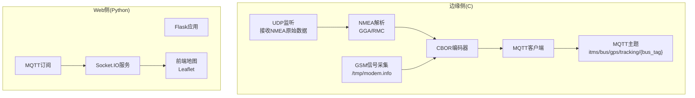
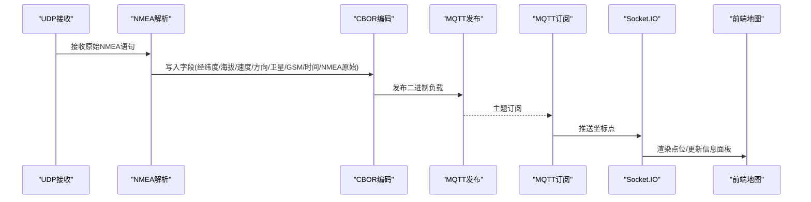
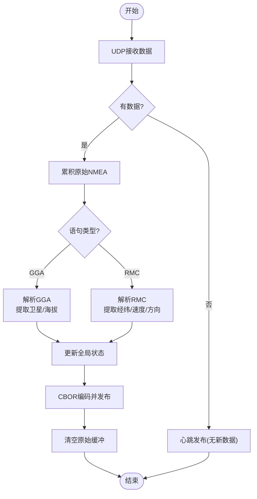
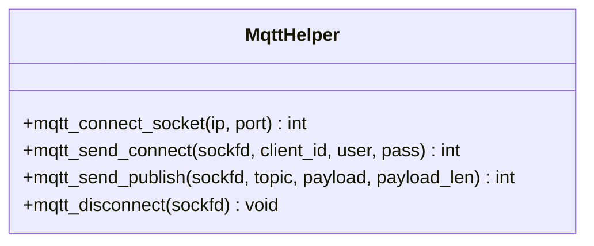
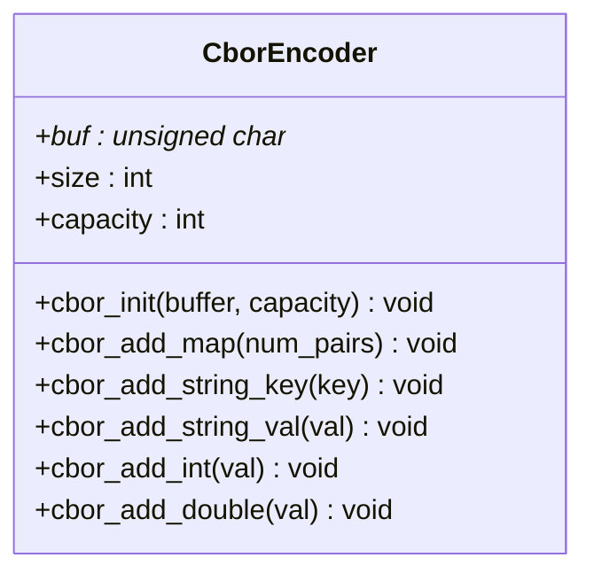
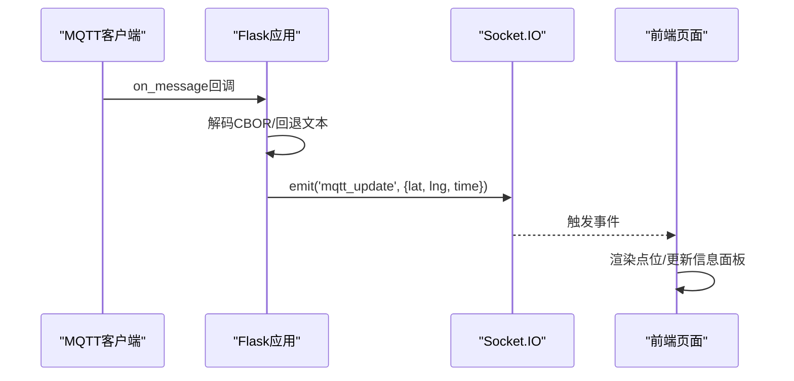
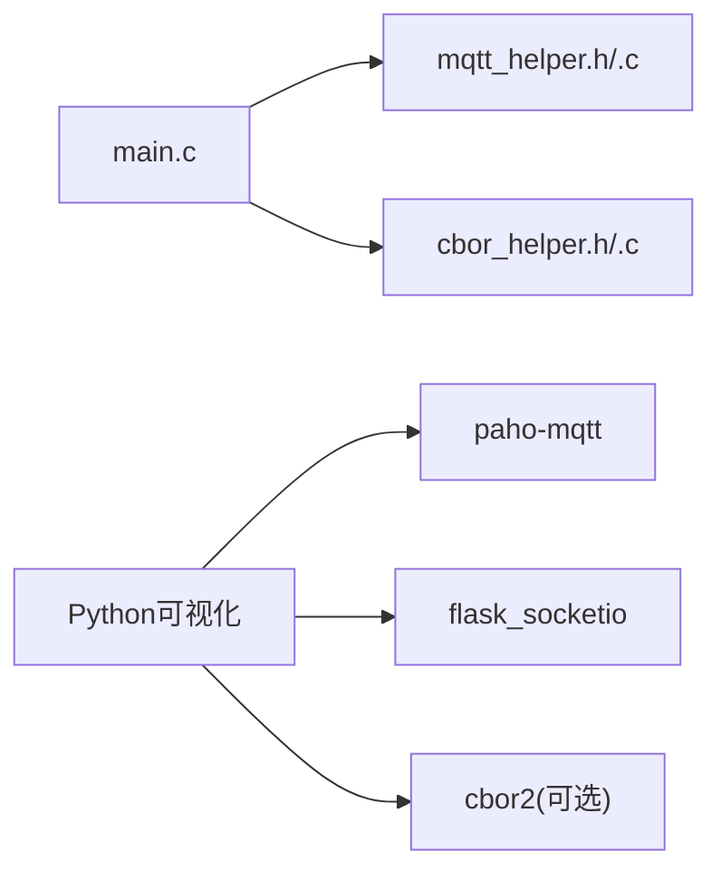

# 自定义开发指南

<cite>
**本文引用的文件**
- [main.c](file://dev_code/dev_code/mqtt_project_16_ver1_based-on-9/main.c)
- [mqtt_helper.c](file://dev_code/dev_code/mqtt_project_16_ver1_based-on-9/mqtt_helper.c)
- [mqtt_helper.h](file://dev_code/dev_code/mqtt_project_16_ver1_based-on-9/mqtt_helper.h)
- [cbor_helper.c](file://dev_code/dev_code/mqtt_project_16_ver1_based-on-9/cbor_helper.c)
- [cbor_helper.h](file://dev_code/dev_code/mqtt_project_16_ver1_based-on-9/cbor_helper.h)
- [visual_mqtt_poc-brt-solo_2_hongdian.py（带rawdata）](file://OPENSDT_none-armhf_plugin_mqtt-dummy-16-based-on-15_nmea-debug_16.15.0_2602051525-带rawdata/visual_mqtt_poc-brt-solo_2_hongdian.py)
- [visual_mqtt_poc-brt-solo_2_hongdian.py（不带rawdata）](file://visual_mqtt_poc-brt-solo_2_hongdian-不带rawdata/visual_mqtt_poc-brt-solo_2_hongdian.py)
- [Readme.md.txt](file://dev_code/dev_code/Readme.md.txt)
</cite>

## 目录
1. [简介](#简介)
2. [项目结构](#项目结构)
3. [核心组件](#核心组件)
4. [架构总览](#架构总览)
5. [详细组件分析](#详细组件分析)
6. [依赖关系分析](#依赖关系分析)
7. [性能考量](#性能考量)
8. [故障排查指南](#故障排查指南)
9. [结论](#结论)
10. [附录](#附录)

## 简介
本指南面向印尼GPS追踪系统的Web可视化监控系统，目标是帮助开发者在现有基础上进行扩展与定制，包括：
- 可视化层面：新增图表类型、UI组件定制、前端扩展点与插件化思路
- 数据层：新增监控指标与数据源集成、MQTT主题扩展与消息格式自定义
- 后端API与数据库：后端服务扩展与数据库集成建议
- 代码重构与最佳实践：可维护性与可扩展性的改进方向
- 测试与调试：测试策略与调试技巧

## 项目结构
该仓库包含两部分关键能力：
- 嵌入式/边缘侧C语言采集与发布模块：负责从UDP接收NMEA原始数据，解析GGA/RMC等语句，采集卫星数、信号强度等信息，使用CBOR编码并通过MQTT发布到指定主题
- Python Web可视化模块：通过Socket.IO实时渲染地图点位，订阅MQTT主题，将坐标点投递到前端

图示来源
- [main.c](file://dev_code/dev_code/mqtt_project_16_ver1_based-on-9/main.c#L182-L259)
- [mqtt_helper.c](file://dev_code/dev_code/mqtt_project_16_ver1_based-on-9/mqtt_helper.c#L38-L114)
- [cbor_helper.c](file://dev_code/dev_code/mqtt_project_16_ver1_based-on-9/cbor_helper.c#L38-L88)
- [visual_mqtt_poc-brt-solo_2_hongdian.py（带rawdata）](file://OPENSDT_none-armhf_plugin_mqtt-dummy-16-based-on-15_nmea-debug_16.15.0_2602051525-带rawdata/visual_mqtt_poc-brt-solo_2_hongdian.py#L1-L217)
- [visual_mqtt_poc-brt-solo_2_hongdian.py（不带rawdata）](file://visual_mqtt_poc-brt-solo_2_hongdian-不带rawdata/visual_mqtt_poc-brt-solo_2_hongdian.py#L1-L217)

章节来源
- [Readme.md.txt](file://dev_code/dev_code/Readme.md.txt#L1-L12)

## 核心组件
- 边缘侧C程序（main.c）
  - 负责UDP端口监听、NMEA语句解析（GGA/RMC）、卫星数与海拔提取、GSM信号读取、时间戳生成、CBOR编码、MQTT发布
- MQTT辅助库（mqtt_helper.c/.h）
  - 提供TCP连接、CONNECT/PUBLISH封包发送、断开连接等基础能力；支持二进制负载安全传输
- CBOR辅助库（cbor_helper.c/.h）
  - 提供键值对写入、整型/浮点型编码、网络字节序转换等
- Web可视化（Python）
  - 使用Flask+Socket.IO，订阅MQTT主题，将坐标点推送到前端，前端基于Leaflet渲染点位

章节来源
- [main.c](file://dev_code/dev_code/mqtt_project_16_ver1_based-on-9/main.c#L1-L259)
- [mqtt_helper.c](file://dev_code/dev_code/mqtt_project_16_ver1_based-on-9/mqtt_helper.c#L1-L115)
- [mqtt_helper.h](file://dev_code/dev_code/mqtt_project_16_ver1_based-on-9/mqtt_helper.h#L1-L13)
- [cbor_helper.c](file://dev_code/dev_code/mqtt_project_16_ver1_based-on-9/cbor_helper.c#L1-L89)
- [cbor_helper.h](file://dev_code/dev_code/mqtt_project_16_ver1_based-on-9/cbor_helper.h#L1-L27)
- [visual_mqtt_poc-brt-solo_2_hongdian.py（带rawdata）](file://OPENSDT_none-armhf_plugin_mqtt-dummy-16-based-on-15_nmea-debug_16.15.0_2602051525-带rawdata/visual_mqtt_poc-brt-solo_2_hongdian.py#L1-L217)
- [visual_mqtt_poc-brt-solo_2_hongdian.py（不带rawdata）](file://visual_mqtt_poc-brt-solo_2_hongdian-不带rawdata/visual_mqtt_poc-brt-solo_2_hongdian.py#L1-L217)

## 架构总览
整体采用“边缘采集+MQTT传输+Web可视化”的分层架构。边缘侧以最小资源占用持续采集与发布，Web侧以事件驱动方式实时渲染。

图示来源
- [main.c](file://dev_code/dev_code/mqtt_project_16_ver1_based-on-9/main.c#L201-L259)
- [mqtt_helper.c](file://dev_code/dev_code/mqtt_project_16_ver1_based-on-9/mqtt_helper.c#L88-L108)
- [visual_mqtt_poc-brt-solo_2_hongdian.py（带rawdata）](file://OPENSDT_none-armhf_plugin_mqtt-dummy-16-based-on-15_nmea-debug_16.15.0_2602051525-带rawdata/visual_mqtt_poc-brt-solo_2_hongdian.py#L150-L187)

## 详细组件分析

### 组件A：边缘侧NMEA解析与发布流程
- 关键逻辑
  - UDP监听与select超时控制
  - NMEA语句识别与切片（GGA/RMC）
  - 坐标换算（度分转十进制度）
  - 卫星数与海拔提取
  - GSM信号周期性读取
  - 时间戳格式化
  - CBOR对象构建与字段填充
  - MQTT CONNECT/PUBLISH/断开
- 扩展点
  - 新增字段：可在CBOR对象中增加新键值（如能耗、温度、震动状态等）
  - 新增NMEA语句：在主循环中识别新语句并解析，更新全局状态
  - 新增主题：修改主题拼接逻辑，按业务维度拆分主题或增加前缀

图示来源
- [main.c](file://dev_code/dev_code/mqtt_project_16_ver1_based-on-9/main.c#L201-L259)

章节来源
- [main.c](file://dev_code/dev_code/mqtt_project_16_ver1_based-on-9/main.c#L63-L133)
- [main.c](file://dev_code/dev_code/mqtt_project_16_ver1_based-on-9/main.c#L135-L180)

### 组件B：MQTT辅助库（二进制安全发布）
- 功能要点
  - CONNECT封包构造与发送
  - PUBLISH封包构造，支持二进制payload长度参数
  - 断开连接
- 扩展点
  - 支持QoS/Will/KeepAlive等扩展
  - 增加重连与退避策略
  - 增加日志与错误码返回

图示来源
- [mqtt_helper.h](file://dev_code/dev_code/mqtt_project_16_ver1_based-on-9/mqtt_helper.h#L1-L13)
- [mqtt_helper.c](file://dev_code/dev_code/mqtt_project_16_ver1_based-on-9/mqtt_helper.c#L38-L114)

章节来源
- [mqtt_helper.c](file://dev_code/dev_code/mqtt_project_16_ver1_based-on-9/mqtt_helper.c#L1-L115)
- [mqtt_helper.h](file://dev_code/dev_code/mqtt_project_16_ver1_based-on-9/mqtt_helper.h#L1-L13)

### 组件C：CBOR辅助库（键值对编码）
- 功能要点
  - 初始化编码器
  - 写入Map头
  - 写入字符串键/值、整型、双精度浮点
  - 处理大整数与网络字节序
- 扩展点
  - 支持数组、布尔、null等类型
  - 增加校验与容量检查
  - 封装常用对象模板函数

图示来源
- [cbor_helper.h](file://dev_code/dev_code/mqtt_project_16_ver1_based-on-9/cbor_helper.h#L1-L27)
- [cbor_helper.c](file://dev_code/dev_code/mqtt_project_16_ver1_based-on-9/cbor_helper.c#L1-L89)

章节来源
- [cbor_helper.c](file://dev_code/dev_code/mqtt_project_16_ver1_based-on-9/cbor_helper.c#L1-L89)
- [cbor_helper.h](file://dev_code/dev_code/mqtt_project_16_ver1_based-on-9/cbor_helper.h#L1-L27)

### 组件D：Web可视化（Flask+Socket.IO+MQTT）
- 功能要点
  - 订阅MQTT主题，解码CBOR或回退文本
  - 追加日志文件
  - 通过Socket.IO推送坐标点
  - 前端使用Leaflet渲染点位，自动跟随最新点
- 扩展点
  - 新增图表：在前端引入图表库，将历史数据转换为折线/柱状/仪表盘
  - 新增UI组件：在信息面板中增加更多指标显示
  - 插件化：将图表渲染封装为插件接口，按需加载

图示来源
- [visual_mqtt_poc-brt-solo_2_hongdian.py（带rawdata）](file://OPENSDT_none-armhf_plugin_mqtt-dummy-16-based-on-15_nmea-debug_16.15.0_2602051525-带rawdata/visual_mqtt_poc-brt-solo_2_hongdian.py#L150-L187)
- [visual_mqtt_poc-brt-solo_2_hongdian.py（不带rawdata）](file://visual_mqtt_poc-brt-solo_2_hongdian-不带rawdata/visual_mqtt_poc-brt-solo_2_hongdian.py#L150-L187)

章节来源
- [visual_mqtt_poc-brt-solo_2_hongdian.py（带rawdata）](file://OPENSDT_none-armhf_plugin_mqtt-dummy-16-based-on-15_nmea-debug_16.15.0_2602051525-带rawdata/visual_mqtt_poc-brt-solo_2_hongdian.py#L1-L217)
- [visual_mqtt_poc-brt-solo_2_hongdian.py（不带rawdata）](file://visual_mqtt_poc-brt-solo_2_hongdian-不带rawdata/visual_mqtt_poc-brt-solo_2_hongdian.py#L1-L217)

## 依赖关系分析
- 边缘侧C程序依赖
  - mqtt_helper.h/.c：MQTT协议栈
  - cbor_helper.h/.c：CBOR编码
  - 系统调用：socket/select/time/文件读取
- Web侧Python依赖
  - paho-mqtt：MQTT客户端
  - flask_socketio：WebSocket通信
  - cbor2（可选）：CBOR解码
  - eventlet：异步I/O

图示来源
- [main.c](file://dev_code/dev_code/mqtt_project_16_ver1_based-on-9/main.c#L1-L12)
- [mqtt_helper.h](file://dev_code/dev_code/mqtt_project_16_ver1_based-on-9/mqtt_helper.h#L1-L13)
- [cbor_helper.h](file://dev_code/dev_code/mqtt_project_16_ver1_based-on-9/cbor_helper.h#L1-L27)
- [visual_mqtt_poc-brt-solo_2_hongdian.py（带rawdata）](file://OPENSDT_none-armhf_plugin_mqtt-dummy-16-based-on-15_nmea-debug_16.15.0_2602051525-带rawdata/visual_mqtt_poc-brt-solo_2_hongdian.py#L4-L17)

章节来源
- [main.c](file://dev_code/dev_code/mqtt_project_16_ver1_based-on-9/main.c#L1-L12)
- [mqtt_helper.h](file://dev_code/dev_code/mqtt_project_16_ver1_based-on-9/mqtt_helper.h#L1-L13)
- [cbor_helper.h](file://dev_code/dev_code/mqtt_project_16_ver1_based-on-9/cbor_helper.h#L1-L27)
- [visual_mqtt_poc-brt-solo_2_hongdian.py（带rawdata）](file://OPENSDT_none-armhf_plugin_mqtt-dummy-16-based-on-15_nmea-debug_16.15.0_2602051525-带rawdata/visual_mqtt_poc-brt-solo_2_hongdian.py#L4-L17)

## 性能考量
- 边缘侧
  - UDP轮询间隔与select超时已设置，避免忙等；建议根据NMEA刷新频率调整超时
  - CBOR缓冲区预留充足空间，避免溢出
  - 原始NMEA缓冲区限制长度，防止无限增长
- Web侧
  - Socket.IO事件推送按点位触发，建议前端做去抖/合并渲染
  - 日志写入为同步落盘，建议异步队列或批量写入
- 通用
  - MQTT连接超时设置合理，建议增加重连与指数退避
  - CBOR双精度编码为网络字节序，确保跨平台一致性

[本节为通用指导，无需列出章节来源]

## 故障排查指南
- MQTT连接失败
  - 检查Broker地址/端口/账号密码是否正确
  - 查看CONNECT封包构造与发送结果
  - 建议增加返回码与日志输出
- CBOR解码异常
  - Python侧若未安装cbor2，会回退为文本负载；确认是否需要安装依赖
  - 检查边缘侧CBOR字段顺序与类型是否与解码端一致
- 坐标无效或(0,0)
  - 检查RMC语句状态位是否为A
  - 检查度分换算逻辑与符号处理
- 前端不渲染
  - 确认Socket.IO连接状态与事件名一致
  - 检查主题订阅是否匹配

章节来源
- [mqtt_helper.c](file://dev_code/dev_code/mqtt_project_16_ver1_based-on-9/mqtt_helper.c#L59-L86)
- [visual_mqtt_poc-brt-solo_2_hongdian.py（带rawdata）](file://OPENSDT_none-armhf_plugin_mqtt-dummy-16-based-on-15_nmea-debug_16.15.0_2602051525-带rawdata/visual_mqtt_poc-brt-solo_2_hongdian.py#L150-L187)

## 结论
本系统以轻量、稳定为核心设计目标，边缘侧专注于高效采集与发布，Web侧专注实时可视化。通过本文档提供的扩展点与最佳实践，可以在不破坏现有稳定性的前提下，快速集成新的监控指标、图表与UI组件，并实现MQTT主题与消息格式的灵活定制。

[本节为总结，无需列出章节来源]

## 附录

### A. 扩展可视化：新增图表类型与UI组件
- 新增图表
  - 在前端引入图表库（如Chart.js/ECharts），将历史坐标转换为折线/散点/热力图
  - 通过Socket.IO事件订阅历史数据，按需渲染
- UI组件定制
  - 在信息面板中增加更多指标（如速度、方向、卫星数、GSM信号）
  - 将点位数量、最后更新时间等信息动态更新
- 插件化思路
  - 定义统一的图表接口，按需注册与卸载插件
  - 将渲染逻辑与数据处理分离，便于单元测试与维护

[本节为概念性内容，无需列出章节来源]

### B. 添加新的监控指标与数据源集成
- 边缘侧新增指标
  - 在全局状态中新增字段（如能耗、温度、震动计数）
  - 在NMEA解析或外部传感器读取后更新状态
  - 在CBOR对象中新增键值对
- 数据源集成
  - 新增UDP/TCP/串口等数据源时，保持与现有select/事件循环兼容
  - 对新数据进行校验与过滤，避免污染发布负载

章节来源
- [main.c](file://dev_code/dev_code/mqtt_project_16_ver1_based-on-9/main.c#L27-L38)
- [main.c](file://dev_code/dev_code/mqtt_project_16_ver1_based-on-9/main.c#L154-L168)

### C. MQTT主题扩展与消息格式自定义
- 主题扩展
  - 当前主题为“itms/bus/gps/tracking/{bus_tag}”，可按业务域拆分为多级主题（如按公司/线路/车辆细分）
  - 建议在发布前统一主题命名规范与权限控制
- 消息格式
  - 当前使用CBOR二进制格式，具备紧凑与跨平台优势
  - 若需兼容非CBOR解码端，可保留文本回退路径或提供双格式选项

章节来源
- [main.c](file://dev_code/dev_code/mqtt_project_16_ver1_based-on-9/main.c#L142-L143)
- [main.c](file://dev_code/dev_code/mqtt_project_16_ver1_based-on-9/main.c#L150-L170)
- [visual_mqtt_poc-brt-solo_2_hongdian.py（带rawdata）](file://OPENSDT_none-armhf_plugin_mqtt-dummy-16-based-on-15_nmea-debug_16.15.0_2602051525-带rawdata/visual_mqtt_poc-brt-solo_2_hongdian.py#L156-L163)

### D. 前端JavaScript扩展点与插件开发模式
- 扩展点
  - Socket.IO事件名与数据结构可扩展，用于传递更多指标
  - Leaflet图层可抽象为插件，支持不同样式与交互
- 插件开发
  - 定义插件接口，暴露初始化、更新、销毁方法
  - 通过事件总线或观察者模式与主应用解耦

[本节为概念性内容，无需列出章节来源]

### E. 后端API扩展与数据库集成指南
- 后端API扩展
  - 可在现有Flask应用上增加REST接口，用于查询历史轨迹、统计报表、设备状态
  - 建议使用异步I/O与连接池，提升并发能力
- 数据库集成
  - 建议将CBOR负载持久化为结构化表（如轨迹点、设备状态、告警记录）
  - 引入索引与分区策略，优化查询性能

[本节为概念性内容，无需列出章节来源]

### F. 代码重构建议与最佳实践
- 边缘侧C
  - 将CBOR编码封装为独立模块，减少main.c复杂度
  - 增加配置文件/环境变量，避免硬编码
  - 增加日志级别与结构化日志
- Web侧Python
  - 将MQTT订阅与Socket.IO推送解耦为独立服务
  - 引入异步队列与批处理，降低I/O阻塞
  - 增加单元测试与集成测试

[本节为通用指导，无需列出章节来源]

### G. 测试策略与调试技巧
- 单元测试
  - 对NMEA解析函数、度分换算、CBOR编码进行单元测试
- 集成测试
  - 搭建本地MQTT Broker与模拟GPS数据源，验证端到端链路
- 调试技巧
  - 边缘侧：打印关键状态与耗时，定位解析/发布瓶颈
  - Web侧：启用Socket.IO调试日志，检查事件与负载

[本节为通用指导，无需列出章节来源]