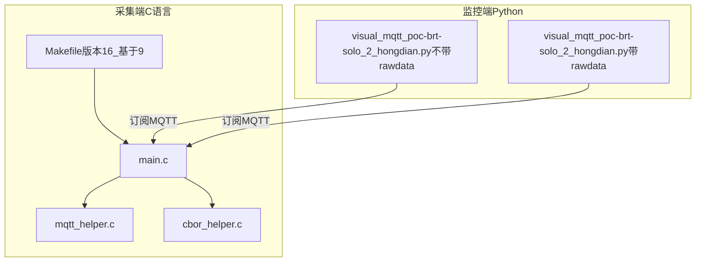
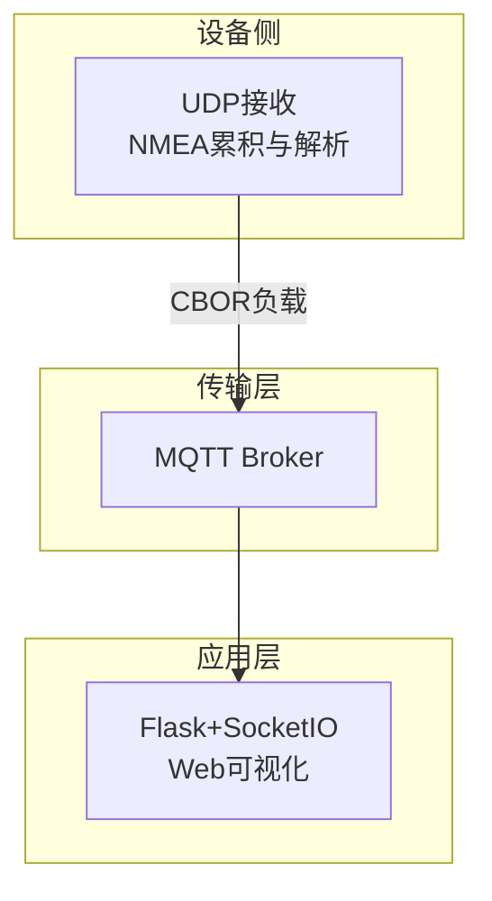
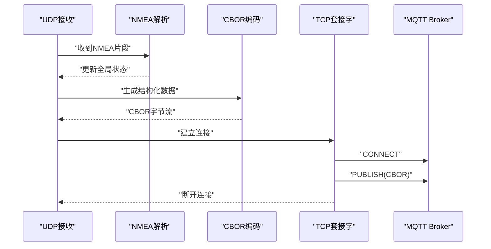
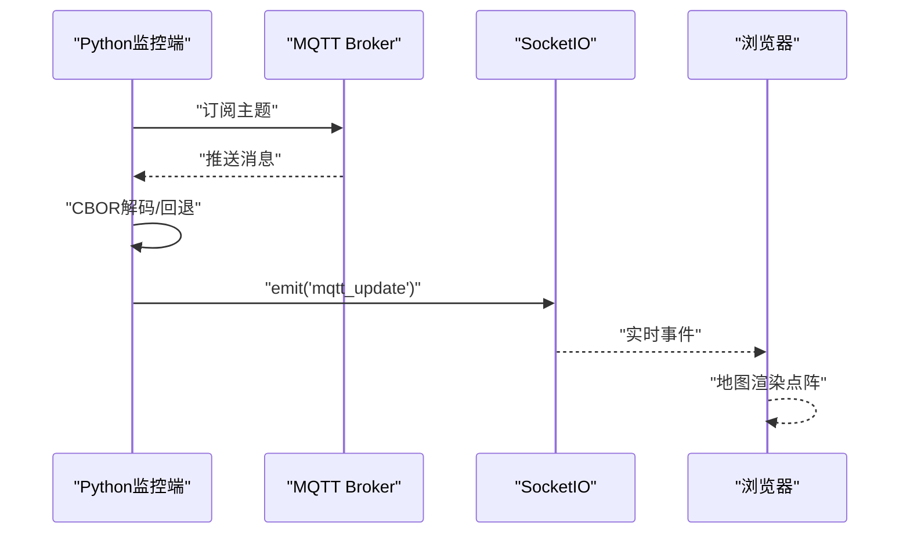
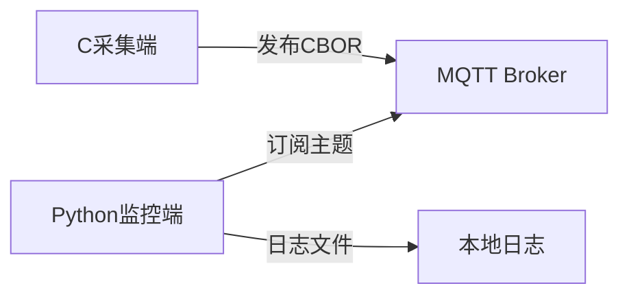

# 部署与配置

<cite>
**本文引用的文件**
- [visual_mqtt_poc-brt-solo_2_hongdian.py（不带rawdata）](file://visual_mqtt_poc-brt-solo_2_hongdian-不带rawdata/visual_mqtt_poc-brt-solo_2_hongdian.py)
- [visual_mqtt_poc-brt-solo_2_hongdian.py（带rawdata）](file://OPENSDT_none-armhf_plugin_mqtt-dummy-16-based-on-15_nmea-debug_16.15.0_2602051525-带rawdata/visual_mqtt_poc-brt-solo_2_hongdian.py)
- [main.c（版本16_基于9）](file://dev_code/dev_code/mqtt_project_16_ver1_based-on-9/main.c)
- [mqtt_helper.c（版本16_基于9）](file://dev_code/dev_code/mqtt_project_16_ver1_based-on-9/mqtt_helper.c)
- [cbor_helper.c（版本16_基于9）](file://dev_code/dev_code/mqtt_project_16_ver1_based-on-9/cbor_helper.c)
- [mqtt_helper.h（版本16_基于9）](file://dev_code/dev_code/mqtt_project_16_ver1_based-on-9/mqtt_helper.h)
- [cbor_helper.h（版本16_基于9）](file://dev_code/dev_code/mqtt_project_16_ver1_based-on-9/cbor_helper.h)
- [Makefile（版本16_基于9）](file://dev_code/dev_code/mqtt_project_16_ver1_based-on-9/Makefile)
- [Makefile（版本16_基于15）](file://dev_code/dev_code/mqtt_project_16_ver2_based-on-15/Makefile)
- [Makefile（版本9）](file://dev_code/dev_code/mqtt_project_9/Makefile)
- [Readme.md.txt](file://dev_code/dev_code/Readme.md.txt)
</cite>

## 目录
1. [简介](#简介)
2. [项目结构](#项目结构)
3. [核心组件](#核心组件)
4. [架构总览](#架构总览)
5. [详细组件分析](#详细组件分析)
6. [依赖关系分析](#依赖关系分析)
7. [性能考虑](#性能考虑)
8. [网络配置要求](#网络配置要求)
9. [日志与监控](#日志与监控)
10. [容器化部署与Docker配置](#容器化部署与docker配置)
11. [启动脚本与进程管理](#启动脚本与进程管理)
12. [故障排除指南](#故障排除指南)
13. [结论](#结论)

## 简介
本文件面向印尼GPS追踪系统的Web可视化监控系统，提供从Python运行环境到系统部署、网络配置、日志与监控、容器化以及故障排除的完整部署与配置指南。系统由两部分组成：
- 数据采集与发布端：C语言实现的UDP接收器，解析NMEA数据，编码为CBOR并通过MQTT发布。
- 可视化监控端：基于Flask+SocketIO的Web服务，订阅MQTT主题，渲染实时轨迹点。

## 项目结构
仓库包含多个版本的C语言采集程序与两个Python可视化示例脚本。核心路径如下：
- dev_code/dev_code/mqtt_project_16_ver1_based-on-9：最新改进版采集端（基于版本9），支持UDP接收、NMEA解析、CBOR编码与MQTT发布。
- visual_mqtt_poc-brt-solo_2_hongdian-不带rawdata：Web可视化监控端（Python），使用Flask+SocketIO+MQTT。
- OPENSDT_none-armhf_plugin_mqtt-dummy-16-based-on-15_nmea-debug_16.15.0_2602051525-带rawdata：另一个Python可视化示例，功能与上一版本一致，仅命名不同。
- 其他版本（16_ver2_based-on-15、9）：历史版本与构建配置。

图表来源
- [main.c（版本16_基于9）](file://dev_code/dev_code/mqtt_project_16_ver1_based-on-9/main.c#L182-L259)
- [mqtt_helper.c（版本16_基于9）](file://dev_code/dev_code/mqtt_project_16_ver1_based-on-9/mqtt_helper.c#L38-L115)
- [cbor_helper.c（版本16_基于9）](file://dev_code/dev_code/mqtt_project_16_ver1_based-on-9/cbor_helper.c#L38-L89)
- [Makefile（版本16_基于9）](file://dev_code/dev_code/mqtt_project_16_ver1_based-on-9/Makefile#L1-L23)
- [visual_mqtt_poc-brt-solo_2_hongdian.py（不带rawdata）](file://visual_mqtt_poc-brt-solo_2_hongdian-不带rawdata/visual_mqtt_poc-brt-solo_2_hongdian.py#L1-L217)
- [visual_mqtt_poc-brt-solo_2_hongdian.py（带rawdata）](file://OPENSDT_none-armhf_plugin_mqtt-dummy-16-based-on-15_nmea-debug_16.15.0_2602051525-带rawdata/visual_mqtt_poc-brt-solo_2_hongdian.py#L1-L217)

章节来源
- [Readme.md.txt](file://dev_code/dev_code/Readme.md.txt#L1-L12)

## 核心组件
- 采集端（C语言）
  - UDP监听与NMEA解析：接收UDP数据，累积原始NMEA句子，解析GGA/ RMC，提取经纬度、海拔、卫星数、速度、方向等。
  - CBOR编码：将结构化数据编码为CBOR二进制格式。
  - MQTT发布：通过TCP连接MQTT Broker，发送CBOR负载。
- 监控端（Python）
  - Flask+SocketIO：提供Web页面与实时事件推送。
  - MQTT订阅：订阅指定主题，解析CBOR或回退为文本，记录日志并推送前端显示。
  - 地图渲染：使用Leaflet在浏览器中绘制轨迹点。

章节来源
- [main.c（版本16_基于9）](file://dev_code/dev_code/mqtt_project_16_ver1_based-on-9/main.c#L63-L180)
- [cbor_helper.c（版本16_基于9）](file://dev_code/dev_code/mqtt_project_16_ver1_based-on-9/cbor_helper.c#L38-L89)
- [mqtt_helper.c（版本16_基于9）](file://dev_code/dev_code/mqtt_project_16_ver1_based-on-9/mqtt_helper.c#L38-L115)
- [visual_mqtt_poc-brt-solo_2_hongdian.py（不带rawdata）](file://visual_mqtt_poc-brt-solo_2_hongdian-不带rawdata/visual_mqtt_poc-brt-solo_2_hongdian.py#L142-L209)

## 架构总览
系统采用“采集端（C语言）—MQTT—监控端（Python）”的轻量级消息驱动架构。采集端负责高频数据采集与预处理，监控端负责展示与交互。

图表来源
- [main.c（版本16_基于9）](file://dev_code/dev_code/mqtt_project_16_ver1_based-on-9/main.c#L135-L180)
- [mqtt_helper.c（版本16_基于9）](file://dev_code/dev_code/mqtt_project_16_ver1_based-on-9/mqtt_helper.c#L59-L108)
- [visual_mqtt_poc-brt-solo_2_hongdian.py（不带rawdata）](file://visual_mqtt_poc-brt-solo_2_hongdian-不带rawdata/visual_mqtt_poc-brt-solo_2_hongdian.py#L142-L209)

## 详细组件分析

### 采集端（C语言）组件
- UDP接收与选择超时：使用select控制轮询周期，避免忙等；累积原始NMEA至缓冲区。
- NMEA解析：支持GGA与RMC语句，提取位置、海拔、卫星数、速度、方向，并更新全局状态。
- CBOR编码：以键值对形式编码，包含业务字段与原始NMEA字符串。
- MQTT发布：建立TCP连接，发送CONNECT，再发送PUBLISH，最后断开连接。

图表来源
- [main.c（版本16_基于9）](file://dev_code/dev_code/mqtt_project_16_ver1_based-on-9/main.c#L201-L256)
- [mqtt_helper.c（版本16_基于9）](file://dev_code/dev_code/mqtt_project_16_ver1_based-on-9/mqtt_helper.c#L38-L108)
- [cbor_helper.c（版本16_基于9）](file://dev_code/dev_code/mqtt_project_16_ver1_based-on-9/cbor_helper.c#L38-L89)

章节来源
- [main.c（版本16_基于9）](file://dev_code/dev_code/mqtt_project_16_ver1_based-on-9/main.c#L182-L259)
- [mqtt_helper.c（版本16_基于9）](file://dev_code/dev_code/mqtt_project_16_ver1_based-on-9/mqtt_helper.c#L38-L115)
- [cbor_helper.c（版本16_基于9）](file://dev_code/dev_code/mqtt_project_16_ver1_based-on-9/cbor_helper.c#L38-L89)

### 监控端（Python）组件
- 配置与初始化：定义MQTT连接参数、主题、日志文件名；初始化Flask与SocketIO。
- 日志记录：将解码后的消息写入本地JSON格式日志文件。
- MQTT回调：连接成功后订阅主题；收到消息后解析CBOR或回退为文本，提取经纬度并推送到前端。
- 前端渲染：使用SocketIO事件推送坐标，浏览器端用Leaflet绘制点阵。

图表来源
- [visual_mqtt_poc-brt-solo_2_hongdian.py（不带rawdata）](file://visual_mqtt_poc-brt-solo_2_hongdian-不带rawdata/visual_mqtt_poc-brt-solo_2_hongdian.py#L142-L209)

章节来源
- [visual_mqtt_poc-brt-solo_2_hongdian.py（不带rawdata）](file://visual_mqtt_poc-brt-solo_2_hongdian-不带rawdata/visual_mqtt_poc-brt-solo_2_hongdian.py#L1-L217)
- [visual_mqtt_poc-brt-solo_2_hongdian.py（带rawdata）](file://OPENSDT_none-armhf_plugin_mqtt-dummy-16-based-on-15_nmea-debug_16.15.0_2602051525-带rawdata/visual_mqtt_poc-brt-solo_2_hongdian.py#L1-L217)

## 依赖关系分析
- Python端依赖
  - Flask、Flask-SocketIO、Paho-MQTT、eventlet、cbor2（可选）、json、threading、datetime、os。
- C端依赖
  - 标准C库（stdio、stdlib、unistd、string、time、sys/socket、netinet/in、sys/select、ctype）。
  - 自研CBOR与MQTT辅助模块。

图表来源
- [visual_mqtt_poc-brt-solo_2_hongdian.py（不带rawdata）](file://visual_mqtt_poc-brt-solo_2_hongdian-不带rawdata/visual_mqtt_poc-brt-solo_2_hongdian.py#L132-L166)
- [main.c（版本16_基于9）](file://dev_code/dev_code/mqtt_project_16_ver1_based-on-9/main.c#L135-L180)

章节来源
- [visual_mqtt_poc-brt-solo_2_hongdian.py（不带rawdata）](file://visual_mqtt_poc-brt-solo_2_hongdian-不带rawdata/visual_mqtt_poc-brt-solo_2_hongdian.py#L1-L217)
- [main.c（版本16_基于9）](file://dev_code/dev_code/mqtt_project_16_ver1_based-on-9/main.c#L1-L12)

## 性能考虑
- 采集端
  - 使用select设置轮询超时，降低CPU占用。
  - CBOR编码紧凑，减少MQTT负载体积。
  - 心跳发布：无新数据时仍定期发布，保证监控端连通性。
- 监控端
  - 使用eventlet异步模式提升并发能力。
  - 仅推送有效坐标，避免无效点导致的前端重绘压力。

章节来源
- [main.c（版本16_基于9）](file://dev_code/dev_code/mqtt_project_16_ver1_based-on-9/main.c#L208-L256)
- [visual_mqtt_poc-brt-solo_2_hongdian.py（不带rawdata）](file://visual_mqtt_poc-brt-solo_2_hongdian-不带rawdata/visual_mqtt_poc-brt-solo_2_hongdian.py#L188-L209)

## 网络配置要求
- 端口
  - UDP端口：采集端绑定UDP端口用于接收NMEA数据（示例中为固定端口）。
  - MQTT端口：默认1883（示例脚本使用），需确保Broker可达。
  - Web端口：默认5001（示例脚本使用），需对外放通。
- 防火墙与安全组
  - 放通UDP端口（接收NMEA）。
  - 放通TCP 1883（MQTT）。
  - 放通TCP 5001（Web访问）。
- 认证
  - MQTT用户名/密码需与Broker配置一致。

章节来源
- [main.c（版本16_基于9）](file://dev_code/dev_code/mqtt_project_16_ver1_based-on-9/main.c#L14-L25)
- [visual_mqtt_poc-brt-solo_2_hongdian.py（不带rawdata）](file://visual_mqtt_poc-brt-solo_2_hongdian-不带rawdata/visual_mqtt_poc-brt-solo_2_hongdian.py#L19-L24)

## 日志与监控
- 采集端日志
  - 控制台输出：打印GPS位置、GSM信号、卫星数等信息。
- 监控端日志
  - 文件日志：按时间戳写入JSON格式日志文件，便于离线分析。
- 监控指标
  - 建议在生产环境增加：
    - 连接状态计数（MQTT连接成功/失败）。
    - 消息接收速率（条/秒）。
    - 有效坐标点数量。
    - CBOR解码错误次数。

章节来源
- [main.c（版本16_基于9）](file://dev_code/dev_code/mqtt_project_16_ver1_based-on-9/main.c#L238-L241)
- [visual_mqtt_poc-brt-solo_2_hongdian.py（不带rawdata）](file://visual_mqtt_poc-brt-solo_2_hongdian-不带rawdata/visual_mqtt_poc-brt-solo_2_hongdian.py#L132-L166)

## 容器化部署与Docker配置
- 建议方案
  - 采集端：构建静态或动态链接的Linux可执行文件，放入最小镜像（如Alpine或Debian Slim）。
  - 监控端：使用Python官方镜像，安装依赖后运行。
- Dockerfile要点
  - 设置工作目录与复制产物。
  - 暴露UDP与TCP端口（根据实际配置）。
  - 使用非root用户运行。
  - 映射日志卷。
- Compose建议
  - 将采集端与监控端分别作为服务，共享网络。
  - 为监控端挂载日志目录。

[本节为通用容器化建议，未直接分析具体源文件，故不附“章节来源”]

## 启动脚本与进程管理
- 采集端
  - 编译：使用Makefile进行编译与安装。
  - 运行：直接执行二进制文件；建议配合systemd或Supervisor进行守护。
- 监控端
  - 安装依赖：pip安装Flask、Flask-SocketIO、Paho-MQTT、eventlet、cbor2（可选）。
  - 运行：python运行脚本；建议使用Supervisor或systemd管理。
- 建议
  - 将日志输出重定向到标准输出，便于容器日志收集。
  - 为两个进程分别配置健康检查与自动重启策略。

章节来源
- [Makefile（版本16_基于9）](file://dev_code/dev_code/mqtt_project_16_ver1_based-on-9/Makefile#L14-L22)
- [Makefile（版本16_基于15）](file://dev_code/dev_code/mqtt_project_16_ver2_based-on-15/Makefile#L14-L22)
- [Makefile（版本9）](file://dev_code/dev_code/mqtt_project_9/Makefile#L14-L22)
- [visual_mqtt_poc-brt-solo_2_hongdian.py（不带rawdata）](file://visual_mqtt_poc-brt-solo_2_hongdian-不带rawdata/visual_mqtt_poc-brt-solo_2_hongdian.py#L210-L217)

## 故障排除指南
- 无法连接MQTT
  - 检查Broker地址、端口、用户名/密码是否正确。
  - 确认网络策略放通TCP 1883。
- 无数据或延迟高
  - 检查UDP端口是否被占用或被防火墙拦截。
  - 确认NMEA数据源正常，且采集端已绑定对应端口。
- 解码异常
  - 若未安装cbor2，监控端会回退为文本解析；建议安装cbor2以获得完整字段。
- 坐标无效
  - 当经纬度为0时会被忽略；检查NMEA语句完整性与解析逻辑。
- Web无法访问
  - 确认监听地址与端口（默认0.0.0.0:5001），并放通相应安全组。

章节来源
- [visual_mqtt_poc-brt-solo_2_hongdian.py（不带rawdata）](file://visual_mqtt_poc-brt-solo_2_hongdian-不带rawdata/visual_mqtt_poc-brt-solo_2_hongdian.py#L150-L186)
- [main.c（版本16_基于9）](file://dev_code/dev_code/mqtt_project_16_ver1_based-on-9/main.c#L238-L241)

## 结论
本部署文档提供了从环境准备、组件配置、网络与日志、容器化到运维保障的全链路指导。建议在生产环境中结合Supervisor/systemd进行进程管理，结合容器编排工具实现弹性扩展，并完善监控与告警体系以保障系统稳定运行。