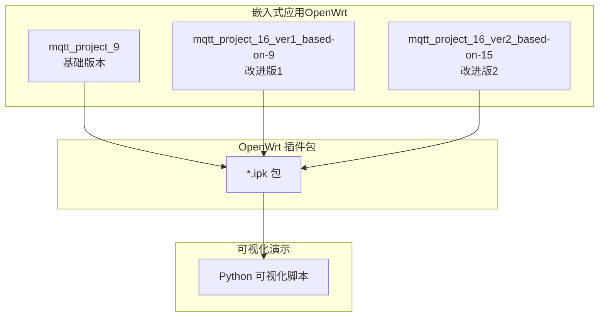
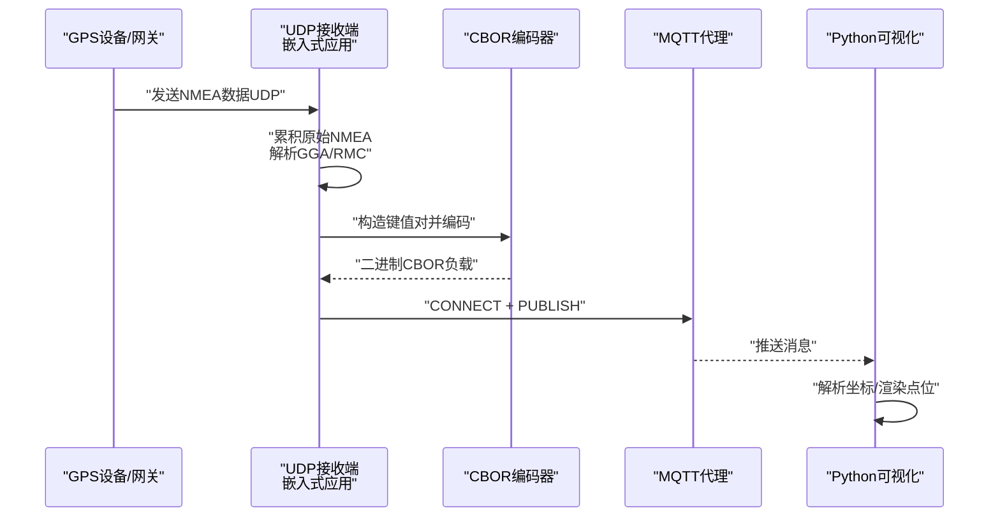
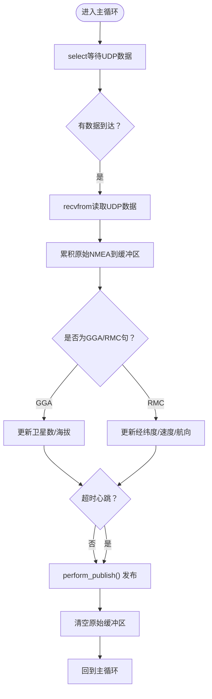
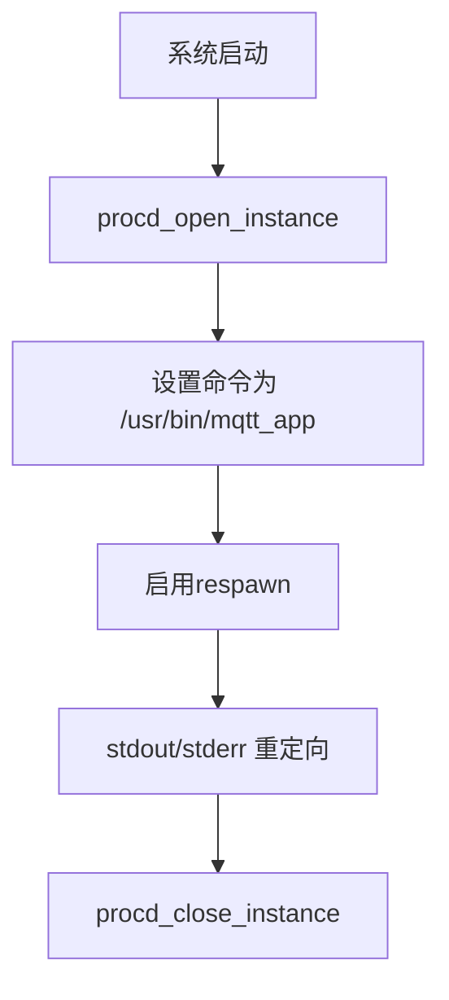
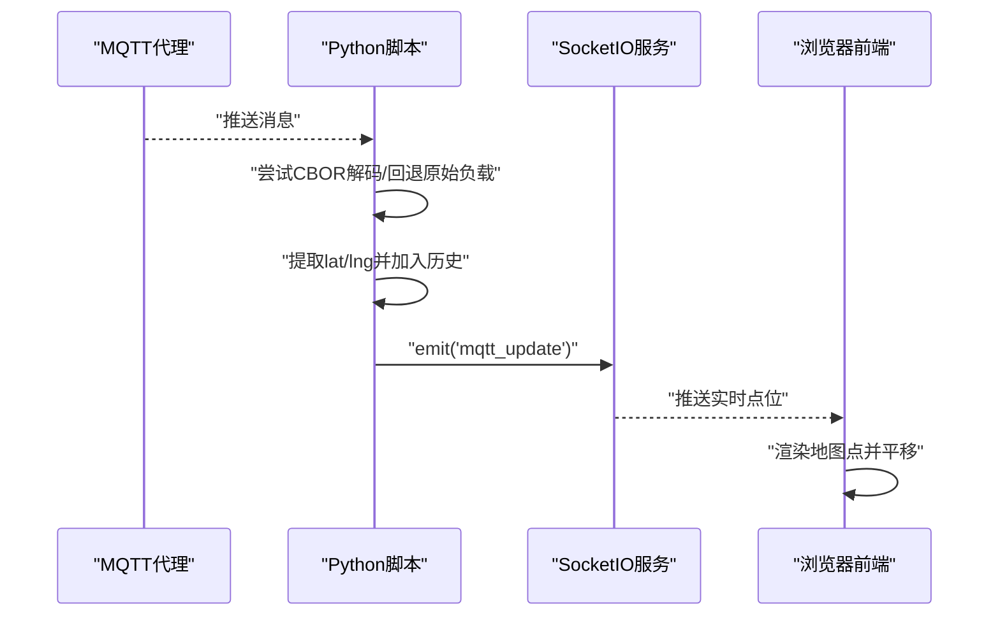

# 快速开始

<cite>
**本文引用的文件**
- [dev_code\dev_code\Readme.md.txt](file://dev_code\dev_code\Readme.md.txt)
- [dev_code\dev_code\mqtt_project_16_ver1_based-on-9\Makefile](file://dev_code\dev_code\mqtt_project_16_ver1_based-on-9\Makefile)
- [dev_code\dev_code\mqtt_project_16_ver2_based-on-15\Makefile](file://dev_code\dev_code\mqtt_project_16_ver2_based-on-15\Makefile)
- [dev_code\dev_code\mqtt_project_9\Makefile](file://dev_code\dev_code\mqtt_project_9\Makefile)
- [dev_code\dev_code\mqtt_project_16_ver1_based-on-9\main.c](file://dev_code\dev_code\mqtt_project_16_ver1_based-on-9\main.c)
- [dev_code\dev_code\mqtt_project_16_ver1_based-on-9\mqtt_helper.c](file://dev_code\dev_code\mqtt_project_16_ver1_based-on-9\mqtt_helper.c)
- [dev_code\dev_code\mqtt_project_16_ver1_based-on-9\cbor_helper.c](file://dev_code\dev_code\mqtt_project_16_ver1_based-on-9\cbor_helper.c)
- [dev_code\dev_code\mqtt_project_16_ver1_based-on-9\files\mqtt_pub.init](file://dev_code\dev_code\mqtt_project_16_ver1_based-on-9\files\mqtt_pub.init)
- [dev_code\dev_code\mqtt_project_9\main.c](file://dev_code\dev_code\mqtt_project_9\main.c)
- [dev_code\dev_code\mqtt_project_9\mqtt_helper.c](file://dev_code\dev_code\mqtt_project_9\mqtt_helper.c)
- [dev_code\dev_code\mqtt_project_9\cbor_helper.c](file://dev_code\dev_code\mqtt_project_9\cbor_helper.c)
- [dev_code\dev_code\mqtt_project_9\files\mqtt_pub.init](file://dev_code\dev_code\mqtt_project_9\files\mqtt_pub.init)
- [OPENSDT_none-armhf_plugin_mqtt-dummy-16-based-on-15_nmea-debug_16.15.0_2602051525-带rawdata\visual_mqtt_poc-brt-solo_2_hongdian.py](file://OPENSDT_none-armhf_plugin_mqtt-dummy-16-based-on-15_nmea-debug_16.15.0_2602051525-带rawdata\visual_mqtt_poc-brt-solo_2_hongdian.py)
</cite>

## 目录
1. [简介](#简介)
2. [项目结构](#项目结构)
3. [核心组件](#核心组件)
4. [架构总览](#架构总览)
5. [详细组件分析](#详细组件分析)
6. [依赖与编译](#依赖与编译)
7. [部署与安装](#部署与安装)
8. [运行与测试](#运行与测试)
9. [性能与优化](#性能与优化)
10. [故障排查](#故障排查)
11. [结语](#结语)

## 简介
本指南面向初学者，帮助你在最短时间内完成印尼GPS追踪系统的环境搭建、编译、部署与验证。系统由三部分组成：
- OpenWrt侧嵌入式应用：从UDP接收NMEA数据，解析并打包为CBOR，通过MQTT发布到消息代理。
- 消息代理与可视化：使用MQTT订阅并用Flask+SocketIO实时展示轨迹点。
- OpenWrt插件包：将可执行程序与系统服务集成，随系统启动自动运行。

## 项目结构
仓库包含多个版本的工程与演示脚本，核心目录如下：
- dev_code/dev_code：包含三个版本的嵌入式应用工程（mqtt_project_9、mqtt_project_16_ver1_based-on-9、mqtt_project_16_ver2_based-on-15），每个工程均包含源码、Makefile与OpenWrt init脚本。
- OPENSDT_*：OpenWrt插件包（.ipk）及可视化演示脚本（Python）。
- visual_mqtt_poc-*：不带原始数据的可视化演示脚本。

**章节来源**
- file://dev_code\dev_code\Readme.md.txt#L1-L12

## 核心组件
- 嵌入式应用（C语言）
  - 主循环：监听UDP端口，累积NMEA原始数据，解析GGA/RMC获取位置、高度、卫星数、航向等信息，采集GSM信号强度，打包为CBOR并通过MQTT发布。
  - 协议栈：自实现MQTT连接、发布与断开流程；CBOR编码器按规范写入键值对。
  - 配置项：MQTT服务器地址、端口、用户名、密码；车辆编号、Provider/Koridor ID；UDP端口；Modem信息文件路径。
- OpenWrt服务脚本（init.d）
  - 使用procd管理进程生命周期，支持开机自启与自动重启。
- 可视化演示（Python）
  - 订阅MQTT主题，解析CBOR或原始负载，将经纬度渲染为地图上的点，记录日志文件。

**章节来源**
- file://dev_code\dev_code\mqtt_project_16_ver1_based-on-9\main.c#L182-L259
- file://dev_code\dev_code\mqtt_project_16_ver1_based-on-9\mqtt_helper.c#L38-L115
- file://dev_code\dev_code\mqtt_project_16_ver1_based-on-9\cbor_helper.c#L38-L89
- file://dev_code\dev_code\mqtt_project_16_ver1_based-on-9\files\mqtt_pub.init#L1-L14
- file://OPENSDT_none-armhf_plugin_mqtt-dummy-16-based-on-15_nmea-debug_16.15.0_2602051525-带rawdata\visual_mqtt_poc-brt-solo_2_hongdian.py#L1-L217

## 架构总览
下图展示了从GPS设备到可视化界面的数据流：

**图表来源**
- [dev_code\dev_code\mqtt_project_16_ver1_based-on-9\main.c](file://dev_code\dev_code\mqtt_project_16_ver1_based-on-9\main.c#L224-L249)
- [dev_code\dev_code\mqtt_project_16_ver1_based-on-9\mqtt_helper.c](file://dev_code\dev_code\mqtt_project_16_ver1_based-on-9\mqtt_helper.c#L59-L108)
- [OPENSDT_none-armhf_plugin_mqtt-dummy-16-based-on-15_nmea-debug_16.15.0_2602051525-带rawdata\visual_mqtt_poc-brt-solo_2_hongdian.py](file://OPENSDT_none-armhf_plugin_mqtt-dummy-16-based-on-15_nmea-debug_16.15.0_2602051525-带rawdata\visual_mqtt_poc-brt-solo_2_hongdian.py#L150-L186)

## 详细组件分析

### 组件A：嵌入式应用主流程（C语言）
- 功能要点
  - UDP监听与选择超时，避免阻塞。
  - 原始NMEA累积缓冲区，按句追加换行便于查看。
  - 解析GGA获取卫星数与海拔；解析RMC获取经纬度、速度（原始节）、航向。
  - 采集GSM信号强度（从modem信息文件读取）。
  - 构造CBOR映射，包含provider_id、koridor_id、bus_no、lat/lon/alt、avg_speed、datetime_log、direction、satelite、gsm_signal、nmea_raw等字段。
  - 建立TCP连接后发送MQTT CONNECT，再PUBLISH至指定主题，最后断开连接。
- 关键路径
  - 主循环与心跳：file://dev_code\dev_code\mqtt_project_16_ver1_based-on-9\main.c#L201-L256
  - RMC解析与速度处理：file://dev_code\dev_code\mqtt_project_16_ver1_based-on-9\main.c#L98-L133
  - 发布流程：file://dev_code\dev_code\mqtt_project_16_ver1_based-on-9\main.c#L135-L180
  - MQTT协议实现：file://dev_code\dev_code\mqtt_project_16_ver1_based-on-9\mqtt_helper.c#L38-L115
  - CBOR编码：file://dev_code\dev_code\mqtt_project_16_ver1_based-on-9\cbor_helper.c#L38-L89

**图表来源**
- [dev_code\dev_code\mqtt_project_16_ver1_based-on-9\main.c](file://dev_code\dev_code\mqtt_project_16_ver1_based-on-9\main.c#L201-L256)

**章节来源**
- file://dev_code\dev_code\mqtt_project_16_ver1_based-on-9\main.c#L182-L259
- file://dev_code\dev_code\mqtt_project_16_ver1_based-on-9\mqtt_helper.c#L38-L115
- file://dev_code\dev_code\mqtt_project_16_ver1_based-on-9\cbor_helper.c#L38-L89

### 组件B：OpenWrt服务脚本（init.d）
- 功能要点
  - 使用procd启动/重启进程，重定向标准输出与错误输出。
  - 设置启动优先级与停止优先级。
- 关键路径
  - file://dev_code\dev_code\mqtt_project_16_ver1_based-on-9\files\mqtt_pub.init#L6-L13

**图表来源**
- [dev_code\dev_code\mqtt_project_16_ver1_based-on-9\files\mqtt_pub.init](file://dev_code\dev_code\mqtt_project_16_ver1_based-on-9\files\mqtt_pub.init#L6-L13)

**章节来源**
- file://dev_code\dev_code\mqtt_project_16_ver1_based-on-9\files\mqtt_pub.init#L1-L14

### 组件C：可视化演示（Python）
- 功能要点
  - 连接MQTT代理，订阅指定主题。
  - 尝试使用CBOR解码；若失败则记录原始负载。
  - 提取经纬度，加入历史列表并通过SocketIO推送到前端。
  - 前端使用Leaflet渲染地图点，实时跟随最新点位。
- 关键路径
  - MQTT回调与消息处理：file://OPENSDT_none-armhf_plugin_mqtt-dummy-16-based-on-15_nmea-debug_16.15.0_2602051525-带rawdata\visual_mqtt_poc-brt-solo_2_hongdian.py#L150-L186
  - SocketIO初始化与前端模板：file://OPENSDT_none-armhf_plugin_mqtt-dummy-16-based-on-15_nmea-debug_16.15.0_2602051525-带rawdata\visual_mqtt_poc-brt-solo_2_hongdian.py#L36-L130

**图表来源**
- [OPENSDT_none-armhf_plugin_mqtt-dummy-16-based-on-15_nmea-debug_16.15.0_2602051525-带rawdata\visual_mqtt_poc-brt-solo_2_hongdian.py](file://OPENSDT_none-armhf_plugin_mqtt-dummy-16-based-on-15_nmea-debug_16.15.0_2602051525-带rawdata\visual_mqtt_poc-brt-solo_2_hongdian.py#L150-L186)

**章节来源**
- file://OPENSDT_none-armhf_plugin_mqtt-dummy-16-based-on-15_nmea-debug_16.15.0_2602051525-带rawdata\visual_mqtt_poc-brt-solo_2_hongdian.py#L1-L217

## 依赖与编译

### 编译环境与工具链
- 目标平台：armhf（OpenWrt）
- 工具链：使用OpenWrt SDK或编译树提供的交叉编译工具链（CC/CFLAGS/LDFLAGS等变量由工具链提供）
- 依赖库：数学库（-lm）

**章节来源**
- file://dev_code\dev_code\mqtt_project_16_ver1_based-on-9\Makefile#L1-L23
- file://dev_code\dev_code\mqtt_project_16_ver2_based-on-15\Makefile#L1-L23
- file://dev_code\dev_code\mqtt_project_9\Makefile#L1-L23

### Makefile使用方法与构建选项
- 构建目标
  - 默认：生成可执行文件
  - install：在目标根目录/usr/bin放置可执行文件，在/etc/init.d放置服务脚本并赋予执行权限
  - clean：清理对象文件与可执行文件
- 关键变量
  - TARGET：目标程序名
  - OBJS：源文件编译产物
  - LIBS：链接参数（如-m）
- 构建流程
  - 通过模式规则编译.c为.o
  - 链接生成最终二进制

**章节来源**
- file://dev_code\dev_code\mqtt_project_16_ver1_based-on-9\Makefile#L6-L22
- file://dev_code\dev_code\mqtt_project_16_ver2_based-on-15\Makefile#L6-L22
- file://dev_code\dev_code\mqtt_project_9\Makefile#L6-L22

### 版本差异与选择建议
- mqtt_project_9：基础版本，已验证持续1Hz输出，但存在精度与异常速度问题。
- mqtt_project_16_ver1_based-on-9：在9基础上改进，针对新网关版本，但测试中出现数据跳变。
- mqtt_project_16_ver2_based-on-15：从另一个基线分支改进，用于解决异常速度问题。
- 建议：优先使用16_ver1或16_ver2进行测试，结合实际硬件与网关版本选择。

**章节来源**
- file://dev_code\dev_code\Readme.md.txt#L1-L12

## 部署与安装

### OpenWrt插件包安装
- 安装方式：使用opkg安装对应.ipk包（包名包含“OPENSDT_none-armhf_plugin_mqtt-dummy-...”）
- 安装后行为：可执行文件位于/usr/bin，服务脚本位于/etc/init.d/mqtt_pub，随系统启动自动运行

**章节来源**
- file://dev_code\dev_code\mqtt_project_16_ver1_based-on-9\Makefile#L14-L19
- file://dev_code\dev_code\mqtt_project_16_ver2_based-on-15\Makefile#L14-L19
- file://dev_code\dev_code\mqtt_project_9\Makefile#L14-L19

### 系统服务配置
- 启动顺序：START=99，STOP=10
- 运行模式：procd管理，自动重启（respawn）
- 输出重定向：stdout/stderr重定向到系统日志

**章节来源**
- file://dev_code\dev_code\mqtt_project_16_ver1_based-on-9\files\mqtt_pub.init#L2-L13
- file://dev_code\dev_code\mqtt_project_9\files\mqtt_pub.init#L2-L13

### 网络参数设置
- UDP端口：默认监听UDP端口（各版本源码中定义）
- MQTT参数：服务器地址、端口、用户名、密码（需在源码中配置或通过外部配置注入）
- Modem信息文件：用于读取GSM信号强度（路径在源码中定义）

**章节来源**
- file://dev_code\dev_code\mqtt_project_16_ver1_based-on-9\main.c#L14-L25
- file://dev_code\dev_code\mqtt_project_9\main.c#L14-L25

## 运行与测试

### 基本运行测试步骤
- 在OpenWrt设备上安装.ipk包并确认服务已启动
- 使用可视化脚本连接MQTT代理，打开浏览器访问前端页面
- 观察地图上是否出现移动的点位，检查日志文件是否记录坐标
- 若无点位，检查UDP数据是否到达、MQTT连接是否成功、主题是否一致

**章节来源**
- file://OPENSDT_none-armhf_plugin_mqtt-dummy-16-based-on-15_nmea-debug_16.15.0_2602051525-带rawdata\visual_mqtt_poc-brt-solo_2_hongdian.py#L200-L217

### 常见问题与解决方案
- 无数据点
  - 检查UDP端口是否正确、防火墙是否放行
  - 确认GPS设备/网关是否正常发送NMEA
- 异常速度或数值异常
  - 使用16_ver1或16_ver2版本，避免直接转换为km/h
  - 检查RMC句中的速度字段来源与单位
- MQTT连接失败
  - 核对服务器地址、端口、用户名、密码
  - 检查网络连通性与代理状态
- 日志为空
  - 确认CBOR库可用；若不可用，脚本会记录原始负载
  - 检查日志文件路径与权限

**章节来源**
- file://dev_code\dev_code\mqtt_project_16_ver1_based-on-9\main.c#L120-L133
- file://OPENSDT_none-armhf_plugin_mqtt-dummy-16-based-on-15_nmea-debug_16.15.0_2602051525-带rawdata\visual_mqtt_poc-brt-solo_2_hongdian.py#L156-L163

## 性能与优化
- UDP轮询间隔：主循环使用select并设置微秒级超时，平衡实时性与CPU占用
- 缓冲策略：累积原始NMEA，避免频繁发布；心跳周期内不清空，保留部分数据
- CBOR编码：紧凑二进制格式，减少MQTT负载大小
- 建议
  - 根据硬件能力调整超时与缓冲上限
  - 对异常数据进行阈值过滤后再发布

**章节来源**
- file://dev_code\dev_code\mqtt_project_16_ver1_based-on-9\main.c#L208-L212
- file://dev_code\dev_code\mqtt_project_16_ver1_based-on-9\main.c#L249-L255

## 故障排查
- 服务未启动
  - 检查/etc/init.d/mqtt_pub是否存在与权限
  - 查看系统日志中stdout/stderr输出
- 数据延迟或丢失
  - 调整select超时，观察CPU占用
  - 检查网络拥塞与代理性能
- 速度异常
  - 使用原始节值而非转换后的km/h
  - 核对RMC句字段索引与校验

**章节来源**
- file://dev_code\dev_code\mqtt_project_16_ver1_based-on-9\files\mqtt_pub.init#L6-L13
- file://dev_code\dev_code\mqtt_project_16_ver1_based-on-9\main.c#L120-L133

## 结语
通过本指南，你可以在OpenWrt设备上快速部署GPS追踪系统，并借助可视化脚本验证数据流。建议先用16_ver1或16_ver2版本进行测试，结合实际硬件与网关版本选择最优方案；遇到问题时，优先检查UDP数据、MQTT连接与日志输出。