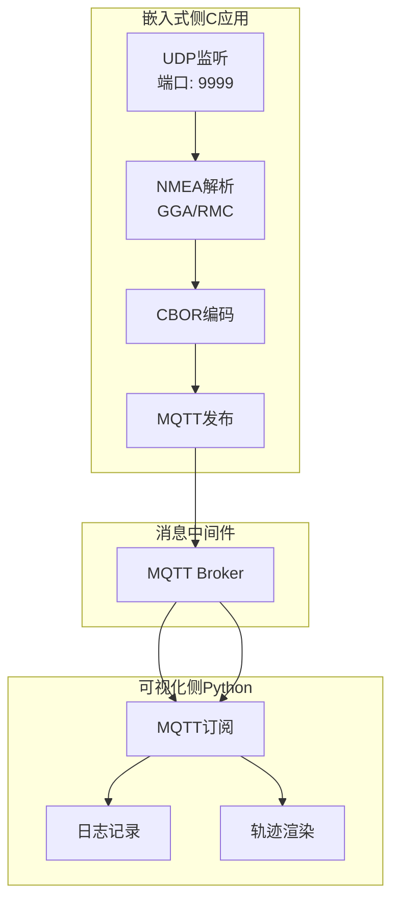
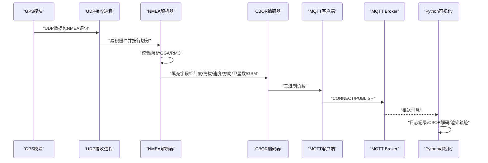
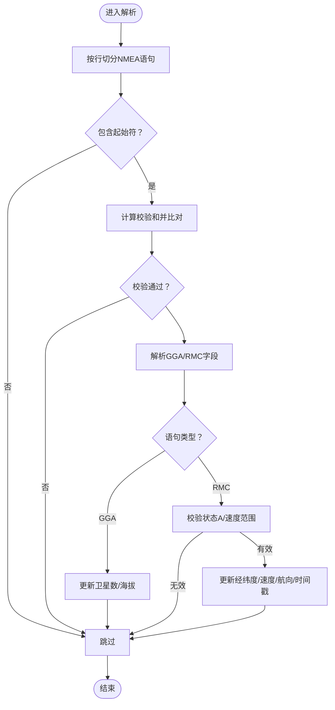
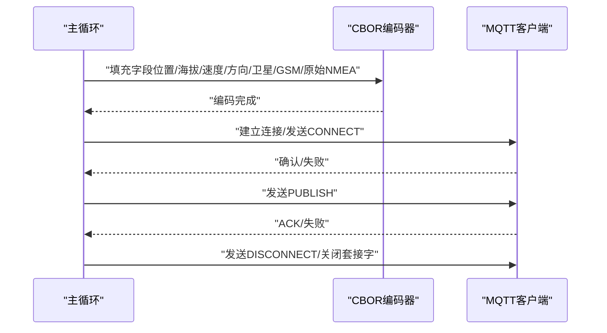
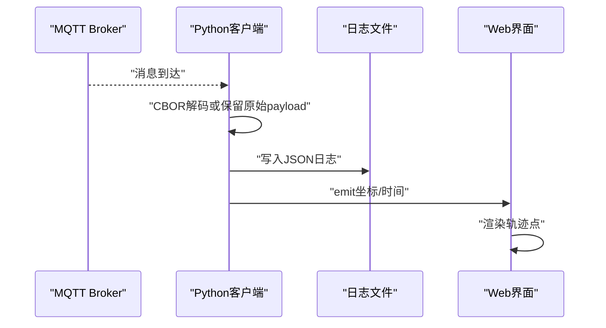
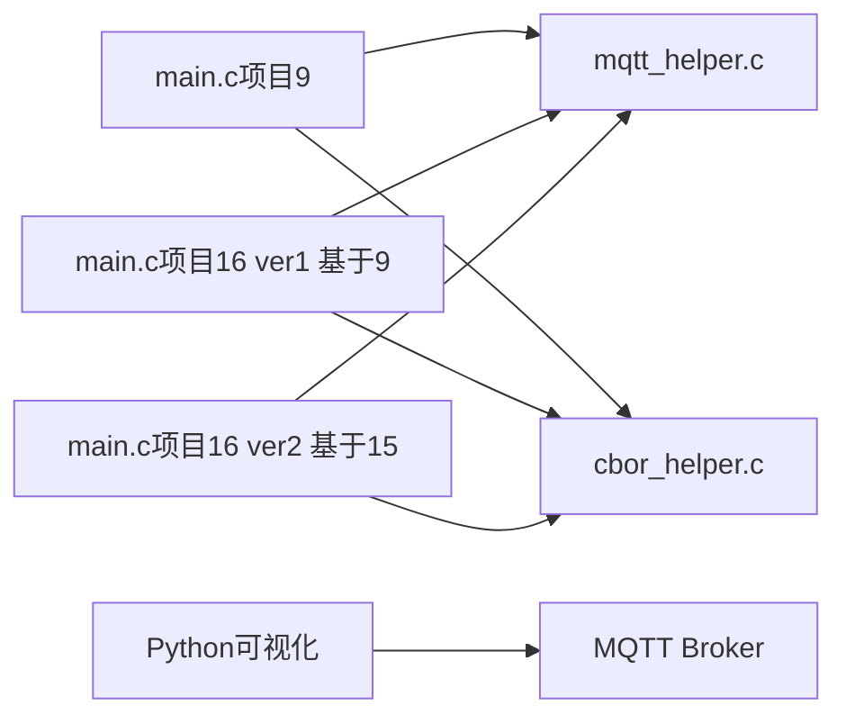

# 故障排除

<cite>
**本文引用的文件**
- [Readme.md.txt](file://dev_code/Readme.md.txt)
- [main.c（项目16 ver1 基于9）](file://dev_code/dev_code/mqtt_project_16_ver1_based-on-9/main.c)
- [mqtt_helper.c（项目16 ver1 基于9）](file://dev_code/dev_code/mqtt_project_16_ver1_based-on-9/mqtt_helper.c)
- [cbor_helper.c（项目16 ver1 基于9）](file://dev_code/dev_code/mqtt_project_16_ver1_based-on-9/cbor_helper.c)
- [main.c（项目9）](file://dev_code/dev_code/mqtt_project_9/main.c)
- [main.c（项目16 ver2 基于15）](file://dev_code/dev_code/mqtt_project_16_ver2_based-on-15/main.c)
- [visual_mqtt_poc-brt-solo_2_hongdian.py（不带rawdata）](file://visual_mqtt_poc-brt-solo_2_hongdian-不带rawdata/visual_mqtt_poc-brt-solo_2_hongdian.py)
- [visual_mqtt_poc-brt-solo_2_hongdian.py（带rawdata）](file://OPENSDT_none-armhf_plugin_mqtt-dummy-16-based-on-15_nmea-debug_16.15.0_2602051525-带rawdata/visual_mqtt_poc-brt-solo_2_hongdian.py)
- [Makefile（项目16 ver1 基于9）](file://dev_code/dev_code/mqtt_project_16_ver1_based-on-9/Makefile)
- [mqtt_pub.init（项目16 ver1 基于9）](file://dev_code/dev_code/mqtt_project_16_ver1_based-on-9/files/mqtt_pub.init)
</cite>

## 目录
1. [简介](#简介)
2. [项目结构](#项目结构)
3. [核心组件](#核心组件)
4. [架构总览](#架构总览)
5. [详细组件分析](#详细组件分析)
6. [依赖关系分析](#依赖关系分析)
7. [性能考量](#性能考量)
8. [故障排除指南](#故障排除指南)
9. [结论](#结论)
10. [附录](#附录)

## 简介
本指南面向印尼GPS追踪系统的运维与技术支持人员，聚焦于常见问题的诊断与修复：GPS数据异常（含数据跳变、精度不足、天文数值异常）、网络连接问题（MQTT连接失败、超时、认证错误）、系统性能问题（CPU/内存占用、发布频率抖动、缓冲区溢出）。文档提供系统日志解读方法、错误代码与字段含义说明、调试技巧以及针对不同版本差异的解决方案，并给出预防性维护与性能优化建议。

## 项目结构
该仓库包含多个版本的客户端实现与可视化演示脚本：
- 版本说明与差异：README中明确指出三个版本的定位与已知问题，便于快速定位当前使用版本与潜在回归点。
- 核心C应用：基于UDP接收NMEA语句，解析GGA/RMC等，封装CBOR并通过MQTT发送；包含两个版本（基于9与基于15）及原始版本。
- 可视化演示：Python脚本订阅MQTT主题，实时渲染轨迹点，支持日志记录与CBOR解码回放。
- 构建与部署：提供Makefile与OpenWrt init脚本，便于在嵌入式设备上安装与自启动。

图表来源
- [main.c（项目16 ver1 基于9）](file://dev_code/dev_code/mqtt_project_16_ver1_based-on-9/main.c#L182-L259)
- [mqtt_helper.c（项目16 ver1 基于9）](file://dev_code/dev_code/mqtt_project_16_ver1_based-on-9/mqtt_helper.c#L38-L115)
- [cbor_helper.c（项目16 ver1 基于9）](file://dev_code/dev_code/mqtt_project_16_ver1_based-on-9/cbor_helper.c#L38-L89)
- [visual_mqtt_poc-brt-solo_2_hongdian.py（不带rawdata）](file://visual_mqtt_poc-brt-solo_2_hongdian-不带rawdata/visual_mqtt_poc-brt-solo_2_hongdian.py#L142-L217)

章节来源
- [Readme.md.txt](file://dev_code/Readme.md.txt#L1-L12)
- [Makefile（项目16 ver1 基于9）](file://dev_code/dev_code/mqtt_project_16_ver1_based-on-9/Makefile#L1-L23)
- [mqtt_pub.init（项目16 ver1 基于9）](file://dev_code/dev_code/mqtt_project_16_ver1_based-on-9/files/mqtt_pub.init#L1-L14)

## 核心组件
- UDP接收与缓冲管理：持续累积NMEA语句，按行切分并逐条校验与解析，避免丢句与越界。
- NMEA解析器：支持GGA（卫星数、海拔）与RMC（经纬度、速度、航向），并进行坐标格式转换与有效性检查。
- CBOR序列化：将关键字段打包为二进制结构，确保跨语言传输一致性。
- MQTT发布器：建立TCP连接、发送CONNECT、PUBLISH，断开连接，具备超时与重试基础逻辑。
- 可视化前端：订阅MQTT主题，渲染轨迹点，记录日志，支持CBOR解码与回放。

章节来源
- [main.c（项目16 ver1 基于9）](file://dev_code/dev_code/mqtt_project_16_ver1_based-on-9/main.c#L201-L259)
- [main.c（项目9）](file://dev_code/dev_code/mqtt_project_9/main.c#L179-L257)
- [main.c（项目16 ver2 基于15）](file://dev_code/dev_code/mqtt_project_16_ver2_based-on-15/main.c#L245-L289)
- [mqtt_helper.c（项目16 ver1 基于9）](file://dev_code/dev_code/mqtt_project_16_ver1_based-on-9/mqtt_helper.c#L38-L115)
- [cbor_helper.c（项目16 ver1 基于9）](file://dev_code/dev_code/mqtt_project_16_ver1_based-on-9/cbor_helper.c#L38-L89)
- [visual_mqtt_poc-brt-solo_2_hongdian.py（不带rawdata）](file://visual_mqtt_poc-brt-solo_2_hongdian-不带rawdata/visual_mqtt_poc-brt-solo_2_hongdian.py#L142-L217)

## 架构总览
下图展示从GPS模块到MQTT再到可视化前端的数据流路径，标注关键控制点与可能的瓶颈位置。

图表来源
- [main.c（项目16 ver1 基于9）](file://dev_code/dev_code/mqtt_project_16_ver1_based-on-9/main.c#L201-L259)
- [mqtt_helper.c（项目16 ver1 基于9）](file://dev_code/dev_code/mqtt_project_16_ver1_based-on-9/mqtt_helper.c#L59-L115)
- [cbor_helper.c（项目16 ver1 基于9）](file://dev_code/dev_code/mqtt_project_16_ver1_based-on-9/cbor_helper.c#L38-L89)
- [visual_mqtt_poc-brt-solo_2_hongdian.py（不带rawdata）](file://visual_mqtt_poc-brt-solo_2_hongdian-不带rawdata/visual_mqtt_poc-brt-solo_2_hongdian.py#L142-L217)

## 详细组件分析

### 组件A：NMEA解析与数据校验
- 关键流程：按行提取$...*校验码段，计算异或校验值并与接收值比对；仅当RMC状态为A且速度在合理范围时更新位置与速度。
- 数据跳变与异常处理：通过“最近一次RMC时间戳”与“固定窗口阈值”判定是否有效，避免过期或异常速度导致的跳变。
- 字段映射：纬度/经度采用度分转十进制度；海拔来自GGA；速度先取节再换算为km/h（版本差异见后文）。

图表来源
- [main.c（项目16 ver2 基于15）](file://dev_code/dev_code/mqtt_project_16_ver2_based-on-15/main.c#L116-L186)

章节来源
- [main.c（项目16 ver2 基于15）](file://dev_code/dev_code/mqtt_project_16_ver2_based-on-15/main.c#L116-L186)

### 组件B：CBOR编码与MQTT发布
- 编码策略：使用紧凑型CBOR映射，字符串键与数值/浮点值组合，保证跨平台一致性。
- 发布策略：每次收到RMC或定时心跳均尝试发布；在ver1中直接发送完整原始NMEA文本；ver2中发送最新聚合的GGA/RMC等片段。
- 连接与超时：设置TCP读写超时，CONNECT报文包含用户名/密码；断开前发送DISCONNECT。

图表来源
- [cbor_helper.c（项目16 ver1 基于9）](file://dev_code/dev_code/mqtt_project_16_ver1_based-on-9/cbor_helper.c#L38-L89)
- [mqtt_helper.c（项目16 ver1 基于9）](file://dev_code/dev_code/mqtt_project_16_ver1_based-on-9/mqtt_helper.c#L38-L115)
- [main.c（项目16 ver1 基于9）](file://dev_code/dev_code/mqtt_project_16_ver1_based-on-9/main.c#L132-L180)

章节来源
- [cbor_helper.c（项目16 ver1 基于9）](file://dev_code/dev_code/mqtt_project_16_ver1_based-on-9/cbor_helper.c#L38-L89)
- [mqtt_helper.c（项目16 ver1 基于9）](file://dev_code/dev_code/mqtt_project_16_ver1_based-on-9/mqtt_helper.c#L38-L115)
- [main.c（项目16 ver1 庩于9）](file://dev_code/dev_code/mqtt_project_16_ver1_based-on-9/main.c#L132-L180)

### 组件C：可视化与日志
- 订阅与渲染：订阅指定主题，收到消息后提取经纬度并绘制点；同时记录JSON日志，便于离线分析。
- CBOR解码：优先使用cbor2库解码二进制负载；若缺失则保留原始payload字符串，便于排查。
- 日志文件：统一追加写入，包含时间戳与完整载荷，便于回溯。

图表来源
- [visual_mqtt_poc-brt-solo_2_hongdian.py（不带rawdata）](file://visual_mqtt_poc-brt-solo_2_hongdian-不带rawdata/visual_mqtt_poc-brt-solo_2_hongdian.py#L142-L217)

章节来源
- [visual_mqtt_poc-brt-solo_2_hongdian.py（不带rawdata）](file://visual_mqtt_poc-brt-solo_2_hongdian-不带rawdata/visual_mqtt_poc-brt-solo_2_hongdian.py#L142-L217)

## 依赖关系分析
- 模块内聚：解析、编码、发布三部分职责清晰，耦合度低，便于独立测试与替换。
- 外部依赖：MQTT客户端库（C）、Python paho-mqtt与cbor2（可选）、Flask/SocketIO用于可视化。
- 版本差异：ver1与ver2在速度处理、缓冲策略、校验与异常处理方面存在差异，需结合README与源码逐项对比。

图表来源
- [main.c（项目9）](file://dev_code/dev_code/mqtt_project_9/main.c#L1-L257)
- [main.c（项目16 ver1 基于9）](file://dev_code/dev_code/mqtt_project_16_ver1_based-on-9/main.c#L1-L259)
- [main.c（项目16 ver2 基于15）](file://dev_code/dev_code/mqtt_project_16_ver2_based-on-15/main.c#L1-L289)
- [mqtt_helper.c（项目16 ver1 基于9）](file://dev_code/dev_code/mqtt_project_16_ver1_based-on-9/mqtt_helper.c#L1-L115)
- [cbor_helper.c（项目16 ver1 基于9）](file://dev_code/dev_code/mqtt_project_16_ver1_based-on-9/cbor_helper.c#L1-L89)
- [visual_mqtt_poc-brt-solo_2_hongdian.py（不带rawdata）](file://visual_mqtt_poc-brt-solo_2_hongdian-不带rawdata/visual_mqtt_poc-brt-solo_2_hongdian.py#L1-L217)

章节来源
- [Readme.md.txt](file://dev_code/Readme.md.txt#L1-L12)

## 性能考量
- 解析效率：按行扫描与令牌化，复杂度近似O(n)，适合高频NMEA输入。
- 缓冲管理：累积缓冲区大小与发布周期影响内存占用与延迟；应根据链路质量调整心跳间隔。
- 网络开销：CBOR二进制编码体积更小，传输更高效；发布频率过高会增加MQTT压力。
- 资源占用：UDP监听+解析+MQTT连接+日志写入，需关注CPU与磁盘I/O峰值。

[本节为通用性能讨论，无需特定文件引用]

## 故障排除指南

### 一、GPS数据异常

#### 1. 数据跳变（位置/速度突变）
- 现象特征：轨迹出现明显折线或瞬移，速度值异常波动。
- 排查步骤
  - 检查RMC状态位是否为A，速度是否在合理区间（ver2中对异常速度有裁剪逻辑）。
  - 查看最近一次RMC时间戳与当前时间差，确认是否超过有效窗口。
  - 对比不同版本的速度处理逻辑（ver1直接使用原始节值，ver2进行km/h换算并裁剪）。
  - 核对原始NMEA片段，确认是否存在损坏或截断。
- 解决方案
  - 在ver2基础上启用“速度范围裁剪”与“时间戳有效性判断”，减少异常值传播。
  - 若使用ver1，考虑在应用层增加滑动窗口滤波或阈值报警。
- 预防措施
  - 定期校准GPS天线与遮挡环境，避免多路径误差。
  - 提升发布周期稳定性，避免因心跳导致的空窗期误判。

章节来源
- [main.c（项目16 ver2 基于15）](file://dev_code/dev_code/mqtt_project_16_ver2_based-on-15/main.c#L150-L164)
- [main.c（项目16 ver1 基于9）](file://dev_code/dev_code/mqtt_project_16_ver1_based-on-9/main.c#L119-L133)

#### 2. GPS精度不足（坐标漂移/偏移）
- 现象特征：相同地点多次采样坐标存在微小偏差，或整体偏移。
- 排查步骤
  - 检查卫星数与PDOP/HDOP（由GGA中的定位精度参数反映），弱信号会导致精度下降。
  - 观察GSM信号强度，弱信号可能影响定位稳定性。
  - 使用可视化工具核对历史轨迹，确认是否为传感器固有偏差。
- 解决方案
  - 改善安装位置，减少遮挡与反射面。
  - 在应用层引入坐标平滑算法（移动平均/卡尔曼滤波）。
- 预防措施
  - 定期清理天线罩，避免积尘与腐蚀。

章节来源
- [main.c（项目9）](file://dev_code/dev_code/mqtt_project_9/main.c#L86-L130)
- [main.c（项目16 ver1 基于9）](file://dev_code/dev_code/mqtt_project_16_ver1_based-on-9/main.c#L86-L133)

#### 3. 天文数值异常（速度/航向异常高/低）
- 现象特征：速度接近0或远超正常范围，航向无意义。
- 排查步骤
  - 在ver2中确认速度裁剪逻辑是否生效（小于1km/h置0，大于150km/h置0）。
  - 检查RMC中速度字段是否为空或非数字。
  - 对比不同版本的速度处理差异（节值 vs km/h换算）。
- 解决方案
  - 启用ver2的异常值过滤与时间戳有效性判断。
  - 在应用层增加阈值报警与自动降级策略。
- 预防措施
  - 定期校验GPS模块固件版本与驱动。

章节来源
- [main.c（项目16 ver2 基于15）](file://dev_code/dev_code/mqtt_project_16_ver2_based-on-15/main.c#L150-L157)

### 二、网络连接问题

#### 1. MQTT连接失败/超时
- 现象特征：日志显示连接建立失败、CONNECT发送失败或超时。
- 排查步骤
  - 检查Broker地址、端口、用户名/密码是否正确。
  - 使用网络连通性工具验证TCP连通性与防火墙策略。
  - 查看C侧超时设置与返回码，确认是否为EINTR重试或连接拒绝。
- 解决方案
  - 调整超时参数，增加重试次数与退避策略。
  - 在初始化脚本中启用respawn，确保异常退出后自动重启。
- 预防措施
  - 将Broker切换至高可用集群，降低单点风险。

章节来源
- [mqtt_helper.c（项目16 ver1 基于9）](file://dev_code/dev_code/mqtt_project_16_ver1_based-on-9/mqtt_helper.c#L38-L86)
- [mqtt_pub.init（项目16 ver1 基于9）](file://dev_code/dev_code/mqtt_project_16_ver1_based-on-9/files/mqtt_pub.init#L6-L13)

#### 2. 认证错误（返回码非0）
- 现象特征：on_connect回调返回码非0，订阅失败。
- 排查步骤
  - 确认用户名/密码与ACL配置一致。
  - 检查客户端ID是否冲突或被限制。
- 解决方案
  - 更新配置并重启服务实例。
- 预防措施
  - 引入配置校验与自动化部署流程。

章节来源
- [visual_mqtt_poc-brt-solo_2_hongdian.py（不带rawdata）](file://visual_mqtt_poc-brt-solo_2_hongdian-不带rawdata/visual_mqtt_poc-brt-solo_2_hongdian.py#L143-L149)

#### 3. 发布失败/丢包
- 现象特征：消息未送达或延迟较大。
- 排查步骤
  - 检查发布频率与Broker QoS/限速策略。
  - 核对CBOR编码是否完整，避免半包导致解码失败。
  - 在Python侧确认是否启用cbor2，缺失时将记录原始payload以便人工分析。
- 解决方案
  - 降低发布频率或合并多条NMEA后再发布。
  - 在应用层增加本地缓存与重发机制。
- 预防措施
  - 建立发布成功率监控与告警。

章节来源
- [cbor_helper.c（项目16 ver1 基于9）](file://dev_code/dev_code/mqtt_project_16_ver1_based-on-9/cbor_helper.c#L38-L89)
- [visual_mqtt_poc-brt-solo_2_hongdian.py（不带rawdata）](file://visual_mqtt_poc-brt-solo_2_hongdian-不带rawdata/visual_mqtt_poc-brt-solo_2_hongdian.py#L156-L163)

### 三、系统性能问题

#### 1. CPU/内存占用过高
- 现象特征：设备发热、风扇高速运转、响应迟滞。
- 排查步骤
  - 检查UDP接收与解析循环的触发频率，确认是否过于频繁。
  - 观察日志中缓冲区增长趋势，避免无限增长导致内存压力。
  - 分析发布周期与网络往返时间，避免阻塞式发送。
- 解决方案
  - 调整select超时与发布间隔，平衡实时性与资源消耗。
  - 限制原始NMEA缓冲区长度并在发布后清空。
- 预防措施
  - 引入资源监控与自动降载策略。

章节来源
- [main.c（项目16 ver1 基于9）](file://dev_code/dev_code/mqtt_project_16_ver1_based-on-9/main.c#L201-L259)
- [main.c（项目16 ver2 基于15）](file://dev_code/dev_code/mqtt_project_16_ver2_based-on-15/main.c#L259-L289)

#### 2. 发布频率不稳定
- 现象特征：轨迹点稀疏或密集不均。
- 排查步骤
  - 检查select超时与心跳逻辑，确认是否在无数据时仍频繁发布。
  - 对比不同版本的心跳策略（ver1在无活动时也会发布，ver2按固定周期发布）。
- 解决方案
  - 固定发布周期，避免受网络波动影响。
- 预防措施
  - 在Broker侧设置合理的去重与合并策略。

章节来源
- [main.c（项目16 ver1 基于9）](file://dev_code/dev_code/mqtt_project_16_ver1_based-on-9/main.c#L249-L255)
- [main.c（项目16 ver2 基于15）](file://dev_code/dev_code/mqtt_project_16_ver2_based-on-15/main.c#L284-L287)

### 四、日志解读与调试技巧

#### 1. 系统日志
- C应用日志：包含“GPS坐标/GSM信号/卫星数”的简要输出，便于快速定位数据状态。
- Python日志：以JSON格式记录完整载荷，便于离线分析与回放。
- 调试技巧
  - 在无cbor2时，优先查看“raw_payload”字段，确认二进制是否可解码。
  - 使用时间戳对齐消息到达顺序，定位异常片段。

章节来源
- [main.c（项目16 ver1 基于9）](file://dev_code/dev_code/mqtt_project_16_ver1_based-on-9/main.c#L238-L241)
- [visual_mqtt_poc-brt-solo_2_hongdian.py（不带rawdata）](file://visual_mqtt_poc-brt-solo_2_hongdian-不带rawdata/visual_mqtt_poc-brt-solo_2_hongdian.py#L133-L141)

#### 2. 错误代码与含义
- MQTT返回码（on_connect）：非0表示连接失败，需检查认证与网络。
- CBOR解码失败：通常由payload非标准或损坏引起，记录“raw_error”字段辅助定位。
- 文件写入失败：检查日志文件权限与磁盘空间。

章节来源
- [visual_mqtt_poc-brt-solo_2_hongdian.py（不带rawdata）](file://visual_mqtt_poc-brt-solo_2_hongdian-不带rawdata/visual_mqtt_poc-brt-solo_2_hongdian.py#L143-L149)
- [visual_mqtt_poc-brt-solo_2_hongdian.py（不带rawdata）](file://visual_mqtt_poc-brt-solo_2_hongdian-不带rawdata/visual_mqtt_poc-brt-solo_2_hongdian.py#L156-L163)

#### 3. 版本差异与迁移建议
- 版本说明要点：README明确指出各版本目标与遗留问题，迁移时需对照功能差异与已知缺陷。
- 迁移建议
  - 优先采用ver2的异常值过滤与缓冲策略。
  - 若必须使用ver1，补充应用层滤波与心跳策略。

章节来源
- [Readme.md.txt](file://dev_code/Readme.md.txt#L1-L12)

### 五、预防性维护与性能优化

- 预防性维护
  - 定期检查GPS天线与馈线连接，清洁透镜。
  - 监控GSM信号强度与卫星数，异常时及时复位或更换设备。
  - 定期巡检Broker健康状态与队列积压。
- 性能优化
  - 合理设置发布周期与缓冲上限，避免内存膨胀。
  - 在应用层引入轻量滤波与异常检测，减少无效发布。
  - 使用二进制协议（CBOR）与压缩策略，降低带宽占用。

[本节为通用建议，无需特定文件引用]

## 结论
本指南围绕印尼GPS追踪系统的关键环节提供了系统化的故障排除方法与优化策略。通过理解不同版本的差异、掌握日志解读与调试技巧，并结合预防性维护，可显著提升系统的稳定性与可维护性。建议在生产环境中优先采用具备异常值过滤与缓冲管理能力的版本，并配套完善的监控与告警体系。

[本节为总结性内容，无需特定文件引用]

## 附录

### A. 关键字段与含义（CBOR载荷）
- provider_id：运营方标识
- koridor_id：线路标识
- no_bus：车辆编号
- lat_pos/lon_pos：十进制度坐标
- alt_pos：海拔
- avg_speed：平均速度
- direction：航向
- satelite：卫星数
- gsm_signal：GSM信号强度
- nmea_raw：原始NMEA片段（不同版本策略不同）

章节来源
- [main.c（项目16 ver1 基于9）](file://dev_code/dev_code/mqtt_project_16_ver1_based-on-9/main.c#L154-L169)
- [main.c（项目16 ver2 基于15）](file://dev_code/dev_code/mqtt_project_16_ver2_based-on-15/main.c#L209-L225)

### B. 构建与部署要点
- 构建：使用提供的Makefile编译目标，链接数学库。
- 安装：复制可执行文件与初始化脚本，设置自启动与respawn。
- 验证：检查进程状态、日志输出与可视化界面连接状态。

章节来源
- [Makefile（项目16 ver1 基于9）](file://dev_code/dev_code/mqtt_project_16_ver1_based-on-9/Makefile#L14-L22)
- [mqtt_pub.init（项目16 ver1 基于9）](file://dev_code/dev_code/mqtt_project_16_ver1_based-on-9/files/mqtt_pub.init#L6-L13)