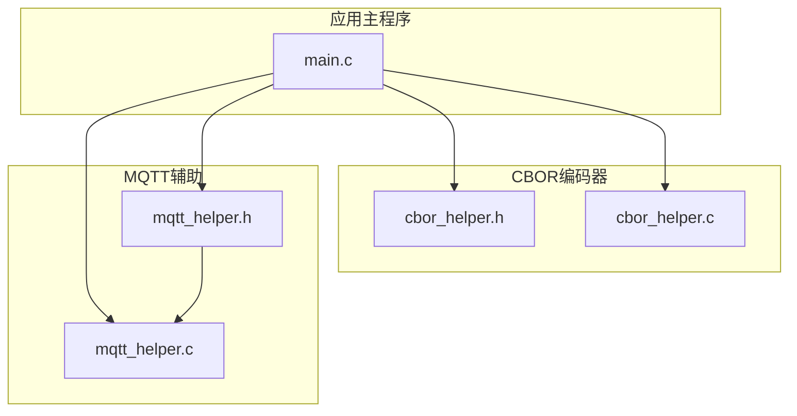
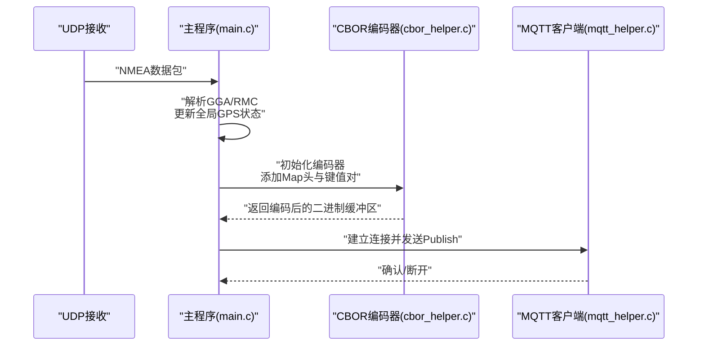
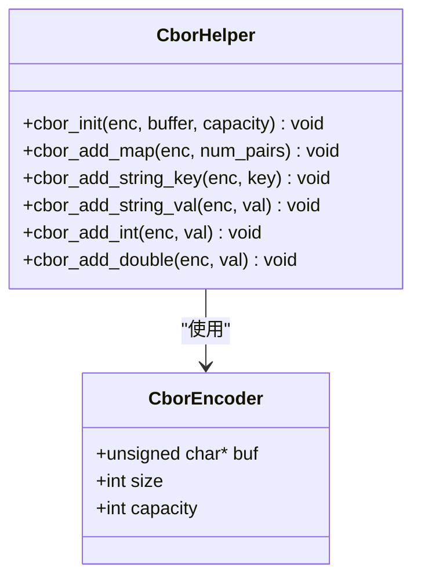
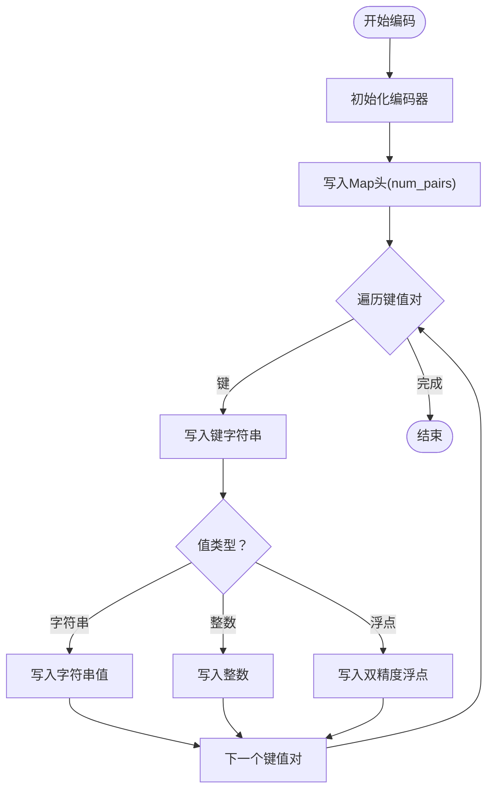
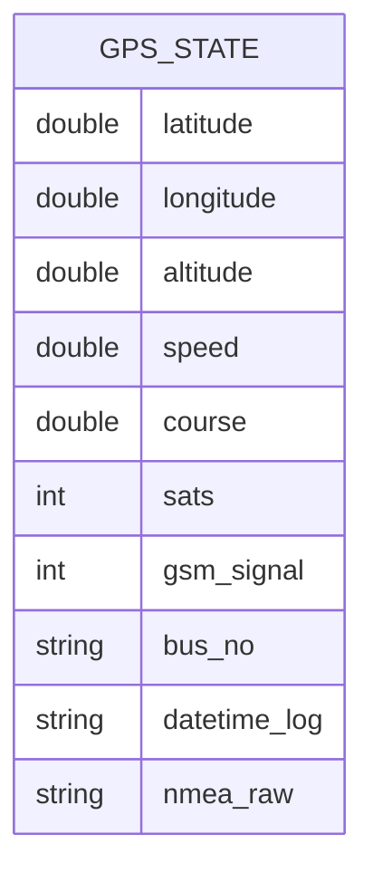
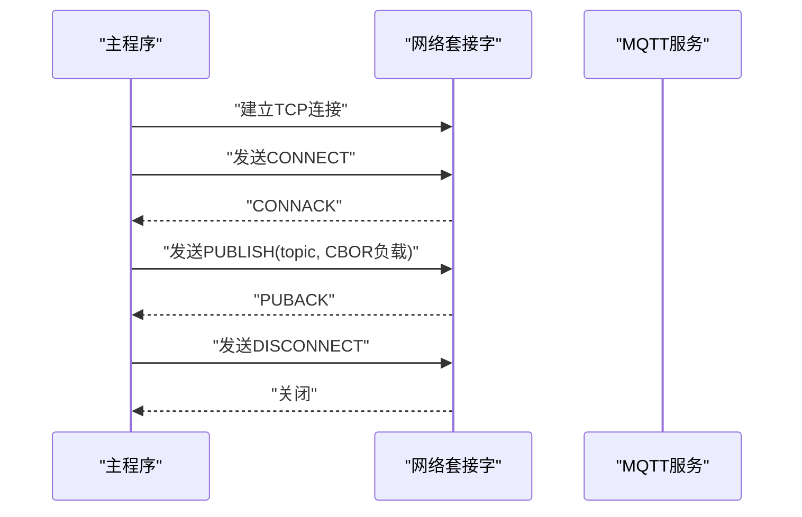
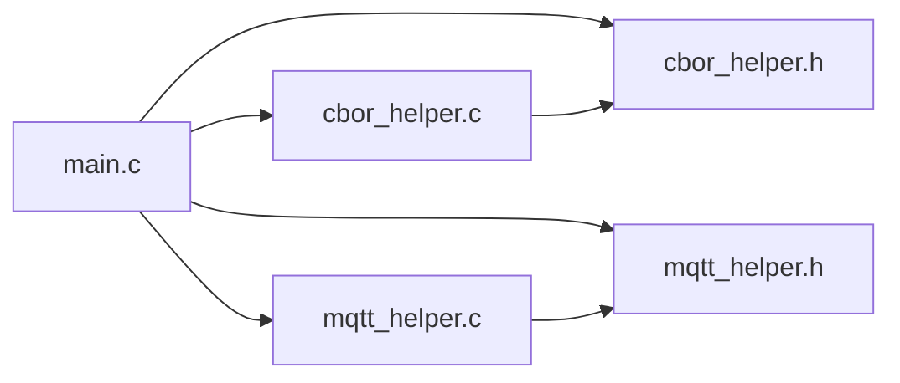

# CBOR编码系统

<cite>
**本文引用的文件**
- [cbor_helper.h](file://dev_code/dev_code/mqtt_project_16_ver1_based-on-9/cbor_helper.h)
- [cbor_helper.c](file://dev_code/dev_code/mqtt_project_16_ver1_based-on-9/cbor_helper.c)
- [main.c](file://dev_code/dev_code/mqtt_project_16_ver1_based-on-9/main.c)
- [mqtt_helper.h](file://dev_code/dev_code/mqtt_project_16_ver1_based-on-9/mqtt_helper.h)
- [mqtt_helper.c](file://dev_code/dev_code/mqtt_project_16_ver1_based-on-9/mqtt_helper.c)
- [cbor_helper.h（版本9）](file://dev_code/dev_code/mqtt_project_9/cbor_helper.h)
- [cbor_helper.c（版本9）](file://dev_code/dev_code/mqtt_project_9/cbor_helper.c)
- [cbor_helper.h（版本16_ver2）](file://dev_code/dev_code/mqtt_project_16_ver2_based-on-15/cbor_helper.h)
- [cbor_helper.c（版本16_ver2）](file://dev_code/dev_code/mqtt_project_16_ver2_based-on-15/cbor_helper.c)
- [Readme.md.txt](file://dev_code/dev_code/Readme.md.txt)
</cite>

## 目录
1. [简介](#简介)
2. [项目结构](#项目结构)
3. [核心组件](#核心组件)
4. [架构总览](#架构总览)
5. [详细组件分析](#详细组件分析)
6. [依赖关系分析](#依赖关系分析)
7. [性能考虑](#性能考虑)
8. [故障排查指南](#故障排查指南)
9. [结论](#结论)
10. [附录：API参考](#附录api参考)

## 简介
本技术文档围绕CBOR（Concise Binary Object Representation）编码系统展开，面向需要在嵌入式或资源受限环境中进行二进制序列化与高效传输的开发者。系统通过轻量级的CBOR编码器将GPS状态数据等键值对结构序列化为紧凑的二进制流，并通过MQTT协议发布到消息代理。文档内容涵盖：
- CBOR数据格式特点与优势（二进制、紧凑、高效）
- 编码器实现细节（CborEncoder结构体、缓冲区管理、编码函数）
- 数据结构定义（GPS状态字段映射、类型转换与序列化策略）
- 内存管理策略（缓冲区分配、大小计算、资源释放）
- 完整API参考（函数说明与使用示例路径）
- 性能优化建议与最佳实践

## 项目结构
该仓库包含多个版本的项目工程，均共享CBOR编码器与MQTT辅助模块，主程序负责从UDP接收NMEA数据、解析并构建GPS状态对象，随后进行CBOR编码并通过MQTT发布。

图表来源
- [cbor_helper.h](file://dev_code/dev_code/mqtt_project_16_ver1_based-on-9/cbor_helper.h#L1-L27)
- [cbor_helper.c](file://dev_code/dev_code/mqtt_project_16_ver1_based-on-9/cbor_helper.c#L1-L89)
- [mqtt_helper.h](file://dev_code/dev_code/mqtt_project_16_ver1_based-on-9/mqtt_helper.h#L1-L13)
- [mqtt_helper.c](file://dev_code/dev_code/mqtt_project_16_ver1_based-on-9/mqtt_helper.c#L1-L115)
- [main.c](file://dev_code/dev_code/mqtt_project_16_ver1_based-on-9/main.c#L1-L259)

章节来源
- [Readme.md.txt](file://dev_code/dev_code/Readme.md.txt#L1-L12)

## 核心组件
- CborEncoder结构体：封装输出缓冲区指针、已写入字节数与容量上限，用于跟踪编码进度与防止越界。
- 编码函数族：初始化、添加Map头、添加键、添加字符串值、添加整数、添加双精度浮点。
- 主程序集成：从UDP接收NMEA数据，解析出GPS位置、速度、方向、卫星数、信号强度等，累积原始NMEA文本，构建键值对对象后进行CBOR编码并通过MQTT发布。

章节来源
- [cbor_helper.h](file://dev_code/dev_code/mqtt_project_16_ver1_based-on-9/cbor_helper.h#L7-L12)
- [cbor_helper.c](file://dev_code/dev_code/mqtt_project_16_ver1_based-on-9/cbor_helper.c#L38-L46)
- [main.c](file://dev_code/dev_code/mqtt_project_16_ver1_based-on-9/main.c#L150-L170)

## 架构总览
下图展示了从NMEA数据输入到MQTT发布的端到端流程，以及CBOR编码器在其中的角色。

图表来源
- [main.c](file://dev_code/dev_code/mqtt_project_16_ver1_based-on-9/main.c#L201-L256)
- [cbor_helper.c](file://dev_code/dev_code/mqtt_project_16_ver1_based-on-9/cbor_helper.c#L38-L88)
- [mqtt_helper.c](file://dev_code/dev_code/mqtt_project_16_ver1_based-on-9/mqtt_helper.c#L38-L108)

## 详细组件分析

### CborEncoder结构体与缓冲区管理
- 结构体字段
  - buf：输出缓冲区指针
  - size：当前已写入字节数
  - capacity：缓冲区容量上限
- 初始化
  - 将buf指向外部缓冲区，设置capacity与size为0
- 写入策略
  - write_byte：在未越界时写入单字节
  - write_type_value：根据数值范围选择短/长编码，支持1字节到8字节扩展
- 类型编码要点
  - 整数：正数与负数采用不同的主类型与编码规则
  - 字符串：先写长度，再顺序写入每个字符
  - 双精度浮点：写入固定头部后，按网络字节序写入64位位模式

图表来源
- [cbor_helper.h](file://dev_code/dev_code/mqtt_project_16_ver1_based-on-9/cbor_helper.h#L7-L12)
- [cbor_helper.c](file://dev_code/dev_code/mqtt_project_16_ver1_based-on-9/cbor_helper.c#L38-L88)

章节来源
- [cbor_helper.h](file://dev_code/dev_code/mqtt_project_16_ver1_based-on-9/cbor_helper.h#L7-L12)
- [cbor_helper.c](file://dev_code/dev_code/mqtt_project_16_ver1_based-on-9/cbor_helper.c#L4-L36)

### 编码流程与算法
- Map头编码：调用cbor_add_map(num_pairs)写入Map头
- 键值对编码：键与值分别通过cbor_add_string_key与对应类型函数写入
- 整数编码：cbor_add_int处理有符号整数，区分正负
- 浮点编码：cbor_add_double将IEEE 754位模式按网络字节序写入
- 类型值编码：write_type_value根据数值范围选择短/长编码，覆盖1~8字节扩展

图表来源
- [cbor_helper.c](file://dev_code/dev_code/mqtt_project_16_ver1_based-on-9/cbor_helper.c#L44-L64)
- [cbor_helper.c](file://dev_code/dev_code/mqtt_project_16_ver1_based-on-9/cbor_helper.c#L66-L88)

章节来源
- [cbor_helper.c](file://dev_code/dev_code/mqtt_project_16_ver1_based-on-9/cbor_helper.c#L44-L88)

### GPS状态数据结构与序列化策略
- 全局状态变量（示例）
  - 纬度、经度、海拔、速度、航向、卫星数、GSM信号强度
- 序列化策略
  - provider_id、koridor_id：整数
  - bus_no、lat_pos、lon_pos、alt_pos、datetime_log、nmea_raw：字符串
  - avg_speed：双精度浮点
  - direction、satelite、gsm_signal：整数
- 原始NMEA累积：在每次解析到GNRMC有效数据后，将完整NMEA句子累积到缓冲区并在发布时一并发送

图表来源
- [main.c](file://dev_code/dev_code/mqtt_project_16_ver1_based-on-9/main.c#L27-L38)
- [main.c](file://dev_code/dev_code/mqtt_project_16_ver1_based-on-9/main.c#L154-L169)

章节来源
- [main.c](file://dev_code/dev_code/mqtt_project_16_ver1_based-on-9/main.c#L27-L38)
- [main.c](file://dev_code/dev_code/mqtt_project_16_ver1_based-on-9/main.c#L154-L169)

### MQTT发布流程
- 连接与认证：建立TCP连接，发送CONNECT包
- 发布消息：构造PUBLISH包，携带主题与二进制负载（CBOR）
- 断开连接：发送DISCONNECT包

图表来源
- [mqtt_helper.c](file://dev_code/dev_code/mqtt_project_16_ver1_based-on-9/mqtt_helper.c#L38-L108)

章节来源
- [mqtt_helper.h](file://dev_code/dev_code/mqtt_project_16_ver1_based-on-9/mqtt_helper.h#L4-L10)
- [mqtt_helper.c](file://dev_code/dev_code/mqtt_project_16_ver1_based-on-9/mqtt_helper.c#L88-L108)

## 依赖关系分析
- 主程序依赖CBOR编码器与MQTT辅助模块
- CBOR编码器内部仅依赖标准C库（字符串与内存操作）
- MQTT辅助模块负责网络I/O与MQTT协议打包

图表来源
- [main.c](file://dev_code/dev_code/mqtt_project_16_ver1_based-on-9/main.c#L10-L11)
- [cbor_helper.h](file://dev_code/dev_code/mqtt_project_16_ver1_based-on-9/cbor_helper.h#L1-L6)
- [mqtt_helper.h](file://dev_code/dev_code/mqtt_project_16_ver1_based-on-9/mqtt_helper.h#L1-L6)

章节来源
- [main.c](file://dev_code/dev_code/mqtt_project_16_ver1_based-on-9/main.c#L10-L11)

## 性能考虑
- 缓冲区复用：在主程序中使用固定大小的本地缓冲区，避免频繁动态分配
- 紧凑编码：CBOR对整数与字符串采用自描述长度编码，减少冗余
- 零拷贝策略：MQTT发布直接使用CBOR缓冲区作为二进制负载，无需额外复制
- 批处理与心跳：在无新数据时仍可触发发布，保证数据可达性；注意控制发布频率以降低带宽占用
- 数值精度：浮点数按IEEE 754写入，确保跨平台一致性

## 故障排查指南
- 缓冲区溢出
  - 现象：编码后enc.size等于capacity且后续写入无效
  - 排查：检查CBOR缓冲区容量是否足够容纳所有键值对
  - 参考：编码器写入条件与容量判断
- MQTT发送失败
  - 现象：send返回错误或超时
  - 排查：检查网络连接、Broker地址与端口、认证信息；确认发送循环是否成功
  - 参考：发送循环与错误处理
- NMEA解析异常
  - 现象：位置或速度异常、卫星数为0
  - 排查：确认GNRMC/GGA语句格式、校验和、坐标半球标识
  - 参考：解析逻辑与边界条件
- 浮点字节序
  - 现象：跨平台解码结果不一致
  - 排查：确认网络字节序转换是否正确
  - 参考：浮点编码中的位模式与字节序转换

章节来源
- [cbor_helper.c](file://dev_code/dev_code/mqtt_project_16_ver1_based-on-9/cbor_helper.c#L4-L9)
- [mqtt_helper.c](file://dev_code/dev_code/mqtt_project_16_ver1_based-on-9/mqtt_helper.c#L10-L25)
- [main.c](file://dev_code/dev_code/mqtt_project_16_ver1_based-on-9/main.c#L232-L249)
- [cbor_helper.c](file://dev_code/dev_code/mqtt_project_16_ver1_based-on-9/cbor_helper.c#L66-L88)

## 结论
本CBOR编码系统以极小的实现代价提供了高效的二进制序列化能力，结合MQTT发布链路，适合在资源受限环境下稳定传输GPS状态数据。通过合理的缓冲区管理、紧凑的数据模型与严格的类型编码策略，系统在保证数据完整性的同时实现了低开销与高可靠性。

## 附录API参考

- CborEncoder
  - 字段
    - buf：输出缓冲区指针
    - size：当前已写入字节数
    - capacity：缓冲区容量上限
  - 函数
    - cbor_init(enc, buffer, capacity)：初始化编码器
    - cbor_add_map(enc, num_pairs)：写入Map头
    - cbor_add_string_key(enc, key)：写入字符串键
    - cbor_add_string_val(enc, val)：写入字符串值
    - cbor_add_int(enc, val)：写入整数
    - cbor_add_double(enc, val)：写入双精度浮点

- MQTT辅助函数
  - mqtt_connect_socket(ip, port)：建立TCP连接
  - mqtt_send_connect(sockfd, client_id, user, pass)：发送CONNECT
  - mqtt_send_publish(sockfd, topic, payload, payload_len)：发送PUBLISH（支持二进制负载）
  - mqtt_disconnect(sockfd)：断开连接

- 使用示例路径
  - 初始化与编码：见主程序中对CBOR编码器的使用路径
  - 发布流程：见主程序中对MQTT辅助函数的调用路径

章节来源
- [cbor_helper.h](file://dev_code/dev_code/mqtt_project_16_ver1_based-on-9/cbor_helper.h#L7-L25)
- [cbor_helper.c](file://dev_code/dev_code/mqtt_project_16_ver1_based-on-9/cbor_helper.c#L38-L88)
- [mqtt_helper.h](file://dev_code/dev_code/mqtt_project_16_ver1_based-on-9/mqtt_helper.h#L4-L10)
- [main.c](file://dev_code/dev_code/mqtt_project_16_ver1_based-on-9/main.c#L150-L170)