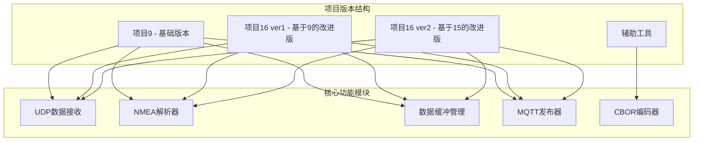
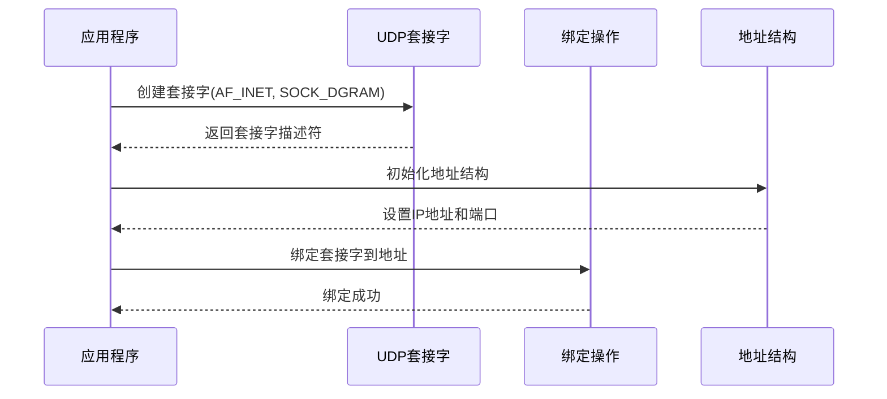
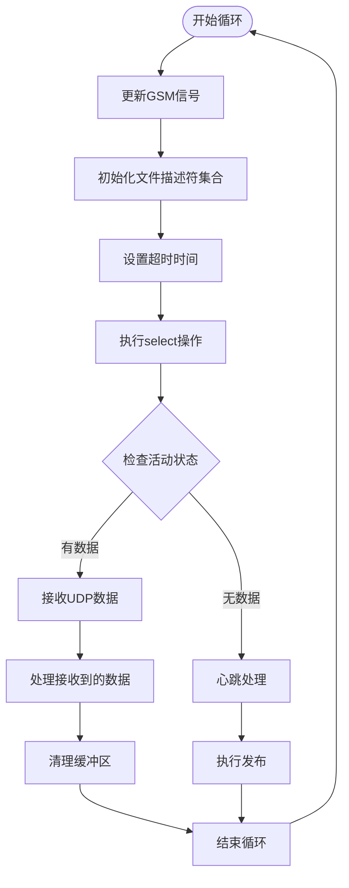
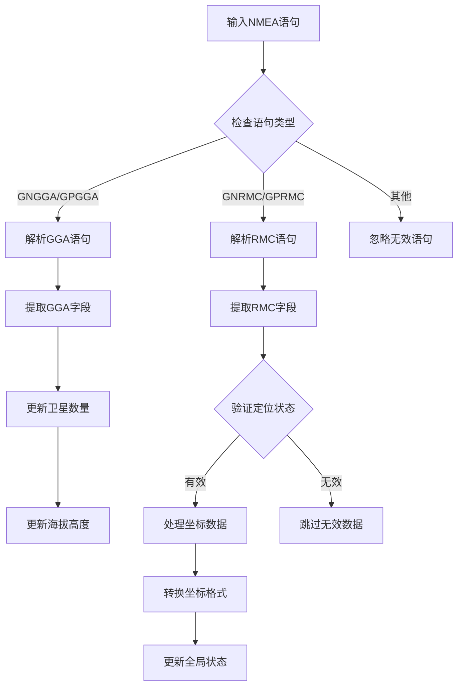
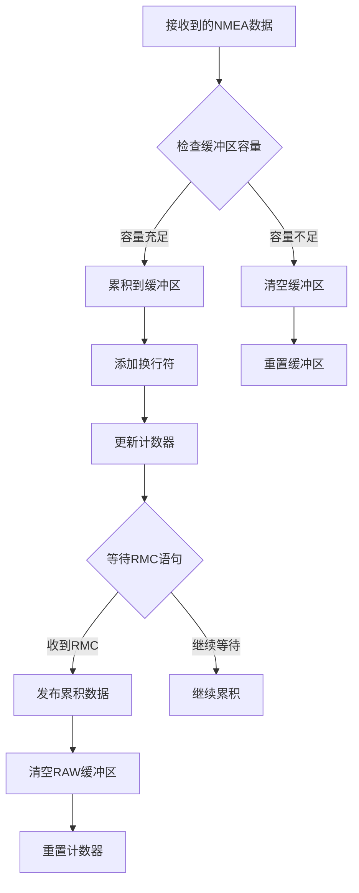
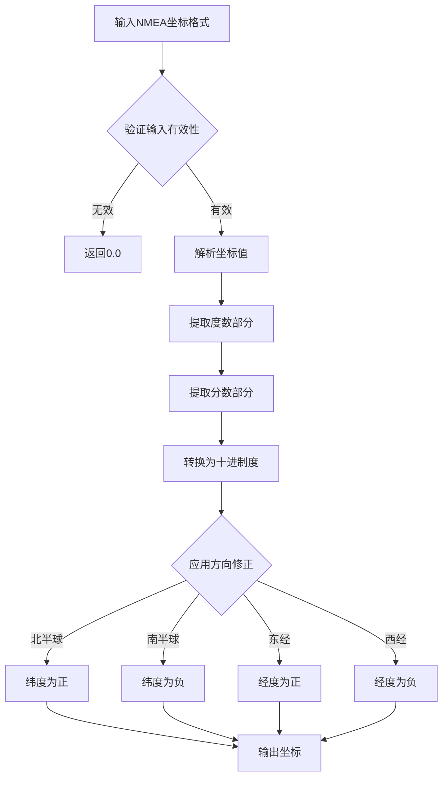
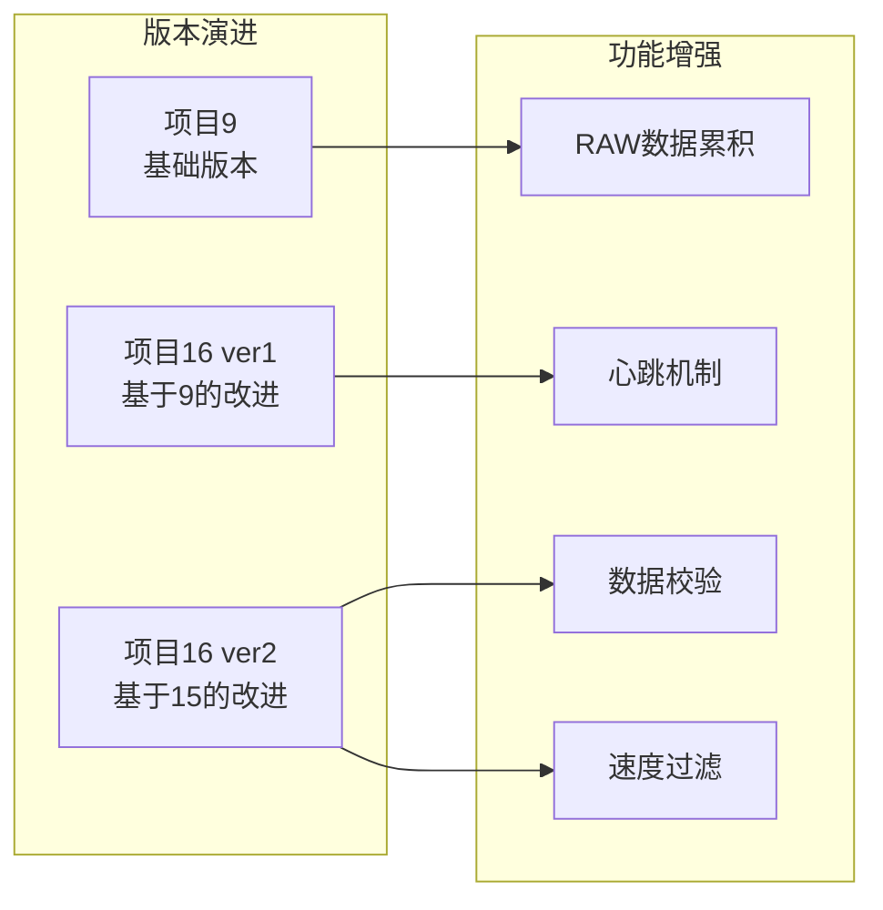
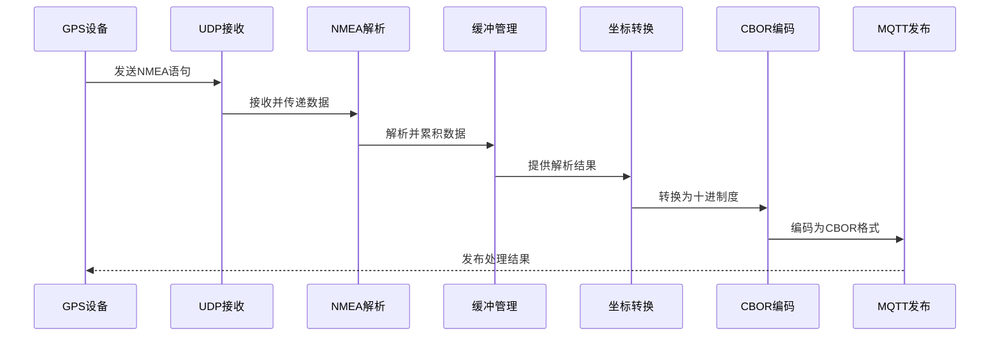
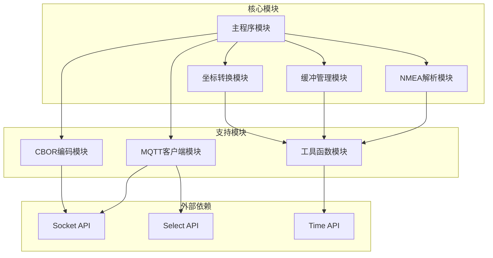

# GPS数据采集与处理

<cite>
**本文档引用的文件**
- [main.c (项目9)](file://dev_code/dev_code/mqtt_project_9/main.c)
- [main.c (项目16 ver1 基于9)](file://dev_code/dev_code/mqtt_project_16_ver1_based-on-9/main.c)
- [main.c (项目16 ver2 基于15)](file://dev_code/dev_code/mqtt_project_16_ver2_based-on-15/main.c)
- [mqtt_helper.c](file://dev_code/dev_code/mqtt_project_16_ver1_based-on-9/mqtt_helper.c)
- [cbor_helper.c](file://dev_code/dev_code/mqtt_project_16_ver1_based-on-9/cbor_helper.c)
- [mqtt_helper.h](file://dev_code/dev_code/mqtt_project_16_ver1_based-on-9/mqtt_helper.h)
- [cbor_helper.h](file://dev_code/dev_code/mqtt_project_16_ver1_based-on-9/cbor_helper.h)
- [Readme.md.txt](file://dev_code/Readme.md.txt)
- [gps_local.raw](file://gps_local.raw)
</cite>

## 目录
1. [简介](#简介)
2. [项目结构](#项目结构)
3. [核心组件](#核心组件)
4. [架构概览](#架构概览)
5. [详细组件分析](#详细组件分析)
6. [依赖关系分析](#依赖关系分析)
7. [性能考虑](#性能考虑)
8. [故障排除指南](#故障排除指南)
9. [结论](#结论)
10. [附录](#附录)

## 简介

本项目是一个基于Linux的GPS数据采集与处理系统，实现了UDP数据接收、NMEA 0183语句解析、数据缓冲管理和MQTT发布功能。系统支持多种GPS语句格式，包括GNGGA和GNRMC，并提供了完整的数据转换和发布流程。

该系统经过多个版本的迭代优化，从最初的项目9发展到项目16的两个变体，每个版本都针对特定的问题进行了改进。系统采用非阻塞I/O模型，通过select()函数实现高效的UDP数据接收，并使用CBOR编码格式进行数据传输。

## 项目结构

项目采用多版本并行开发的结构，包含四个主要版本：



**图表来源**
- [Readme.md.txt](file://dev_code/Readme.md.txt#L1-L12)

**章节来源**
- [Readme.md.txt](file://dev_code/Readme.md.txt#L1-L12)

## 核心组件

### UDP数据接收模块

系统使用标准的UDP套接字接口实现数据接收，采用非阻塞I/O模型提高效率。

**关键特性：**
- Socket创建和绑定
- select()非阻塞I/O模型
- 超时控制机制
- 数据完整性检查

### NMEA 0183解析器

实现了对GPS标准语句的解析，支持多种语句类型：

**支持的语句类型：**
- GNGGA - GPS定位信息
- GNRMC - 推算位置数据
- GPGGA - GPS定位信息（兼容）
- GPRMC - 推算位置数据（兼容）

### 数据缓冲管理系统

提供了灵活的数据缓冲策略，支持累积模式和实时模式。

**缓冲策略：**
- 全局RAW缓冲区累积
- 内存溢出防护
- 心跳机制下的数据保留

### MQTT发布器

集成了MQTT协议支持，负责将处理后的GPS数据发布到消息代理。

**发布特性：**
- CBOR二进制编码
- 自动重连机制
- 异步发布模式

**章节来源**
- [main.c (项目9)](file://dev_code/dev_code/mqtt_project_9/main.c#L182-L256)
- [main.c (项目16 ver1 基于9)](file://dev_code/dev_code/mqtt_project_16_ver1_based-on-9/main.c#L182-L259)
- [main.c (项目16 ver2 基于15)](file://dev_code/dev_code/mqtt_project_16_ver2_based-on-15/main.c#L245-L289)

## 架构概览

系统采用模块化设计，各组件职责明确，通过清晰的接口进行交互：

```mermaid
graph TB
subgraph "数据采集层"
UDP[UDP套接字]
SELECT[select() I/O模型]
end
subgraph "数据处理层"
PARSE[NMEA解析器]
BUFFER[数据缓冲管理]
CONVERT[坐标转换器]
end
subgraph "数据封装层"
CBOR[CBOR编码器]
MQTT[MQTT客户端]
end
subgraph "外部接口"
GPS[GPS设备]
BROKER[MQTT代理]
end
GPS --> UDP
UDP --> SELECT
SELECT --> PARSE
PARSE --> BUFFER
BUFFER --> CONVERT
CONVERT --> CBOR
CBOR --> MQTT
MQTT --> BROKER
```

**图表来源**
- [main.c (项目16 ver1 基于9)](file://dev_code/dev_code/mqtt_project_16_ver1_based-on-9/main.c#L182-L259)
- [mqtt_helper.c](file://dev_code/dev_code/mqtt_project_16_ver1_based-on-9/mqtt_helper.c#L38-L115)
- [cbor_helper.c](file://dev_code/dev_code/mqtt_project_16_ver1_based-on-9/cbor_helper.c#L38-L89)

## 详细组件分析

### UDP数据接收机制

#### Socket创建与绑定

系统使用标准的UDP套接字接口创建网络连接：



**图表来源**
- [main.c (项目9)](file://dev_code/dev_code/mqtt_project_9/main.c#L183-L196)
- [main.c (项目16 ver1 基于9)](file://dev_code/dev_code/mqtt_project_16_ver1_based-on-9/main.c#L186-L199)

#### select()非阻塞I/O模型

系统采用select()函数实现高效的异步数据接收：



**图表来源**
- [main.c (项目9)](file://dev_code/dev_code/mqtt_project_9/main.c#L198-L253)
- [main.c (项目16 ver1 基于9)](file://dev_code/dev_code/mqtt_project_16_ver1_based-on-9/main.c#L201-L256)

**章节来源**
- [main.c (项目9)](file://dev_code/dev_code/mqtt_project_9/main.c#L182-L256)
- [main.c (项目16 ver1 基于9)](file://dev_code/dev_code/mqtt_project_16_ver1_based-on-9/main.c#L182-L259)

### NMEA 0183语句解析逻辑

#### 语句识别与令牌分割

系统实现了高效的NMEA语句解析算法：



**图表来源**
- [main.c (项目9)](file://dev_code/dev_code/mqtt_project_9/main.c#L86-L130)
- [main.c (项目16 ver1 基于9)](file://dev_code/dev_code/mqtt_project_16_ver1_based-on-9/main.c#L86-L133)

#### GNGGA语句解析

GNGGA语句包含GPS定位信息，系统解析以下关键字段：

**解析字段：**
- 卫星数量 (第7个字段)
- 海拔高度 (第9个字段)

#### GNRMC语句解析

GNRMC语句包含推算位置数据，系统解析以下关键字段：

**解析字段：**
- 定位状态 (第2个字段，需为"A")
- 纬度 (第3个字段)
- 纬度方向 (第4个字段，'S'表示南半球)
- 经度 (第5个字段)
- 经度方向 (第6个字段，'W'表示西半球)
- 速度 (第7个字段，节)
- 航向 (第8个字段，度)

**章节来源**
- [main.c (项目9)](file://dev_code/dev_code/mqtt_project_9/main.c#L86-L130)
- [main.c (项目16 ver1 基于9)](file://dev_code/dev_code/mqtt_project_16_ver1_based-on-9/main.c#L86-L133)

### 数据缓冲管理策略

#### 全局RAW缓冲区累积机制

系统提供了两种缓冲管理策略：



**图表来源**
- [main.c (项目9)](file://dev_code/dev_code/mqtt_project_9/main.c#L221-L247)
- [main.c (项目16 ver1 基于9)](file://dev_code/dev_code/mqtt_project_16_ver1_based-on-9/main.c#L224-L249)

#### 内存溢出防护

系统实现了多重保护机制防止内存溢出：

**保护措施：**
- 缓冲区长度检查
- 字符串安全复制
- 动态内存管理
- 心跳机制下的数据保留

**章节来源**
- [main.c (项目9)](file://dev_code/dev_code/mqtt_project_9/main.c#L221-L247)
- [main.c (项目16 ver1 基于9)](file://dev_code/dev_code/mqtt_project_16_ver1_based-on-9/main.c#L224-L249)

### 坐标转换算法

#### NMEA格式到十进制度转换

系统实现了标准的NMEA坐标格式转换算法：



**图表来源**
- [main.c (项目9)](file://dev_code/dev_code/mqtt_project_9/main.c#L64-L70)
- [main.c (项目16 ver1 基于9)](file://dev_code/dev_code/mqtt_project_16_ver1_based-on-9/main.c#L64-L70)

#### 数学原理说明

NMEA格式的GPS坐标采用"度分"格式，转换公式为：

```
十进制度 = 度 + 分钟/60
```

对于方向修正：
- 北纬和东经保持正值
- 南纬和西经取负值

**章节来源**
- [main.c (项目9)](file://dev_code/dev_code/mqtt_project_9/main.c#L64-L70)
- [main.c (项目16 ver1 基于9)](file://dev_code/dev_code/mqtt_project_16_ver1_based-on-9/main.c#L64-L70)

### 数据流处理完整生命周期

#### 版本演进对比

系统经历了三个主要版本的演进：



**图表来源**
- [Readme.md.txt](file://dev_code/Readme.md.txt#L1-L12)

#### 数据处理流程

完整的数据处理生命周期包括以下阶段：



**图表来源**
- [main.c (项目16 ver2 基于15)](file://dev_code/dev_code/mqtt_project_16_ver2_based-on-15/main.c#L167-L287)

**章节来源**
- [Readme.md.txt](file://dev_code/Readme.md.txt#L1-L12)
- [main.c (项目16 ver2 基于15)](file://dev_code/dev_code/mqtt_project_16_ver2_based-on-15/main.c#L116-L287)

## 依赖关系分析

### 模块间依赖关系

系统采用清晰的模块化设计，各组件之间的依赖关系如下：



**图表来源**
- [main.c (项目16 ver1 基于9)](file://dev_code/dev_code/mqtt_project_16_ver1_based-on-9/main.c#L1-L12)
- [mqtt_helper.c](file://dev_code/dev_code/mqtt_project_16_ver1_based-on-9/mqtt_helper.c#L1-L8)
- [cbor_helper.c](file://dev_code/dev_code/mqtt_project_16_ver1_based-on-9/cbor_helper.c#L1-L3)

### 外部依赖分析

系统主要依赖以下外部库和API：

**系统调用依赖：**
- socket() - 套接字创建
- bind() - 套接字绑定
- recvfrom() - UDP数据接收
- select() - 非阻塞I/O
- send() - 数据发送

**标准库依赖：**
- stdio.h - 输入输出操作
- stdlib.h - 内存管理
- string.h - 字符串处理
- time.h - 时间操作
- ctype.h - 字符分类

**章节来源**
- [main.c (项目16 ver1 基于9)](file://dev_code/dev_code/mqtt_project_16_ver1_based-on-9/main.c#L1-L12)
- [mqtt_helper.c](file://dev_code/dev_code/mqtt_project_16_ver1_based-on-9/mqtt_helper.c#L1-L8)
- [cbor_helper.c](file://dev_code/dev_code/mqtt_project_16_ver1_based-on-9/cbor_helper.c#L1-L3)

## 性能考虑

### I/O性能优化

系统采用了多项性能优化技术：

**非阻塞I/O优化：**
- 使用select()实现多路复用
- 合理设置超时时间
- 减少系统调用次数

**内存管理优化：**
- 预分配固定大小缓冲区
- 避免动态内存分配
- 使用字符串拼接优化

### 处理性能优化

**解析算法优化：**
- 单次扫描完成令牌分割
- 直接字符指针操作
- 避免不必要的字符串复制

**发布性能优化：**
- 批量数据累积
- 异步发布机制
- CBOR高效编码

## 故障排除指南

### 常见问题诊断

#### UDP连接问题

**症状：** 程序启动失败或无法接收数据

**可能原因：**
- 端口被占用
- 权限不足
- 网络配置错误

**解决方法：**
1. 检查端口号是否被其他进程占用
2. 确认程序具有足够的权限
3. 验证网络接口配置

#### NMEA解析错误

**症状：** GPS数据解析失败或显示异常

**可能原因：**
- 语句格式不正确
- 校验和错误
- 数据截断

**解决方法：**
1. 检查GPS设备输出格式
2. 验证NMEA语句完整性
3. 确认数据传输质量

#### MQTT发布失败

**症状：** 数据无法发布到MQTT代理

**可能原因：**
- 网络连接中断
- 认证信息错误
- 主题名称不匹配

**解决方法：**
1. 检查网络连接状态
2. 验证MQTT代理配置
3. 确认主题权限

**章节来源**
- [main.c (项目9)](file://dev_code/dev_code/mqtt_project_9/main.c#L183-L199)
- [main.c (项目16 ver1 基于9)](file://dev_code/dev_code/mqtt_project_16_ver1_based-on-9/main.c#L186-L199)

## 结论

本GPS数据采集与处理系统展现了良好的模块化设计和工程实践。通过多个版本的迭代优化，系统在稳定性、性能和功能完整性方面都有显著提升。

**主要优势：**
- 清晰的模块化架构
- 高效的非阻塞I/O模型
- 完善的错误处理机制
- 灵活的数据处理策略

**技术特色：**
- 支持多种NMEA语句格式
- 实现了标准的坐标转换算法
- 采用CBOR高效编码格式
- 提供心跳机制保证数据连续性

该系统为GPS数据处理提供了可靠的基础设施，可以作为类似项目的参考实现。

## 附录

### 配置参数说明

系统支持以下配置参数：

**网络配置：**
- UDP_PORT - UDP监听端口
- MQTT_BROKER - MQTT代理地址
- MQTT_PORT - MQTT代理端口

**GPS配置：**
- BUS_NO - 公交车编号
- BUS_NO_TAG - 公交车标签
- PROVIDER_ID - 运营商ID
- KORIDOR_ID - 路线ID

**运行配置：**
- MODEM_INFO_FILE - 模块信息文件路径

### 数据格式规范

**NMEA语句格式：**
- $GPGGA - GPS定位信息
- $GPRMC - 推算位置数据
- $GPVTG - 地面速度信息

**输出数据格式：**
- 十进制度坐标
- CBOR编码的JSON数据
- MQTT主题结构化消息

**章节来源**
- [main.c (项目9)](file://dev_code/dev_code/mqtt_project_9/main.c#L14-L26)
- [main.c (项目16 ver1 基于9)](file://dev_code/dev_code/mqtt_project_16_ver1_based-on-9/main.c#L14-L26)
- [main.c (项目16 ver2 基于15)](file://dev_code/dev_code/mqtt_project_16_ver2_based-on-15/main.c#L14-L27)