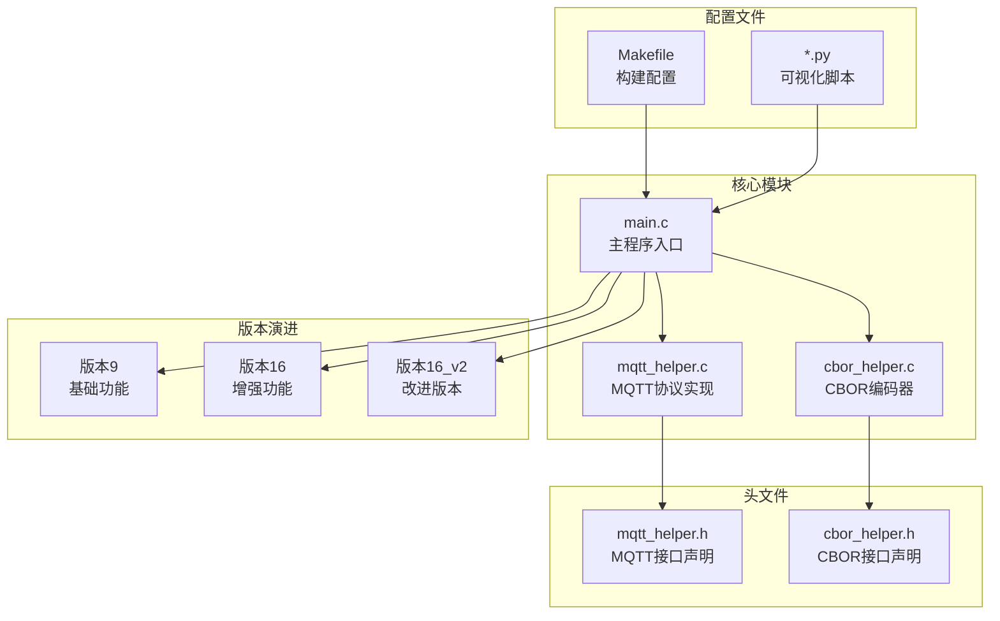
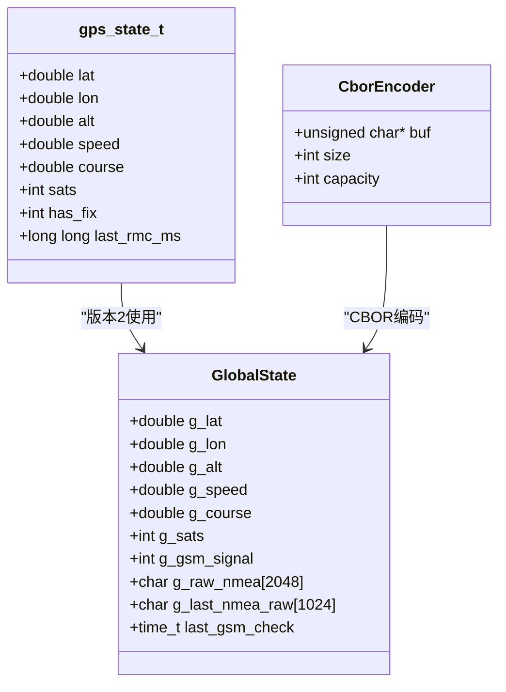
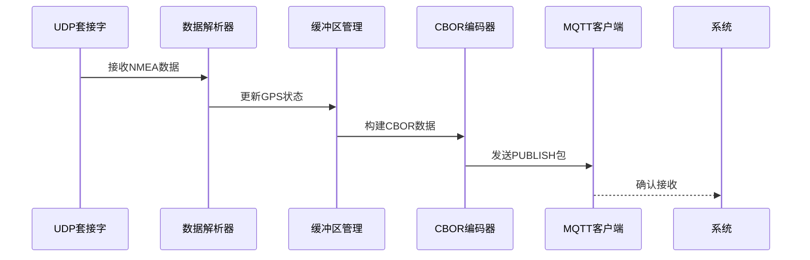
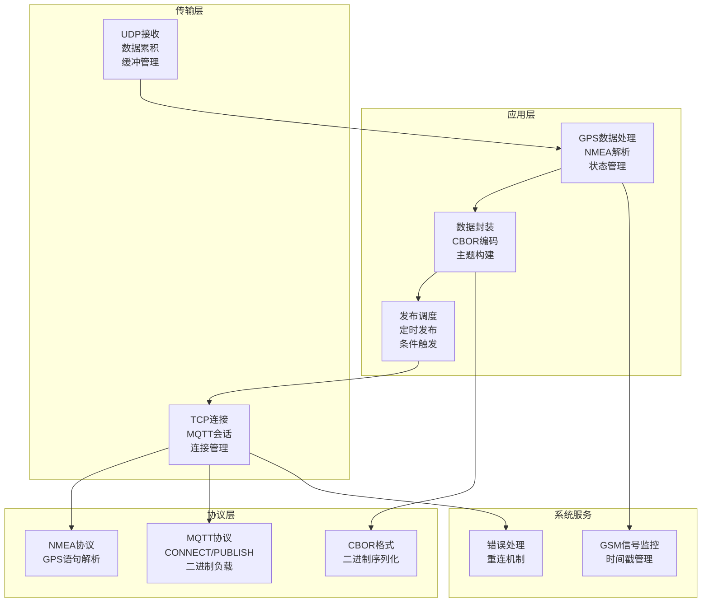
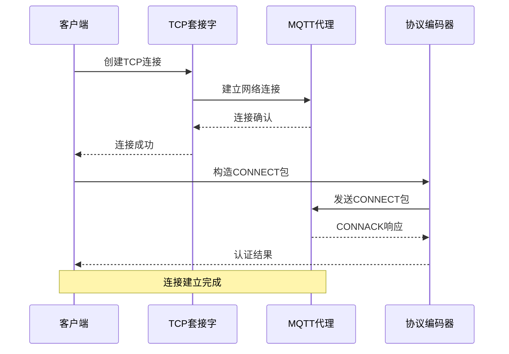
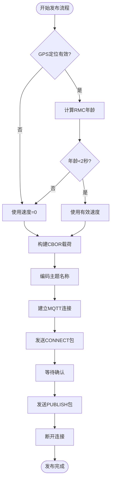
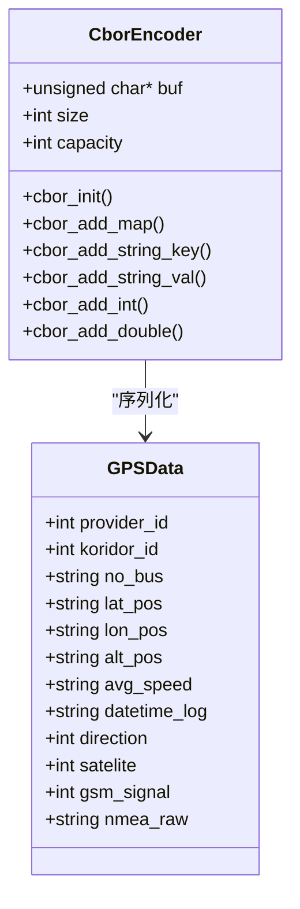
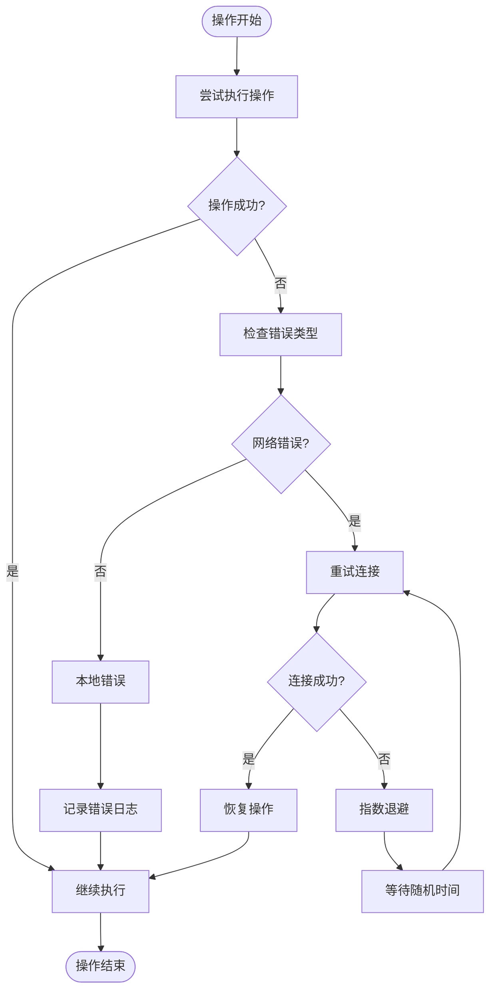
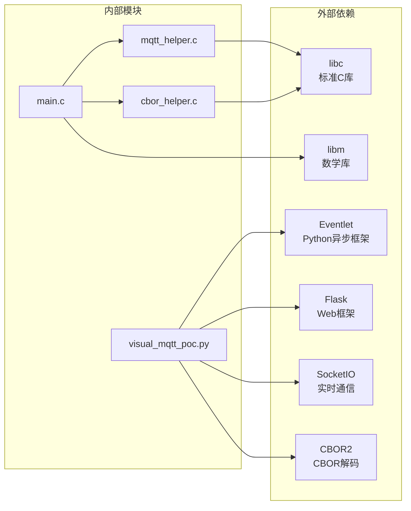

# MQTT通信实现

<cite>
**本文档引用的文件**
- [main.c](file://dev_code/dev_code/mqtt_project_16_ver1_based-on-9/main.c)
- [mqtt_helper.c](file://dev_code/dev_code/mqtt_project_16_ver1_based-on-9/mqtt_helper.c)
- [cbor_helper.c](file://dev_code/dev_code/mqtt_project_16_ver1_based-on-9/cbor_helper.c)
- [mqtt_helper.h](file://dev_code/dev_code/mqtt_project_16_ver1_based-on-9/mqtt_helper.h)
- [cbor_helper.h](file://dev_code/dev_code/mqtt_project_16_ver1_based-on-9/cbor_helper.h)
- [main.c](file://dev_code/dev_code/mqtt_project_16_ver2_based-on-15/main.c)
- [main.c](file://dev_code/dev_code/mqtt_project_9/main.c)
- [Makefile](file://dev_code/dev_code/mqtt_project_16_ver1_based-on-9/Makefile)
- [visual_mqtt_poc-brt-solo_2_hongdian.py](file://visual_mqtt_poc-brt-solo_2_hongdian-不带rawdata/visual_mqtt_poc-brt-solo_2_hongdian.py)
</cite>

## 目录
1. [简介](#简介)
2. [项目结构](#项目结构)
3. [核心组件](#核心组件)
4. [架构概览](#架构概览)
5. [详细组件分析](#详细组件分析)
6. [依赖关系分析](#依赖关系分析)
7. [性能考虑](#性能考虑)
8. [故障排除指南](#故障排除指南)
9. [结论](#结论)
10. [附录：API参考](#附录api参考)

## 简介

本项目是一个基于C语言开发的GPS数据采集与MQTT传输系统，专门用于印尼公交GPS跟踪应用。该系统通过UDP接收NMEA格式的GPS数据，解析并转换为CBOR二进制格式，然后通过MQTT协议发送到远程服务器。

系统采用多版本迭代设计，从基础版本逐步演进到增强版本，每个版本都针对特定的功能需求进行了优化。主要特性包括：
- 实时GPS数据采集（UDP NMEA协议）
- 多格式NMEA语句解析（GGA、RMC等）
- CBOR二进制数据序列化
- MQTT协议通信（CONNECT、PUBLISH包）
- GSM信号强度监控
- 错误处理与重连机制

## 项目结构

项目采用模块化设计，主要包含以下核心模块：



**图表来源**
- [main.c](file://dev_code/dev_code/mqtt_project_16_ver1_based-on-9/main.c#L1-L259)
- [mqtt_helper.c](file://dev_code/dev_code/mqtt_project_16_ver1_based-on-9/mqtt_helper.c#L1-L115)
- [cbor_helper.c](file://dev_code/dev_code/mqtt_project_16_ver1_based-on-9/cbor_helper.c#L1-L89)

**章节来源**
- [main.c](file://dev_code/dev_code/mqtt_project_16_ver1_based-on-9/main.c#L1-L259)
- [Makefile](file://dev_code/dev_code/mqtt_project_16_ver1_based-on-9/Makefile#L1-L23)

## 核心组件

### 主要数据结构

系统使用统一的数据结构来管理GPS状态和缓冲区：



**图表来源**
- [main.c](file://dev_code/dev_code/mqtt_project_16_ver2_based-on-15/main.c#L30-L46)
- [cbor_helper.h](file://dev_code/dev_code/mqtt_project_16_ver1_based-on-9/cbor_helper.h#L7-L12)

### UDP数据接收与处理

系统通过UDP套接字接收GPS数据，支持多种NMEA语句格式：



**图表来源**
- [main.c](file://dev_code/dev_code/mqtt_project_16_ver1_based-on-9/main.c#L201-L256)
- [main.c](file://dev_code/dev_code/mqtt_project_16_ver2_based-on-15/main.c#L259-L288)

**章节来源**
- [main.c](file://dev_code/dev_code/mqtt_project_16_ver1_based-on-9/main.c#L182-L259)
- [main.c](file://dev_code/dev_code/mqtt_project_16_ver2_based-on-15/main.c#L245-L289)

## 架构概览

系统采用分层架构设计，从底层的网络通信到高层的应用逻辑：



**图表来源**
- [main.c](file://dev_code/dev_code/mqtt_project_16_ver1_based-on-9/main.c#L135-L180)
- [mqtt_helper.c](file://dev_code/dev_code/mqtt_project_16_ver1_based-on-9/mqtt_helper.c#L38-L86)

## 详细组件分析

### MQTT连接建立流程

MQTT连接建立是整个系统的核心流程，包含多个关键步骤：



**图表来源**
- [mqtt_helper.c](file://dev_code/dev_code/mqtt_project_16_ver1_based-on-9/mqtt_helper.c#L38-L86)

#### 连接建立步骤详解

1. **TCP套接字创建**：使用`socket()`函数创建IPv4 TCP套接字
2. **超时设置**：配置接收和发送超时时间为10秒
3. **地址解析**：使用`inet_pton()`将字符串IP地址转换为二进制格式
4. **连接建立**：调用`connect()`函数建立TCP连接
5. **CONNECT包构造**：构建MQTT协议的CONNECT包，包含协议版本、保持连接时间等
6. **认证处理**：在CONNECT包中包含用户名和密码
7. **连接确认**：等待服务器的CONNACK响应

**章节来源**
- [mqtt_helper.c](file://dev_code/dev_code/mqtt_project_16_ver1_based-on-9/mqtt_helper.c#L38-L86)

### 消息发布机制

系统采用灵活的消息发布策略，支持定时发布和事件触发发布：



**图表来源**
- [main.c](file://dev_code/dev_code/mqtt_project_16_ver2_based-on-15/main.c#L190-L241)

#### PUBLISH包格式分析

PUBLISH包由三部分组成：

1. **固定头部**：包含控制字节和剩余长度编码
2. **可变头部**：主题名（UTF-8编码）和消息标识符（QoS级别>0时）
3. **负载数据**：CBOR格式的二进制数据

**章节来源**
- [mqtt_helper.c](file://dev_code/dev_code/mqtt_project_16_ver1_based-on-9/mqtt_helper.c#L88-L108)

### CBOR二进制负载支持

系统使用CBOR（Concise Binary Object Representation）格式进行高效的数据传输：



**图表来源**
- [cbor_helper.h](file://dev_code/dev_code/mqtt_project_16_ver1_based-on-9/cbor_helper.h#L7-L26)
- [main.c](file://dev_code/dev_code/mqtt_project_16_ver1_based-on-9/main.c#L150-L170)

#### CBOR编码特点

1. **紧凑性**：相比JSON更节省空间
2. **类型安全**：明确的数据类型表示
3. **二进制格式**：直接的二进制传输，无需额外编码
4. **流式处理**：支持增量编码和解码

**章节来源**
- [cbor_helper.c](file://dev_code/dev_code/mqtt_project_16_ver1_based-on-9/cbor_helper.c#L1-L89)

### 错误处理策略

系统实现了多层次的错误处理机制：



**图表来源**
- [mqtt_helper.c](file://dev_code/dev_code/mqtt_project_16_ver1_based-on-9/mqtt_helper.c#L11-L25)

#### 错误处理机制

1. **连接失败重试**：网络连接失败时自动重试
2. **超时处理**：设置合理的超时时间避免阻塞
3. **缓冲区保护**：防止缓冲区溢出
4. **状态监控**：实时监控GPS定位状态
5. **GSM信号检测**：监控网络信号质量

**章节来源**
- [main.c](file://dev_code/dev_code/mqtt_project_16_ver1_based-on-9/main.c#L42-L61)
- [main.c](file://dev_code/dev_code/mqtt_project_16_ver2_based-on-15/main.c#L56-L73)

## 依赖关系分析

系统模块间的依赖关系清晰明确：



**图表来源**
- [Makefile](file://dev_code/dev_code/mqtt_project_16_ver1_based-on-9/Makefile#L4)
- [visual_mqtt_poc-brt-solo_2_hongdian.py](file://visual_mqtt_poc-brt-solo_2_hongdian-不带rawdata/visual_mqtt_poc-brt-solo_2_hongdian.py#L1-L217)

**章节来源**
- [Makefile](file://dev_code/dev_code/mqtt_project_16_ver1_based-on-9/Makefile#L1-L23)

## 性能考虑

### 内存管理优化

1. **缓冲区大小**：根据GPS数据量合理设置缓冲区大小
2. **增量处理**：支持UDP数据的增量接收和处理
3. **内存复用**：重用CBOR编码器实例减少内存分配

### 网络性能优化

1. **连接池**：复用MQTT连接避免频繁建立连接
2. **批量发送**：合并多个GPS数据点进行批量传输
3. **压缩传输**：使用CBOR格式减少数据体积

### 实时性保证

1. **非阻塞I/O**：使用select()实现非阻塞UDP接收
2. **定时发布**：固定间隔触发数据发布
3. **优先级调度**：确保GPS数据的实时处理

## 故障排除指南

### 常见问题及解决方案

#### 连接问题
- **症状**：无法连接到MQTT代理
- **原因**：网络配置错误、认证失败
- **解决**：检查IP地址、端口、用户名密码配置

#### 数据丢失问题
- **症状**：GPS数据不完整或丢失
- **原因**：UDP缓冲区溢出、解析错误
- **解决**：增大缓冲区、检查NMEA语句完整性

#### 性能问题
- **症状**：系统响应缓慢
- **原因**：CPU占用过高、内存泄漏
- **解决**：优化算法、检查内存释放

**章节来源**
- [main.c](file://dev_code/dev_code/mqtt_project_16_ver1_based-on-9/main.c#L182-L259)
- [mqtt_helper.c](file://dev_code/dev_code/mqtt_project_16_ver1_based-on-9/mqtt_helper.c#L38-L57)

## 结论

本MQTT通信模块为GPS数据传输提供了完整的技术解决方案。系统具有以下优势：

1. **模块化设计**：清晰的模块分离便于维护和扩展
2. **高效传输**：CBOR格式提供高效的二进制数据传输
3. **健壮性**：完善的错误处理和重连机制
4. **实时性**：支持GPS数据的实时处理和传输
5. **可移植性**：跨平台的C语言实现

该系统特别适用于印尼公交GPS跟踪应用，能够满足高可靠性和实时性的要求。

## 附录：API参考

### 核心函数接口

#### MQTT相关函数

| 函数名 | 参数 | 返回值 | 描述 |
|--------|------|--------|------|
| `mqtt_connect_socket` | `const char *ip, int port` | `int` | 建立TCP连接 |
| `mqtt_send_connect` | `int sockfd, const char *client_id, const char *user, const char *pass` | `int` | 发送CONNECT包 |
| `mqtt_send_publish` | `int sockfd, const char *topic, const unsigned char *payload, int payload_len` | `int` | 发送PUBLISH包 |
| `mqtt_disconnect` | `int sockfd` | `void` | 断开MQTT连接 |

#### CBOR相关函数

| 函数名 | 参数 | 返回值 | 描述 |
|--------|------|--------|------|
| `cbor_init` | `CborEncoder *enc, unsigned char *buffer, int capacity` | `void` | 初始化编码器 |
| `cbor_add_map` | `CborEncoder *enc, int num_pairs` | `void` | 添加对象头 |
| `cbor_add_string_key` | `CborEncoder *enc, const char *key` | `void` | 添加字符串键 |
| `cbor_add_string_val` | `CborEncoder *enc, const char *val` | `void` | 添加字符串值 |
| `cbor_add_int` | `CborEncoder *enc, int val` | `void` | 添加整数值 |
| `cbor_add_double` | `CborEncoder *enc, double val` | `void` | 添加双精度值 |

### 配置参数

| 参数名 | 类型 | 默认值 | 描述 |
|--------|------|--------|------|
| `MQTT_BROKER` | `const char*` | `"redacted"` | MQTT代理地址 |
| `MQTT_PORT` | `int` | `99` | MQTT代理端口 |
| `MQTT_USER` | `const char*` | `"redacted"` | 用户名 |
| `MQTT_PASS` | `const char*` | `"redacted"` | 密码 |
| `BUS_NO` | `const char*` | `"redacted"` | 车辆编号 |
| `BUS_NO_TAG` | `const char*` | `"redacted"` | 车辆标签 |
| `PROVIDER_ID` | `int` | `99` | 运营商ID |
| `KORIDOR_ID` | `int` | `99` | 路线ID |
| `UDP_PORT` | `int` | `9999` | UDP监听端口 |
| `MODEM_INFO_FILE` | `const char*` | `"/tmp/modem.info"` | GSM信号文件路径 |

### 使用示例

#### 基本使用模式

```c
// 1. 建立MQTT连接
int sock = mqtt_connect_socket(MQTT_BROKER, MQTT_PORT);

// 2. 发送CONNECT包
if (mqtt_send_connect(sock, "OSDT_Client", MQTT_USER, MQTT_PASS) == 0) {
    // 3. 发送GPS数据
    mqtt_send_publish(sock, topic, cbor_buf, enc.size);
    
    // 4. 断开连接
    mqtt_disconnect(sock);
}
```

#### GPS数据集成示例

```c
// 1. 解析NMEA数据
if (parse_gnrmc(buffer)) {
    // 2. 构建CBOR载荷
    build_cbor_payload();
    
    // 3. 发布到MQTT
    perform_publish();
}
```

**章节来源**
- [mqtt_helper.h](file://dev_code/dev_code/mqtt_project_16_ver1_based-on-9/mqtt_helper.h#L4-L10)
- [cbor_helper.h](file://dev_code/dev_code/mqtt_project_16_ver1_based-on-9/cbor_helper.h#L14-L26)