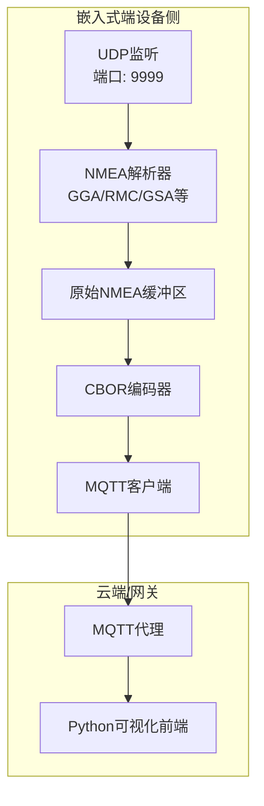
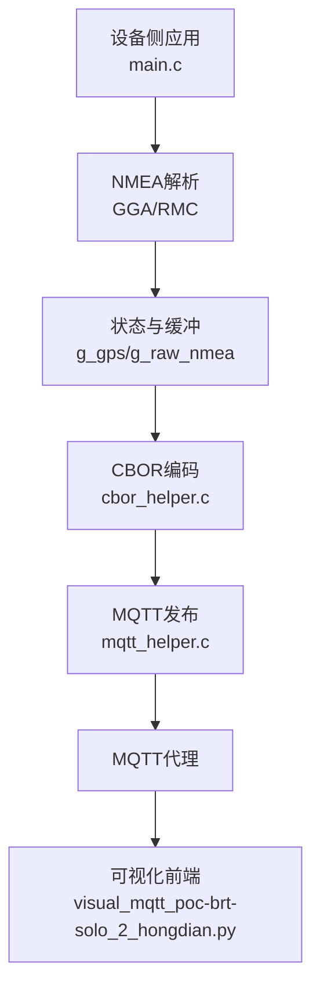
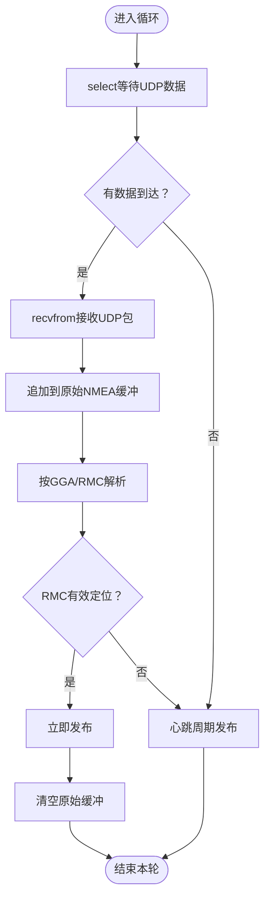
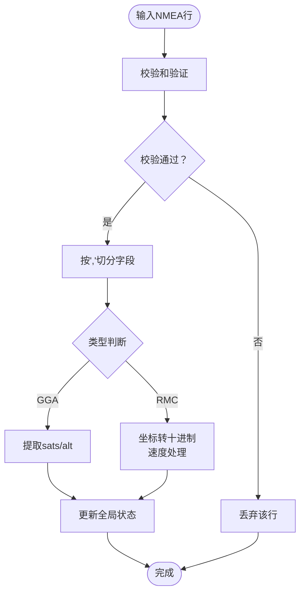
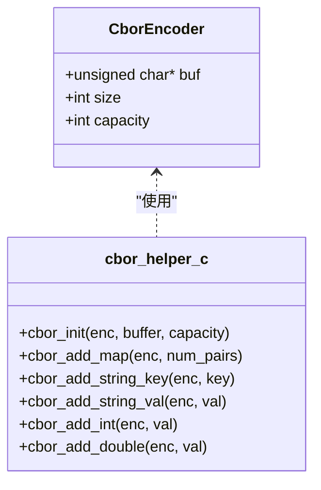
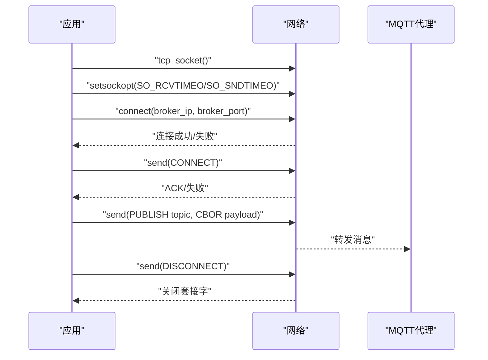
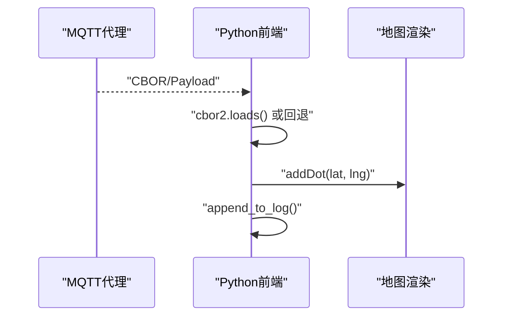
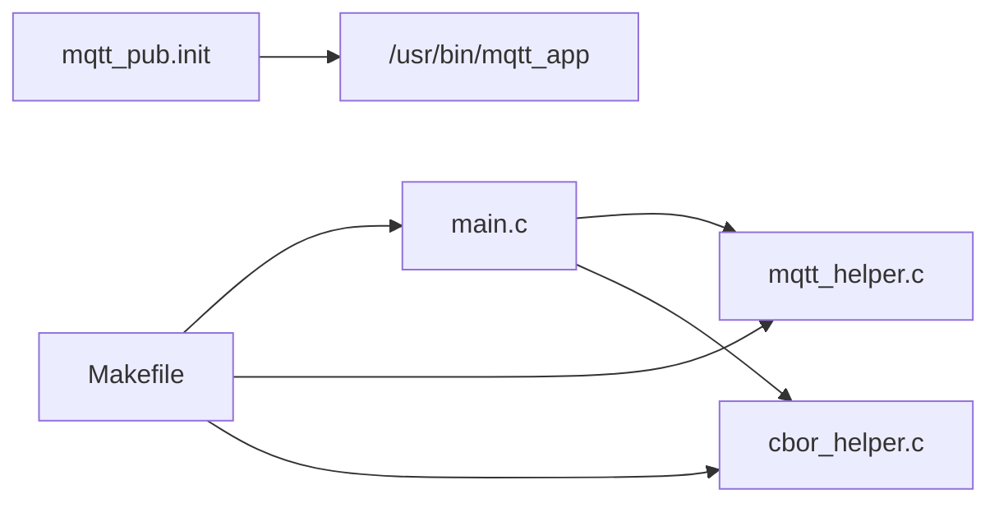

# 核心功能详解

<cite>
**本文引用的文件**
- [main.c（版本16_1）](file://dev_code/dev_code/mqtt_project_16_ver1_based-on-9/main.c)
- [cbor_helper.c（版本16_1）](file://dev_code/dev_code/mqtt_project_16_ver1_based-on-9/cbor_helper.c)
- [cbor_helper.h（版本16_1）](file://dev_code/dev_code/mqtt_project_16_ver1_based-on-9/cbor_helper.h)
- [mqtt_helper.c（版本16_1）](file://dev_code/dev_code/mqtt_project_16_ver1_based-on-9/mqtt_helper.c)
- [mqtt_helper.h（版本16_1）](file://dev_code/dev_code/mqtt_project_16_ver1_based-on-9/mqtt_helper.h)
- [Makefile（版本16_1）](file://dev_code/dev_code/mqtt_project_16_ver1_based-on-9/Makefile)
- [mqtt_pub.init（版本16_1）](file://dev_code/dev_code/mqtt_project_16_ver1_based-on-9/files/mqtt_pub.init)
- [main.c（版本16_2）](file://dev_code/dev_code/mqtt_project_16_ver2_based-on-15/main.c)
- [main.c（版本9）](file://dev_code/dev_code/mqtt_project_9/main.c)
- [visual_mqtt_poc-brt-solo_2_hongdian.py（带rawdata）](file://OPENSDT_none-armhf_plugin_mqtt-dummy-16-based-on-15_nmea-debug_16.15.0_2602051525-带rawdata/visual_mqtt_poc-brt-solo_2_hongdian.py)
- [visual_mqtt_poc-brt-solo_2_hongdian.py（不带rawdata）](file://visual_mqtt_poc-brt-solo_2_hongdian-不带rawdata/visual_mqtt_poc-brt-solo_2_hongdian.py)
- [Readme.md.txt](file://dev_code/dev_code/Readme.md.txt)
</cite>

## 目录
1. [简介](#简介)
2. [项目结构](#项目结构)
3. [核心组件](#核心组件)
4. [架构总览](#架构总览)
5. [详细组件分析](#详细组件分析)
6. [依赖关系分析](#依赖关系分析)
7. [性能考量](#性能考量)
8. [故障排查指南](#故障排查指南)
9. [结论](#结论)
10. [附录](#附录)

## 简介
本技术文档聚焦印尼GPS追踪系统的核心功能模块，围绕以下主题展开：UDP数据接收、NMEA语句解析与数据缓冲管理；数据处理与转换流程（坐标转换与速度处理）；MQTT通信实现（连接、发布、错误处理）；CBOR编码系统（数据结构与内存管理）。文档通过多版本代码对比与可视化前端集成，帮助读者理解各模块协作关系与数据流向。

## 项目结构
系统由三套主要版本构成，分别对应不同优化目标与问题修复路径：
- 版本9：基础工作版本，具备连续1Hz输出能力，存在速度异常值与精度问题。
- 版本16_1：在版本9基础上改进，尝试解决数据跳变问题，但新模块测试中出现数据缺失。
- 版本16_2：从版本9出发，进一步修正异常速度值问题，采用更稳健的解析与缓冲策略。

此外，仓库包含配套的Python可视化脚本与初始化脚本，用于实时展示与服务托管。

图表来源
- [main.c（版本16_1）](file://dev_code/dev_code/mqtt_project_16_ver1_based-on-9/main.c#L182-L259)
- [main.c（版本16_2）](file://dev_code/dev_code/mqtt_project_16_ver2_based-on-15/main.c#L245-L289)
- [mqtt_helper.c（版本16_1）](file://dev_code/dev_code/mqtt_project_16_ver1_based-on-9/mqtt_helper.c#L38-L115)
- [cbor_helper.c（版本16_1）](file://dev_code/dev_code/mqtt_project_16_ver1_based-on-9/cbor_helper.c#L38-L89)
- [visual_mqtt_poc-brt-solo_2_hongdian.py（带rawdata）](file://OPENSDT_none-armhf_plugin_mqtt-dummy-16-based-on-15_nmea-debug_16.15.0_2602051525-带rawdata/visual_mqtt_poc-brt-solo_2_hongdian.py#L19-L25)

章节来源
- [Readme.md.txt](file://dev_code/dev_code/Readme.md.txt#L1-L12)

## 核心组件
- UDP数据接收与缓冲：基于select的非阻塞UDP监听，累积原始NMEA句子到环形/追加缓冲区，按RMC触发发布或心跳周期性发布。
- NMEA解析器：支持GGA（海拔、卫星数）、RMC（经纬度、速度、航向），含校验与格式化处理。
- 数据转换：将NMEA坐标转换为十进制度，速度保留原始节值或换算为km/h。
- CBOR编码器：轻量级CBOR编码实现，支持整型、双精度浮点、字符串键值对，网络序字节序处理。
- MQTT客户端：TCP连接、CONNECT包构造、PUBLISH二进制安全发送、DISCONNECT与超时控制。
- 可视化前端：订阅指定主题，解码CBOR，渲染地图点位，记录日志。

章节来源
- [main.c（版本16_1）](file://dev_code/dev_code/mqtt_project_16_ver1_based-on-9/main.c#L182-L259)
- [main.c（版本16_2）](file://dev_code/dev_code/mqtt_project_16_ver2_based-on-15/main.c#L245-L289)
- [cbor_helper.c（版本16_1）](file://dev_code/dev_code/mqtt_project_16_ver1_based-on-9/cbor_helper.c#L38-L89)
- [mqtt_helper.c（版本16_1）](file://dev_code/dev_code/mqtt_project_16_ver1_based-on-9/mqtt_helper.c#L38-L115)
- [visual_mqtt_poc-brt-solo_2_hongdian.py（带rawdata）](file://OPENSDT_none-armhf_plugin_mqtt-dummy-16-based-on-15_nmea-debug_16.15.0_2602051525-带rawdata/visual_mqtt_poc-brt-solo_2_hongdian.py#L142-L187)

## 架构总览
系统采用“设备侧嵌入式应用 + 云端MQTT代理 + 可视化前端”的三层架构。设备侧负责采集与处理，云端负责转发与持久化，前端负责实时展示与调试。

图表来源
- [main.c（版本16_2）](file://dev_code/dev_code/mqtt_project_16_ver2_based-on-15/main.c#L116-L186)
- [cbor_helper.c（版本16_1）](file://dev_code/dev_code/mqtt_project_16_ver1_based-on-9/cbor_helper.c#L38-L89)
- [mqtt_helper.c（版本16_1）](file://dev_code/dev_code/mqtt_project_16_ver1_based-on-9/mqtt_helper.c#L59-L108)
- [visual_mqtt_poc-brt-solo_2_hongdian.py（带rawdata）](file://OPENSDT_none-armhf_plugin_mqtt-dummy-16-based-on-15_nmea-debug_16.15.0_2602051525-带rawdata/visual_mqtt_poc-brt-solo_2_hongdian.py#L190-L217)

## 详细组件分析

### UDP数据接收与缓冲管理
- 非阻塞监听：使用select设置微秒级超时，避免长时间阻塞。
- 累积缓冲：将收到的原始NMEA句子追加到全局缓冲区，按行分隔便于后续解析。
- 触发发布：当检测到RMC有效定位时立即发布；否则按固定心跳周期发布，保持数据活跃。
- 缓冲清理：发布后清空原始NMEA缓冲，防止无限增长。

图表来源
- [main.c（版本16_1）](file://dev_code/dev_code/mqtt_project_16_ver1_based-on-9/main.c#L201-L256)
- [main.c（版本16_2）](file://dev_code/dev_code/mqtt_project_16_ver2_based-on-15/main.c#L259-L287)

章节来源
- [main.c（版本16_1）](file://dev_code/dev_code/mqtt_project_16_ver1_based-on-9/main.c#L182-L259)
- [main.c（版本16_2）](file://dev_code/dev_code/mqtt_project_16_ver2_based-on-15/main.c#L245-L289)

### NMEA语句解析与数据转换
- 基础解析：按逗号与校验符切分为字段数组，提取必要字段。
- GGA解析：更新卫星数与海拔。
- RMC解析：转换十进制度坐标，保留原始速度（版本16_1）或换算为km/h（版本9/16_2），更新航向与定位有效性时间戳。
- 校验与健壮性：版本16_2新增校验函数，丢弃无效校验的句子，提升鲁棒性。

图表来源
- [main.c（版本16_2）](file://dev_code/dev_code/mqtt_project_16_ver2_based-on-15/main.c#L97-L165)
- [main.c（版本9）](file://dev_code/dev_code/mqtt_project_9/main.c#L86-L130)
- [main.c（版本16_1）](file://dev_code/dev_code/mqtt_project_16_ver1_based-on-9/main.c#L86-L133)

章节来源
- [main.c（版本16_2）](file://dev_code/dev_code/mqtt_project_16_ver2_based-on-15/main.c#L116-L165)
- [main.c（版本9）](file://dev_code/dev_code/mqtt_project_9/main.c#L86-L130)
- [main.c（版本16_1）](file://dev_code/dev_code/mqtt_project_16_ver1_based-on-9/main.c#L86-L133)

### 数据处理与聚合策略
- 速度处理差异：
  - 版本16_1：直接使用RMC中的原始节值，不做单位换算。
  - 版本9/16_2：换算为km/h，同时加入范围过滤（如阈值与上限）以剔除异常值。
- 定位有效性：版本16_2引入“最近RMC时间戳”，结合窗口判定是否有效，心跳发布时根据年龄决定是否输出速度。
- 卫星数与海拔：来自GGA，用于质量评估与显示。

章节来源
- [main.c（版本16_1）](file://dev_code/dev_code/mqtt_project_16_ver1_based-on-9/main.c#L120-L133)
- [main.c（版本9）](file://dev_code/dev_code/mqtt_project_9/main.c#L120-L127)
- [main.c（版本16_2）](file://dev_code/dev_code/mqtt_project_16_ver2_based-on-15/main.c#L150-L164)

### CBOR编码系统设计与实现
CBOR编码器以紧凑二进制形式封装JSON风格对象，支持整数、双精度浮点与字符串键值对。其核心要点如下：
- 结构体状态：持有缓冲指针、已写字节数与容量。
- 类型编码：按major type与长度编码规则写入头部与数据。
- 字节序：双精度浮点采用网络序（大端）存储。
- 使用方式：在发布前构建对象，填充字段，再通过MQTT二进制安全发送。

图表来源
- [cbor_helper.h（版本16_1）](file://dev_code/dev_code/mqtt_project_16_ver1_based-on-9/cbor_helper.h#L7-L12)
- [cbor_helper.c（版本16_1）](file://dev_code/dev_code/mqtt_project_16_ver1_based-on-9/cbor_helper.c#L38-L89)

章节来源
- [cbor_helper.h（版本16_1）](file://dev_code/dev_code/mqtt_project_16_ver1_based-on-9/cbor_helper.h#L1-L27)
- [cbor_helper.c（版本16_1）](file://dev_code/dev_code/mqtt_project_16_ver1_based-on-9/cbor_helper.c#L1-L89)

### MQTT通信实现
- 连接建立：创建TCP套接字，设置收发超时，发起connect。
- CONNECT包：固定变量头与可变头，包含协议版本、标志位与keepalive；载荷包含客户端ID、用户名、密码。
- PUBLISH发送：二进制安全复制CBOR负载，确保payload_len正确传递。
- 断开连接：发送DISCONNECT包并关闭套接字。
- 错误处理：连接失败、发送失败均进行资源回收与返回码判定。

图表来源
- [mqtt_helper.c（版本16_1）](file://dev_code/dev_code/mqtt_project_16_ver1_based-on-9/mqtt_helper.c#L38-L115)
- [mqtt_helper.h（版本16_1）](file://dev_code/dev_code/mqtt_project_16_ver1_based-on-9/mqtt_helper.h#L1-L13)

章节来源
- [mqtt_helper.c（版本16_1）](file://dev_code/dev_code/mqtt_project_16_ver1_based-on-9/mqtt_helper.c#L38-L115)
- [mqtt_helper.h（版本16_1）](file://dev_code/dev_code/mqtt_project_16_ver1_based-on-9/mqtt_helper.h#L1-L13)

### 可视化前端与数据流
- 订阅主题：前端连接MQTT代理，订阅指定主题。
- CBOR解码：优先使用cbor2库解码，失败则回退到原始负载字符串。
- 实时渲染：提取经纬度，添加圆点标记，滚动更新信息面板。
- 日志记录：将解码后的JSON写入本地日志文件，便于离线分析。

图表来源
- [visual_mqtt_poc-brt-solo_2_hongdian.py（带rawdata）](file://OPENSDT_none-armhf_plugin_mqtt-dummy-16-based-on-15_nmea-debug_16.15.0_2602051525-带rawdata/visual_mqtt_poc-brt-solo_2_hongdian.py#L142-L187)

章节来源
- [visual_mqtt_poc-brt-solo_2_hongdian.py（带rawdata）](file://OPENSDT_none-armhf_plugin_mqtt-dummy-16-based-on-15_nmea-debug_16.15.0_2602051525-带rawdata/visual_mqtt_poc-brt-solo_2_hongdian.py#L1-L217)
- [visual_mqtt_poc-brt-solo_2_hongdian.py（不带rawdata）](file://visual_mqtt_poc-brt-solo_2_hongdian-不带rawdata/visual_mqtt_poc-brt-solo_2_hongdian.py#L1-L217)

## 依赖关系分析
- 模块耦合：
  - main.c依赖mqtt_helper与cbor_helper，形成清晰的边界。
  - 版本16_2在解析链路中增加校验与状态机，提升稳定性。
- 外部依赖：
  - 数学库：链接-m以支持浮点运算。
  - 初始化脚本：通过procd托管服务，自动重启。
- 构建产物：编译生成mqtt_app，安装至/usr/bin，初始化脚本放置/etc/init.d。

图表来源
- [Makefile（版本16_1）](file://dev_code/dev_code/mqtt_project_16_ver1_based-on-9/Makefile#L1-L23)
- [mqtt_pub.init（版本16_1）](file://dev_code/dev_code/mqtt_project_16_ver1_based-on-9/files/mqtt_pub.init#L6-L13)

章节来源
- [Makefile（版本16_1）](file://dev_code/dev_code/mqtt_project_16_ver1_based-on-9/Makefile#L1-L23)
- [Makefile（版本16_2）](file://dev_code/dev_code/mqtt_project_16_ver2_based-on-15/Makefile#L1-L23)
- [Makefile（版本9）](file://dev_code/dev_code/mqtt_project_9/Makefile#L1-L23)
- [mqtt_pub.init（版本16_1）](file://dev_code/dev_code/mqtt_project_16_ver1_based-on-9/files/mqtt_pub.init#L1-L14)
- [mqtt_pub.init（版本16_2）](file://dev_code/dev_code/mqtt_project_16_ver2_based-on-15/files/mqtt_pub.init#L1-L14)

## 性能考量
- UDP监听：使用微秒级select超时，平衡响应性与CPU占用。
- 缓冲策略：版本16_2采用累积缓冲与游标推进，减少重复拷贝；版本16_1采用追加+清空，降低复杂度。
- 发布频率：心跳周期控制发布频率，避免频繁连接/断开。
- CBOR编码：紧凑二进制格式，减小传输体积；双精度浮点网络序写入，保证跨平台一致性。
- 解析健壮性：版本16_2引入校验与范围过滤，减少异常值带来的额外处理成本。

## 故障排查指南
- 无数据/延迟高
  - 检查UDP端口绑定与防火墙策略。
  - 查看select超时设置与网络状况。
- 速度异常/跳变
  - 对比版本9与16_2的速度处理逻辑，确认是否启用范围过滤。
  - 核对RMC字段索引与单位换算。
- CBOR解码失败
  - 确认MQTT代理未对负载做二次编码。
  - 前端安装cbor2库，或接受原始负载字符串回退。
- 连接不稳定
  - 检查broker地址、端口、认证信息。
  - 关注超时设置与网络抖动影响。
- 日志与可视化
  - 确认日志文件权限与磁盘空间。
  - 前端页面加载完成后观察地图点位增长趋势。

章节来源
- [mqtt_helper.c（版本16_1）](file://dev_code/dev_code/mqtt_project_16_ver1_based-on-9/mqtt_helper.c#L38-L57)
- [visual_mqtt_poc-brt-solo_2_hongdian.py（带rawdata）](file://OPENSDT_none-armhf_plugin_mqtt-dummy-16-based-on-15_nmea-debug_16.15.0_2602051525-带rawdata/visual_mqtt_poc-brt-solo_2_hongdian.py#L156-L163)

## 结论
本系统通过UDP+NMEA+CBOR+MQTT的组合，实现了从设备侧到云端再到前端的完整数据链路。版本演进体现了对稳定性与健壮性的持续优化：从基础连续输出，到异常速度处理，再到解析校验与缓冲策略完善。建议在生产部署中：
- 优先采用版本16_2的解析与缓冲策略；
- 在前端启用CBOR解码并配置日志归档；
- 结合心跳与有效性窗口，确保数据新鲜度与准确性。

## 附录
- 版本差异速览
  - 版本9：基础连续输出，速度异常值问题。
  - 版本16_1：尝试解决跳变，新模块测试中出现数据缺失。
  - 版本16_2：修正异常速度值，增强解析健壮性与缓冲管理。
- 关键配置项
  - MQTT代理：IP、端口、用户名、密码、主题。
  - UDP端口：默认9999。
  - 设备标识：公交编号、标签、运营商与走廊ID。

章节来源
- [Readme.md.txt](file://dev_code/dev_code/Readme.md.txt#L1-L12)
- [main.c（版本16_1）](file://dev_code/dev_code/mqtt_project_16_ver1_based-on-9/main.c#L13-L25)
- [main.c（版本16_2）](file://dev_code/dev_code/mqtt_project_16_ver2_based-on-15/main.c#L14-L26)
- [main.c（版本9）](file://dev_code/dev_code/mqtt_project_9/main.c#L13-L25)