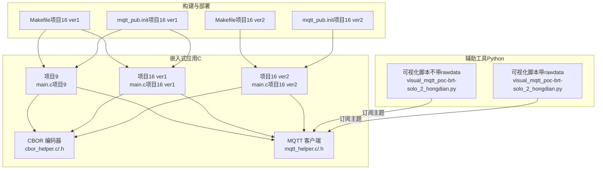
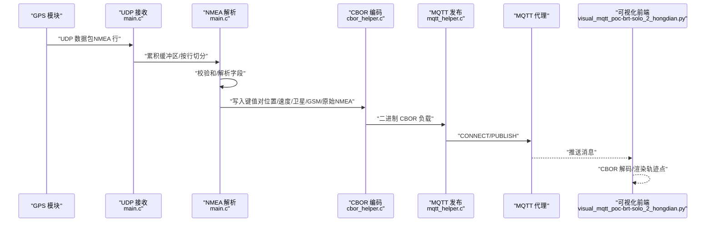
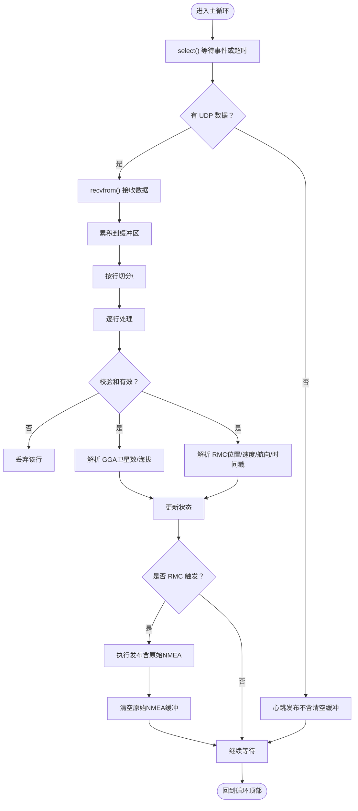
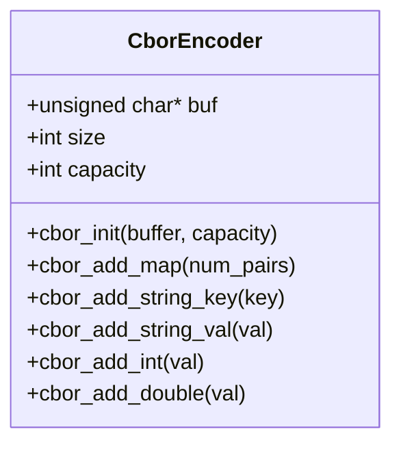
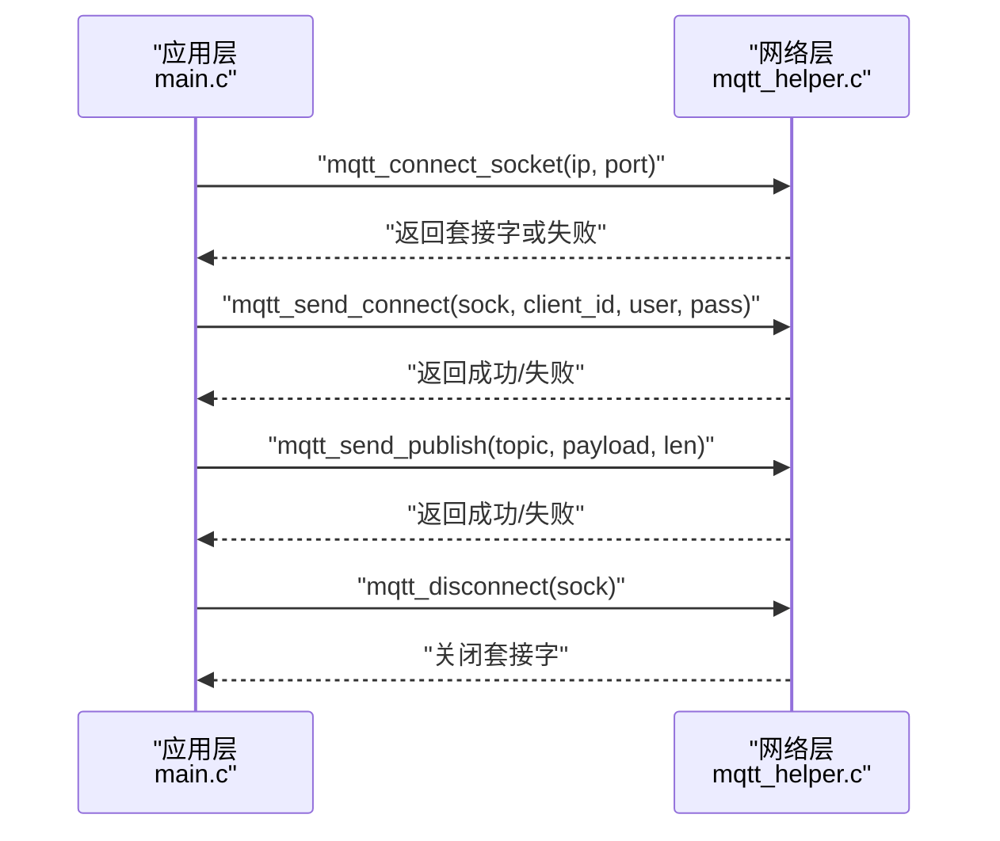
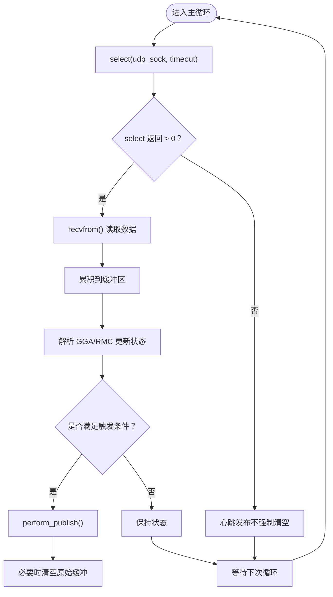
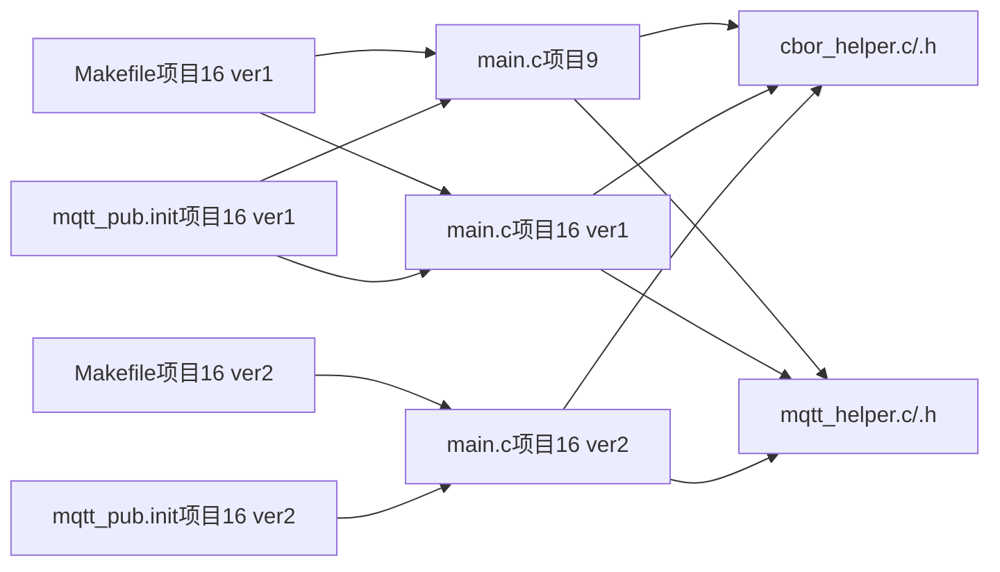

# 系统集成与协调

<cite>
**本文引用的文件**
- [main.c（项目16 ver1）](file://dev_code/dev_code/mqtt_project_16_ver1_based-on-9/main.c)
- [cbor_helper.c](file://dev_code/dev_code/mqtt_project_16_ver1_based-on-9/cbor_helper.c)
- [cbor_helper.h](file://dev_code/dev_code/mqtt_project_16_ver1_based-on-9/cbor_helper.h)
- [mqtt_helper.c](file://dev_code/dev_code/mqtt_project_16_ver1_based-on-9/mqtt_helper.c)
- [mqtt_helper.h](file://dev_code/dev_code/mqtt_project_16_ver1_based-on-9/mqtt_helper.h)
- [main.c（项目9）](file://dev_code/dev_code/mqtt_project_9/main.c)
- [main.c（项目16 ver2）](file://dev_code/dev_code/mqtt_project_16_ver2_based-on-15/main.c)
- [Makefile（项目16 ver1）](file://dev_code/dev_code/mqtt_project_16_ver1_based-on-9/Makefile)
- [Makefile（项目16 ver2）](file://dev_code/dev_code/mqtt_project_16_ver2_based-on-15/Makefile)
- [mqtt_pub.init（项目16 ver1）](file://dev_code/dev_code/mqtt_project_16_ver1_based-on-9/files/mqtt_pub.init)
- [mqtt_pub.init（项目16 ver2）](file://dev_code/dev_code/mqtt_project_16_ver2_based-on-15/files/mqtt_pub.init)
- [Readme.md.txt](file://dev_code/dev_code/Readme.md.txt)
- [visual_mqtt_poc-brt-solo_2_hongdian.py（不带rawdata）](file://visual_mqtt_poc-brt-solo_2_hongdian-不带rawdata/visual_mqtt_poc-brt-solo_2_hongdian.py)
- [visual_mqtt_poc-brt-solo_2_hongdian.py（带rawdata）](file://OPENSDT_none-armhf_plugin_mqtt-dummy-16-based-on-15_nmea-debug_16.15.0_2602051525-带rawdata/visual_mqtt_poc-brt-solo_2_hongdian.py)
</cite>

## 目录
1. [简介](#简介)
2. [项目结构](#项目结构)
3. [核心组件](#核心组件)
4. [架构总览](#架构总览)
5. [详细组件分析](#详细组件分析)
6. [依赖关系分析](#依赖关系分析)
7. [性能考虑](#性能考虑)
8. [故障排查指南](#故障排查指南)
9. [结论](#结论)
10. [附录](#附录)

## 简介
本技术文档聚焦于系统集成与协调模块，围绕以下目标展开：  
- 解释 GPS 数据采集、MQTT 通信与 CBOR 编码三者的完整数据流；  
- 阐述主循环设计（基于 select() 的事件驱动模型、时间片管理与心跳机制）；  
- 描述状态管理策略（全局变量设计、数据同步与并发控制）；  
- 解释错误处理与异常恢复（网络故障、数据解析错误、系统资源不足）；  
- 提供系统架构图与数据流向图，直观展示模块间交互；  
- 给出性能监控与调试技巧，帮助开发者优化系统运行效率。

## 项目结构
该仓库包含多个版本的实现与配套工具，核心由 C 语言实现的嵌入式应用与 Python 可视化脚本组成。  
- 嵌入式应用（C）：  
  - 项目9：基础版本，使用 UDP 接收 NMEA，累积原始数据并在 RMC 到达时发布；  
  - 项目16 ver1：在项目9基础上改进，保留原有功能；  
  - 项目16 ver2：从项目9出发的另一改进分支，强调更稳健的解析与心跳发布策略；  
- 辅助工具（Python）：  
  - 可视化脚本：订阅 MQTT 主题，解析 CBOR，实时渲染轨迹点；  
- 构建与部署：  
  - Makefile：编译目标与安装流程；  
  - init 脚本：通过 procd 启动守护进程并自动重启。

图表来源
- [main.c（项目9）](file://dev_code/dev_code/mqtt_project_9/main.c#L1-L257)
- [main.c（项目16 ver1）](file://dev_code/dev_code/mqtt_project_16_ver1_based-on-9/main.c#L1-L259)
- [main.c（项目16 ver2）](file://dev_code/dev_code/mqtt_project_16_ver2_based-on-15/main.c#L1-L289)
- [cbor_helper.c](file://dev_code/dev_code/mqtt_project_16_ver1_based-on-9/cbor_helper.c#L1-L89)
- [cbor_helper.h](file://dev_code/dev_code/mqtt_project_16_ver1_based-on-9/cbor_helper.h#L1-L27)
- [mqtt_helper.c](file://dev_code/dev_code/mqtt_project_16_ver1_based-on-9/mqtt_helper.c#L1-L115)
- [mqtt_helper.h](file://dev_code/dev_code/mqtt_project_16_ver1_based-on-9/mqtt_helper.h#L1-L13)
- [Makefile（项目16 ver1）](file://dev_code/dev_code/mqtt_project_16_ver1_based-on-9/Makefile#L1-L23)
- [Makefile（项目16 ver2）](file://dev_code/dev_code/mqtt_project_16_ver2_based-on-15/Makefile#L1-L23)
- [mqtt_pub.init（项目16 ver1）](file://dev_code/dev_code/mqtt_project_16_ver1_based-on-9/files/mqtt_pub.init#L1-L14)
- [mqtt_pub.init（项目16 ver2）](file://dev_code/dev_code/mqtt_project_16_ver2_based-on-15/files/mqtt_pub.init#L1-L14)

章节来源
- [Readme.md.txt](file://dev_code/dev_code/Readme.md.txt#L1-L12)

## 核心组件
- GPS 数据采集与解析  
  - 使用 UDP 接收 NMEA 语句，累积到缓冲区；按行切分并校验校验和后解析 GGA/RMC 字段，更新位置、高度、速度、航向与卫星数等状态。  
  - 版本差异：项目16 ver2 引入了更严格的校验与心跳发布策略，避免天文数值与超时未发导致的数据丢失。  

- CBOR 编码  
  - 自研轻量 CBOR 编码器，支持整型、双精度浮点、字符串键值对，输出二进制负载用于 MQTT 发布。  

- MQTT 发布  
  - TCP 连接、CONNECT 协商、PUBLISH 发送，支持二进制负载安全传输；连接超时与发送保障函数确保可靠性。  

- 主循环与心跳  
  - 基于 select() 的事件驱动模型，设定超时时间片；无事件时触发心跳发布，保证周期性上报。  

- 状态管理与并发  
  - 全局状态变量集中管理；缓冲区大小限制与溢出保护；多版本实现中对缓冲区累积策略与清空时机的差异体现了不同的容错策略。  

章节来源
- [main.c（项目9）](file://dev_code/dev_code/mqtt_project_9/main.c#L179-L256)
- [main.c（项目16 ver1）](file://dev_code/dev_code/mqtt_project_16_ver1_based-on-9/main.c#L182-L259)
- [main.c（项目16 ver2）](file://dev_code/dev_code/mqtt_project_16_ver2_based-on-15/main.c#L245-L289)
- [cbor_helper.c](file://dev_code/dev_code/mqtt_project_16_ver1_based-on-9/cbor_helper.c#L38-L89)
- [cbor_helper.h](file://dev_code/dev_code/mqtt_project_16_ver1_based-on-9/cbor_helper.h#L7-L27)
- [mqtt_helper.c](file://dev_code/dev_code/mqtt_project_16_ver1_based-on-9/mqtt_helper.c#L38-L115)
- [mqtt_helper.h](file://dev_code/dev_code/mqtt_project_16_ver1_based-on-9/mqtt_helper.h#L1-L13)

## 架构总览
下图展示了从 GPS UDP 接收、NMEA 解析、CBOR 编码到 MQTT 发布的完整数据流，以及与可视化前端的交互。

图表来源
- [main.c（项目9）](file://dev_code/dev_code/mqtt_project_9/main.c#L211-L247)
- [main.c（项目16 ver1）](file://dev_code/dev_code/mqtt_project_16_ver1_based-on-9/main.c#L214-L249)
- [main.c（项目16 ver2）](file://dev_code/dev_code/mqtt_project_16_ver2_based-on-15/main.c#L267-L282)
- [cbor_helper.c](file://dev_code/dev_code/mqtt_project_16_ver1_based-on-9/cbor_helper.c#L44-L89)
- [mqtt_helper.c](file://dev_code/dev_code/mqtt_project_16_ver1_based-on-9/mqtt_helper.c#L59-L108)
- [visual_mqtt_poc-brt-solo_2_hongdian.py（不带rawdata）](file://visual_mqtt_poc-brt-solo_2_hongdian-不带rawdata/visual_mqtt_poc-brt-solo_2_hongdian.py#L150-L187)

## 详细组件分析

### GPS 数据采集与解析
- 事件驱动接收：使用 select() 等待 UDP 数据到达或超时；  
- 缓冲累积：将收到的 NMEA 行追加到累积缓冲区；  
- 行级解析：按换行符切分，定位起始标记“$”，提取 GGA/RMC 字段；  
- 校验与过滤：项目16 ver2 引入校验和验证，丢弃无效帧；  
- 状态更新：解析成功后更新经纬度、海拔、速度、航向与卫星数等状态。

图表来源
- [main.c（项目9）](file://dev_code/dev_code/mqtt_project_9/main.c#L209-L252)
- [main.c（项目16 ver1）](file://dev_code/dev_code/mqtt_project_16_ver1_based-on-9/main.c#L212-L255)
- [main.c（项目16 ver2）](file://dev_code/dev_code/mqtt_project_16_ver2_based-on-15/main.c#L167-L186)

章节来源
- [main.c（项目9）](file://dev_code/dev_code/mqtt_project_9/main.c#L86-L130)
- [main.c（项目16 ver1）](file://dev_code/dev_code/mqtt_project_16_ver1_based-on-9/main.c#L86-L133)
- [main.c（项目16 ver2）](file://dev_code/dev_code/mqtt_project_16_ver2_based-on-15/main.c#L116-L165)

### CBOR 编码器
- 设计要点：  
  - 编码器状态结构体记录缓冲指针、容量与已写字节数；  
  - 支持添加映射头、字符串键值、整型与双精度浮点；  
  - 写入字节序与长度编码遵循 CBOR 规范；  
  - 输出二进制负载直接作为 MQTT PUBLISH 的 payload。  

图表来源
- [cbor_helper.h](file://dev_code/dev_code/mqtt_project_16_ver1_based-on-9/cbor_helper.h#L7-L27)
- [cbor_helper.c](file://dev_code/dev_code/mqtt_project_16_ver1_based-on-9/cbor_helper.c#L38-L89)

章节来源
- [cbor_helper.c](file://dev_code/dev_code/mqtt_project_16_ver1_based-on-9/cbor_helper.c#L4-L89)
- [cbor_helper.h](file://dev_code/dev_code/mqtt_project_16_ver1_based-on-9/cbor_helper.h#L1-L27)

### MQTT 客户端
- 连接与超时：TCP 套接字设置发送/接收超时，避免阻塞；  
- CONNECT 协商：构造协议头与用户名密码载荷；  
- PUBLISH：主题固定，二进制负载安全复制；  
- 断开：发送 DISCONNECT 包并关闭套接字。  

图表来源
- [mqtt_helper.c](file://dev_code/dev_code/mqtt_project_16_ver1_based-on-9/mqtt_helper.c#L38-L115)
- [mqtt_helper.h](file://dev_code/dev_code/mqtt_project_16_ver1_based-on-9/mqtt_helper.h#L1-L13)

章节来源
- [mqtt_helper.c](file://dev_code/dev_code/mqtt_project_16_ver1_based-on-9/mqtt_helper.c#L10-L115)
- [mqtt_helper.h](file://dev_code/dev_code/mqtt_project_16_ver1_based-on-9/mqtt_helper.h#L1-L13)

### 主循环设计与心跳机制
- 事件驱动：使用 select() 等待 UDP 套接字可读或超时；  
- 时间片管理：设置微秒级超时，平衡响应性与 CPU 占用；  
- 心跳发布：当无新数据到达时仍定期发布，确保系统存活与数据连续性；  
- 版本差异：  
  - 项目9/16 ver1：仅在 RMC 到达时发布，超时触发心跳发布但不清空原始缓冲；  
  - 项目16 ver2：引入更严格的时间片与心跳策略，避免过期数据重复发送。

图表来源
- [main.c（项目9）](file://dev_code/dev_code/mqtt_project_9/main.c#L198-L254)
- [main.c（项目16 ver1）](file://dev_code/dev_code/mqtt_project_16_ver1_based-on-9/main.c#L201-L256)
- [main.c（项目16 ver2）](file://dev_code/dev_code/mqtt_project_16_ver2_based-on-15/main.c#L259-L288)

章节来源
- [main.c（项目9）](file://dev_code/dev_code/mqtt_project_9/main.c#L198-L254)
- [main.c（项目16 ver1）](file://dev_code/dev_code/mqtt_project_16_ver1_based-on-9/main.c#L201-L256)
- [main.c（项目16 ver2）](file://dev_code/dev_code/mqtt_project_16_ver2_based-on-15/main.c#L259-L288)

### 状态管理策略
- 全局变量设计（项目9/16 ver1）：  
  - 使用一组全局变量保存位置、高度、速度、航向、卫星数与 GSM 信号强度；  
  - 原始 NMEA 缓冲独立存放，便于一次性打包发送；  
- 结构化状态（项目16 ver2）：  
  - 引入结构体封装 GPS 状态，包含最近一次 RMC 时间戳，用于心跳时的速度裁剪；  
  - 分离“最新单行 NMEA”与“累积 NMEA”，提升可维护性与可测试性；  
- 数据同步与并发：  
  - 当前实现为单线程事件循环，无显式锁；  
  - 通过缓冲区边界检查与溢出保护降低竞态风险；  
  - 建议：在多线程扩展时引入互斥锁与原子操作。

章节来源
- [main.c（项目9）](file://dev_code/dev_code/mqtt_project_9/main.c#L27-L39)
- [main.c（项目16 ver1）](file://dev_code/dev_code/mqtt_project_16_ver1_based-on-9/main.c#L27-L40)
- [main.c（项目16 ver2）](file://dev_code/dev_code/mqtt_project_16_ver2_based-on-15/main.c#L30-L47)

### 错误处理与异常恢复
- 网络故障：  
  - 连接超时与发送失败时关闭套接字并重试；  
  - 心跳发布确保在网络抖动期间仍能维持上报；  
- 数据解析错误：  
  - 项目16 ver2 引入校验和验证，丢弃无效帧；  
  - 对异常速度范围进行过滤，避免异常值污染；  
- 系统资源不足：  
  - 缓冲区长度限制与溢出保护，防止内存越界；  
  - 心跳时清空原始缓冲（项目9/16 ver1），避免无限增长；  
  - 建议：增加动态扩容或环形缓冲策略以应对突发流量。

章节来源
- [mqtt_helper.c](file://dev_code/dev_code/mqtt_project_16_ver1_based-on-9/mqtt_helper.c#L38-L57)
- [main.c（项目16 ver2）](file://dev_code/dev_code/mqtt_project_16_ver2_based-on-15/main.c#L97-L112)
- [main.c（项目16 ver2）](file://dev_code/dev_code/mqtt_project_16_ver2_based-on-15/main.c#L150-L157)
- [main.c（项目9）](file://dev_code/dev_code/mqtt_project_9/main.c#L223-L229)
- [main.c（项目16 ver1）](file://dev_code/dev_code/mqtt_project_16_ver1_based-on-9/main.c#L226-L229)

## 依赖关系分析
- 模块耦合：  
  - main.c 依赖 cbor_helper 与 mqtt_helper；  
  - cbor_helper 与 mqtt_helper 为纯工具模块，低耦合；  
- 外部依赖：  
  - 数学库（-lm）用于三角函数与浮点运算（项目16 ver2 显式包含）；  
  - 构建系统：Makefile 统一编译与安装；  
  - 初始化：procd 启动守护进程并自动重启。

图表来源
- [main.c（项目9）](file://dev_code/dev_code/mqtt_project_9/main.c#L1-L12)
- [main.c（项目16 ver1）](file://dev_code/dev_code/mqtt_project_16_ver1_based-on-9/main.c#L1-L12)
- [main.c（项目16 ver2）](file://dev_code/dev_code/mqtt_project_16_ver2_based-on-15/main.c#L1-L12)
- [Makefile（项目16 ver1）](file://dev_code/dev_code/mqtt_project_16_ver1_based-on-9/Makefile#L1-L23)
- [Makefile（项目16 ver2）](file://dev_code/dev_code/mqtt_project_16_ver2_based-on-15/Makefile#L1-L23)
- [mqtt_pub.init（项目16 ver1）](file://dev_code/dev_code/mqtt_project_16_ver1_based-on-9/files/mqtt_pub.init#L1-L14)
- [mqtt_pub.init（项目16 ver2）](file://dev_code/dev_code/mqtt_project_16_ver2_based-on-15/files/mqtt_pub.init#L1-L14)

章节来源
- [Makefile（项目16 ver1）](file://dev_code/dev_code/mqtt_project_16_ver1_based-on-9/Makefile#L1-L23)
- [Makefile（项目16 ver2）](file://dev_code/dev_code/mqtt_project_16_ver2_based-on-15/Makefile#L1-L23)

## 性能考虑
- I/O 与 CPU 平衡：  
  - 选择合适的 select 超时，避免频繁唤醒与高 CPU 占用；  
  - 将解析与编码合并为单次发布，减少网络往返；  
- 缓冲区管理：  
  - 控制累积缓冲区上限，防止内存膨胀；  
  - 心跳发布时清空原始缓冲，避免历史数据堆积；  
- 网络可靠性：  
  - 设置连接与发送超时，失败快速回退；  
  - 心跳发布作为保活手段，降低长链路断连风险；  
- 可视化与日志：  
  - 前端解码 CBOR 并渲染轨迹，建议开启本地日志以便离线分析；  
  - 在生产环境建议将日志输出到系统日志服务，便于集中监控。

## 故障排查指南
- 无法接收 GPS 数据：  
  - 检查 UDP 端口绑定与防火墙；  
  - 确认 GPS 模块输出格式为标准 NMEA；  
- 发布失败：  
  - 查看 MQTT 连接超时与认证信息；  
  - 检查 broker 可达性与主题权限；  
- 数据异常（速度/坐标异常）：  
  - 项目16 ver2 已内置校验与过滤逻辑，优先升级至该版本；  
  - 关注心跳发布时的速度裁剪逻辑；  
- 内存占用过高：  
  - 检查累积缓冲区是否溢出保护生效；  
  - 心跳发布后是否正确清空原始缓冲；  
- 可视化无数据：  
  - 确认订阅的主题与 broker 地址一致；  
  - 检查 CBOR 解码库是否可用，若不可用则降级显示原始负载。

章节来源
- [mqtt_helper.c](file://dev_code/dev_code/mqtt_project_16_ver1_based-on-9/mqtt_helper.c#L38-L57)
- [main.c（项目16 ver2）](file://dev_code/dev_code/mqtt_project_16_ver2_based-on-15/main.c#L97-L112)
- [visual_mqtt_poc-brt-solo_2_hongdian.py（不带rawdata）](file://visual_mqtt_poc-brt-solo_2_hongdian-不带rawdata/visual_mqtt_poc-brt-solo_2_hongdian.py#L150-L187)

## 结论
本系统通过事件驱动的主循环、稳健的 NMEA 解析与 CBOR 编码，实现了从 GPS 数据采集到 MQTT 发布的闭环流程。项目16 ver2 在解析健壮性与心跳策略上进行了显著改进，适合在复杂环境下部署。建议在后续版本中引入更完善的并发控制、动态缓冲与监控告警机制，以进一步提升稳定性与可观测性。

## 附录
- 构建与安装  
  - 使用 Makefile 编译生成可执行文件；  
  - 通过 init 脚本注册为系统服务，具备自动重启能力；  
- 版本演进说明  
  - 项目9为基础版本；  
  - 项目16 ver1 在其基础上保持功能不变的改进；  
  - 项目16 ver2 从项目9出发的另一条改进路径，强调解析健壮性与心跳策略。

章节来源
- [Makefile（项目16 ver1）](file://dev_code/dev_code/mqtt_project_16_ver1_based-on-9/Makefile#L14-L22)
- [Makefile（项目16 ver2）](file://dev_code/dev_code/mqtt_project_16_ver2_based-on-15/Makefile#L14-L22)
- [mqtt_pub.init（项目16 ver1）](file://dev_code/dev_code/mqtt_project_16_ver1_based-on-9/files/mqtt_pub.init#L6-L12)
- [mqtt_pub.init（项目16 ver2）](file://dev_code/dev_code/mqtt_project_16_ver2_based-on-15/files/mqtt_pub.init#L6-L12)
- [Readme.md.txt](file://dev_code/dev_code/Readme.md.txt#L3-L12)