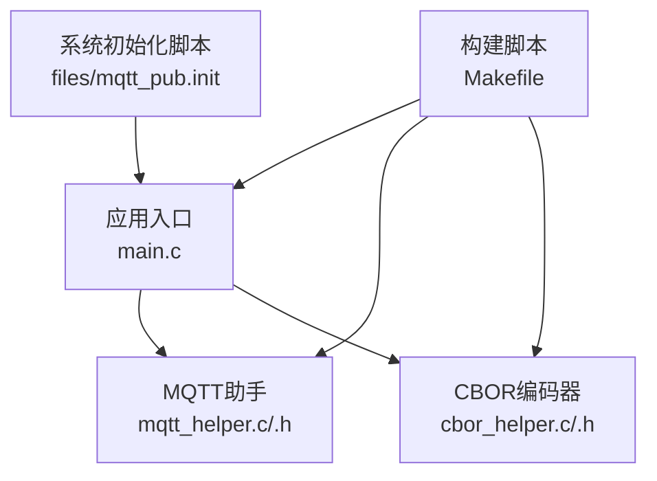
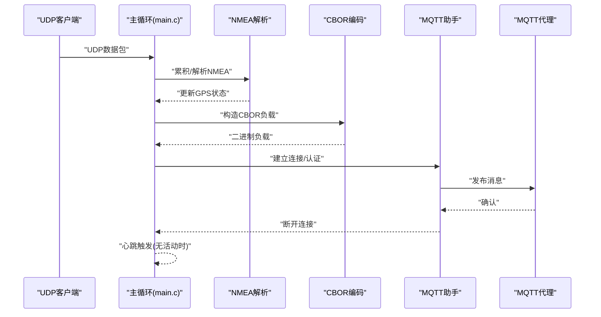
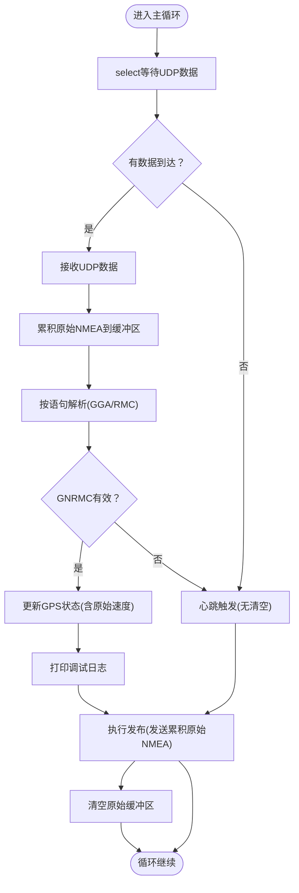
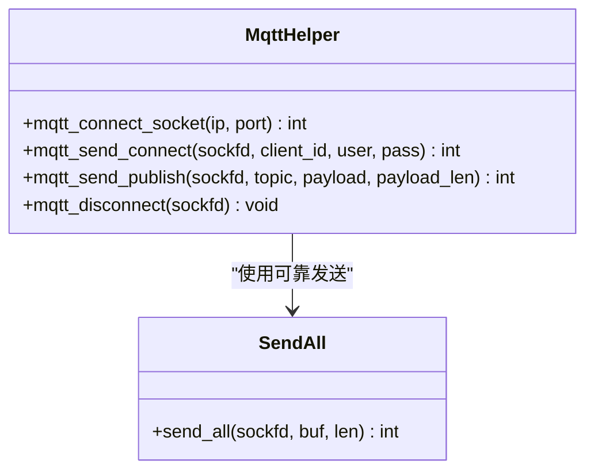
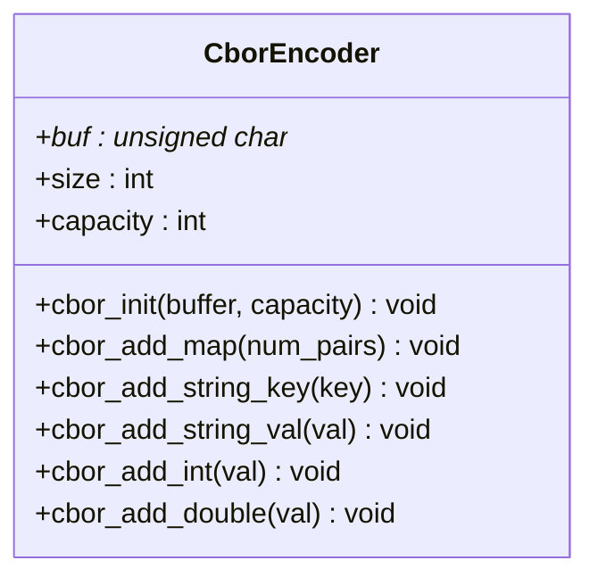
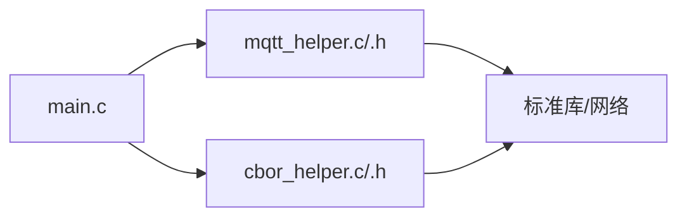

# 版本16改进版1

<cite>
**本文引用的文件**
- [main.c](file://dev_code/dev_code/mqtt_project_16_ver1_based-on-9/main.c)
- [mqtt_helper.c](file://dev_code/dev_code/mqtt_project_16_ver1_based-on-9/mqtt_helper.c)
- [mqtt_helper.h](file://dev_code/dev_code/mqtt_project_16_ver1_based-on-9/mqtt_helper.h)
- [cbor_helper.c](file://dev_code/dev_code/mqtt_project_16_ver1_based-on-9/cbor_helper.c)
- [cbor_helper.h](file://dev_code/dev_code/mqtt_project_16_ver1_based-on-9/cbor_helper.h)
- [Makefile](file://dev_code/dev_code/mqtt_project_16_ver1_based-on-9/Makefile)
- [mqtt_pub.init](file://dev_code/dev_code/mqtt_project_16_ver1_based-on-9/files/mqtt_pub.init)
- [main.c](file://dev_code/dev_code/mqtt_project_9/main.c)
- [main.c](file://dev_code/dev_code/mqtt_project_16_ver2_based-on-15/main.c)
- [mqtt_helper.c](file://dev_code/dev_code/mqtt_project_16_ver2_based-on-15/mqtt_helper.c)
- [cbor_helper.c](file://dev_code/dev_code/mqtt_project_16_ver2_based-on-15/cbor_helper.c)
- [Readme.md.txt](file://dev_code/Readme.md.txt)
</cite>

## 目录
1. [简介](#简介)
2. [项目结构](#项目结构)
3. [核心组件](#核心组件)
4. [架构总览](#架构总览)
5. [详细组件分析](#详细组件分析)
6. [依赖关系分析](#依赖关系分析)
7. [性能考虑](#性能考虑)
8. [故障排查指南](#故障排查指南)
9. [结论](#结论)
10. [附录：版本升级与兼容性说明](#附录版本升级与兼容性说明)

## 简介
本文件针对 mqtt_project_16_ver1 基于版本9的改进版本进行全面技术分析，重点阐述以下方面的改进与变化：
- 性能优化：缓冲区管理策略、发送路径优化、心跳发布机制
- 错误处理增强：NMEA校验、边界检查、异常数据过滤
- 代码结构改进：模块化设计、状态机式解析流程、可维护性提升
- 新增功能特性：原始NMEA完整累积、原始速度字段保留、GSM信号采集
- 稳定性提升：内存安全、超时控制、连接健壮性

同时，通过与版本9和版本16_ver2的对比，解释改进的技术原因与实现方法，并提供版本升级指南与兼容性说明。

## 项目结构
该版本采用分层模块化组织：
- 应用入口与主循环：main.c
- MQTT协议封装：mqtt_helper.c/.h
- CBOR序列化：cbor_helper.c/.h
- 构建脚本：Makefile
- 初始化脚本：files/mqtt_pub.init

图表来源
- [main.c](file://dev_code/dev_code/mqtt_project_16_ver1_based-on-9/main.c#L182-L259)
- [mqtt_helper.c](file://dev_code/dev_code/mqtt_project_16_ver1_based-on-9/mqtt_helper.c#L1-L115)
- [cbor_helper.c](file://dev_code/dev_code/mqtt_project_16_ver1_based-on-9/cbor_helper.c#L1-L89)
- [Makefile](file://dev_code/dev_code/mqtt_project_16_ver1_based-on-9/Makefile#L1-L23)
- [mqtt_pub.init](file://dev_code/dev_code/mqtt_project_16_ver1_based-on-9/files/mqtt_pub.init#L1-L14)

章节来源
- [main.c](file://dev_code/dev_code/mqtt_project_16_ver1_based-on-9/main.c#L1-L259)
- [Makefile](file://dev_code/dev_code/mqtt_project_16_ver1_based-on-9/Makefile#L1-L23)

## 核心组件
- 主循环与UDP接收：基于select的非阻塞IO，定时心跳触发发布
- NMEA解析：支持GGA/GPRMC等语句，累积原始NMEA并按需发布
- MQTT发布：连接、认证、发布到指定主题
- CBOR序列化：将GPS状态打包为二进制格式
- GSM信号采集：周期性读取modem信息文件

章节来源
- [main.c](file://dev_code/dev_code/mqtt_project_16_ver1_based-on-9/main.c#L182-L259)
- [mqtt_helper.c](file://dev_code/dev_code/mqtt_project_16_ver1_based-on-9/mqtt_helper.c#L38-L115)
- [cbor_helper.c](file://dev_code/dev_code/mqtt_project_16_ver1_based-on-9/cbor_helper.c#L38-L89)

## 架构总览
整体工作流从UDP接收开始，经过NMEA累积与解析，生成CBOR负载并通过MQTT发布。心跳机制确保即使无新数据也能定期上报。

图表来源
- [main.c](file://dev_code/dev_code/mqtt_project_16_ver1_based-on-9/main.c#L201-L256)
- [mqtt_helper.c](file://dev_code/dev_code/mqtt_project_16_ver1_based-on-9/mqtt_helper.c#L59-L115)
- [cbor_helper.c](file://dev_code/dev_code/mqtt_project_16_ver1_based-on-9/cbor_helper.c#L38-L89)

## 详细组件分析

### 组件A：NMEA解析与累积（基于版本9的改进）
- 改进点
  - 原始速度字段直接使用GNRMC中的节值，不再转换为km/h，减少误差链
  - 增大原始NMEA缓冲区容量至2048字节，支持多语句累积
  - 在GNRMC有效时才清空原始缓冲区，避免心跳发布时丢失中间数据
  - 发布前打印调试日志，便于运维观察
- 技术原因
  - 避免单位换算引入的浮点误差；满足下游系统对原始节值的需求
  - 提升在弱信号或间歇接收场景下的数据完整性
- 实现要点
  - 使用select超时控制，150ms间隔处理一次
  - 对GNRMC进行有效性判断（定位状态A）
  - 将完整原始NMEA字符串作为字段发送，便于回溯与诊断

图表来源
- [main.c](file://dev_code/dev_code/mqtt_project_16_ver1_based-on-9/main.c#L201-L256)

章节来源
- [main.c](file://dev_code/dev_code/mqtt_project_16_ver1_based-on-9/main.c#L86-L133)
- [main.c](file://dev_code/dev_code/mqtt_project_16_ver1_based-on-9/main.c#L224-L249)

### 组件B：MQTT助手（连接、认证、发布）
- 改进点
  - 发布函数新增payload长度参数，支持二进制CBOR安全传输
  - 增加发送循环，保证完整发送
  - 设置socket收发超时，提升连接健壮性
- 技术原因
  - CBOR为二进制格式，必须以长度限定安全拷贝
  - 部分平台网络不稳定，需要可靠发送保障
- 实现要点
  - CONNECT包包含协议版本、用户名密码
  - PUBLISH包包含主题长度、主题、二进制负载

图表来源
- [mqtt_helper.c](file://dev_code/dev_code/mqtt_project_16_ver1_based-on-9/mqtt_helper.c#L11-L115)
- [mqtt_helper.h](file://dev_code/dev_code/mqtt_project_16_ver1_based-on-9/mqtt_helper.h#L4-L10)

章节来源
- [mqtt_helper.c](file://dev_code/dev_code/mqtt_project_16_ver1_based-on-9/mqtt_helper.c#L38-L115)
- [mqtt_helper.h](file://dev_code/dev_code/mqtt_project_16_ver1_based-on-9/mqtt_helper.h#L1-L13)

### 组件C：CBOR编码器（二进制序列化）
- 改进点
  - 支持整数与双精度浮点的网络字节序编码
  - 内置容量检查，防止越界写入
- 技术原因
  - MQTT传输要求二进制安全，且需跨平台字节序一致
- 实现要点
  - 类型头根据数值范围自动选择1/2/4/8字节编码
  - 浮点数手动字节序翻转，确保网络字节序

图表来源
- [cbor_helper.h](file://dev_code/dev_code/mqtt_project_16_ver1_based-on-9/cbor_helper.h#L8-L25)
- [cbor_helper.c](file://dev_code/dev_code/mqtt_project_16_ver1_based-on-9/cbor_helper.c#L38-L89)

章节来源
- [cbor_helper.c](file://dev_code/dev_code/mqtt_project_16_ver1_based-on-9/cbor_helper.c#L38-L89)
- [cbor_helper.h](file://dev_code/dev_code/mqtt_project_16_ver1_based-on-9/cbor_helper.h#L1-L27)

### 组件D：GSM信号采集与状态管理
- 改进点
  - 限制读取频率（至少2秒一次），降低IO压力
  - 安全读取modem信息文件，过滤无效值
- 技术原因
  - 频繁IO可能影响实时性；需要边界检查避免异常值
- 实现要点
  - 仅当文件存在且包含csq行时更新信号强度

章节来源
- [main.c](file://dev_code/dev_code/mqtt_project_16_ver1_based-on-9/main.c#L42-L61)

## 依赖关系分析
- 模块内聚高：主循环、解析、发布、编码各司其职
- 外部依赖清晰：仅依赖标准C库与网络套接字
- 接口契约明确：mqtt_helper对外暴露连接、发布、断开接口；cbor_helper提供二进制序列化能力

图表来源
- [main.c](file://dev_code/dev_code/mqtt_project_16_ver1_based-on-9/main.c#L1-L12)
- [mqtt_helper.c](file://dev_code/dev_code/mqtt_project_16_ver1_based-on-9/mqtt_helper.c#L1-L8)
- [cbor_helper.c](file://dev_code/dev_code/mqtt_project_16_ver1_based-on-9/cbor_helper.c#L1-L2)

章节来源
- [main.c](file://dev_code/dev_code/mqtt_project_16_ver1_based-on-9/main.c#L1-L12)
- [mqtt_helper.c](file://dev_code/dev_code/mqtt_project_16_ver1_based-on-9/mqtt_helper.c#L1-L8)
- [cbor_helper.c](file://dev_code/dev_code/mqtt_project_16_ver1_based-on-9/cbor_helper.c#L1-L2)

## 性能考虑
- 缓冲区管理
  - 原始NMEA缓冲区扩大至2048字节，支持多语句累积，减少丢包风险
  - 心跳发布时不清理缓冲区，避免中间数据丢失
- IO与CPU平衡
  - select超时150ms，兼顾实时性与CPU占用
  - 只在GNRMC有效时清空缓冲区，避免无效发布
- 发送可靠性
  - send_all循环确保完整发送，减少重传与丢包
  - socket设置收发超时，避免阻塞

章节来源
- [main.c](file://dev_code/dev_code/mqtt_project_16_ver1_based-on-9/main.c#L37-L37)
- [main.c](file://dev_code/dev_code/mqtt_project_16_ver1_based-on-9/main.c#L209-L210)
- [mqtt_helper.c](file://dev_code/dev_code/mqtt_project_16_ver1_based-on-9/mqtt_helper.c#L11-L25)

## 故障排查指南
- 连接失败
  - 检查Broker地址、端口、用户名密码配置
  - 查看socket超时设置与网络连通性
- 发布失败
  - 确认payload长度参数正确传递给发布函数
  - 检查CBOR编码是否成功完成
- 数据异常
  - 关注原始速度字段是否为节值而非km/h
  - 观察GNRMC有效性（定位状态A）与卫星数
- 资源问题
  - 监控缓冲区增长趋势，确保定期清空
  - 检查modem信息文件权限与内容格式

章节来源
- [mqtt_helper.c](file://dev_code/dev_code/mqtt_project_16_ver1_based-on-9/mqtt_helper.c#L38-L115)
- [cbor_helper.c](file://dev_code/dev_code/mqtt_project_16_ver1_based-on-9/cbor_helper.c#L38-L89)
- [main.c](file://dev_code/dev_code/mqtt_project_16_ver1_based-on-9/main.c#L120-L130)

## 结论
版本16改进版1在保持原有功能的基础上，重点提升了数据完整性、传输可靠性与系统稳定性。通过原始NMEA累积、原始速度保留、心跳发布机制与可靠的MQTT发送路径，显著改善了在新网关环境下的表现。建议在新部署中优先采用此版本，并结合版本16_ver2进一步完善校验与状态管理。

## 附录：版本升级与兼容性说明

### 与版本9的差异对比
- 原始速度处理
  - 版本9：将节(knots)转换为km/h
  - 版本16_ver1：直接使用原始节值，减少误差
- 原始NMEA累积
  - 两者均支持累积，但版本16_ver1在GNRMC有效后才清空缓冲区，避免心跳丢失中间数据
- 发布触发
  - 版本9：仅在GNRMC有效时发布
  - 版本16_ver1：增加心跳发布，确保周期性上报

章节来源
- [main.c](file://dev_code/dev_code/mqtt_project_9/main.c#L120-L127)
- [main.c](file://dev_code/dev_code/mqtt_project_16_ver1_based-on-9/main.c#L120-L130)
- [main.c](file://dev_code/dev_code/mqtt_project_9/main.c#L232-L246)
- [main.c](file://dev_code/dev_code/mqtt_project_16_ver1_based-on-9/main.c#L235-L249)

### 与版本16_ver2的差异对比
- 状态模型
  - 版本16_ver2：引入gps_state_t结构体，包含has_fix与last_rmc_ms，用于更精细的速度有效性判定
  - 版本16_ver1：沿用全局变量，逻辑更简洁
- 校验与鲁棒性
  - 版本16_ver2：增加NMEA校验函数，提升抗干扰能力
  - 版本16_ver1：未包含校验逻辑
- 发布策略
  - 版本16_ver2：固定100ms心跳发布
  - 版本16_ver1：基于select超时的动态心跳

章节来源
- [main.c](file://dev_code/dev_code/mqtt_project_16_ver2_based-on-15/main.c#L28-L47)
- [main.c](file://dev_code/dev_code/mqtt_project_16_ver2_based-on-15/main.c#L97-L112)
- [main.c](file://dev_code/dev_code/mqtt_project_16_ver2_based-on-15/main.c#L195-L197)
- [main.c](file://dev_code/dev_code/mqtt_project_16_ver1_based-on-9/main.c#L209-L210)

### 升级建议
- 如果需要更强的抗干扰能力与更严格的数据有效性控制，建议升级至版本16_ver2
- 如果追求简单稳定、快速部署，版本16_ver1已能满足大多数场景需求
- 升级前请核对Broker配置、modem信息文件路径与权限

章节来源
- [Readme.md.txt](file://dev_code/Readme.md.txt#L8-L11)