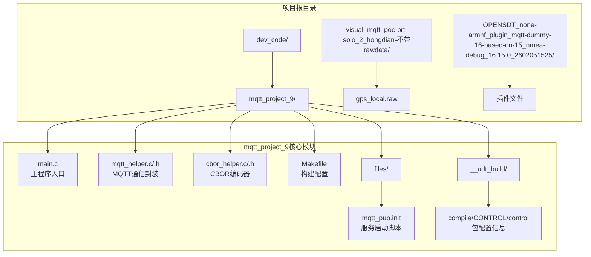
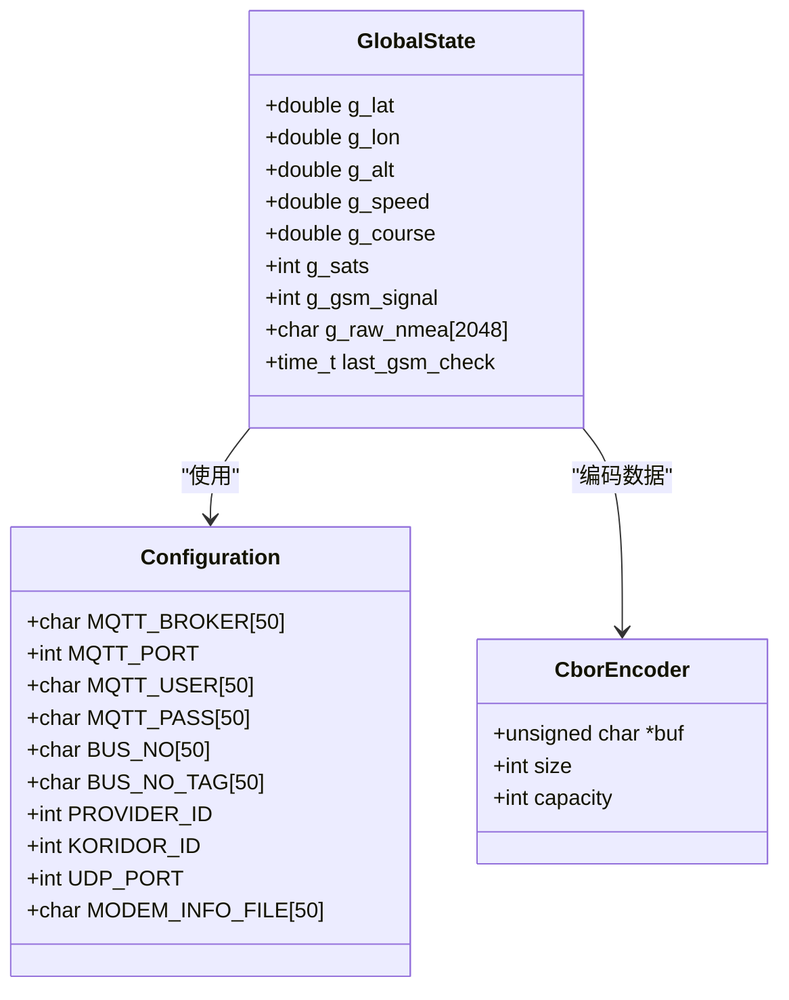
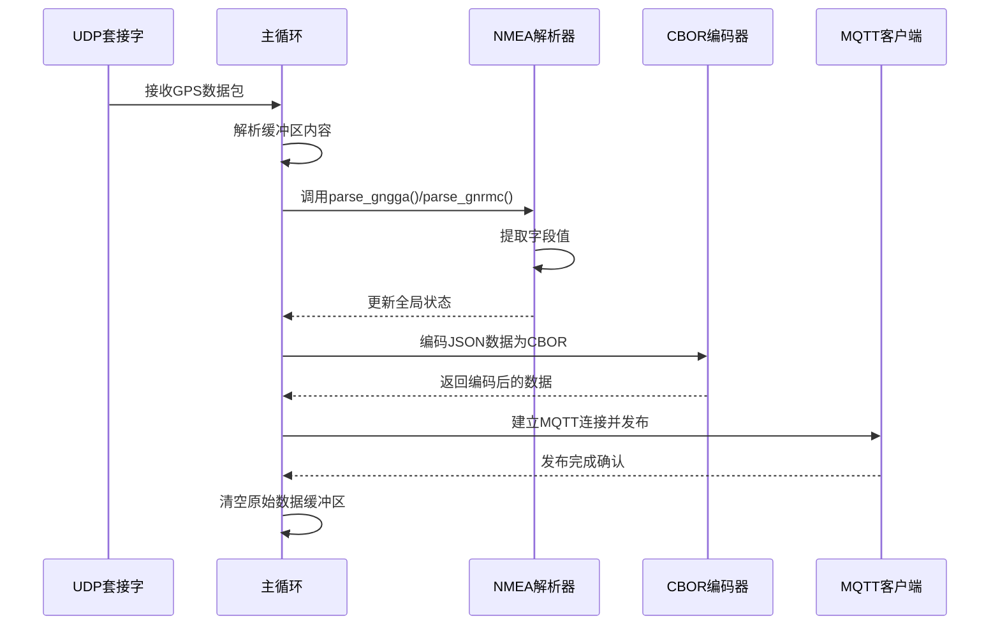
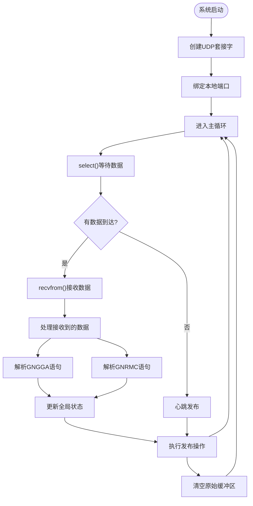
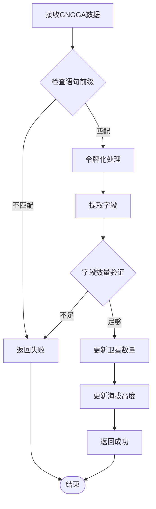
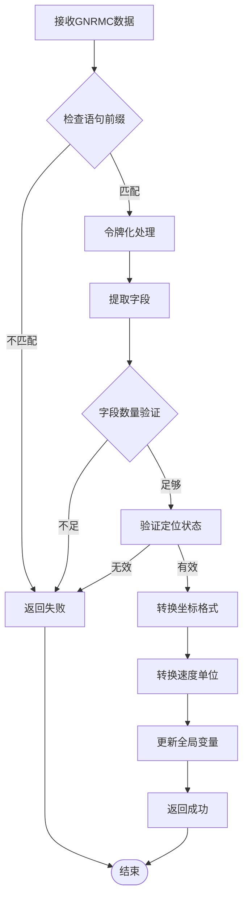
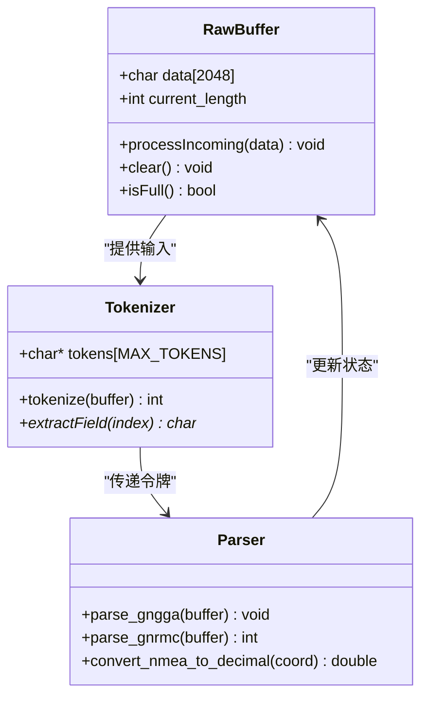
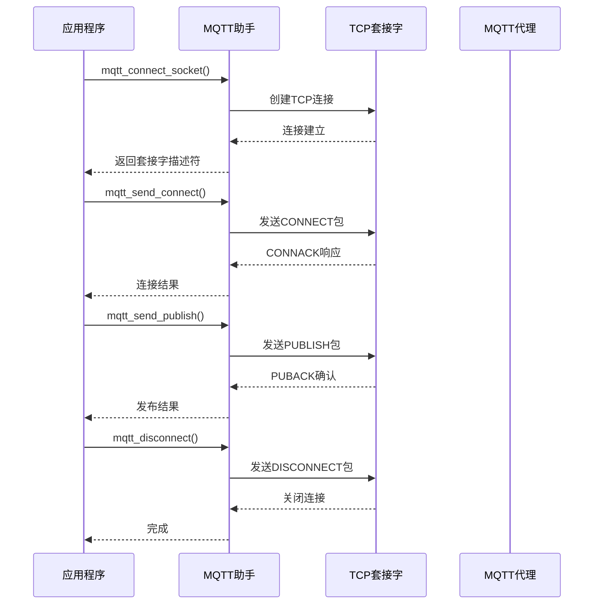
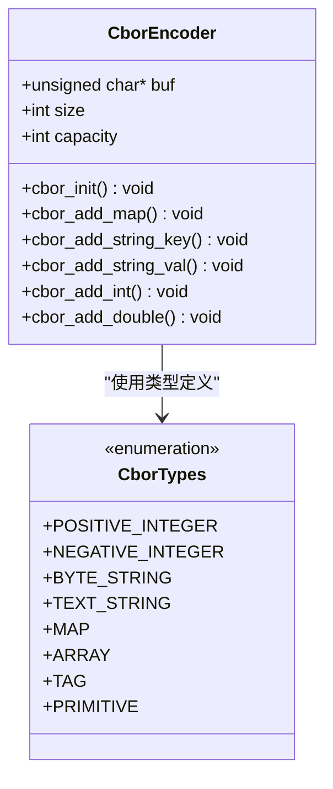
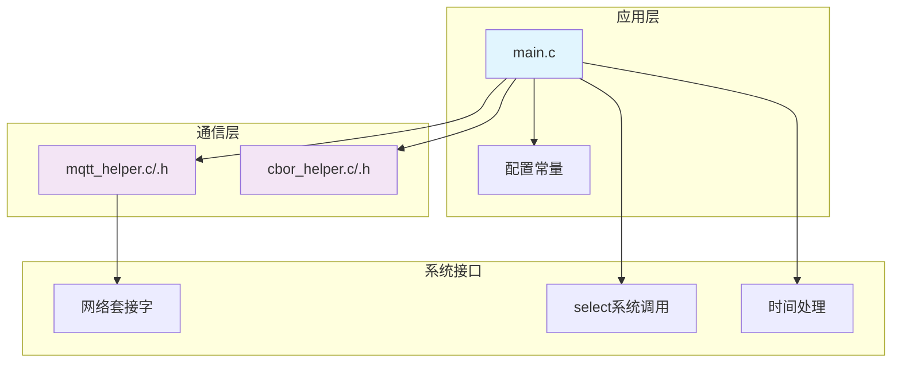

# 版本9基础功能

<cite>
**本文档引用的文件**
- [main.c](file://dev_code/dev_code/mqtt_project_9/main.c)
- [mqtt_helper.c](file://dev_code/dev_code/mqtt_project_9/mqtt_helper.c)
- [mqtt_helper.h](file://dev_code/dev_code/mqtt_project_9/mqtt_helper.h)
- [cbor_helper.c](file://dev_code/dev_code/mqtt_project_9/cbor_helper.c)
- [cbor_helper.h](file://dev_code/dev_code/mqtt_project_9/cbor_helper.h)
- [Makefile](file://dev_code/dev_code/mqtt_project_9/Makefile)
- [mqtt_pub.init](file://dev_code/dev_code/mqtt_project_9/files/mqtt_pub.init)
- [control](file://dev_code/dev_code/mqtt_project_9/__udt_build/compile/CONTROL/control)
- [Readme.md.txt](file://dev_code/dev_code/Readme.md.txt)
- [gps_local.raw](file://gps_local.raw)
</cite>

## 目录
1. [简介](#简介)
2. [项目结构](#项目结构)
3. [核心组件](#核心组件)
4. [架构概览](#架构概览)
5. [详细组件分析](#详细组件分析)
6. [依赖关系分析](#依赖关系分析)
7. [性能考虑](#性能考虑)
8. [故障排除指南](#故障排除指南)
9. [结论](#结论)
10. [附录](#附录)

## 简介

mqtt_project_9是基于Hongdian网关H6700开发的GPS数据采集与传输系统的基础版本。该版本实现了完整的GPS数据处理管道，包括NMEA语句解析、数据缓冲管理、坐标转换和MQTT通信等核心功能。系统通过UDP接收GPS数据，解析GNGGA和GNRMC语句，提取位置信息，并通过MQTT协议发送到消息代理服务器。

根据项目说明，这是经过测试的最后一个工作版本，在H6700网关上实现了连续1Hz的数据流输出（无跳过），尽管仍存在GPS精度和速度值异常等问题需要解决。

## 项目结构

该项目采用模块化设计，主要包含以下核心文件：



**图表来源**
- [main.c](file://dev_code/dev_code/mqtt_project_9/main.c#L1-L257)
- [mqtt_helper.c](file://dev_code/dev_code/mqtt_project_9/mqtt_helper.c#L1-L115)
- [cbor_helper.c](file://dev_code/dev_code/mqtt_project_9/cbor_helper.c#L1-L89)

**章节来源**
- [main.c](file://dev_code/dev_code/mqtt_project_9/main.c#L1-L257)
- [Makefile](file://dev_code/dev_code/mqtt_project_9/Makefile#L1-L23)

## 核心组件

### 主要数据结构

系统使用全局变量来维护GPS状态和配置信息：



**图表来源**
- [main.c](file://dev_code/dev_code/mqtt_project_9/main.c#L27-L41)
- [cbor_helper.h](file://dev_code/dev_code/mqtt_project_9/cbor_helper.h#L7-L12)

### 关键函数概览

系统的主要功能由以下核心函数实现：

- **GPS数据接收**: `main()`函数中的UDP套接字处理循环
- **NMEA语句解析**: `parse_gngga()`和`parse_gnrmc()`函数
- **坐标转换**: `convert_nmea_to_decimal()`函数
- **数据发布**: `perform_publish()`函数
- **MQTT通信**: `mqtt_helper.c`中的MQTT协议实现

**章节来源**
- [main.c](file://dev_code/dev_code/mqtt_project_9/main.c#L63-L177)

## 架构概览

系统采用事件驱动的架构模式，通过select()系统调用实现非阻塞I/O操作：



**图表来源**
- [main.c](file://dev_code/dev_code/mqtt_project_9/main.c#L179-L256)
- [mqtt_helper.c](file://dev_code/dev_code/mqtt_project_9/mqtt_helper.c#L38-L114)

## 详细组件分析

### GPS数据接收机制

系统通过UDP套接字接收GPS数据，采用非阻塞I/O模式：



**图表来源**
- [main.c](file://dev_code/dev_code/mqtt_project_9/main.c#L179-L256)

**章节来源**
- [main.c](file://dev_code/dev_code/mqtt_project_9/main.c#L179-L256)

### NMEA语句解析逻辑

系统支持GNGGA和GNRMC两种主要的NMEA语句类型：

#### GNGGA语句处理流程

GNGGA语句包含定位精度和海拔高度信息：



**图表来源**
- [main.c](file://dev_code/dev_code/mqtt_project_9/main.c#L86-L96)

#### GNRMC语句处理流程

GNRMC语句包含位置、速度和时间信息：



**图表来源**
- [main.c](file://dev_code/dev_code/mqtt_project_9/main.c#L98-L130)

**章节来源**
- [main.c](file://dev_code/dev_code/mqtt_project_9/main.c#L86-L130)

### 数据缓冲管理策略

系统实现了智能的缓冲区管理机制：



**图表来源**
- [main.c](file://dev_code/dev_code/mqtt_project_9/main.c#L36-L84)

**章节来源**
- [main.c](file://dev_code/dev_code/mqtt_project_9/main.c#L36-L84)

### MQTT通信实现

系统使用轻量级的MQTT客户端实现：



**图表来源**
- [mqtt_helper.c](file://dev_code/dev_code/mqtt_project_9/mqtt_helper.c#L38-L114)

**章节来源**
- [mqtt_helper.c](file://dev_code/dev_code/mqtt_project_9/mqtt_helper.c#L1-L115)
- [mqtt_helper.h](file://dev_code/dev_code/mqtt_project_9/mqtt_helper.h#L1-L13)

### CBOR数据编码

系统使用CBOR（Concise Binary Object Representation）进行高效的数据序列化：



**图表来源**
- [cbor_helper.c](file://dev_code/dev_code/mqtt_project_9/cbor_helper.c#L38-L89)
- [cbor_helper.h](file://dev_code/dev_code/mqtt_project_9/cbor_helper.h#L7-L27)

**章节来源**
- [cbor_helper.c](file://dev_code/dev_code/mqtt_project_9/cbor_helper.c#L1-L89)
- [cbor_helper.h](file://dev_code/dev_code/mqtt_project_9/cbor_helper.h#L1-L27)

## 依赖关系分析

系统采用模块化设计，各组件之间的依赖关系如下：



**图表来源**
- [main.c](file://dev_code/dev_code/mqtt_project_9/main.c#L1-L12)
- [mqtt_helper.c](file://dev_code/dev_code/mqtt_project_9/mqtt_helper.c#L1-L8)

**章节来源**
- [main.c](file://dev_code/dev_code/mqtt_project_9/main.c#L1-L12)
- [mqtt_helper.c](file://dev_code/dev_code/mqtt_project_9/mqtt_helper.c#L1-L8)

## 性能考虑

### 内存管理优化

系统在内存使用方面采用了多项优化措施：

1. **固定大小缓冲区**: 使用2048字节的固定缓冲区存储原始NMEA数据
2. **增量增长策略**: 当缓冲区接近满载时，系统会重置缓冲区而不是动态扩展
3. **零拷贝设计**: CBOR编码器直接写入目标缓冲区，避免额外的内存分配

### I/O性能优化

1. **非阻塞I/O**: 使用select()实现非阻塞等待，超时时间为150ms
2. **批量处理**: 同一循环中处理多个NMEA语句
3. **心跳机制**: 在没有新数据时定期发布，确保数据传输的连续性

### 网络性能优化

1. **连接复用**: 每次发布都重新建立TCP连接，简化了连接管理
2. **二进制传输**: 使用CBOR格式减少数据体积
3. **错误处理**: 实现了完整的错误检测和恢复机制

## 故障排除指南

### 常见问题及解决方案

#### GPS数据接收问题

**问题**: 无法接收到GPS数据
**可能原因**:
- UDP端口未正确绑定
- 网络连接中断
- GPS设备未正确配置

**解决方案**:
1. 检查UDP端口配置是否正确
2. 验证网络连接状态
3. 确认GPS设备的NMEA输出设置

#### NMEA解析失败

**问题**: GNGGA或GNRMC语句解析失败
**可能原因**:
- 语句格式不符合预期
- 字段数量不足
- 定位状态无效

**解决方案**:
1. 检查NMEA语句的完整性
2. 验证字段分隔符的正确性
3. 确认定位状态为"A"（有效）

#### MQTT发布失败

**问题**: 无法通过MQTT发布数据
**可能原因**:
- MQTT代理连接失败
- 认证信息错误
- 网络连接中断

**解决方案**:
1. 验证MQTT代理的可达性
2. 检查用户名和密码配置
3. 确认网络连接稳定

**章节来源**
- [main.c](file://dev_code/dev_code/mqtt_project_9/main.c#L179-L256)
- [mqtt_helper.c](file://dev_code/dev_code/mqtt_project_9/mqtt_helper.c#L38-L114)

## 结论

mqtt_project_9版本代表了GPS数据处理系统的完整基础实现，具有以下特点：

### 技术优势

1. **模块化设计**: 清晰的组件分离，便于维护和扩展
2. **高效处理**: 采用事件驱动架构，实现低延迟的数据处理
3. **可靠通信**: 完整的MQTT协议实现，支持断线重连
4. **内存优化**: 固定大小缓冲区设计，避免内存泄漏

### 功能完整性

系统实现了GPS数据处理的完整生命周期：
- 数据接收与缓冲管理
- NMEA语句解析与验证
- 坐标转换与数据标准化
- CBOR编码与MQTT发布

### 改进建议

基于项目说明中提到的问题，建议后续版本可以考虑：
1. 改进GPS精度处理算法
2. 优化速度值异常检测机制
3. 增强数据缓存管理策略
4. 实现更完善的错误处理机制

## 附录

### 使用说明

#### 编译安装

```bash
# 进入项目目录
cd dev_code/dev_code/mqtt_project_9

# 编译项目
make

# 安装到目标系统
make install
```

#### 配置参数

系统的主要配置参数位于main.c文件的顶部区域，包括：
- MQTT服务器地址和端口
- 用户名和密码认证
- 车辆标识和线路信息
- UDP监听端口
- 模块信息文件路径

#### 服务管理

系统通过OpenWrt的procd框架进行服务管理，启动脚本位于`files/mqtt_pub.init`文件中。

**章节来源**
- [Makefile](file://dev_code/dev_code/mqtt_project_9/Makefile#L14-L22)
- [mqtt_pub.init](file://dev_code/dev_code/mqtt_project_9/files/mqtt_pub.init#L1-L14)