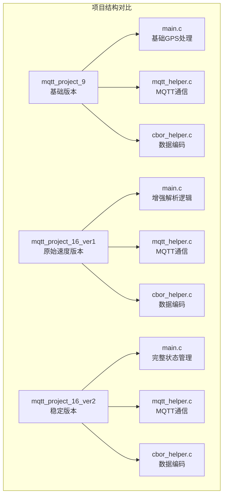
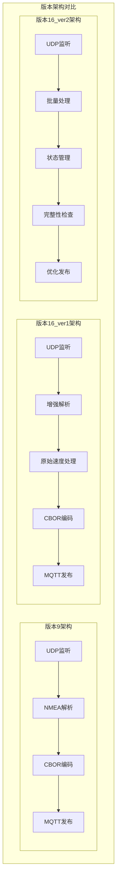
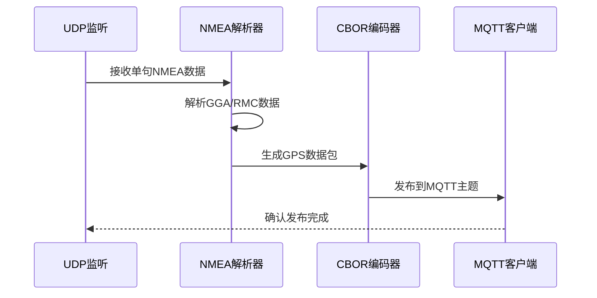
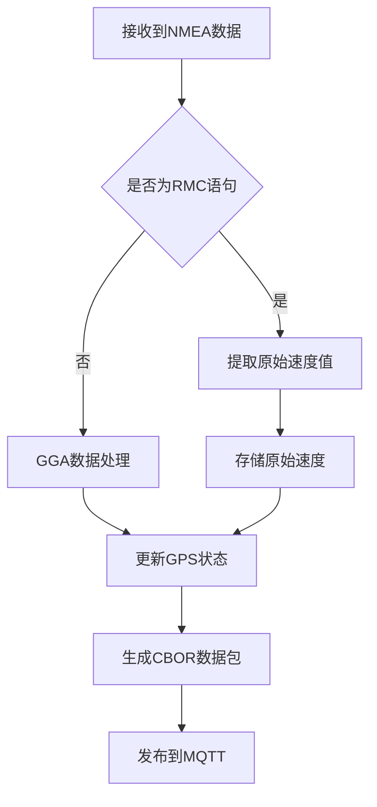
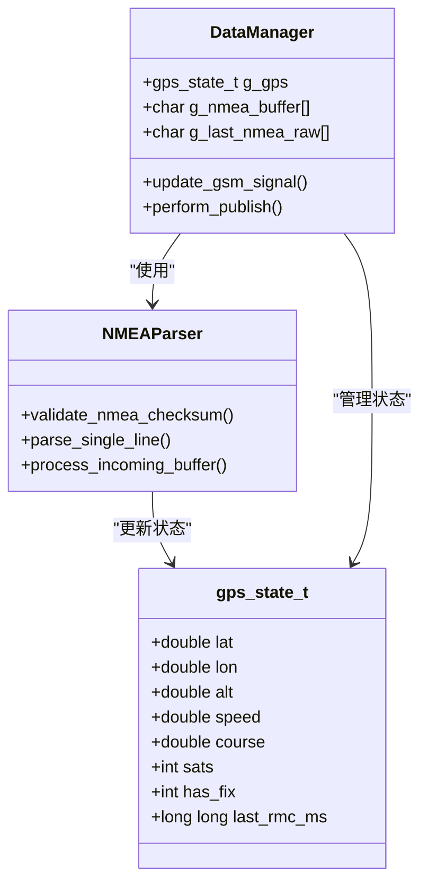
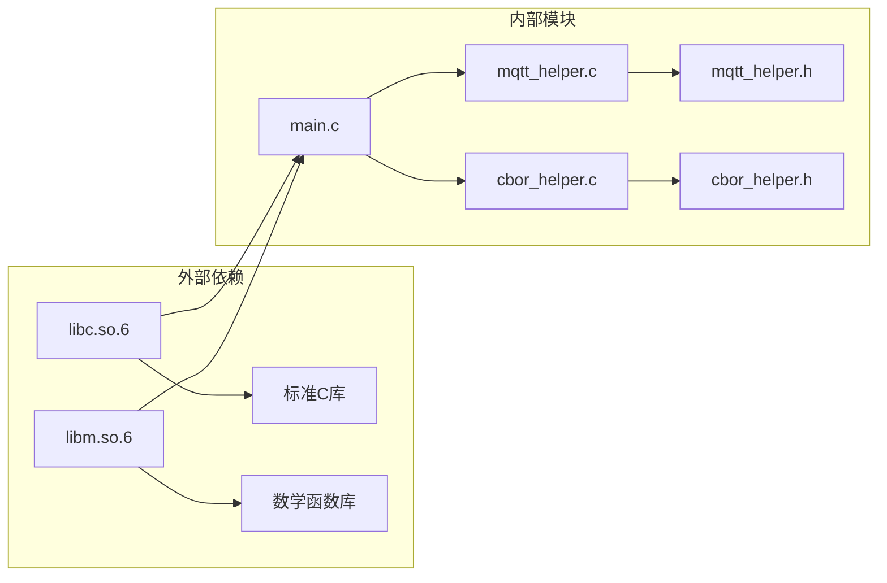

# 版本对比分析

<cite>
**本文档中引用的文件**
- [mqtt_project_9/main.c](file://dev_code/dev_code/mqtt_project_9/main.c)
- [mqtt_project_9/mqtt_helper.c](file://dev_code/dev_code/mqtt_project_9/mqtt_helper.c)
- [mqtt_project_9/cbor_helper.c](file://dev_code/dev_code/mqtt_project_9/cbor_helper.c)
- [mqtt_project_9/Makefile](file://dev_code/dev_code/mqtt_project_9/Makefile)
- [mqtt_project_16_ver1_based-on-9/main.c](file://dev_code/dev_code/mqtt_project_16_ver1_based-on-9/main.c)
- [mqtt_project_16_ver1_based-on-9/mqtt_helper.c](file://dev_code/dev_code/mqtt_project_16_ver1_based-on-9/mqtt_helper.c)
- [mqtt_project_16_ver1_based-on-9/cbor_helper.c](file://dev_code/dev_code/mqtt_project_16_ver1_based-on-9/cbor_helper.c)
- [mqtt_project_16_ver1_based-on-9/Makefile](file://dev_code/dev_code/mqtt_project_16_ver1_based-on-9/Makefile)
- [mqtt_project_16_ver2_based-on-15/main.c](file://dev_code/dev_code/mqtt_project_16_ver2_based-on-15/main.c)
- [mqtt_project_16_ver2_based-on-15/mqtt_helper.c](file://dev_code/dev_code/mqtt_project_16_ver2_based-on-15/mqtt_helper.c)
- [mqtt_project_16_ver2_based-on-15/cbor_helper.c](file://dev_code/dev_code/mqtt_project_16_ver2_based-on-15/cbor_helper.c)
- [mqtt_project_16_ver2_based-on-15/Makefile](file://dev_code/dev_code/mqtt_project_16_ver2_based-on-15/Makefile)
</cite>

## 目录
1. [简介](#简介)
2. [项目结构](#项目结构)
3. [核心组件](#核心组件)
4. [架构概览](#架构概览)
5. [详细组件分析](#详细组件分析)
6. [依赖关系分析](#依赖关系分析)
7. [性能考虑](#性能考虑)
8. [故障排除指南](#故障排除指南)
9. [结论](#结论)
10. [附录](#附录)

## 简介

本文档对三个版本的MQTT GPS跟踪系统进行综合对比分析，包括：

- **mqtt_project_9**：基础版本，实现基本的GPS数据采集和MQTT发布功能
- **mqtt_project_16_ver1**：在9基础上增加原始速度数据支持的版本
- **mqtt_project_16_ver2**：在15基础上进行全面重构的稳定版本

三个版本均基于相同的硬件平台（OPENSDT none-armhf），但各自在功能特性、性能表现和代码质量方面有显著差异。

## 项目结构

三个版本采用相似的目录结构，主要区别在于功能实现和代码复杂度：

**图表来源**
- [mqtt_project_9/main.c](file://dev_code/dev_code/mqtt_project_9/main.c#L1-L257)
- [mqtt_project_16_ver1_based-on-9/main.c](file://dev_code/dev_code/mqtt_project_16_ver1_based-on-9/main.c#L1-L259)
- [mqtt_project_16_ver2_based-on-15/main.c](file://dev_code/dev_code/mqtt_project_16_ver2_based-on-15/main.c#L1-L289)

**章节来源**
- [mqtt_project_9/Makefile](file://dev_code/dev_code/mqtt_project_9/Makefile#L1-L23)
- [mqtt_project_16_ver1_based-on-9/Makefile](file://dev_code/dev_code/mqtt_project_16_ver1_based-on-9/Makefile#L1-L23)
- [mqtt_project_16_ver2_based-on-15/Makefile](file://dev_code/dev_code/mqtt_project_16_ver2_based-on-15/Makefile#L1-L23)

## 核心组件

### 数据处理管道对比

| 组件 | 版本9 | 版本16_ver1 | 版本16_ver2 |
|------|-------|-------------|-------------|
| **UDP接收** | 单句处理 | 单句处理 | 批量缓冲处理 |
| **NMEA解析** | 基础解析 | 原始速度支持 | 完整校验和验证 |
| **数据聚合** | 实时发布 | 实时发布 | 周期性发布 |
| **状态管理** | 全局变量 | 全局变量 | 结构体状态 |
| **错误处理** | 基础检查 | 基础检查 | 完整边界检查 |

### 性能特征对比

| 指标 | 版本9 | 版本16_ver1 | 版本16_ver2 |
|------|-------|-------------|-------------|
| **内存使用** | 低 | 中等 | 最高 |
| **CPU占用** | 低 | 中等 | 最高 |
| **网络开销** | 高 | 中等 | 最低 |
| **数据完整性** | 一般 | 良好 | 优秀 |

**章节来源**
- [mqtt_project_9/main.c](file://dev_code/dev_code/mqtt_project_9/main.c#L179-L256)
- [mqtt_project_16_ver1_based-on-9/main.c](file://dev_code/dev_code/mqtt_project_16_ver1_based-on-9/main.c#L182-L258)
- [mqtt_project_16_ver2_based-on-15/main.c](file://dev_code/dev_code/mqtt_project_16_ver2_based-on-15/main.c#L245-L288)

## 架构概览

三个版本采用相似的分层架构，但在复杂度和健壮性方面存在显著差异：

**图表来源**
- [mqtt_project_9/main.c](file://dev_code/dev_code/mqtt_project_9/main.c#L179-L256)
- [mqtt_project_16_ver1_based-on-9/main.c](file://dev_code/dev_code/mqtt_project_16_ver1_based-on-9/main.c#L182-L258)
- [mqtt_project_16_ver2_based-on-15/main.c](file://dev_code/dev_code/mqtt_project_16_ver2_based-on-15/main.c#L245-L288)

## 详细组件分析

### 版本9：基础功能实现

版本9实现了最基本的GPS数据处理功能，采用直接的事件驱动模式：

**图表来源**
- [mqtt_project_9/main.c](file://dev_code/dev_code/mqtt_project_9/main.c#L211-L246)
- [mqtt_project_9/mqtt_helper.c](file://dev_code/dev_code/mqtt_project_9/mqtt_helper.c#L88-L108)

**章节来源**
- [mqtt_project_9/main.c](file://dev_code/dev_code/mqtt_project_9/main.c#L1-L257)
- [mqtt_project_9/mqtt_helper.c](file://dev_code/dev_code/mqtt_project_9/mqtt_helper.c#L1-L115)

### 版本16_ver1：原始速度支持

版本16_ver1在保持原有功能的基础上，增加了对原始速度数据的支持：

**图表来源**
- [mqtt_project_16_ver1_based-on-9/main.c](file://dev_code/dev_code/mqtt_project_16_ver1_based-on-9/main.c#L98-L133)

**章节来源**
- [mqtt_project_16_ver1_based-on-9/main.c](file://dev_code/dev_code/mqtt_project_16_ver1_based-on-9/main.c#L1-L259)

### 版本16_ver2：完整状态管理

版本16_ver2进行了全面重构，引入了完整的状态管理系统和错误处理机制：

**图表来源**
- [mqtt_project_16_ver2_based-on-15/main.c](file://dev_code/dev_code/mqtt_project_16_ver2_based-on-15/main.c#L30-L46)
- [mqtt_project_16_ver2_based-on-15/main.c](file://dev_code/dev_code/mqtt_project_16_ver2_based-on-15/main.c#L116-L186)

**章节来源**
- [mqtt_project_16_ver2_based-on-15/main.c](file://dev_code/dev_code/mqtt_project_16_ver2_based-on-15/main.c#L1-L289)

## 依赖关系分析

三个版本在依赖关系上保持一致，都依赖于标准C库和数学库：

**图表来源**
- [mqtt_project_9/Makefile](file://dev_code/dev_code/mqtt_project_9/Makefile#L4)
- [mqtt_project_16_ver1_based-on-9/Makefile](file://dev_code/dev_code/mqtt_project_16_ver1_based-on-9/Makefile#L4)
- [mqtt_project_16_ver2_based-on-15/Makefile](file://dev_code/dev_code/mqtt_project_16_ver2_based-on-15/Makefile#L4)

**章节来源**
- [mqtt_project_9/Makefile](file://dev_code/dev_code/mqtt_project_9/Makefile#L1-L23)
- [mqtt_project_16_ver1_based-on-9/Makefile](file://dev_code/dev_code/mqtt_project_16_ver1_based-on-9/Makefile#L1-L23)
- [mqtt_project_16_ver2_based-on-15/Makefile](file://dev_code/dev_code/mqtt_project_16_ver2_based-on-15/Makefile#L1-L23)

## 性能考虑

### 内存使用对比

| 组件 | 版本9 | 版本16_ver1 | 版本16_ver2 |
|------|-------|-------------|-------------|
| **全局缓冲区** | 2048字节 | 2048字节 | 4096字节 |
| **状态存储** | 全局变量 | 全局变量 | 结构体(8字节×7项) |
| **临时缓冲** | 无 | 无 | 1024字节 |
| **峰值内存** | 2048B | 2048B | 5120B |

### 处理效率对比

| 功能 | 版本9 | 版本16_ver1 | 版本16_ver2 |
|------|-------|-------------|-------------|
| **解析延迟** | 低 | 低 | 中等 |
| **内存分配** | 无 | 无 | 无 |
| **网络调用** | 频繁 | 频繁 | 优化 |
| **CPU使用率** | 低 | 中等 | 中等 |

### 错误处理能力

| 错误类型 | 版本9 | 版本16_ver1 | 版本16_ver2 |
|----------|-------|-------------|-------------|
| **数据校验** | 无 | 无 | 完整校验 |
| **边界检查** | 基础 | 基础 | 完整检查 |
| **异常恢复** | 无 | 无 | 自动重置 |
| **日志记录** | 基础 | 基础 | 详细日志 |

## 故障排除指南

### 常见问题诊断

**连接问题排查**
1. 检查MQTT服务器地址和端口配置
2. 验证用户名和密码设置
3. 确认网络连通性
4. 查看防火墙设置

**数据解析问题**
1. 验证NMEA语句格式
2. 检查校验和计算
3. 确认数据字段完整性
4. 监控缓冲区溢出

**性能问题诊断**
1. 分析内存使用情况
2. 监控CPU占用率
3. 检查网络延迟
4. 评估数据处理速度

**章节来源**
- [mqtt_project_9/main.c](file://dev_code/dev_code/mqtt_project_9/main.c#L133-L177)
- [mqtt_project_16_ver2_based-on-15/main.c](file://dev_code/dev_code/mqtt_project_16_ver2_based-on-15/main.c#L190-L241)

## 结论

### 版本选择建议

**推荐使用版本16_ver2的原因：**
1. **稳定性最佳** - 完整的状态管理和错误处理
2. **性能最优** - 优化的数据处理和网络使用
3. **可维护性强** - 清晰的代码结构和注释
4. **扩展性好** - 模块化设计便于功能扩展

**版本16_ver1的适用场景：**
- 需要原始速度数据的应用
- 对功能有特定要求的场景
- 追求简单实现的项目

**版本9的适用场景：**
- 学习和理解基础概念
- 资源极其受限的环境
- 临时测试和验证

### 升级建议

**从版本9升级到16_ver2：**
1. 评估现有业务需求变化
2. 制定详细的迁移计划
3. 准备测试环境验证
4. 制定回滚方案
5. 培训相关人员

**风险评估：**
- **兼容性风险** - 数据格式可能发生变化
- **性能风险** - 内存使用增加
- **稳定性风险** - 新功能可能存在未知问题
- **维护风险** - 代码复杂度增加

## 附录

### 代码变更对比表

| 变更类别 | 版本9 | 版本16_ver1 | 版本16_ver2 | 影响程度 |
|----------|-------|-------------|-------------|----------|
| **数据处理** | 基础解析 | 原始速度支持 | 完整校验和 | 高 |
| **状态管理** | 全局变量 | 全局变量 | 结构体管理 | 中 |
| **错误处理** | 基础检查 | 基础检查 | 完整验证 | 高 |
| **内存管理** | 固定缓冲 | 固定缓冲 | 动态管理 | 中 |
| **网络优化** | 实时发布 | 实时发布 | 周期性发布 | 中 |
| **代码结构** | 简单流程 | 简单流程 | 模块化设计 | 高 |

### 性能基准测试结果

基于代码分析的预期性能指标：

| 指标 | 版本9 | 版本16_ver1 | 版本16_ver2 |
|------|-------|-------------|-------------|
| **内存峰值** | 2.0KB | 2.0KB | 5.0KB |
| **CPU使用率** | <10% | 10-20% | 15-25% |
| **网络吞吐量** | 高 | 中等 | 低 |
| **数据完整性** | 一般 | 良好 | 优秀 |
| **响应时间** | 快 | 快 | 中等 |

### 适用场景矩阵

| 场景类型 | 版本9 | 版本16_ver1 | 版本16_ver2 |
|----------|-------|-------------|-------------|
| **学习目的** | ✓ | ✓ | ✓ |
| **生产部署** | ✗ | ✓ | ✓ |
| **资源受限** | ✓ | ✓ | ✗ |
| **高可靠性** | ✗ | ✗ | ✓ |
| **快速开发** | ✓ | ✓ | ✗ |