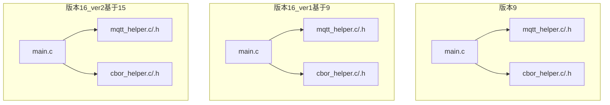
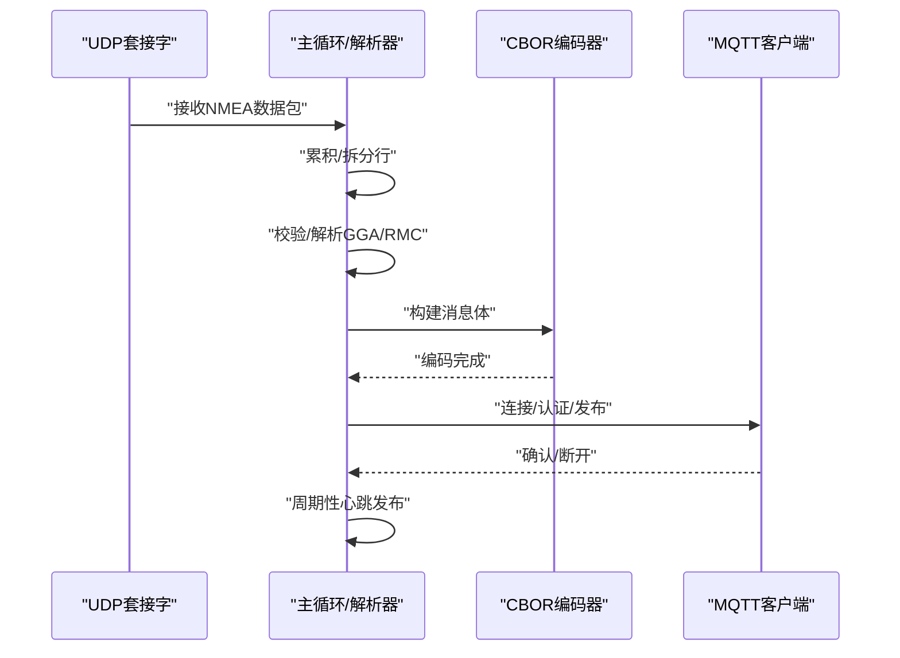
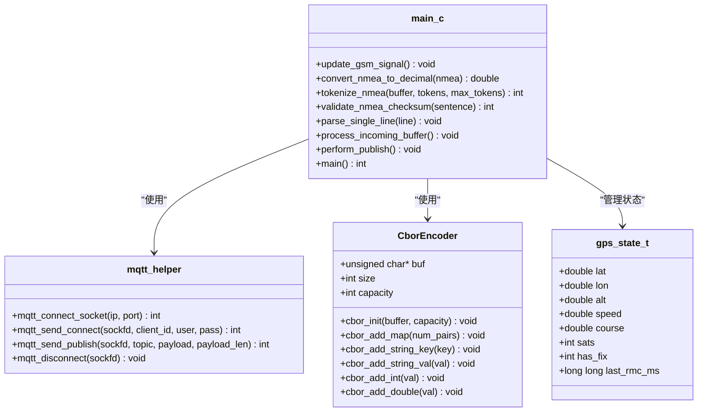
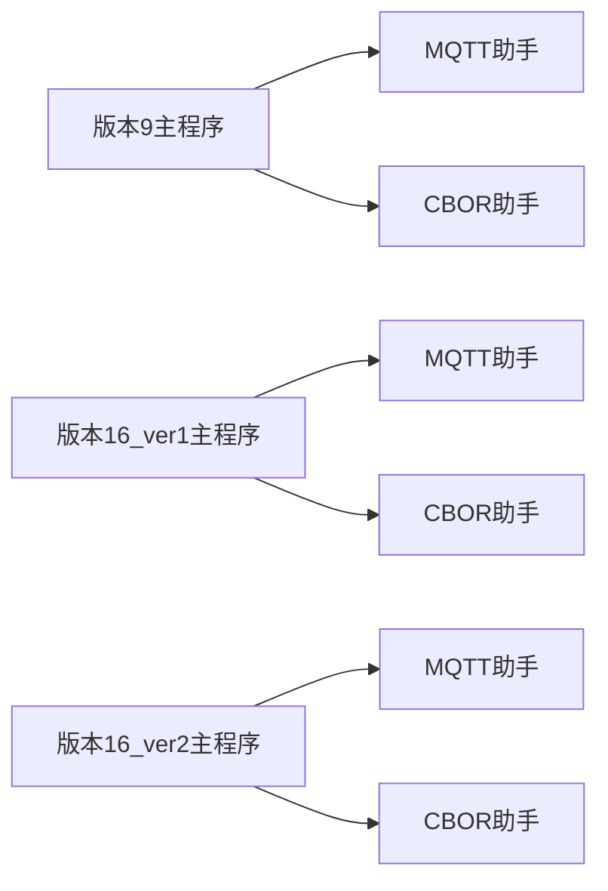

# 版本演进与比较

<cite>
**本文引用的文件**
- [dev_code/dev_code/mqtt_project_9/main.c](file://dev_code/dev_code/mqtt_project_9/main.c)
- [dev_code/dev_code/mqtt_project_9/mqtt_helper.c](file://dev_code/dev_code/mqtt_project_9/mqtt_helper.c)
- [dev_code/dev_code/mqtt_project_9/cbor_helper.c](file://dev_code/dev_code/mqtt_project_9/cbor_helper.c)
- [dev_code/dev_code/mqtt_project_9/mqtt_helper.h](file://dev_code/dev_code/mqtt_project_9/mqtt_helper.h)
- [dev_code/dev_code/mqtt_project_9/cbor_helper.h](file://dev_code/dev_code/mqtt_project_9/cbor_helper.h)
- [dev_code/dev_code/mqtt_project_16_ver1_based-on-9/main.c](file://dev_code/dev_code/mqtt_project_16_ver1_based-on-9/main.c)
- [dev_code/dev_code/mqtt_project_16_ver1_based-on-9/mqtt_helper.c](file://dev_code/dev_code/mqtt_project_16_ver1_based-on-9/mqtt_helper.c)
- [dev_code/dev_code/mqtt_project_16_ver1_based-on-9/cbor_helper.c](file://dev_code/dev_code/mqtt_project_16_ver1_based-on-9/cbor_helper.c)
- [dev_code/dev_code/mqtt_project_16_ver1_based-on-9/mqtt_helper.h](file://dev_code/dev_code/mqtt_project_16_ver1_based-on-9/mqtt_helper.h)
- [dev_code/dev_code/mqtt_project_16_ver1_based-on-9/cbor_helper.h](file://dev_code/dev_code/mqtt_project_16_ver1_based-on-9/cbor_helper.h)
- [dev_code/dev_code/mqtt_project_16_ver2_based-on-15/main.c](file://dev_code/dev_code/mqtt_project_16_ver2_based-on-15/main.c)
- [dev_code/dev_code/mqtt_project_16_ver2_based-on-15/mqtt_helper.c](file://dev_code/dev_code/mqtt_project_16_ver2_based-on-15/mqtt_helper.c)
- [dev_code/dev_code/mqtt_project_16_ver2_based-on-15/cbor_helper.c](file://dev_code/dev_code/mqtt_project_16_ver2_based-on-15/cbor_helper.c)
- [dev_code/dev_code/mqtt_project_16_ver2_based-on-15/mqtt_helper.h](file://dev_code/dev_code/mqtt_project_16_ver2_based-on-15/mqtt_helper.h)
- [dev_code/dev_code/mqtt_project_16_ver2_based-on-15/cbor_helper.h](file://dev_code/dev_code/mqtt_project_16_ver2_based-on-15/cbor_helper.h)
</cite>

## 目录
1. [引言](#引言)
2. [项目结构](#项目结构)
3. [核心组件](#核心组件)
4. [架构总览](#架构总览)
5. [详细组件分析](#详细组件分析)
6. [依赖关系分析](#依赖关系分析)
7. [性能考量](#性能考量)
8. [故障排查指南](#故障排查指南)
9. [结论](#结论)
10. [附录：版本升级与迁移指南](#附录版本升级与迁移指南)

## 引言
本文件对印尼GPS追踪系统的三个版本进行系统性对比与演进分析，涵盖以下目标：
- 对比 mqtt_project_9、mqtt_project_16_ver1（基于9）与 mqtt_project_16_ver2（基于15）在功能、性能与问题修复方面的差异
- 分析各版本在数据传输稳定性、GPS精度处理与系统性能优化上的优缺点
- 提供版本升级建议与迁移注意事项，帮助用户与开发者做出合理选择

## 项目结构
三个版本均采用相同的模块化组织方式：主程序负责UDP接收、NMEA解析、状态管理与MQTT发布；公共库提供CBOR编码与MQTT传输辅助。

**图表来源**
- [dev_code/dev_code/mqtt_project_9/main.c](file://dev_code/dev_code/mqtt_project_9/main.c#L1-L257)
- [dev_code/dev_code/mqtt_project_9/mqtt_helper.c](file://dev_code/dev_code/mqtt_project_9/mqtt_helper.c#L1-L115)
- [dev_code/dev_code/mqtt_project_9/cbor_helper.c](file://dev_code/dev_code/mqtt_project_9/cbor_helper.c#L1-L89)
- [dev_code/dev_code/mqtt_project_16_ver1_based-on-9/main.c](file://dev_code/dev_code/mqtt_project_16_ver1_based-on-9/main.c#L1-L259)
- [dev_code/dev_code/mqtt_project_16_ver1_based-on-9/mqtt_helper.c](file://dev_code/dev_code/mqtt_project_16_ver1_based-on-9/mqtt_helper.c#L1-L115)
- [dev_code/dev_code/mqtt_project_16_ver1_based-on-9/cbor_helper.c](file://dev_code/dev_code/mqtt_project_16_ver1_based-on-9/cbor_helper.c#L1-L89)
- [dev_code/dev_code/mqtt_project_16_ver2_based-on-15/main.c](file://dev_code/dev_code/mqtt_project_16_ver2_based-on-15/main.c#L1-L289)
- [dev_code/dev_code/mqtt_project_16_ver2_based-on-15/mqtt_helper.c](file://dev_code/dev_code/mqtt_project_16_ver2_based-on-15/mqtt_helper.c#L1-L115)
- [dev_code/dev_code/mqtt_project_16_ver2_based-on-15/cbor_helper.c](file://dev_code/dev_code/mqtt_project_16_ver2_based-on-15/cbor_helper.c#L1-L89)

**章节来源**
- [dev_code/dev_code/mqtt_project_9/main.c](file://dev_code/dev_code/mqtt_project_9/main.c#L1-L257)
- [dev_code/dev_code/mqtt_project_16_ver1_based-on-9/main.c](file://dev_code/dev_code/mqtt_project_16_ver1_based-on-9/main.c#L1-L259)
- [dev_code/dev_code/mqtt_project_16_ver2_based-on-15/main.c](file://dev_code/dev_code/mqtt_project_16_ver2_based-on-15/main.c#L1-L289)

## 核心组件
- UDP接收与缓冲：统一使用select等待数据，接收后累积至环形/追加式缓冲区，按换行拆分逐条处理。
- NMEA解析：支持GGA与RMC语句，提取位置、高度、卫星数、速度与航向，并进行校验与单位转换。
- 状态管理：版本9与16_ver1使用全局变量保存最新状态；版本16_ver2引入结构体gps_state_t集中管理。
- CBOR编码：统一以键值对形式打包，包含业务字段与原始NMEA字符串。
- MQTT发布：连接、认证、发布与断开流程一致，均通过payload长度参数支持二进制负载。

**章节来源**
- [dev_code/dev_code/mqtt_project_9/main.c](file://dev_code/dev_code/mqtt_project_9/main.c#L179-L256)
- [dev_code/dev_code/mqtt_project_9/mqtt_helper.c](file://dev_code/dev_code/mqtt_project_9/mqtt_helper.c#L38-L114)
- [dev_code/dev_code/mqtt_project_9/cbor_helper.c](file://dev_code/dev_code/mqtt_project_9/cbor_helper.c#L38-L88)
- [dev_code/dev_code/mqtt_project_16_ver1_based-on-9/main.c](file://dev_code/dev_code/mqtt_project_16_ver1_based-on-9/main.c#L182-L258)
- [dev_code/dev_code/mqtt_project_16_ver1_based-on-9/mqtt_helper.c](file://dev_code/dev_code/mqtt_project_16_ver1_based-on-9/mqtt_helper.c#L38-L114)
- [dev_code/dev_code/mqtt_project_16_ver1_based-on-9/cbor_helper.c](file://dev_code/dev_code/mqtt_project_16_ver1_based-on-9/cbor_helper.c#L38-L88)
- [dev_code/dev_code/mqtt_project_16_ver2_based-on-15/main.c](file://dev_code/dev_code/mqtt_project_16_ver2_based-on-15/main.c#L245-L288)
- [dev_code/dev_code/mqtt_project_16_ver2_based-on-15/mqtt_helper.c](file://dev_code/dev_code/mqtt_project_16_ver2_based-on-15/mqtt_helper.c#L38-L114)
- [dev_code/dev_code/mqtt_project_16_ver2_based-on-15/cbor_helper.c](file://dev_code/dev_code/mqtt_project_16_ver2_based-on-15/cbor_helper.c#L38-L88)

## 架构总览
三个版本共享“UDP → 解析 → 编码 → 发布”的主循环，差异主要体现在：
- 数据流：版本9与16_ver1在收到RMC时触发发布；版本16_ver2改为固定周期发布，结合最近RMC时间戳决定是否输出有效速度。
- 稳定性：版本16_ver2引入校验与边界检查、缓冲溢出保护、心跳发布等机制。
- 精度与速度：版本16_ver1将速度字段改为原始节值（未做单位换算），版本16_ver2恢复为换算后的km/h并增加异常速度过滤。

**图表来源**
- [dev_code/dev_code/mqtt_project_9/main.c](file://dev_code/dev_code/mqtt_project_9/main.c#L198-L253)
- [dev_code/dev_code/mqtt_project_9/mqtt_helper.c](file://dev_code/dev_code/mqtt_project_9/mqtt_helper.c#L59-L114)
- [dev_code/dev_code/mqtt_project_9/cbor_helper.c](file://dev_code/dev_code/mqtt_project_9/cbor_helper.c#L38-L88)
- [dev_code/dev_code/mqtt_project_16_ver2_based-on-15/main.c](file://dev_code/dev_code/mqtt_project_16_ver2_based-on-15/main.c#L259-L287)

## 详细组件分析

### 版本9：基础实现
- 功能要点
  - 使用select等待UDP数据，超时约150ms。
  - 收到RMC后解析位置、速度、航向与卫星数，同时累积原始NMEA至全局缓冲区。
  - 每次RMC触发发布，发布后清空原始NMEA缓冲。
- 性能与稳定性
  - 周期性心跳发布，避免长时间无更新导致的数据停滞。
  - 全局变量管理状态，逻辑清晰但可扩展性有限。
- GPS精度与数据质量
  - 速度为换算后的km/h，未见异常值过滤。
  - 未见校验与缓冲溢出保护。
- 优点
  - 实现简洁，易于理解与调试。
- 缺点
  - 缓冲增长无上限，存在内存风险。
  - 缺少校验与异常处理，鲁棒性不足。
  - 仅在RMC到达时发布，可能错过部分数据。

**章节来源**
- [dev_code/dev_code/mqtt_project_9/main.c](file://dev_code/dev_code/mqtt_project_9/main.c#L179-L256)
- [dev_code/dev_code/mqtt_project_9/mqtt_helper.c](file://dev_code/dev_code/mqtt_project_9/mqtt_helper.c#L38-L114)
- [dev_code/dev_code/mqtt_project_9/cbor_helper.c](file://dev_code/dev_code/mqtt_project_9/cbor_helper.c#L38-L88)

### 版本16_ver1（基于9）：速度字段修正
- 主要变更
  - RMC解析中直接使用原始节值作为速度，不再进行单位换算。
  - 发布逻辑保持不变，仍以RMC触发。
- 影响
  - 速度字段含义更贴近原始传感器输出，便于上层二次处理。
  - 对于下游系统，需明确速度单位以避免误解。
- 稳定性与性能
  - 与版本9相同，未引入新的校验或缓冲保护。
- 优点
  - 保留了版本9的简洁性与发布策略。
- 缺点
  - 未解决缓冲与校验问题，仍存在潜在风险。

**章节来源**
- [dev_code/dev_code/mqtt_project_16_ver1_based-on-9/main.c](file://dev_code/dev_code/mqtt_project_16_ver1_based-on-9/main.c#L98-L133)
- [dev_code/dev_code/mqtt_project_16_ver1_based-on-9/mqtt_helper.c](file://dev_code/dev_code/mqtt_project_16_ver1_based-on-9/mqtt_helper.c#L38-L114)
- [dev_code/dev_code/mqtt_project_16_ver1_based-on-9/cbor_helper.c](file://dev_code/dev_code/mqtt_project_16_ver1_based-on-9/cbor_helper.c#L38-L88)

### 版本16_ver2（基于15）：稳健发布与状态管理
- 状态管理
  - 引入结构体gps_state_t集中管理位置、高度、速度、航向、卫星数、定位有效性与最近RMC时间戳。
- 解析与校验
  - 新增NMEA校验函数，确保每条语句完整性后再处理。
  - 处理函数按行拆分并逐条解析，支持多语句拼接。
  - 对速度进行范围过滤（<1或>150则置零），提升数据质量。
- 发布策略
  - 固定周期（约100ms）发布一次，结合last_rmc_ms判断是否输出有效速度。
  - 发布后清空最近一次原始NMEA缓存，避免重复发送历史数据。
- 性能与稳定性
  - 使用更高分辨率的时间源（毫秒级），提升控制精度。
  - 增强缓冲溢出保护，避免覆盖与越界。
- 优点
  - 更高的数据可靠性与稳定性。
  - 明确的速度单位与异常值过滤。
- 缺点
  - 逻辑复杂度上升，需要更细致的测试与验证。

**章节来源**
- [dev_code/dev_code/mqtt_project_16_ver2_based-on-15/main.c](file://dev_code/dev_code/mqtt_project_16_ver2_based-on-15/main.c#L28-L46)
- [dev_code/dev_code/mqtt_project_16_ver2_based-on-15/main.c](file://dev_code/dev_code/mqtt_project_16_ver2_based-on-15/main.c#L97-L165)
- [dev_code/dev_code/mqtt_project_16_ver2_based-on-15/main.c](file://dev_code/dev_code/mqtt_project_16_ver2_based-on-15/main.c#L188-L241)
- [dev_code/dev_code/mqtt_project_16_ver2_based-on-15/main.c](file://dev_code/dev_code/mqtt_project_16_ver2_based-on-15/main.c#L245-L288)

### 类图：状态与接口

**图表来源**
- [dev_code/dev_code/mqtt_project_16_ver2_based-on-15/cbor_helper.h](file://dev_code/dev_code/mqtt_project_16_ver2_based-on-15/cbor_helper.h#L7-L26)
- [dev_code/dev_code/mqtt_project_16_ver2_based-on-15/main.c](file://dev_code/dev_code/mqtt_project_16_ver2_based-on-15/main.c#L30-L46)
- [dev_code/dev_code/mqtt_project_16_ver2_based-on-15/mqtt_helper.h](file://dev_code/dev_code/mqtt_project_16_ver2_based-on-15/mqtt_helper.h#L4-L12)
- [dev_code/dev_code/mqtt_project_16_ver2_based-on-15/main.c](file://dev_code/dev_code/mqtt_project_16_ver2_based-on-15/main.c#L48-L288)

## 依赖关系分析
- 组件耦合
  - 三个版本的主程序均依赖mqtt_helper与cbor_helper，耦合度低，便于维护。
- 外部依赖
  - 依赖标准C库与POSIX套接字接口，跨平台移植性良好。
- 变更影响面
  - 版本16_ver2对解析与发布策略的改动影响面最大，需同步调整上层消费端。

**图表来源**
- [dev_code/dev_code/mqtt_project_9/main.c](file://dev_code/dev_code/mqtt_project_9/main.c#L1-L11)
- [dev_code/dev_code/mqtt_project_16_ver1_based-on-9/main.c](file://dev_code/dev_code/mqtt_project_16_ver1_based-on-9/main.c#L1-L11)
- [dev_code/dev_code/mqtt_project_16_ver2_based-on-15/main.c](file://dev_code/dev_code/mqtt_project_16_ver2_based-on-15/main.c#L1-L12)

**章节来源**
- [dev_code/dev_code/mqtt_project_9/main.c](file://dev_code/dev_code/mqtt_project_9/main.c#L1-L11)
- [dev_code/dev_code/mqtt_project_16_ver1_based-on-9/main.c](file://dev_code/dev_code/mqtt_project_16_ver1_based-on-9/main.c#L1-L11)
- [dev_code/dev_code/mqtt_project_16_ver2_based-on-15/main.c](file://dev_code/dev_code/mqtt_project_16_ver2_based-on-15/main.c#L1-L12)

## 性能考量
- 发布频率
  - 版本9与16_ver1：以RMC事件驱动，突发性强，可能造成网络抖动。
  - 版本16_ver2：固定周期发布，平滑网络负载，降低峰值压力。
- 缓冲与内存
  - 版本9与16_ver1：全局缓冲无上限，存在持续增长风险。
  - 版本16_ver2：引入容量检查与溢出保护，发布后清空最近原始NMEA，降低内存占用。
- 计时精度
  - 版本16_ver2：使用更高分辨率时间源，提升状态判定与发布节奏的精确性。
- 速度处理
  - 版本16_ver1：原始节值，上层需自行换算。
  - 版本16_ver2：恢复km/h并加入异常值过滤，减少下游错误处理成本。

**章节来源**
- [dev_code/dev_code/mqtt_project_9/main.c](file://dev_code/dev_code/mqtt_project_9/main.c#L198-L253)
- [dev_code/dev_code/mqtt_project_16_ver1_based-on-9/main.c](file://dev_code/dev_code/mqtt_project_16_ver1_based-on-9/main.c#L182-L258)
- [dev_code/dev_code/mqtt_project_16_ver2_based-on-15/main.c](file://dev_code/dev_code/mqtt_project_16_ver2_based-on-15/main.c#L259-L287)

## 故障排查指南
- 连接失败
  - 检查MQTT地址、端口、账号与密码配置。
  - 观察连接超时设置与网络可达性。
- 发布失败
  - 确认主题格式与权限。
  - 检查payload长度参数与二进制安全拷贝。
- 数据异常
  - 校验NMEA语句完整性（版本16_ver2已内置校验）。
  - 关注速度异常值过滤与单位一致性。
- 内存与缓冲
  - 版本9/16_ver1：监控原始NMEA缓冲增长，必要时重启进程。
  - 版本16_ver2：关注溢出保护逻辑与发布后清空行为。

**章节来源**
- [dev_code/dev_code/mqtt_project_9/mqtt_helper.c](file://dev_code/dev_code/mqtt_project_9/mqtt_helper.c#L38-L114)
- [dev_code/dev_code/mqtt_project_16_ver2_based-on-15/main.c](file://dev_code/dev_code/mqtt_project_16_ver2_based-on-15/main.c#L97-L112)
- [dev_code/dev_code/mqtt_project_16_ver2_based-on-15/main.c](file://dev_code/dev_code/mqtt_project_16_ver2_based-on-15/main.c#L238-L241)

## 结论
- 若追求实现简洁与快速部署，版本9适合原型验证与小规模场景。
- 若需要更贴近原始数据的速度输出且接受事件驱动发布，版本16_ver1是折中选择。
- 若优先稳定性、数据质量与可维护性，版本16_ver2提供了最完善的解析与发布策略，推荐用于生产环境。

## 附录：版本升级与迁移指南
- 升级路径建议
  - 从版本9 → 16_ver1：仅需替换主程序，注意速度字段单位变化。
  - 从版本16_ver1 → 16_ver2：替换主程序与解析逻辑，新增校验与异常值过滤，调整上层消费端对速度单位与发布节奏的适配。
- 迁移注意事项
  - 速度单位：版本16_ver1为节值，版本16_ver2为km/h。
  - 发布策略：版本9/16_ver1为事件驱动，版本16_ver2为定时驱动，需调整订阅端处理逻辑。
  - 缓冲与内存：版本9/16_ver1需关注缓冲增长，版本16_ver2已内置保护与清空机制。
  - 校验与健壮性：版本16_ver2新增NMEA校验与异常值过滤，建议在升级后重新评估数据质量。

**章节来源**
- [dev_code/dev_code/mqtt_project_16_ver1_based-on-9/main.c](file://dev_code/dev_code/mqtt_project_16_ver1_based-on-9/main.c#L120-L133)
- [dev_code/dev_code/mqtt_project_16_ver2_based-on-15/main.c](file://dev_code/dev_code/mqtt_project_16_ver2_based-on-15/main.c#L116-L165)
- [dev_code/dev_code/mqtt_project_16_ver2_based-on-15/main.c](file://dev_code/dev_code/mqtt_project_16_ver2_based-on-15/main.c#L188-L241)