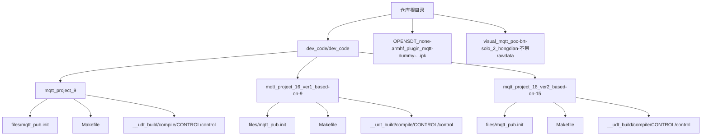
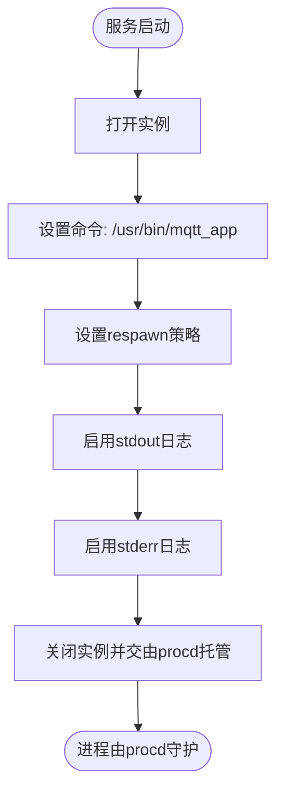
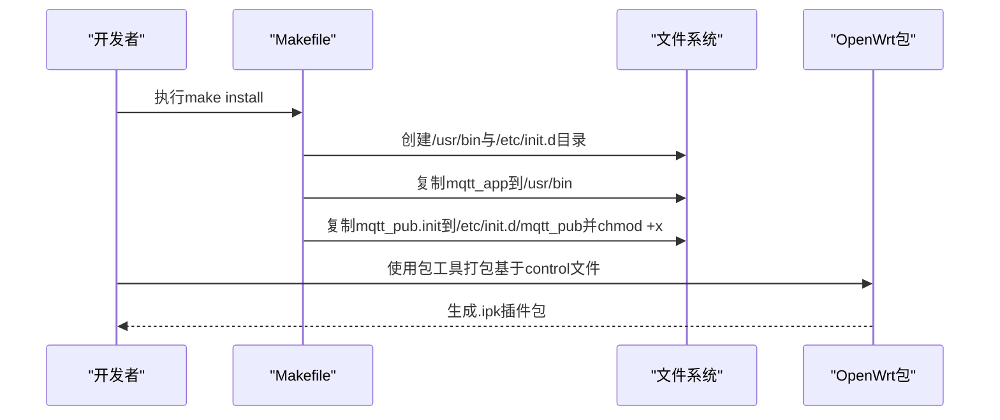
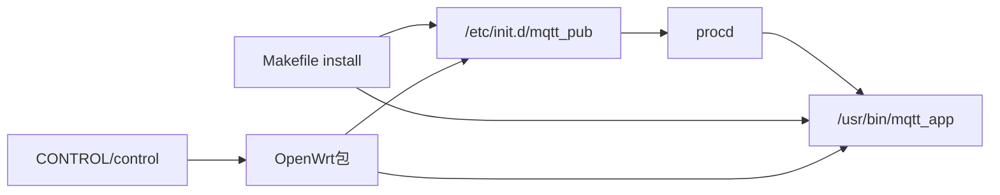

# OpenWrt平台部署

<cite>
**本文引用的文件**
- [mqtt_pub.init（版本16_基于9）](file://dev_code/dev_code/mqtt_project_16_ver1_based-on-9/files/mqtt_pub.init)
- [mqtt_pub.init（版本16_基于15）](file://dev_code/dev_code/mqtt_project_16_ver2_based-on-15/files/mqtt_pub.init)
- [mqtt_pub.init（版本9）](file://dev_code/dev_code/mqtt_project_9/files/mqtt_pub.init)
- [Makefile（版本16_基于15）](file://dev_code/dev_code/mqtt_project_16_ver2_based-on-15/Makefile)
- [Makefile（版本16_基于9）](file://dev_code/dev_code/mqtt_project_16_ver1_based-on-9/Makefile)
- [Makefile（版本9）](file://dev_code/dev_code/mqtt_project_9/Makefile)
- [control（版本16_基于15）](file://dev_code/dev_code/mqtt_project_16_ver2_based-on-15/__udt_build/compile/CONTROL/control)
- [control（版本16_基于9）](file://dev_code/dev_code/mqtt_project_16_ver1_based-on-9/__udt_build/compile/CONTROL/control)
- [control（版本9）](file://dev_code/dev_code/mqtt_project_9/__udt_build/compile/CONTROL/control)
- [OpenWrt插件包（版本16_基于15_带rawdata）](file://OPENSDT_none-armhf_plugin_mqtt-dummy-16-based-on-15_nmea-debug_16.15.0_2602051525-带rawdata/OPENSDT_none-armhf_plugin_mqtt-dummy-16-based-on-15_nmea-debug_16.15.0_2602051525.ipk)
- [OpenWrt插件包（版本16_基于9_不带rawdata）](file://visual_mqtt_poc-brt-solo_2_hongdian-不带rawdata/OPENSDT_none-armhf_plugin_mqtt-dummy-16-based-on-9_nmea-debug_16.9.0_2602051322.ipk)
</cite>

## 目录
1. [简介](#简介)
2. [项目结构](#项目结构)
3. [核心组件](#核心组件)
4. [架构总览](#架构总览)
5. [详细组件分析](#详细组件分析)
6. [依赖关系分析](#依赖关系分析)
7. [性能考虑](#性能考虑)
8. [故障排查指南](#故障排查指南)
9. [结论](#结论)
10. [附录](#附录)

## 简介
本指南面向在OpenWrt平台上部署OpenSDT MQTT插件的用户与工程师，覆盖从插件包安装、系统服务配置、网络参数设置，到mqtt_pub.init服务脚本工作原理的完整流程。文档同时提供常见部署问题的解决方案与系统兼容性检查方法，帮助快速完成从“下载插件包”到“系统启动验证”的全流程部署。

## 项目结构
仓库包含多个版本的OpenSDT MQTT插件源码与构建产物，以及对应的OpenWrt插件包。核心目录与文件如下：
- 源码工程：dev_code/dev_code/mqtt_project_9、mqtt_project_16_ver1_based-on-9、mqtt_project_16_ver2_based-on-15
- 服务脚本：各工程下files/mqtt_pub.init
- 构建配置：各工程下Makefile与__udt_build/compile/CONTROL/control
- 插件包：OPENSDT_none-armhf_plugin_mqtt-dummy-...ipk

图表来源
- [mqtt_pub.init（版本9）](file://dev_code/dev_code/mqtt_project_9/files/mqtt_pub.init#L1-L14)
- [mqtt_pub.init（版本16_基于9）](file://dev_code/dev_code/mqtt_project_16_ver1_based-on-9/files/mqtt_pub.init#L1-L14)
- [mqtt_pub.init（版本16_基于15）](file://dev_code/dev_code/mqtt_project_16_ver2_based-on-15/files/mqtt_pub.init#L1-L14)
- [Makefile（版本9）](file://dev_code/dev_code/mqtt_project_9/Makefile#L1-L23)
- [Makefile（版本16_基于9）](file://dev_code/dev_code/mqtt_project_16_ver1_based-on-9/Makefile#L1-L23)
- [Makefile（版本16_基于15）](file://dev_code/dev_code/mqtt_project_16_ver2_based-on-15/Makefile#L1-L23)
- [control（版本9）](file://dev_code/dev_code/mqtt_project_9/__udt_build/compile/CONTROL/control#L1-L10)
- [control（版本16_基于9）](file://dev_code/dev_code/mqtt_project_16_ver1_based-on-9/__udt_build/compile/CONTROL/control#L1-L10)
- [control（版本16_基于15）](file://dev_code/dev_code/mqtt_project_16_ver2_based-on-15/__udt_build/compile/CONTROL/control#L1-L10)

章节来源
- [OpenWrt插件包（版本16_基于15_带rawdata）](file://OPENSDT_none-armhf_plugin_mqtt-dummy-16-based-on-15_nmea-debug_16.15.0_2602051525-带rawdata/OPENSDT_none-armhf_plugin_mqtt-dummy-16-based-on-15_nmea-debug_16.15.0_2602051525.ipk)
- [OpenWrt插件包（版本16_基于9_不带rawdata）](file://visual_mqtt_poc-brt-solo_2_hongdian-不带rawdata/OPENSDT_none-armhf_plugin_mqtt-dummy-16-based-on-9_nmea-debug_16.9.0_2602051322.ipk)

## 核心组件
- 服务脚本：各版本统一使用/etc/init.d/mqtt_pub作为OpenWrt服务入口，通过rc.common框架与procd进行进程管理。
- 可执行程序：/usr/bin/mqtt_app为实际运行的服务进程。
- 包元数据：各版本的control文件定义了包名、版本、架构等信息，用于安装与依赖校验。
- 构建与安装：Makefile定义了编译目标与安装规则，确保可执行文件与服务脚本正确放置到目标路径。

章节来源
- [mqtt_pub.init（版本9）](file://dev_code/dev_code/mqtt_project_9/files/mqtt_pub.init#L1-L14)
- [mqtt_pub.init（版本16_基于9）](file://dev_code/dev_code/mqtt_project_16_ver1_based-on-9/files/mqtt_pub.init#L1-L14)
- [mqtt_pub.init（版本16_基于15）](file://dev_code/dev_code/mqtt_project_16_ver2_based-on-15/files/mqtt_pub.init#L1-L14)
- [Makefile（版本9）](file://dev_code/dev_code/mqtt_project_9/Makefile#L14-L19)
- [Makefile（版本16_基于9）](file://dev_code/dev_code/mqtt_project_16_ver1_based-on-9/Makefile#L14-L19)
- [Makefile（版本16_基于15）](file://dev_code/dev_code/mqtt_project_16_ver2_based-on-15/Makefile#L14-L19)
- [control（版本9）](file://dev_code/dev_code/mqtt_project_9/__udt_build/compile/CONTROL/control#L1-L10)
- [control（版本16_基于9）](file://dev_code/dev_code/mqtt_project_16_ver1_based-on-9/__udt_build/compile/CONTROL/control#L1-L10)
- [control（版本16_基于15）](file://dev_code/dev_code/mqtt_project_16_ver2_based-on-15/__udt_build/compile/CONTROL/control#L1-L10)

## 架构总览
OpenWrt平台上的MQTT插件采用标准的init.d服务模式，结合procd实现进程生命周期管理。系统启动时由rc.common加载服务脚本，procd负责拉起/usr/bin/mqtt_app，并根据respawn策略自动重启异常退出的进程；stdout/stderr参数将进程输出重定向至系统日志，便于排障。

图表来源
- [mqtt_pub.init（版本9）](file://dev_code/dev_code/mqtt_project_9/files/mqtt_pub.init#L1-L14)
- [mqtt_pub.init（版本16_基于9）](file://dev_code/dev_code/mqtt_project_16_ver1_based-on-9/files/mqtt_pub.init#L1-L14)
- [mqtt_pub.init（版本16_基于15）](file://dev_code/dev_code/mqtt_project_16_ver2_based-on-15/files/mqtt_pub.init#L1-L14)

## 详细组件分析

### 服务脚本工作原理（mqtt_pub.init）
- 启动顺序：START=99确保在大多数基础服务之后启动；STOP=10定义停止优先级。
- 进程管理：USE_PROCD=1启用procd；start_service中通过procd_open_instance/procd_close_instance定义实例；procd_set_param command指定可执行文件路径。
- 重启策略：procd_set_param respawn启用自动重启，保证服务稳定性。
- 日志输出：procd_set_param stdout 1与stderr 1将应用的标准输出与错误输出写入系统日志。

图表来源
- [mqtt_pub.init（版本9）](file://dev_code/dev_code/mqtt_project_9/files/mqtt_pub.init#L6-L13)
- [mqtt_pub.init（版本16_基于9）](file://dev_code/dev_code/mqtt_project_16_ver1_based-on-9/files/mqtt_pub.init#L6-L13)
- [mqtt_pub.init（版本16_基于15）](file://dev_code/dev_code/mqtt_project_16_ver2_based-on-15/files/mqtt_pub.init#L6-L13)

章节来源
- [mqtt_pub.init（版本9）](file://dev_code/dev_code/mqtt_project_9/files/mqtt_pub.init#L1-L14)
- [mqtt_pub.init（版本16_基于9）](file://dev_code/dev_code/mqtt_project_16_ver1_based-on-9/files/mqtt_pub.init#L1-L14)
- [mqtt_pub.init（版本16_基于15）](file://dev_code/dev_code/mqtt_project_16_ver2_based-on-15/files/mqtt_pub.init#L1-L14)

### 构建与安装流程（Makefile）
- 编译目标：TARGET=mqtt_app，OBJS包含main.o、mqtt_helper.o、cbor_helper.o。
- 安装规则：install阶段将mqtt_app复制到/usr/bin，将服务脚本复制到/etc/init.d/mqtt_pub并赋予执行权限。
- 清理规则：clean移除中间文件与可执行文件。

图表来源
- [Makefile（版本9）](file://dev_code/dev_code/mqtt_project_9/Makefile#L14-L19)
- [Makefile（版本16_基于9）](file://dev_code/dev_code/mqtt_project_16_ver1_based-on-9/Makefile#L14-L19)
- [Makefile（版本16_基于15）](file://dev_code/dev_code/mqtt_project_16_ver2_based-on-15/Makefile#L14-L19)
- [control（版本9）](file://dev_code/dev_code/mqtt_project_9/__udt_build/compile/CONTROL/control#L1-L10)
- [control（版本16_基于9）](file://dev_code/dev_code/mqtt_project_16_ver1_based-on-9/__udt_build/compile/CONTROL/control#L1-L10)
- [control（版本16_基于15）](file://dev_code/dev_code/mqtt_project_16_ver2_based-on-15/__udt_build/compile/CONTROL/control#L1-L10)

章节来源
- [Makefile（版本9）](file://dev_code/dev_code/mqtt_project_9/Makefile#L1-L23)
- [Makefile（版本16_基于9）](file://dev_code/dev_code/mqtt_project_16_ver1_based-on-9/Makefile#L1-L23)
- [Makefile（版本16_基于15）](file://dev_code/dev_code/mqtt_project_16_ver2_based-on-15/Makefile#L1-L23)
- [control（版本9）](file://dev_code/dev_code/mqtt_project_9/__udt_build/compile/CONTROL/control#L1-L10)
- [control（版本16_基于9）](file://dev_code/dev_code/mqtt_project_16_ver1_based-on-9/__udt_build/compile/CONTROL/control#L1-L10)
- [control（版本16_基于15）](file://dev_code/dev_code/mqtt_project_16_ver2_based-on-15/__udt_build/compile/CONTROL/control#L1-L10)

### 版本差异与选择建议
- 版本9：包名为mqtt-dummy_nmea-debug，适合基础场景。
- 版本16_基于9：包名为mqtt-dummy-16-based-on-9_nmea-debug，功能增强但不带rawdata。
- 版本16_基于15：包名为mqtt-dummy-16-based-on-15_nmea-debug，功能更完善且带rawdata支持。

章节来源
- [control（版本9）](file://dev_code/dev_code/mqtt_project_9/__udt_build/compile/CONTROL/control#L1-L10)
- [control（版本16_基于9）](file://dev_code/dev_code/mqtt_project_16_ver1_based-on-9/__udt_build/compile/CONTROL/control#L1-L10)
- [control（版本16_基于15）](file://dev_code/dev_code/mqtt_project_16_ver2_based-on-15/__udt_build/compile/CONTROL/control#L1-L10)

## 依赖关系分析
- 服务脚本依赖：/etc/init.d/mqtt_pub依赖rc.common与procd；procd再依赖/usr/bin/mqtt_app。
- 安装依赖：Makefile安装规则要求目标路径存在/usr/bin与/etc/init.d；control文件定义包元数据。
- 兼容性依赖：control中的Architecture字段需与目标设备匹配（例如arm_xscale）。

图表来源
- [Makefile（版本9）](file://dev_code/dev_code/mqtt_project_9/Makefile#L14-L19)
- [Makefile（版本16_基于9）](file://dev_code/dev_code/mqtt_project_16_ver1_based-on-9/Makefile#L14-L19)
- [Makefile（版本16_基于15）](file://dev_code/dev_code/mqtt_project_16_ver2_based-on-15/Makefile#L14-L19)
- [control（版本9）](file://dev_code/dev_code/mqtt_project_9/__udt_build/compile/CONTROL/control#L7)
- [control（版本16_基于9）](file://dev_code/dev_code/mqtt_project_16_ver1_based-on-9/__udt_build/compile/CONTROL/control#L7)
- [control（版本16_基于15）](file://dev_code/dev_code/mqtt_project_16_ver2_based-on-15/__udt_build/compile/CONTROL/control#L7)

章节来源
- [Makefile（版本9）](file://dev_code/dev_code/mqtt_project_9/Makefile#L14-L19)
- [Makefile（版本16_基于9）](file://dev_code/dev_code/mqtt_project_16_ver1_based-on-9/Makefile#L14-L19)
- [Makefile（版本16_基于15）](file://dev_code/dev_code/mqtt_project_16_ver2_based-on-15/Makefile#L14-L19)
- [control（版本9）](file://dev_code/dev_code/mqtt_project_9/__udt_build/compile/CONTROL/control#L7)
- [control（版本16_基于9）](file://dev_code/dev_code/mqtt_project_16_ver1_based-on-9/__udt_build/compile/CONTROL/control#L7)
- [control（版本16_基于15）](file://dev_code/dev_code/mqtt_project_16_ver2_based-on-15/__udt_build/compile/CONTROL/control#L7)

## 性能考虑
- 进程管理：启用respawn可提升可用性，但需关注异常重启频率；可通过日志观察进程状态。
- 日志输出：stdout/stderr写入系统日志会占用I/O，建议在生产环境合理配置日志级别与轮转策略。
- 资源占用：mqtt_app的CPU与内存占用取决于消息处理逻辑与网络负载，建议在目标设备上进行压力测试。

## 故障排查指南
- 服务未启动
  - 检查服务脚本是否存在且具备执行权限：/etc/init.d/mqtt_pub
  - 验证procd是否可用：查看系统日志中是否有procd相关条目
  - 查看应用可执行文件是否存在：/usr/bin/mqtt_app
- 进程频繁重启
  - 检查应用日志，定位异常原因；确认respawn策略符合预期
- 日志无输出
  - 确认stdout/stderr参数已启用；检查系统日志服务是否正常
- 包安装失败
  - 校验包架构与目标设备是否一致（参考control文件中的Architecture字段）
  - 确认依赖满足，必要时先安装依赖包

章节来源
- [mqtt_pub.init（版本9）](file://dev_code/dev_code/mqtt_project_9/files/mqtt_pub.init#L6-L13)
- [mqtt_pub.init（版本16_基于9）](file://dev_code/dev_code/mqtt_project_16_ver1_based-on-9/files/mqtt_pub.init#L6-L13)
- [mqtt_pub.init（版本16_基于15）](file://dev_code/dev_code/mqtt_project_16_ver2_based-on-15/files/mqtt_pub.init#L6-L13)
- [control（版本9）](file://dev_code/dev_code/mqtt_project_9/__udt_build/compile/CONTROL/control#L7)
- [control（版本16_基于9）](file://dev_code/dev_code/mqtt_project_16_ver1_based-on-9/__udt_build/compile/CONTROL/control#L7)
- [control（版本16_基于15）](file://dev_code/dev_code/mqtt_project_16_ver2_based-on-15/__udt_build/compile/CONTROL/control#L7)

## 结论
通过本指南，您可以在OpenWrt平台上完成OpenSDT MQTT插件的安装与部署。服务脚本采用标准的rc.common+procd模式，具备良好的稳定性与可观测性。建议根据业务需求选择合适版本的插件包，并在部署后持续监控日志与进程状态，以确保系统稳定运行。

## 附录

### 完整安装步骤（从下载插件包到系统启动验证）
- 步骤1：下载对应版本的OpenWrt插件包（.ipk）
  - 带rawdata版本：参见[OpenWrt插件包（版本16_基于15_带rawdata）](file://OPENSDT_none-armhf_plugin_mqtt-dummy-16-based-on-15_nmea-debug_16.15.0_2602051525-带rawdata/OPENSDT_none-armhf_plugin_mqtt-dummy-16-based-on-15_nmea-debug_16.15.0_2602051525.ipk)
  - 不带rawdata版本：参见[OpenWrt插件包（版本16_基于9_不带rawdata）](file://visual_mqtt_poc-brt-solo_2_hongdian-不带rawdata/OPENSDT_none-armhf_plugin_mqtt-dummy-16-based-on-9_nmea-debug_16.9.0_2602051322.ipk)
- 步骤2：在OpenWrt设备上安装插件包
  - 使用opkg或系统包管理器安装.ipk文件
- 步骤3：确认服务脚本与可执行文件
  - /etc/init.d/mqtt_pub应存在且可执行
  - /usr/bin/mqtt_app应存在
- 步骤4：启动服务并验证
  - 启动服务：/etc/init.d/mqtt_pub start
  - 观察系统日志，确认进程被procd托管且无异常重启
- 步骤5：网络参数配置
  - 根据实际网络环境配置MQTT服务器地址、端口、认证信息等（具体参数请参考应用内部配置方式）

章节来源
- [OpenWrt插件包（版本16_基于15_带rawdata）](file://OPENSDT_none-armhf_plugin_mqtt-dummy-16-based-on-15_nmea-debug_16.15.0_2602051525-带rawdata/OPENSDT_none-armhf_plugin_mqtt-dummy-16-based-on-15_nmea-debug_16.15.0_2602051525.ipk)
- [OpenWrt插件包（版本16_基于9_不带rawdata）](file://visual_mqtt_poc-brt-solo_2_hongdian-不带rawdata/OPENSDT_none-armhf_plugin_mqtt-dummy-16-based-on-9_nmea-debug_16.9.0_2602051322.ipk)
- [mqtt_pub.init（版本9）](file://dev_code/dev_code/mqtt_project_9/files/mqtt_pub.init#L1-L14)
- [mqtt_pub.init（版本16_基于9）](file://dev_code/dev_code/mqtt_project_16_ver1_based-on-9/files/mqtt_pub.init#L1-L14)
- [mqtt_pub.init（版本16_基于15）](file://dev_code/dev_code/mqtt_project_16_ver2_based-on-15/files/mqtt_pub.init#L1-L14)