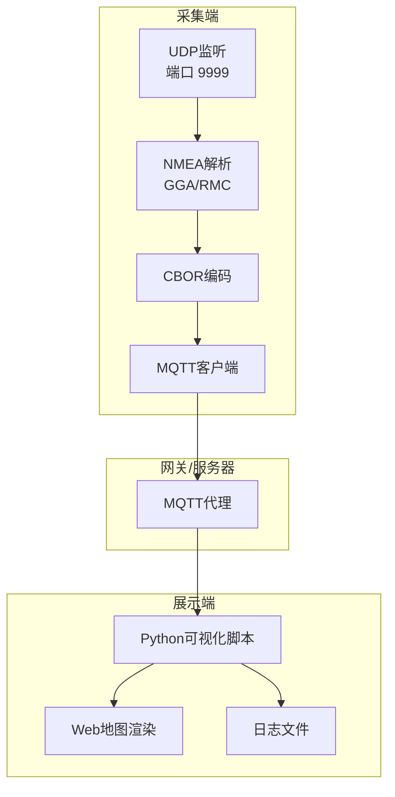
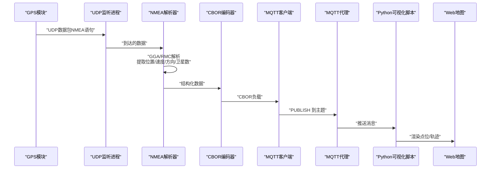
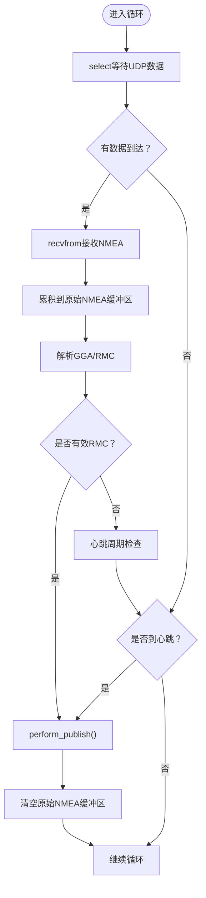
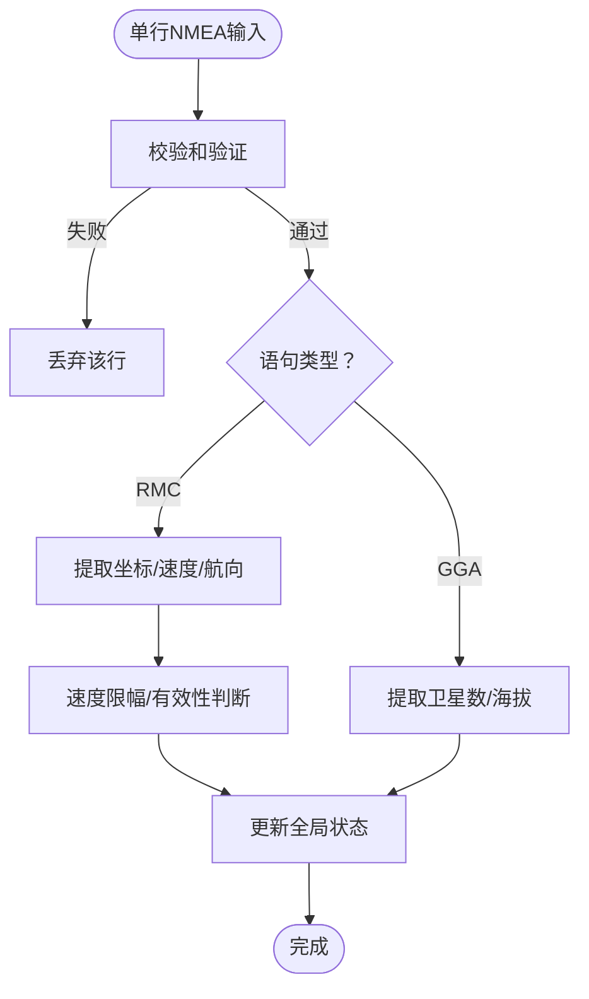
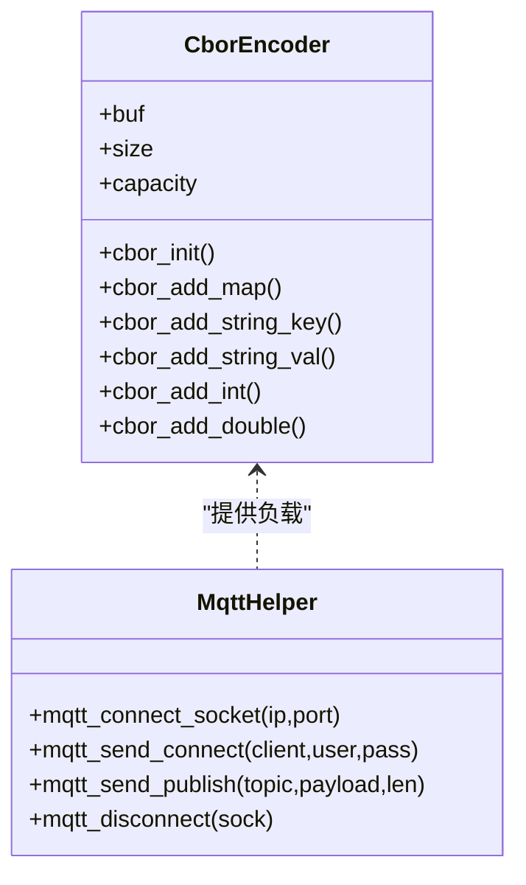
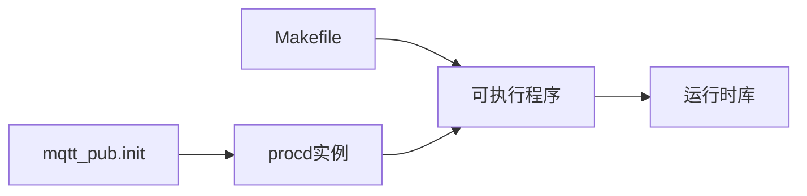
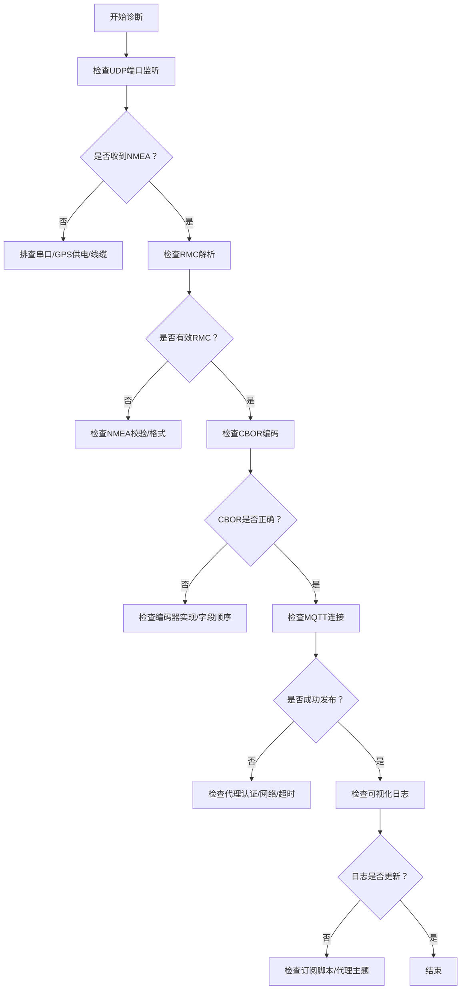

# 系统监控与维护

<cite>
**本文引用的文件**
- [main.c（项目16 ver1）](file://dev_code/dev_code/mqtt_project_16_ver1_based-on-9/main.c)
- [mqtt_helper.c](file://dev_code/dev_code/mqtt_project_16_ver1_based-on-9/mqtt_helper.c)
- [cbor_helper.c](file://dev_code/dev_code/mqtt_project_16_ver1_based-on-9/cbor_helper.c)
- [mqtt_helper.h](file://dev_code/dev_code/mqtt_project_16_ver1_based-on-9/mqtt_helper.h)
- [cbor_helper.h](file://dev_code/dev_code/mqtt_project_16_ver1_based-on-9/cbor_helper.h)
- [Makefile（项目16 ver1）](file://dev_code/dev_code/mqtt_project_16_ver1_based-on-9/Makefile)
- [mqtt_pub.init](file://dev_code/dev_code/mqtt_project_16_ver1_based-on-9/files/mqtt_pub.init)
- [main.c（项目9）](file://dev_code/dev_code/mqtt_project_9/main.c)
- [main.c（项目16 ver2）](file://dev_code/dev_code/mqtt_project_16_ver2_based-on-15/main.c)
- [Readme.md.txt](file://dev_code/dev_code/Readme.md.txt)
- [visual_mqtt_poc-brt-solo_2_hongdian.py](file://visual_mqtt_poc-brt-solo_2_hongdian-不带rawdata/visual_mqtt_poc-brt-solo_2_hongdian.py)
</cite>

## 目录
1. [简介](#简介)
2. [项目结构](#项目结构)
3. [核心组件](#核心组件)
4. [架构总览](#架构总览)
5. [详细组件分析](#详细组件分析)
6. [依赖关系分析](#依赖关系分析)
7. [性能监控指标与测量方法](#性能监控指标与测量方法)
8. [日志与错误处理](#日志与错误处理)
9. [故障诊断流程](#故障诊断流程)
10. [常见问题与快速排查](#常见问题与快速排查)
11. [系统维护最佳实践](#系统维护最佳实践)
12. [结论](#结论)

## 简介
本指南面向GPS数据采集与传输系统的运行维护人员，覆盖以下主题：
- 如何监控GPS数据接收状态（位置、卫星数、速度、方向）
- 如何评估MQTT连接质量（连通性、发布成功率、超时）
- 如何观测系统资源使用情况（CPU、内存、网络）
- 日志文件位置、格式与解读方法（含错误码与处理建议）
- 性能监控指标定义与测量方法（数据处理延迟、内存使用率、网络带宽占用）
- 故障诊断流程、常见问题快速排查与系统维护最佳实践

## 项目结构
该仓库包含多个版本的GPS采集与MQTT发布工程，以及可视化演示脚本。核心工程位于 dev_code/dev_code 下，包含：
- 项目9：基础版本，支持UDP接收NMEA、解析GGA/RMC、CBOR封装并通过MQTT发布
- 项目16 ver1：在项目9基础上增强，支持完整原始NMEA累积与更频繁心跳发布
- 项目16 ver2：进一步优化，增加校验与限幅、时间戳控制、更稳健的缓冲区管理
- 可视化脚本：订阅MQTT主题，实时渲染地图点位并记录日志

图表来源
- [main.c（项目16 ver1）](file://dev_code/dev_code/mqtt_project_16_ver1_based-on-9/main.c#L182-L259)
- [mqtt_helper.c](file://dev_code/dev_code/mqtt_project_16_ver1_based-on-9/mqtt_helper.c#L38-L115)
- [cbor_helper.c](file://dev_code/dev_code/mqtt_project_16_ver1_based-on-9/cbor_helper.c#L38-L89)
- [visual_mqtt_poc-brt-solo_2_hongdian.py](file://visual_mqtt_poc-brt-solo_2_hongdian-不带rawdata/visual_mqtt_poc-brt-solo_2_hongdian.py#L1-L217)

章节来源
- [Readme.md.txt](file://dev_code/dev_code/Readme.md.txt#L1-L12)

## 核心组件
- UDP接收与事件循环：持续监听UDP端口，接收NMEA语句，累积到原始缓冲区，触发解析与发布
- NMEA解析器：识别GGA/RMC语句，提取位置、海拔、卫星数、速度、航向；对速度进行合理性校验或保留原始节值
- CBOR编码器：将结构化数据编码为二进制CBOR，用于MQTT发布
- MQTT客户端：建立TCP连接、发送CONNECT、PUBLISH，断开连接
- GSM信号读取：从设备信息文件中读取信号强度，作为链路质量参考
- 发布策略：收到有效RMC或心跳周期触发发布，发布后清空原始NMEA缓冲区

章节来源
- [main.c（项目9）](file://dev_code/dev_code/mqtt_project_9/main.c#L179-L200)
- [main.c（项目16 ver1）](file://dev_code/dev_code/mqtt_project_16_ver1_based-on-9/main.c#L182-L259)
- [main.c（项目16 ver2）](file://dev_code/dev_code/mqtt_project_16_ver2_based-on-15/main.c#L245-L264)
- [mqtt_helper.c](file://dev_code/dev_code/mqtt_project_16_ver1_based-on-9/mqtt_helper.c#L38-L115)
- [cbor_helper.c](file://dev_code/dev_code/mqtt_project_16_ver1_based-on-9/cbor_helper.c#L38-L89)

## 架构总览
下图展示了从GPS模块到MQTT代理再到可视化展示的整体流程。

图表来源
- [main.c（项目16 ver1）](file://dev_code/dev_code/mqtt_project_16_ver1_based-on-9/main.c#L201-L256)
- [mqtt_helper.c](file://dev_code/dev_code/mqtt_project_16_ver1_based-on-9/mqtt_helper.c#L88-L115)
- [visual_mqtt_poc-brt-solo_2_hongdian.py](file://visual_mqtt_poc-brt-solo_2_hongdian-不带rawdata/visual_mqtt_poc-brt-solo_2_hongdian.py#L142-L200)

## 详细组件分析

### 组件A：UDP接收与发布调度
- 接收逻辑：使用select设置超时，避免阻塞；收到数据后追加到原始NMEA缓冲区
- 触发条件：解析到有效RMC或心跳周期触发发布
- 发布内容：包含位置、海拔、速度、方向、卫星数、GSM信号、时间戳、原始NMEA
- 缓冲区管理：发布后清空原始NMEA缓冲区，防止无限增长

图表来源
- [main.c（项目16 ver1）](file://dev_code/dev_code/mqtt_project_16_ver1_based-on-9/main.c#L201-L256)

章节来源
- [main.c（项目16 ver1）](file://dev_code/dev_code/mqtt_project_16_ver1_based-on-9/main.c#L201-L256)

### 组件B：NMEA解析与数据校验
- GGA解析：提取卫星数与海拔
- RMC解析：提取经纬度、速度（项目16 ver1保留原始节值，项目16 ver2转换为km/h并做限幅）
- 坐标转换：将DDMM.MMMM格式转换为十进制度
- 校验与限幅：ver2版本增加校验与速度限幅，避免异常值影响展示与存储

图表来源
- [main.c（项目16 ver2）](file://dev_code/dev_code/mqtt_project_16_ver2_based-on-15/main.c#L97-L165)

章节来源
- [main.c（项目9）](file://dev_code/dev_code/mqtt_project_9/main.c#L86-L130)
- [main.c（项目16 ver1）](file://dev_code/dev_code/mqtt_project_16_ver1_based-on-9/main.c#L86-L133)
- [main.c（项目16 ver2）](file://dev_code/dev_code/mqtt_project_16_ver2_based-on-15/main.c#L97-L165)

### 组件C：CBOR编码与MQTT发布
- CBOR编码：以键值对形式编码，包含业务字段与原始NMEA
- MQTT发布：建立TCP连接、发送CONNECT、PUBLISH，断开连接
- 超时控制：设置发送/接收超时，提升稳定性

图表来源
- [cbor_helper.h](file://dev_code/dev_code/mqtt_project_16_ver1_based-on-9/cbor_helper.h#L7-L27)
- [cbor_helper.c](file://dev_code/dev_code/mqtt_project_16_ver1_based-on-9/cbor_helper.c#L38-L89)
- [mqtt_helper.h](file://dev_code/dev_code/mqtt_project_16_ver1_based-on-9/mqtt_helper.h#L4-L12)
- [mqtt_helper.c](file://dev_code/dev_code/mqtt_project_16_ver1_based-on-9/mqtt_helper.c#L38-L115)

章节来源
- [cbor_helper.c](file://dev_code/dev_code/mqtt_project_16_ver1_based-on-9/cbor_helper.c#L38-L89)
- [mqtt_helper.c](file://dev_code/dev_code/mqtt_project_16_ver1_based-on-9/mqtt_helper.c#L38-L115)

### 组件D：GSM信号读取与资源监控
- 信号读取：定期从设备信息文件读取信号强度，作为链路质量参考
- 进程管理：通过init脚本以procd方式启动，具备自动重启能力

章节来源
- [main.c（项目16 ver1）](file://dev_code/dev_code/mqtt_project_16_ver1_based-on-9/main.c#L42-L61)
- [mqtt_pub.init](file://dev_code/dev_code/mqtt_project_16_ver1_based-on-9/files/mqtt_pub.init#L6-L13)

## 依赖关系分析
- 模块内聚：解析、编码、发布职责清晰，耦合度低
- 外部依赖：MQTT代理、操作系统socket接口、CBOR库（编译期链接数学库）
- 启动与安装：Makefile负责编译与安装，init脚本负责开机自启与重启

图表来源
- [Makefile（项目16 ver1）](file://dev_code/dev_code/mqtt_project_16_ver1_based-on-9/Makefile#L14-L22)
- [mqtt_pub.init](file://dev_code/dev_code/mqtt_project_16_ver1_based-on-9/files/mqtt_pub.init#L6-L13)

章节来源
- [Makefile（项目16 ver1）](file://dev_code/dev_code/mqtt_project_16_ver1_based-on-9/Makefile#L1-L23)
- [mqtt_pub.init](file://dev_code/dev_code/mqtt_project_16_ver1_based-on-9/files/mqtt_pub.init#L1-L14)

## 性能监控指标与测量方法
- 数据处理延迟
  - 定义：从接收到有效RMC到完成发布的时间间隔
  - 测量：在解析到RMC后记录时间戳，在发布前再次记录，二者差值即为处理延迟
  - 版本差异：项目16 ver2引入了基于时间戳的“年龄”判断，避免过期数据参与发布
- 内存使用率
  - 关注点：原始NMEA缓冲区大小、CBOR编码缓冲区、进程常驻内存
  - 建议：监控RSS/VMRSS，确保缓冲区上限合理，发布后及时清空
- 网络带宽占用
  - 发布频率：由心跳与有效RMC触发决定；可通过调整发布策略降低带宽
  - 负载大小：CBOR编码后的负载大小取决于字段数量与原始NMEA长度
- CPU占用
  - 关注点：解析与CBOR编码的计算开销；UDP轮询与select超时设置
  - 建议：在高并发场景下适当增大select超时，减少忙轮询

章节来源
- [main.c（项目16 ver2）](file://dev_code/dev_code/mqtt_project_16_ver2_based-on-15/main.c#L190-L241)
- [main.c（项目16 ver1）](file://dev_code/dev_code/mqtt_project_16_ver1_based-on-9/main.c#L201-L256)

## 日志与错误处理
- 日志位置与格式
  - 采集端日志：stdout输出，包含GPS坐标、GSM信号、卫星数等信息
  - 可视化日志：Python脚本将解码后的消息写入本地JSON日志文件
- 错误码与处理建议
  - MQTT连接失败：检查用户名/密码、代理可达性、防火墙策略
  - CBOR解码失败：确认发布端使用二进制CBOR，订阅端具备相应库
  - NMEA校验失败：检查串口波特率、线缆质量、GPS模块供电
  - 缓冲区溢出：增大缓冲区容量或缩短发布周期
- 日志解读要点
  - 有效RMC：lat_pos与lon_pos非零且方向/速度合理
  - 心跳发布：即使无新RMC也应周期性发布，保持代理可见性
  - 原始NMEA：用于离线回放与问题定位

章节来源
- [main.c（项目16 ver1）](file://dev_code/dev_code/mqtt_project_16_ver1_based-on-9/main.c#L237-L244)
- [visual_mqtt_poc-brt-solo_2_hongdian.py](file://visual_mqtt_poc-brt-solo_2_hongdian-不带rawdata/visual_mqtt_poc-brt-solo_2_hongdian.py#L132-L186)

## 故障诊断流程

## 常见问题与快速排查
- GPS无数据
  - 检查串口参数与线缆连接；确认GPS模块供电正常
  - 查看采集端是否打印有效RMC
- MQTT无法连接
  - 核对用户名/密码/主题；测试代理连通性
  - 检查防火墙与代理ACL
- 速度异常
  - 项目16 ver2已做限幅；若仍异常，检查传感器或上游数据源
- 带宽过高
  - 降低发布频率或裁剪原始NMEA字段
- 进程崩溃/退出
  - 检查procd自动重启；查看系统日志

## 系统维护最佳实践
- 配置管理
  - 将敏感配置（Broker地址、账号、Bus编号）集中管理，避免硬编码
- 版本演进
  - 优先采用项目16 ver2的稳健解析与限幅策略
- 监控与告警
  - 建立基于日志与指标的告警机制（如连续无RMC、发布失败、内存上涨）
- 升级与回滚
  - 使用打包安装方式，便于升级与回滚
- 文档与演练
  - 记录每次变更与测试结果，定期演练故障恢复流程

## 结论
本指南提供了从采集、解析、编码到发布的全链路监控与维护方法。通过关注GPS接收状态、MQTT连接质量与系统资源使用，结合日志解读与性能指标，可有效保障系统的稳定运行与快速排障。建议在生产环境中采用项目16 ver2的稳健策略，并配合完善的监控与告警体系。