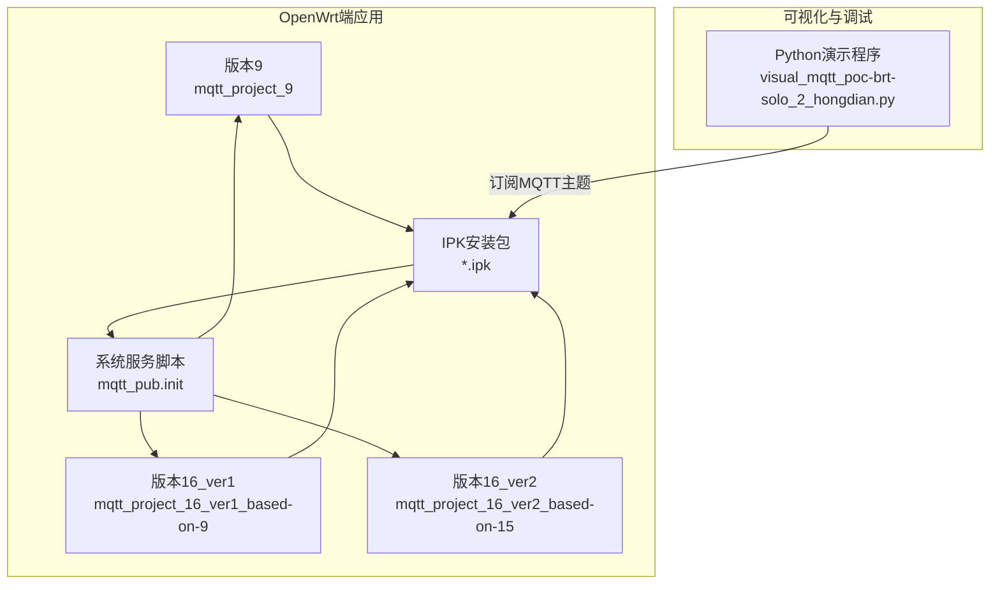
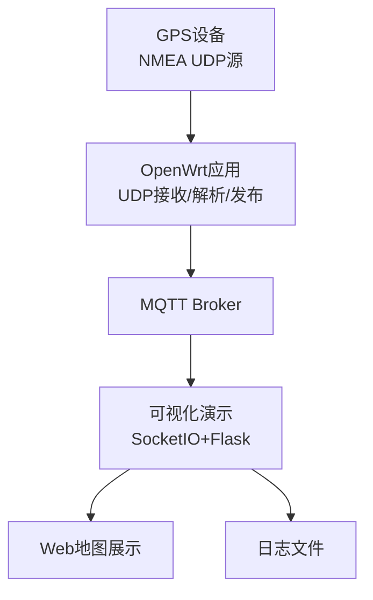
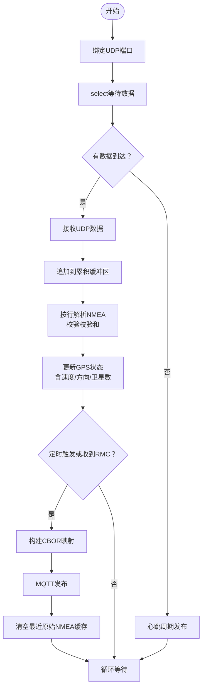
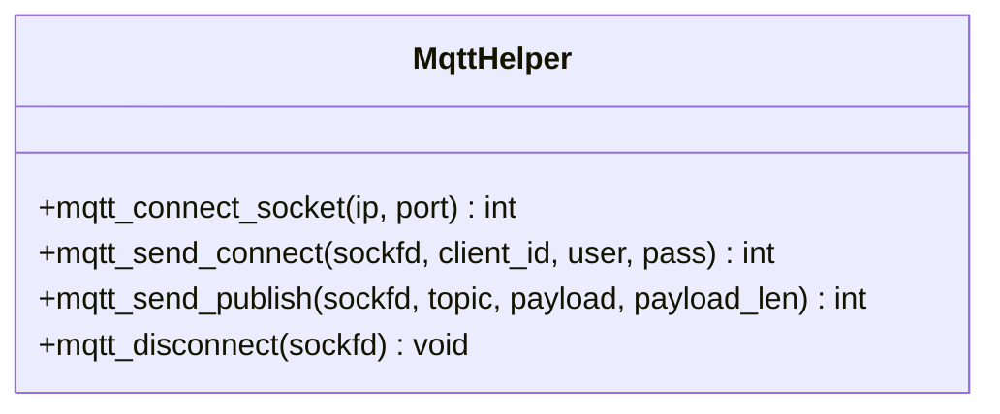
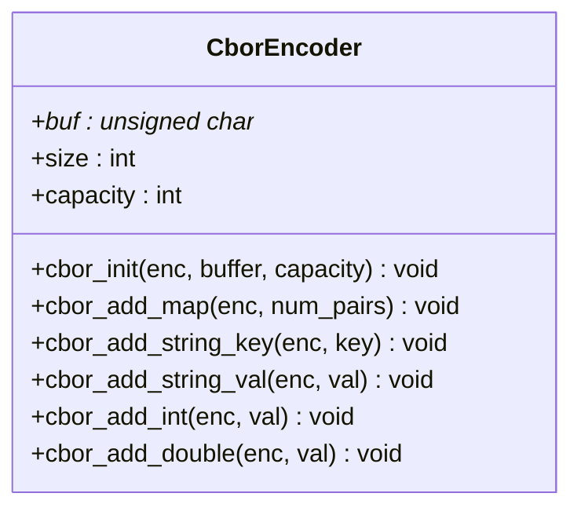
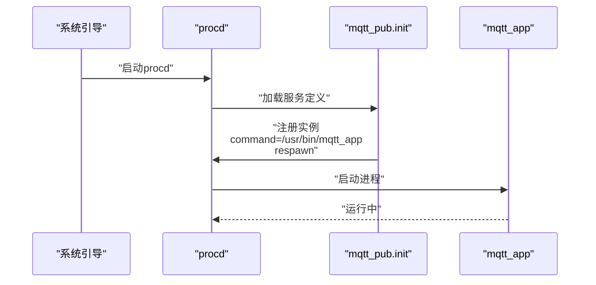
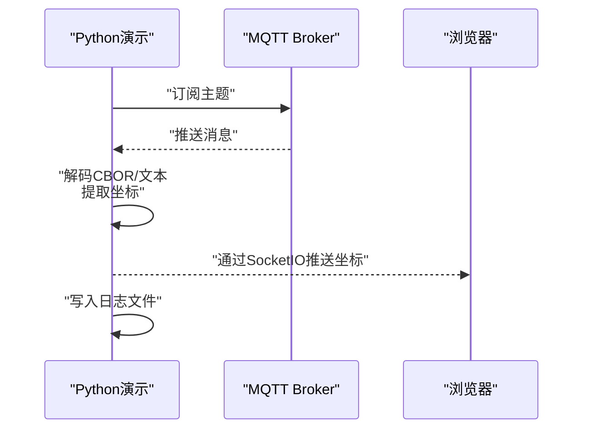
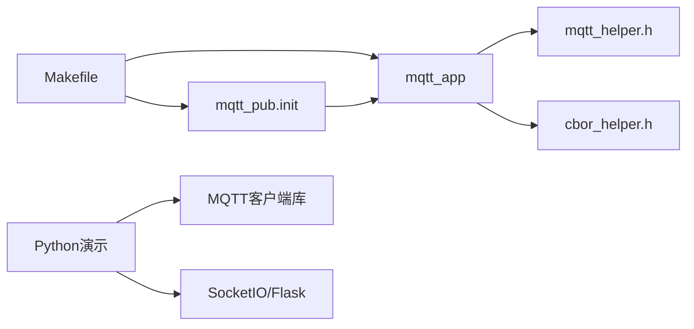

# 部署与配置

<cite>
**本文引用的文件**
- [dev_code\dev_code\Readme.md.txt](file://dev_code\dev_code\Readme.md.txt)
- [dev_code\dev_code\mqtt_project_16_ver1_based-on-9\Makefile](file://dev_code\dev_code\mqtt_project_16_ver1_based-on-9\Makefile)
- [dev_code\dev_code\mqtt_project_16_ver2_based-on-15\Makefile](file://dev_code\dev_code\mqtt_project_16_ver2_based-on-15\Makefile)
- [dev_code\dev_code\mqtt_project_9\Makefile](file://dev_code\dev_code\mqtt_project_9\Makefile)
- [dev_code\dev_code\mqtt_project_16_ver1_based-on-9\files\mqtt_pub.init](file://dev_code\dev_code\mqtt_project_16_ver1_based-on-9\files\mqtt_pub.init)
- [dev_code\dev_code\mqtt_project_16_ver2_based-on-15\files\mqtt_pub.init](file://dev_code\dev_code\mqtt_project_16_ver2_based-on-15\files\mqtt_pub.init)
- [dev_code\dev_code\mqtt_project_9\files\mqtt_pub.init](file://dev_code\dev_code\mqtt_project_9\files\mqtt_pub.init)
- [dev_code\dev_code\mqtt_project_16_ver1_based-on-9\main.c](file://dev_code\dev_code\mqtt_project_16_ver1_based-on-9\main.c)
- [dev_code\dev_code\mqtt_project_16_ver2_based-on-15\main.c](file://dev_code\dev_code\mqtt_project_16_ver2_based-on-15\main.c)
- [dev_code\dev_code\mqtt_project_16_ver1_based-on-9\mqtt_helper.h](file://dev_code\dev_code\mqtt_project_16_ver1_based-on-9\mqtt_helper.h)
- [dev_code\dev_code\mqtt_project_16_ver2_based-on-15\mqtt_helper.h](file://dev_code\dev_code\mqtt_project_16_ver2_based-on-15\mqtt_helper.h)
- [dev_code\dev_code\mqtt_project_9\mqtt_helper.h](file://dev_code\dev_code\mqtt_project_9\mqtt_helper.h)
- [dev_code\dev_code\mqtt_project_16_ver1_based-on-9\cbor_helper.h](file://dev_code\dev_code\mqtt_project_16_ver1_based-on-9\cbor_helper.h)
- [dev_code\dev_code\mqtt_project_16_ver2_based-on-15\cbor_helper.h](file://dev_code\dev_code\mqtt_project_16_ver2_based-on-15\cbor_helper.h)
- [dev_code\dev_code\mqtt_project_9\cbor_helper.h](file://dev_code\dev_code\mqtt_project_9\cbor_helper.h)
- [visual_mqtt_poc-brt-solo_2_hongdian-不带rawdata\visual_mqtt_poc-brt-solo_2_hongdian.py](file://visual_mqtt_poc-brt-solo_2_hongdian-不带rawdata\visual_mqtt_poc-brt-solo_2_hongdian.py)
- [OPENSDT_none-armhf_plugin_mqtt-dummy-16-based-on-15_nmea-debug_16.15.0_2602051525-带rawdata\OPENSDT_none-armhf_plugin_mqtt-dummy-16-based-on-15_nmea-debug_16.15.0_2602051525.ipk](file://OPENSDT_none-armhf_plugin_mqtt-dummy-16-based-on-15_nmea-debug_16.15.0_2602051525-带rawdata\OPENSDT_none-armhf_plugin_mqtt-dummy-16-based-on-15_nmea-debug_16.15.0_2602051525.ipk)
- [dev_code\dev_code\mqtt_project_16_ver1_based-on-9\__udt_build\OPENSDT_none-armhf_plugin_mqtt-dummy-16-based-on-9_nmea-debug_16.9.0_2602051322.ipk](file://dev_code\dev_code\mqtt_project_16_ver1_based-on-9\__udt_build\OPENSDT_none-armhf_plugin_mqtt-dummy-16-based-on-9_nmea-debug_16.9.0_2602051322.ipk)
- [dev_code\dev_code\mqtt_project_16_ver2_based-on-15\__udt_build\OPENSDT_none-armhf_plugin_mqtt-dummy-16-based-on-15_nmea-debug_16.15.0_2602051525.ipk](file://dev_code\dev_code\mqtt_project_16_ver2_based-on-15\__udt_build\OPENSDT_none-armhf_plugin_mqtt-dummy-16-based-on-15_nmea-debug_16.15.0_2602051525.ipk)
- [dev_code\dev_code\mqtt_project_9\__udt_build\OPENSDT_none-armhf_plugin_mqtt-dummy_nmea-debug_2.3.0_2512291635.ipk](file://dev_code\dev_code\mqtt_project_9\__udt_build\OPENSDT_none-armhf_plugin_mqtt-dummy_nmea-debug_2.3.0_2512291635.ipk)
</cite>

## 目录
1. [简介](#简介)
2. [项目结构](#项目结构)
3. [核心组件](#核心组件)
4. [架构总览](#架构总览)
5. [详细组件分析](#详细组件分析)
6. [依赖关系分析](#依赖关系分析)
7. [性能考虑](#性能考虑)
8. [故障排查指南](#故障排查指南)
9. [结论](#结论)
10. [附录](#附录)

## 简介
本指南面向印尼GPS追踪系统的运维与开发团队，围绕OpenWrt平台下的插件包安装、系统服务配置、网络参数设置、MQTT连接参数、GPS设备参数以及系统行为定制进行系统化说明。文档同时提供配置文件格式、参数含义、最佳实践、监控与维护方法，以及全生命周期管理方案，帮助快速完成部署与稳定运行。

## 项目结构
该仓库包含三套基于不同版本改进的MQTT发布程序（版本9、16_ver1、16_ver2），以及一套用于可视化与日志记录的Python演示程序。各版本在NMEA解析稳健性、速度过滤策略、CBOR编码与发布流程上存在差异；Python演示程序提供实时地图展示与历史轨迹点叠加能力。

图表来源
- [dev_code\dev_code\Readme.md.txt](file://dev_code\dev_code\Readme.md.txt#L1-L12)
- [dev_code\dev_code\mqtt_project_16_ver1_based-on-9\Makefile](file://dev_code\dev_code\mqtt_project_16_ver1_based-on-9\Makefile#L14-L19)
- [dev_code\dev_code\mqtt_project_16_ver2_based-on-15\Makefile](file://dev_code\dev_code\mqtt_project_16_ver2_based-on-15\Makefile#L14-L19)
- [dev_code\dev_code\mqtt_project_9\Makefile](file://dev_code\dev_code\mqtt_project_9\Makefile#L14-L19)
- [dev_code\dev_code\mqtt_project_16_ver1_based-on-9\files\mqtt_pub.init](file://dev_code\dev_code\mqtt_project_16_ver1_based-on-9\files\mqtt_pub.init#L1-L14)
- [dev_code\dev_code\mqtt_project_16_ver2_based-on-15\files\mqtt_pub.init](file://dev_code\dev_code\mqtt_project_16_ver2_based-on-15\files\mqtt_pub.init#L1-L14)
- [dev_code\dev_code\mqtt_project_9\files\mqtt_pub.init](file://dev_code\dev_code\mqtt_project_9\files\mqtt_pub.init#L1-L14)
- [visual_mqtt_poc-brt-solo_2_hongdian-不带rawdata\visual_mqtt_poc-brt-solo_2_hongdian.py](file://visual_mqtt_poc-brt-solo_2_hongdian-不带rawdata\visual_mqtt_poc-brt-solo_2_hongdian.py#L1-L217)

章节来源
- [dev_code\dev_code\Readme.md.txt](file://dev_code\dev_code\Readme.md.txt#L1-L12)

## 核心组件
- 应用程序主体：基于UDP接收NMEA语句，解析GGA/RMC等，生成CBOR负载并通过MQTT发布。
- MQTT辅助模块：封装TCP连接、CONNECT握手与PUBLISH发送。
- CBOR辅助模块：构造键值对映射，支持字符串、整数、双精度数值。
- 系统服务脚本：通过procd在OpenWrt启动时自动拉起应用进程。
- 可视化演示：订阅MQTT主题，渲染地图点位，记录日志文件。

章节来源
- [dev_code\dev_code\mqtt_project_16_ver1_based-on-9\main.c](file://dev_code\dev_code\mqtt_project_16_ver1_based-on-9\main.c#L1-L259)
- [dev_code\dev_code\mqtt_project_16_ver2_based-on-15\main.c](file://dev_code\dev_code\mqtt_project_16_ver2_based-on-15\main.c#L1-L289)
- [dev_code\dev_code\mqtt_project_16_ver1_based-on-9\mqtt_helper.h](file://dev_code\dev_code\mqtt_project_16_ver1_based-on-9\mqtt_helper.h#L1-L13)
- [dev_code\dev_code\mqtt_project_16_ver2_based-on-15\mqtt_helper.h](file://dev_code\dev_code\mqtt_project_16_ver2_based-on-15\mqtt_helper.h#L1-L13)
- [dev_code\dev_code\mqtt_project_16_ver1_based-on-9\cbor_helper.h](file://dev_code\dev_code\mqtt_project_16_ver1_based-on-9\cbor_helper.h#L1-L27)
- [dev_code\dev_code\mqtt_project_16_ver2_based-on-15\cbor_helper.h](file://dev_code\dev_code\mqtt_project_16_ver2_based-on-15\cbor_helper.h#L1-L27)
- [dev_code\dev_code\mqtt_project_16_ver1_based-on-9\files\mqtt_pub.init](file://dev_code\dev_code\mqtt_project_16_ver1_based-on-9\files\mqtt_pub.init#L1-L14)
- [dev_code\dev_code\mqtt_project_16_ver2_based-on-15\files\mqtt_pub.init](file://dev_code\dev_code\mqtt_project_16_ver2_based-on-15\files\mqtt_pub.init#L1-L14)
- [dev_code\dev_code\mqtt_project_9\files\mqtt_pub.init](file://dev_code\dev_code\mqtt_project_9\files\mqtt_pub.init#L1-L14)
- [visual_mqtt_poc-brt-solo_2_hongdian-不带rawdata\visual_mqtt_poc-brt-solo_2_hongdian.py](file://visual_mqtt_poc-brt-solo_2_hongdian-不带rawdata\visual_mqtt_poc-brt-solo_2_hongdian.py#L1-L217)

## 架构总览
下图展示了从GPS设备到OpenWrt应用再到MQTT Broker的数据流，以及可视化演示如何订阅并展示数据。

图表来源
- [dev_code\dev_code\mqtt_project_16_ver1_based-on-9\main.c](file://dev_code\dev_code\mqtt_project_16_ver1_based-on-9\main.c#L182-L259)
- [dev_code\dev_code\mqtt_project_16_ver2_based-on-15\main.c](file://dev_code\dev_code\mqtt_project_16_ver2_based-on-15\main.c#L245-L289)
- [visual_mqtt_poc-brt-solo_2_hongdian-不带rawdata\visual_mqtt_poc-brt-solo_2_hongdian.py](file://visual_mqtt_poc-brt-solo_2_hongdian-不带rawdata\visual_mqtt_poc-brt-solo_2_hongdian.py#L1-L217)

## 详细组件分析

### 组件A：OpenWrt应用（UDP接收与NMEA解析）
- 功能要点
  - 基于UDP端口接收NMEA语句，累积多条语句至缓冲区。
  - 解析GGA（卫星数、海拔）与RMC（经纬度、速度、航向、定位状态）。
  - 生成CBOR映射并发布到MQTT主题。
  - 读取模组信号强度（/tmp/modem.info）以纳入上报字段。
- 版本差异
  - 版本9：基础实现，连续1Hz输出验证通过，但存在速度异常与精度问题。
  - 版本16_ver1：在版本9基础上改进，尝试解决精度与速度问题，但在新模块测试中出现丢帧。
  - 版本16_ver2：从版本15分支而来，增强校验与速度阈值过滤，提升稳健性。
- 关键流程（版本16_ver2）

图表来源
- [dev_code\dev_code\mqtt_project_16_ver2_based-on-15\main.c](file://dev_code\dev_code\mqtt_project_16_ver2_based-on-15\main.c#L167-L241)

章节来源
- [dev_code\dev_code\Readme.md.txt](file://dev_code\dev_code\Readme.md.txt#L3-L11)
- [dev_code\dev_code\mqtt_project_16_ver1_based-on-9\main.c](file://dev_code\dev_code\mqtt_project_16_ver1_based-on-9\main.c#L63-L180)
- [dev_code\dev_code\mqtt_project_16_ver2_based-on-15\main.c](file://dev_code\dev_code\mqtt_project_16_ver2_based-on-15\main.c#L114-L241)

### 组件B：MQTT辅助模块
- 职责
  - 建立TCP连接、发送CONNECT握手、发送PUBLISH（支持二进制CBOR负载）、断开连接。
- 接口
  - 连接/断开：mqtt_connect_socket、mqtt_disconnect
  - 发布：mqtt_send_publish（新增payload_len以支持二进制）
- 使用方式
  - 在应用主循环中调用以完成消息发送。

图表来源
- [dev_code\dev_code\mqtt_project_16_ver1_based-on-9\mqtt_helper.h](file://dev_code\dev_code\mqtt_project_16_ver1_based-on-9\mqtt_helper.h#L1-L13)
- [dev_code\dev_code\mqtt_project_16_ver2_based-on-15\mqtt_helper.h](file://dev_code\dev_code\mqtt_project_16_ver2_based-on-15\mqtt_helper.h#L1-L13)
- [dev_code\dev_code\mqtt_project_9\mqtt_helper.h](file://dev_code\dev_code\mqtt_project_9\mqtt_helper.h#L1-L13)

章节来源
- [dev_code\dev_code\mqtt_project_16_ver1_based-on-9\mqtt_helper.h](file://dev_code\dev_code\mqtt_project_16_ver1_based-on-9\mqtt_helper.h#L1-L13)
- [dev_code\dev_code\mqtt_project_16_ver2_based-on-15\mqtt_helper.h](file://dev_code\dev_code\mqtt_project_16_ver2_based-on-15\mqtt_helper.h#L1-L13)
- [dev_code\dev_code\mqtt_project_9\mqtt_helper.h](file://dev_code\dev_code\mqtt_project_9\mqtt_helper.h#L1-L13)

### 组件C：CBOR辅助模块
- 职责
  - 初始化编码器、写入键值对（字符串、整数、双精度）。
- 使用方式
  - 在构建发布载荷前初始化编码器，写入固定字段后发送。

图表来源
- [dev_code\dev_code\mqtt_project_16_ver1_based-on-9\cbor_helper.h](file://dev_code\dev_code\mqtt_project_16_ver1_based-on-9\cbor_helper.h#L1-L27)
- [dev_code\dev_code\mqtt_project_16_ver2_based-on-15\cbor_helper.h](file://dev_code\dev_code\mqtt_project_16_ver2_based-on-15\cbor_helper.h#L1-L27)
- [dev_code\dev_code\mqtt_project_9\cbor_helper.h](file://dev_code\dev_code\mqtt_project_9\cbor_helper.h#L1-L27)

章节来源
- [dev_code\dev_code\mqtt_project_16_ver1_based-on-9\cbor_helper.h](file://dev_code\dev_code\mqtt_project_16_ver1_based-on-9\cbor_helper.h#L1-L27)
- [dev_code\dev_code\mqtt_project_16_ver2_based-on-15\cbor_helper.h](file://dev_code\dev_code\mqtt_project_16_ver2_based-on-15\cbor_helper.h#L1-L27)
- [dev_code\dev_code\mqtt_project_9\cbor_helper.h](file://dev_code\dev_code\mqtt_project_9\cbor_helper.h#L1-L27)

### 组件D：系统服务脚本（OpenWrt init.d）
- 职责
  - 通过procd在系统启动时拉起应用进程，设置命令路径、重启策略与标准输出/错误重定向。
- 启停优先级
  - START=99，STOP=10，确保在网络可用后再启动，在关机时尽早停止。

图表来源
- [dev_code\dev_code\mqtt_project_16_ver1_based-on-9\files\mqtt_pub.init](file://dev_code\dev_code\mqtt_project_16_ver1_based-on-9\files\mqtt_pub.init#L1-L14)
- [dev_code\dev_code\mqtt_project_16_ver2_based-on-15\files\mqtt_pub.init](file://dev_code\dev_code\mqtt_project_16_ver2_based-on-15\files\mqtt_pub.init#L1-L14)
- [dev_code\dev_code\mqtt_project_9\files\mqtt_pub.init](file://dev_code\dev_code\mqtt_project_9\files\mqtt_pub.init#L1-L14)

章节来源
- [dev_code\dev_code\mqtt_project_16_ver1_based-on-9\files\mqtt_pub.init](file://dev_code\dev_code\mqtt_project_16_ver1_based-on-9\files\mqtt_pub.init#L1-L14)
- [dev_code\dev_code\mqtt_project_16_ver2_based-on-15\files\mqtt_pub.init](file://dev_code\dev_code\mqtt_project_16_ver2_based-on-15\files\mqtt_pub.init#L1-L14)
- [dev_code\dev_code\mqtt_project_9\files\mqtt_pub.init](file://dev_code\dev_code\mqtt_project_9\files\mqtt_pub.init#L1-L14)

### 组件E：可视化演示（Python）
- 功能
  - 订阅指定MQTT主题，解析CBOR或文本负载，提取经纬度并绘制地图点。
  - 将每条消息写入本地JSON日志文件，便于离线分析。
- 运行模式
  - 使用Flask+SocketIO提供Web界面，后台线程持续监听MQTT消息。

图表来源
- [visual_mqtt_poc-brt-solo_2_hongdian-不带rawdata\visual_mqtt_poc-brt-solo_2_hongdian.py](file://visual_mqtt_poc-brt-solo_2_hongdian-不带rawdata\visual_mqtt_poc-brt-solo_2_hongdian.py#L142-L200)

章节来源
- [visual_mqtt_poc-brt-solo_2_hongdian-不带rawdata\visual_mqtt_poc-brt-solo_2_hongdian.py](file://visual_mqtt_poc-brt-solo_2_hongdian-不带rawdata\visual_mqtt_poc-brt-solo_2_hongdian.py#L1-L217)

## 依赖关系分析
- 构建与安装
  - Makefile负责编译目标与安装到目标根目录，复制可执行文件与系统服务脚本。
  - 安装后由OpenWrt的procd加载服务脚本，自动启动应用。
- 运行时依赖
  - MQTT辅助模块与CBOR辅助模块被应用主体直接包含与调用。
  - Python演示依赖MQTT客户端库与SocketIO，用于订阅与前端展示。

图表来源
- [dev_code\dev_code\mqtt_project_16_ver1_based-on-9\Makefile](file://dev_code\dev_code\mqtt_project_16_ver1_based-on-9\Makefile#L14-L19)
- [dev_code\dev_code\mqtt_project_16_ver2_based-on-15\Makefile](file://dev_code\dev_code\mqtt_project_16_ver2_based-on-15\Makefile#L14-L19)
- [dev_code\dev_code\mqtt_project_9\Makefile](file://dev_code\dev_code\mqtt_project_9\Makefile#L14-L19)
- [dev_code\dev_code\mqtt_project_16_ver1_based-on-9\mqtt_helper.h](file://dev_code\dev_code\mqtt_project_16_ver1_based-on-9\mqtt_helper.h#L1-L13)
- [dev_code\dev_code\mqtt_project_16_ver2_based-on-15\mqtt_helper.h](file://dev_code\dev_code\mqtt_project_16_ver2_based-on-15\mqtt_helper.h#L1-L13)
- [dev_code\dev_code\mqtt_project_9\mqtt_helper.h](file://dev_code\dev_code\mqtt_project_9\mqtt_helper.h#L1-L13)
- [dev_code\dev_code\mqtt_project_16_ver1_based-on-9\cbor_helper.h](file://dev_code\dev_code\mqtt_project_16_ver1_based-on-9\cbor_helper.h#L1-L27)
- [dev_code\dev_code\mqtt_project_16_ver2_based-on-15\cbor_helper.h](file://dev_code\dev_code\mqtt_project_16_ver2_based-on-15\cbor_helper.h#L1-L27)
- [dev_code\dev_code\mqtt_project_9\cbor_helper.h](file://dev_code\dev_code\mqtt_project_9\cbor_helper.h#L1-L27)
- [visual_mqtt_poc-brt-solo_2_hongdian-不带rawdata\visual_mqtt_poc-brt-solo_2_hongdian.py](file://visual_mqtt_poc-brt-solo_2_hongdian-不带rawdata\visual_mqtt_poc-brt-solo_2_hongdian.py#L1-L217)

章节来源
- [dev_code\dev_code\mqtt_project_16_ver1_based-on-9\Makefile](file://dev_code\dev_code\mqtt_project_16_ver1_based-on-9\Makefile#L1-L23)
- [dev_code\dev_code\mqtt_project_16_ver2_based-on-15\Makefile](file://dev_code\dev_code\mqtt_project_16_ver2_based-on-15\Makefile#L1-L23)
- [dev_code\dev_code\mqtt_project_9\Makefile](file://dev_code\dev_code\mqtt_project_9\Makefile#L1-L23)

## 性能考虑
- UDP接收与解析
  - 使用select设置超时，避免阻塞；累积缓冲区限制防止内存膨胀。
  - 版本16_ver2增加校验和验证与速度阈值过滤，减少无效数据对发布的影响。
- 发布频率
  - 版本16_ver2采用定时发布策略（约100ms周期），兼顾实时性与网络负载。
- CBOR编码
  - 固定映射大小，字段顺序与类型明确，降低序列化开销。
- 模组信号采样
  - 限定采样间隔，避免频繁IO影响主循环。

章节来源
- [dev_code\dev_code\mqtt_project_16_ver2_based-on-15\main.c](file://dev_code\dev_code\mqtt_project_16_ver2_based-on-15\main.c#L257-L288)
- [dev_code\dev_code\mqtt_project_16_ver1_based-on-9\main.c](file://dev_code\dev_code\mqtt_project_16_ver1_based-on-9\main.c#L200-L256)

## 故障排查指南
- 无法启动应用
  - 检查系统服务脚本是否正确安装到/etc/init.d并具备执行权限。
  - 查看procd日志确认实例注册与启动结果。
- 无GPS数据
  - 确认UDP端口绑定成功且设备确实在向该端口发送NMEA。
  - 检查NMEA语句是否包含GGA/RMC，且校验和有效。
- 速度异常或跳变
  - 版本16_ver2内置速度阈值过滤，若仍异常，检查上游设备输出或调整阈值逻辑。
- MQTT发布失败
  - 核对Broker地址、端口、用户名与密码；确认网络连通性。
  - 检查应用日志中的连接与发布返回码。
- 可视化无显示
  - 确认订阅的主题与Broker配置一致；检查浏览器控制台与SocketIO连接状态。
  - 查看日志文件是否存在写入错误。

章节来源
- [dev_code\dev_code\mqtt_project_16_ver1_based-on-9\files\mqtt_pub.init](file://dev_code\dev_code\mqtt_project_16_ver1_based-on-9\files\mqtt_pub.init#L1-L14)
- [dev_code\dev_code\mqtt_project_16_ver2_based-on-15\main.c](file://dev_code\dev_code\mqtt_project_16_ver2_based-on-15\main.c#L97-L112)
- [visual_mqtt_poc-brt-solo_2_hongdian-不带rawdata\visual_mqtt_poc-brt-solo_2_hongdian.py](file://visual_mqtt_poc-brt-solo_2_hongdian-不带rawdata\visual_mqtt_poc-brt-solo_2_hongdian.py#L142-L200)

## 结论
本指南提供了从OpenWrt插件包安装、系统服务配置到网络参数与MQTT连接参数的完整部署路径，并结合不同版本的应用特性给出参数定制与优化建议。配合可视化演示与日志记录，可实现端到端的监控与排障闭环。

## 附录

### A. 插件包安装与系统服务配置
- 安装步骤
  - 将对应版本的IPK包上传至OpenWrt设备。
  - 使用包管理工具安装IPK，安装过程会复制可执行文件与系统服务脚本。
  - 系统重启后，procd根据服务脚本自动启动应用。
- 版本选择
  - 若追求稳定性且设备兼容性良好，可优先选择版本9。
  - 若需要更强的NMEA解析稳健性与速度过滤，推荐版本16_ver2。
  - 版本16_ver1作为中间迭代版本，需关注其在新模块上的丢帧问题。

章节来源
- [dev_code\dev_code\Readme.md.txt](file://dev_code\dev_code\Readme.md.txt#L3-L11)
- [dev_code\dev_code\mqtt_project_16_ver1_based-on-9\Makefile](file://dev_code\dev_code\mqtt_project_16_ver1_based-on-9\Makefile#L14-L19)
- [dev_code\dev_code\mqtt_project_16_ver2_based-on-15\Makefile](file://dev_code\dev_code\mqtt_project_16_ver2_based-on-15\Makefile#L14-L19)
- [dev_code\dev_code\mqtt_project_9\Makefile](file://dev_code\dev_code\mqtt_project_9\Makefile#L14-L19)
- [OPENSDT_none-armhf_plugin_mqtt-dummy-16-based-on-15_nmea-debug_16.15.0_2602051525-带rawdata\OPENSDT_none-armhf_plugin_mqtt-dummy-16-based-on-15_nmea-debug_16.15.0_2602051525.ipk](file://OPENSDT_none-armhf_plugin_mqtt-dummy-16-based-on-15_nmea-debug_16.15.0_2602051525-带rawdata\OPENSDT_none-armhf_plugin_mqtt-dummy-16-based-on-15_nmea-debug_16.15.0_2602051525.ipk)
- [dev_code\dev_code\mqtt_project_16_ver1_based-on-9\__udt_build\OPENSDT_none-armhf_plugin_mqtt-dummy-16-based-on-9_nmea-debug_16.9.0_2602051322.ipk](file://dev_code\dev_code\mqtt_project_16_ver1_based-on-9\__udt_build\OPENSDT_none-armhf_plugin_mqtt-dummy-16-based-on-9_nmea-debug_16.9.0_2602051322.ipk)
- [dev_code\dev_code\mqtt_project_16_ver2_based-on-15\__udt_build\OPENSDT_none-armhf_plugin_mqtt-dummy-16-based-on-15_nmea-debug_16.15.0_2602051525.ipk](file://dev_code\dev_code\mqtt_project_16_ver2_based-on-15\__udt_build\OPENSDT_none-armhf_plugin_mqtt-dummy-16-based-on-15_nmea-debug_16.15.0_2602051525.ipk)
- [dev_code\dev_code\mqtt_project_9\__udt_build\OPENSDT_none-armhf_plugin_mqtt-dummy_nmea-debug_2.3.0_2512291635.ipk](file://dev_code\dev_code\mqtt_project_9\__udt_build\OPENSDT_none-armhf_plugin_mqtt-dummy_nmea-debug_2.3.0_2512291635.ipk)

### B. MQTT连接参数配置
- 参数项
  - Broker地址、端口、用户名、密码、订阅主题。
- 配置位置
  - 应用主体中硬编码的常量区域（需重新编译生效）。
  - 可参考Python演示中的配置示例，便于快速验证连通性。
- 最佳实践
  - 使用稳定的Broker与高可用网络；为不同设备分配独立主题以便区分。
  - 对敏感信息使用强口令与TLS加密传输。

章节来源
- [dev_code\dev_code\mqtt_project_16_ver1_based-on-9\main.c](file://dev_code\dev_code\mqtt_project_16_ver1_based-on-9\main.c#L14-L26)
- [dev_code\dev_code\mqtt_project_16_ver2_based-on-15\main.c](file://dev_code\dev_code\mqtt_project_16_ver2_based-on-15\main.c#L14-L26)
- [visual_mqtt_poc-brt-solo_2_hongdian-不带rawdata\visual_mqtt_poc-brt-solo_2_hongdian.py](file://visual_mqtt_poc-brt-solo_2_hongdian-不带rawdata\visual_mqtt_poc-brt-solo_2_hongdian.py#L20-L24)

### C. GPS设备参数设置与系统行为定制
- UDP端口
  - 默认端口在应用中定义，需与设备输出端口一致。
- 设备标识
  - 车辆编号、标签、运营商ID、走廊ID等在应用中定义，发布时写入CBOR映射。
- 行为定制
  - 速度阈值过滤、卫星数与信号强度采集、心跳发布策略等均可在源码中调整。
- 版本选择建议
  - 以版本16_ver2为默认首选，若遇到兼容性问题再回退至版本9。

章节来源
- [dev_code\dev_code\mqtt_project_16_ver1_based-on-9\main.c](file://dev_code\dev_code\mqtt_project_16_ver1_based-on-9\main.c#L24-L26)
- [dev_code\dev_code\mqtt_project_16_ver2_based-on-15\main.c](file://dev_code\dev_code\mqtt_project_16_ver2_based-on-15\main.c#L25-L26)
- [dev_code\dev_code\Readme.md.txt](file://dev_code\dev_code\Readme.md.txt#L3-L11)

### D. 配置文件格式与参数说明
- CBOR映射字段（发布载荷）
  - provider_id：运营商ID
  - koridor_id：走廊ID
  - no_bus：车辆编号
  - lat_pos、lon_pos：纬度、经度（字符串形式）
  - alt_pos：海拔
  - avg_speed：平均速度（字符串形式）
  - datetime_log：日志时间
  - direction：航向
  - satelite：卫星数
  - gsm_signal：GSM信号强度
  - nmea_raw：原始NMEA累积内容
- 日志文件
  - Python演示将每条消息写入本地JSON日志，包含时间戳与负载内容，便于离线分析。

章节来源
- [dev_code\dev_code\mqtt_project_16_ver1_based-on-9\main.c](file://dev_code\dev_code\mqtt_project_16_ver1_based-on-9\main.c#L154-L168)
- [dev_code\dev_code\mqtt_project_16_ver2_based-on-15\main.c](file://dev_code\dev_code\mqtt_project_16_ver2_based-on-15\main.c#L209-L224)
- [visual_mqtt_poc-brt-solo_2_hongdian-不带rawdata\visual_mqtt_poc-brt-solo_2_hongdian.py](file://visual_mqtt_poc-brt-solo_2_hongdian-不带rawdata\visual_mqtt_poc-brt-solo_2_hongdian.py#L133-L141)

### E. 系统监控与维护
- 监控指标
  - GPS坐标、速度、航向、卫星数、信号强度、发布频率与成功率。
- 日志查看
  - OpenWrt应用日志：通过系统日志查看procd启动与运行状态。
  - Python演示日志：检查日志文件写入是否正常。
- 性能监控
  - 观察UDP接收与解析耗时、CBOR编码与MQTT发布耗时，必要时调整缓冲区与发布周期。
- 故障诊断
  - 逐步验证网络连通性、Broker配置、主题订阅、负载格式与字段完整性。

章节来源
- [dev_code\dev_code\mqtt_project_16_ver1_based-on-9\files\mqtt_pub.init](file://dev_code\dev_code\mqtt_project_16_ver1_based-on-9\files\mqtt_pub.init#L1-L14)
- [dev_code\dev_code\mqtt_project_16_ver2_based-on-15\main.c](file://dev_code\dev_code\mqtt_project_16_ver2_based-on-15\main.c#L257-L288)
- [visual_mqtt_poc-brt-solo_2_hongdian-不带rawdata\visual_mqtt_poc-brt-solo_2_hongdian.py](file://visual_mqtt_poc-brt-solo_2_hongdian-不带rawdata\visual_mqtt_poc-brt-solo_2_hongdian.py#L133-L141)

### F. 系统生命周期管理方案
- 部署阶段
  - 选择合适版本IPK，安装并启用系统服务。
- 运行阶段
  - 持续监控数据质量与网络状态，定期检查日志与性能指标。
- 维护阶段
  - 根据设备与环境变化调整参数；必要时升级到更稳健的版本。
- 升级与回滚
  - 保留旧版本IPK以便回滚；升级前先在测试设备上验证。

章节来源
- [dev_code\dev_code\Readme.md.txt](file://dev_code\dev_code\Readme.md.txt#L3-L11)
- [dev_code\dev_code\mqtt_project_16_ver1_based-on-9\Makefile](file://dev_code\dev_code\mqtt_project_16_ver1_based-on-9\Makefile#L14-L19)
- [dev_code\dev_code\mqtt_project_16_ver2_based-on-15\Makefile](file://dev_code\dev_code\mqtt_project_16_ver2_based-on-15\Makefile#L14-L19)
- [dev_code\dev_code\mqtt_project_9\Makefile](file://dev_code\dev_code\mqtt_project_9\Makefile#L14-L19)