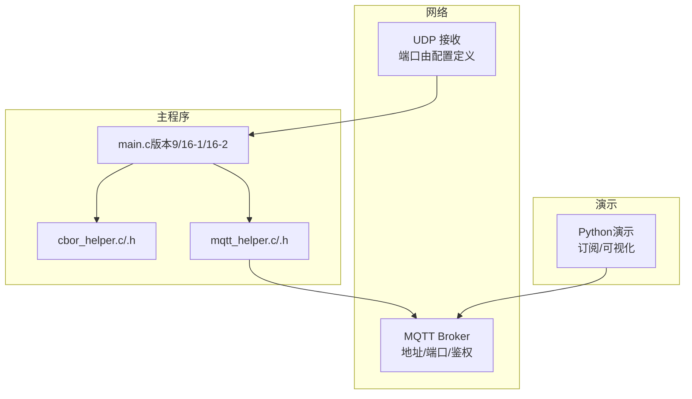
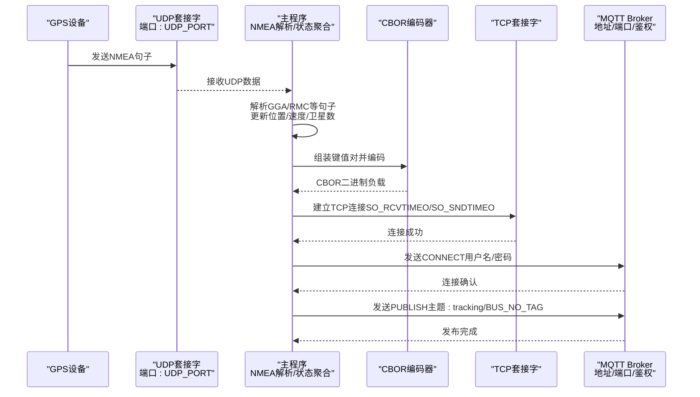
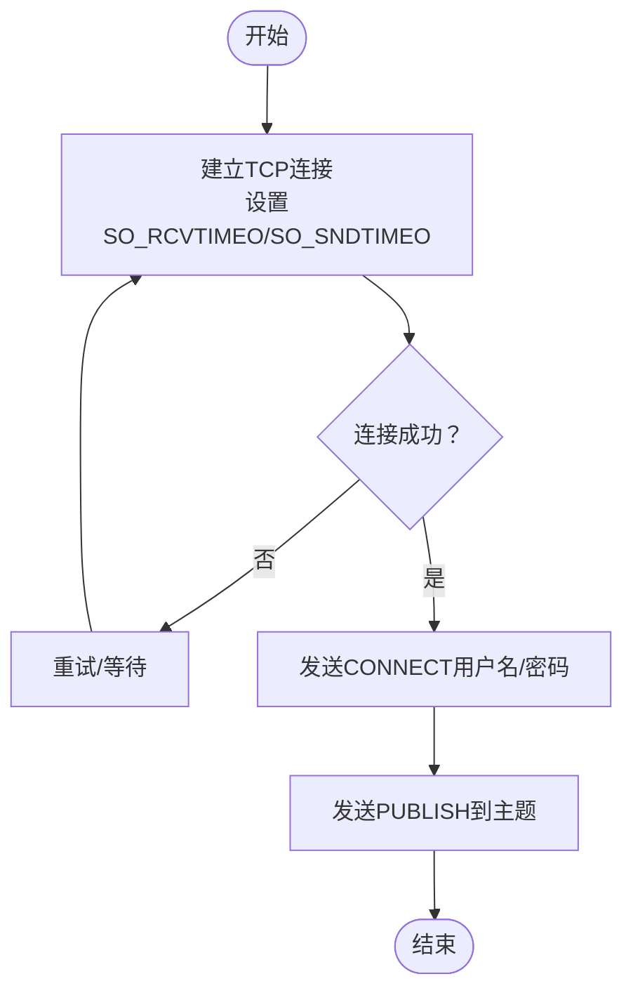
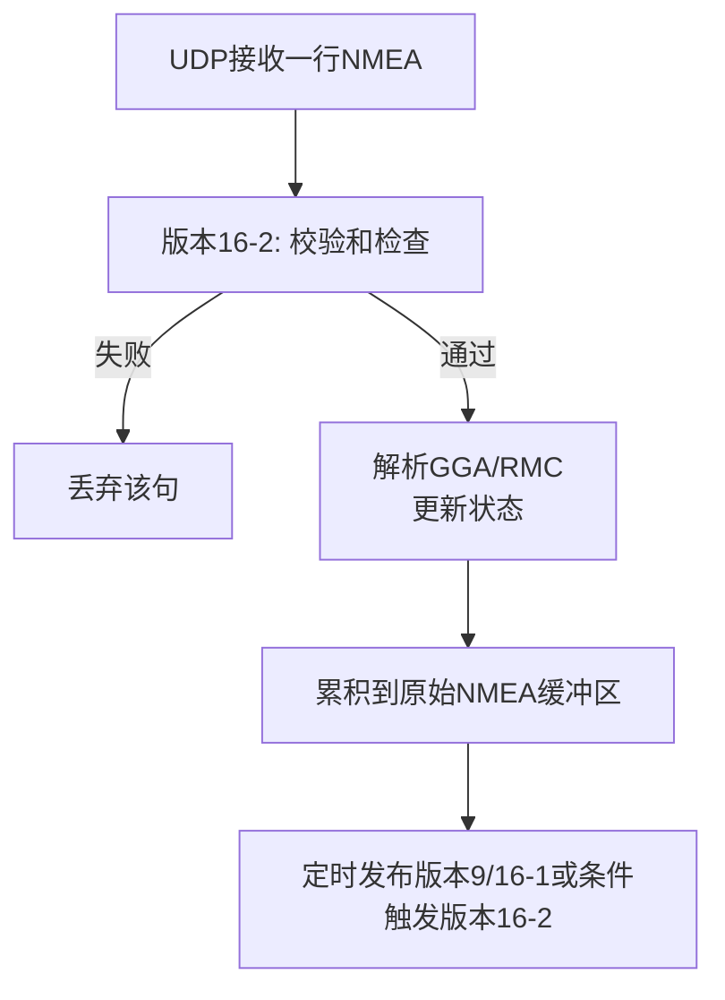
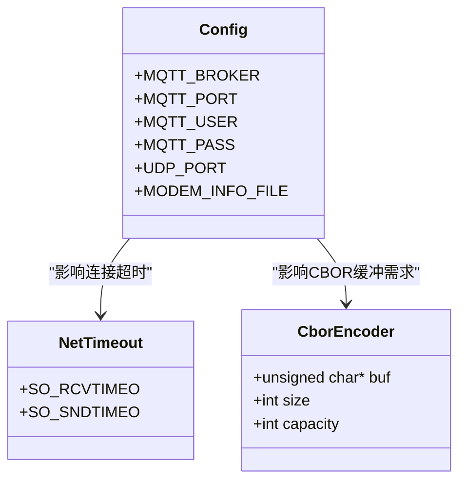
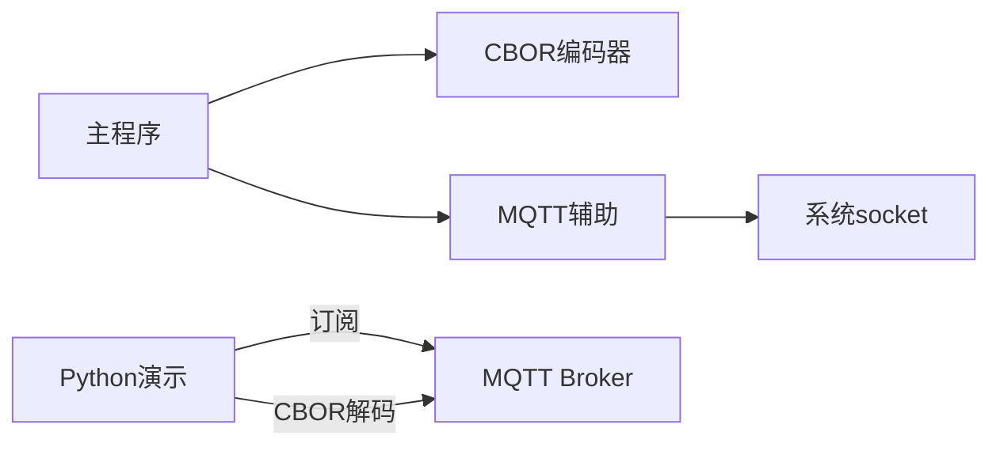

# 配置参数说明

<cite>
**本文引用的文件**
- [main.c（版本16-1）](file://dev_code/dev_code/mqtt_project_16_ver1_based-on-9/main.c)
- [mqtt_helper.c（版本16-1）](file://dev_code/dev_code/mqtt_project_16_ver1_based-on-9/mqtt_helper.c)
- [mqtt_helper.h（版本16-1）](file://dev_code/dev_code/mqtt_project_16_ver1_based-on-9/mqtt_helper.h)
- [cbor_helper.c（版本16-1）](file://dev_code/dev_code/mqtt_project_16_ver1_based-on-9/cbor_helper.c)
- [cbor_helper.h（版本16-1）](file://dev_code/dev_code/mqtt_project_16_ver1_based-on-9/cbor_helper.h)
- [main.c（版本16-2）](file://dev_code/dev_code/mqtt_project_16_ver2_based-on-15/main.c)
- [cbor_helper.c（版本16-2）](file://dev_code/dev_code/mqtt_project_16_ver2_based-on-15/cbor_helper.c)
- [cbor_helper.h（版本16-2）](file://dev_code/dev_code/mqtt_project_16_ver2_based-on-15/cbor_helper.h)
- [main.c（版本9）](file://dev_code/dev_code/mqtt_project_9/main.c)
- [cbor_helper.c（版本9）](file://dev_code/dev_code/mqtt_project_9/cbor_helper.c)
- [visual_mqtt_poc-brt-solo_2_hongdian.py（Python演示）](file://visual_mqtt_poc-brt-solo_2_hongdian-不带rawdata/visual_mqtt_poc-brt-solo_2_hongdian.py)
</cite>

## 目录
1. [简介](#简介)
2. [项目结构](#项目结构)
3. [核心组件](#核心组件)
4. [架构总览](#架构总览)
5. [详细组件分析](#详细组件分析)
6. [依赖关系分析](#依赖关系分析)
7. [性能考虑](#性能考虑)
8. [故障排查指南](#故障排查指南)
9. [结论](#结论)
10. [附录：参数参考与最佳实践](#附录参数参考与最佳实践)

## 简介
本文件为该GPS/MQTT追踪系统的“配置参数说明”参考手册，聚焦以下三类参数：
- MQTT连接参数：服务器地址、端口、用户名、密码
- GPS设备配置参数：UDP端口、数据格式（NMEA句式）、采样频率（由接收轮询与心跳发布共同决定）
- 系统行为设置：日志级别（通过编译期宏控制）、缓冲区大小、超时时间（SO_RCVTIMEO/SO_SNDTIMEO）

文档将解释每个参数的作用机制、默认值、可选范围、推荐配置，并结合不同场景给出配置示例与最佳实践，同时分析参数修改对系统性能的影响。

## 项目结构
该项目包含多个版本的实现，均围绕同一目标：通过UDP接收NMEA数据，解析定位信息，使用CBOR编码后经MQTT发布到指定主题。主要模块包括：
- 主程序：负责UDP监听、NMEA解析、状态聚合、定时发布
- MQTT辅助：封装TCP连接、MQTT CONNECT/PUBLISH报文发送、断开
- CBOR辅助：轻量级CBOR编码器，支持字符串、整数、双精度浮点
- Python演示：用于本地订阅与可视化展示

**图表来源**
- [main.c（版本9）](file://dev_code/dev_code/mqtt_project_9/main.c#L13-L26)
- [main.c（版本16-1）](file://dev_code/dev_code/mqtt_project_16_ver1_based-on-9/main.c#L13-L26)
- [main.c（版本16-2）](file://dev_code/dev_code/mqtt_project_16_ver2_based-on-15/main.c#L14-L27)
- [mqtt_helper.c（版本16-1）](file://dev_code/dev_code/mqtt_project_16_ver1_based-on-9/mqtt_helper.c#L38-L57)
- [visual_mqtt_poc-brt-solo_2_hongdian.py（Python演示）](file://visual_mqtt_poc-brt-solo_2_hongdian-不带rawdata/visual_mqtt_poc-brt-solo_2_hongdian.py#L19-L28)

**章节来源**
- [main.c（版本9）](file://dev_code/dev_code/mqtt_project_9/main.c#L13-L26)
- [main.c（版本16-1）](file://dev_code/dev_code/mqtt_project_16_ver1_based-on-9/main.c#L13-L26)
- [main.c（版本16-2）](file://dev_code/dev_code/mqtt_project_16_ver2_based-on-15/main.c#L14-L27)
- [mqtt_helper.c（版本16-1）](file://dev_code/dev_code/mqtt_project_16_ver1_based-on-9/mqtt_helper.c#L38-L57)
- [visual_mqtt_poc-brt-solo_2_hongdian.py（Python演示）](file://visual_mqtt_poc-brt-solo_2_hongdian-不带rawdata/visual_mqtt_poc-brt-solo_2_hongdian.py#L19-L28)

## 核心组件
- MQTT连接参数
  - 服务器地址：MQTT_BROKER
  - 端口：MQTT_PORT
  - 用户名：MQTT_USER
  - 密码：MQTT_PASS
- GPS设备配置参数
  - UDP端口：UDP_PORT
  - 数据格式：NMEA GGA/RMC等句子（代码中显式匹配）
  - 采样频率：由UDP轮询间隔与心跳发布周期共同决定
- 系统行为设置
  - 缓冲区大小：NMEA原始缓冲区、CBOR输出缓冲区
  - 超时时间：SO_RCVTIMEO/SO_SNDTIMEO（连接超时）
  - 日志级别：通过编译期宏控制（例如仅在调试版本打印详细日志）

**章节来源**
- [main.c（版本9）](file://dev_code/dev_code/mqtt_project_9/main.c#L13-L26)
- [main.c（版本16-1）](file://dev_code/dev_code/mqtt_project_16_ver1_based-on-9/main.c#L13-L26)
- [main.c（版本16-2）](file://dev_code/dev_code/mqtt_project_16_ver2_based-on-15/main.c#L14-L27)
- [mqtt_helper.c（版本16-1）](file://dev_code/dev_code/mqtt_project_16_ver1_based-on-9/mqtt_helper.c#L43-L46)

## 架构总览
下图展示了从UDP接收NMEA到MQTT发布的端到端流程，以及各配置参数在其中的位置与作用。

**图表来源**
- [main.c（版本9）](file://dev_code/dev_code/mqtt_project_9/main.c#L179-L256)
- [main.c（版本16-1）](file://dev_code/dev_code/mqtt_project_16_ver1_based-on-9/main.c#L182-L259)
- [main.c（版本16-2）](file://dev_code/dev_code/mqtt_project_16_ver2_based-on-15/main.c#L245-L289)
- [mqtt_helper.c（版本16-1）](file://dev_code/dev_code/mqtt_project_16_ver1_based-on-9/mqtt_helper.c#L38-L86)
- [cbor_helper.c（版本9）](file://dev_code/dev_code/mqtt_project_9/cbor_helper.c#L38-L89)

## 详细组件分析

### MQTT连接参数
- 参数定义位置
  - 版本9/16-1/16-2：在主程序中以宏形式定义MQTT_BROKER、MQTT_PORT、MQTT_USER、MQTT_PASS
  - 版本16-2：新增BUS_NO、BUS_NO_TAG、PROVIDER_ID、KORIDOR_ID等业务标识
- 作用机制
  - 连接建立：通过TCP套接字连接Broker，设置SO_RCVTIMEO/SO_SNDTIMEO作为连接超时
  - 认证：发送MQTT CONNECT包，携带客户端ID、用户名、密码
  - 发布：成功认证后向主题“itms/bus/gps/tracking/{BUS_NO_TAG}”发布CBOR负载
- 默认值与取值范围
  - 地址：字符串；建议使用内网或公网可达域名/IP
  - 端口：整型；常用1883（明文）、8883（TLS），需与Broker配置一致
  - 用户名/密码：字符串；建议使用强口令并启用TLS
- 性能影响
  - 超时过短：易导致偶发抖动失败；过长：连接阻塞时间增加
  - 认证失败：会重试并阻塞后续发布，应确保凭据正确

**图表来源**
- [mqtt_helper.c（版本16-1）](file://dev_code/dev_code/mqtt_project_16_ver1_based-on-9/mqtt_helper.c#L38-L86)
- [main.c（版本9）](file://dev_code/dev_code/mqtt_project_9/main.c#L167-L177)
- [main.c（版本16-1）](file://dev_code/dev_code/mqtt_project_16_ver1_based-on-9/main.c#L170-L180)
- [main.c（版本16-2）](file://dev_code/dev_code/mqtt_project_16_ver2_based-on-15/main.c#L229-L241)

**章节来源**
- [main.c（版本9）](file://dev_code/dev_code/mqtt_project_9/main.c#L13-L26)
- [main.c（版本16-1）](file://dev_code/dev_code/mqtt_project_16_ver1_based-on-9/main.c#L13-L26)
- [main.c（版本16-2）](file://dev_code/dev_code/mqtt_project_16_ver2_based-on-15/main.c#L14-L27)
- [mqtt_helper.c（版本16-1）](file://dev_code/dev_code/mqtt_project_16_ver1_based-on-9/mqtt_helper.c#L38-L86)

### GPS设备配置参数
- UDP端口
  - 定义位置：主程序宏UDP_PORT
  - 作用：绑定本地UDP端口接收NMEA数据
  - 取值范围：1–65535；避免与系统保留端口冲突
- 数据格式
  - 支持句式：GGA（海拔、卫星数）、RMC（经纬度、速度、航向、定位状态）
  - 解析逻辑：按逗号分隔，校验A状态，转换坐标为十进制度
  - 版本差异：
    - 版本9/16-1：直接拼接原始NMEA句子至缓冲区
    - 版本16-2：按行切分并逐句校验校验和，更稳健
- 采样频率
  - 版本9/16-1：通过select超时（微秒级）控制轮询节奏，无固定采样周期
  - 版本16-2：基于时间戳last_rmc_ms与阈值（毫秒）判断有效速度，发布周期固定（约100ms）
- 性能影响
  - UDP端口占用：需确保防火墙放行与唯一性
  - 解析健壮性：版本16-2的校验和检查可减少错误数据影响
  - 发布频率：越频繁发布，MQTT负载越大，CPU与网络占用越高

**图表来源**
- [main.c（版本9）](file://dev_code/dev_code/mqtt_project_9/main.c#L211-L249)
- [main.c（版本16-1）](file://dev_code/dev_code/mqtt_project_16_ver1_based-on-9/main.c#L214-L249)
- [main.c（版本16-2）](file://dev_code/dev_code/mqtt_project_16_ver2_based-on-15/main.c#L116-L186)
- [main.c（版本16-2）](file://dev_code/dev_code/mqtt_project_16_ver2_based-on-15/main.c#L284-L287)

**章节来源**
- [main.c（版本9）](file://dev_code/dev_code/mqtt_project_9/main.c#L24-L26)
- [main.c（版本16-1）](file://dev_code/dev_code/mqtt_project_16_ver1_based-on-9/main.c#L24-L26)
- [main.c（版本16-2）](file://dev_code/dev_code/mqtt_project_16_ver2_based-on-15/main.c#L25-L27)
- [main.c（版本9）](file://dev_code/dev_code/mqtt_project_9/main.c#L86-L130)
- [main.c（版本16-1）](file://dev_code/dev_code/mqtt_project_16_ver1_based-on-9/main.c#L86-L133)
- [main.c（版本16-2）](file://dev_code/dev_code/mqtt_project_16_ver2_based-on-15/main.c#L116-L165)

### 系统行为设置
- 缓冲区大小
  - 版本9/16-1：原始NMEA缓冲区较大（如2048），用于累积多句
  - 版本16-2：累积缓冲更大（如4096），并维护最近一次NMEA片段（避免过长历史）
  - CBOR输出缓冲：足够容纳对象键值对与数值字段
- 超时时间
  - 连接超时：SO_RCVTIMEO/SO_SNDTIMEO设置为固定秒级，用于TCP连接阶段
- 日志级别
  - 版本9/16-1：在解析到RMC时打印简要日志（位置、信号、卫星数）
  - 版本16-2：未内置日志宏，可通过编译期宏扩展（例如添加DEBUG开关）
- 性能影响
  - 缓冲区过大：内存占用上升；过小：易截断或丢失数据
  - 超时过短：连接失败率上升；过长：资源占用与延迟增大

**图表来源**
- [cbor_helper.h（版本9）](file://dev_code/dev_code/mqtt_project_9/cbor_helper.h#L7-L12)
- [cbor_helper.h（版本16-1）](file://dev_code/dev_code/mqtt_project_16_ver1_based-on-9/cbor_helper.h#L7-L12)
- [cbor_helper.h（版本16-2）](file://dev_code/dev_code/mqtt_project_16_ver2_based-on-15/cbor_helper.h#L7-L12)
- [mqtt_helper.c（版本16-1）](file://dev_code/dev_code/mqtt_project_16_ver1_based-on-9/mqtt_helper.c#L43-L46)
- [main.c（版本9）](file://dev_code/dev_code/mqtt_project_9/main.c#L13-L26)

**章节来源**
- [main.c（版本9）](file://dev_code/dev_code/mqtt_project_9/main.c#L36-L37)
- [main.c（版本16-1）](file://dev_code/dev_code/mqtt_project_16_ver1_based-on-9/main.c#L36-L37)
- [main.c（版本16-2）](file://dev_code/dev_code/mqtt_project_16_ver2_based-on-15/main.c#L42-L44)
- [cbor_helper.c（版本9）](file://dev_code/dev_code/mqtt_project_9/cbor_helper.c#L38-L89)
- [cbor_helper.c（版本16-1）](file://dev_code/dev_code/mqtt_project_16_ver1_based-on-9/cbor_helper.c#L38-L89)
- [cbor_helper.c（版本16-2）](file://dev_code/dev_code/mqtt_project_16_ver2_based-on-15/cbor_helper.c#L38-L89)
- [mqtt_helper.c（版本16-1）](file://dev_code/dev_code/mqtt_project_16_ver1_based-on-9/mqtt_helper.c#L43-L46)

## 依赖关系分析
- 模块耦合
  - 主程序依赖CBOR编码器生成负载，依赖MQTT辅助进行网络交互
  - MQTT辅助依赖系统socket接口与超时配置
- 外部依赖
  - Python演示依赖paho-mqtt与cbor2（可选），用于解码CBOR并可视化

**图表来源**
- [main.c（版本9）](file://dev_code/dev_code/mqtt_project_9/main.c#L147-L177)
- [mqtt_helper.c（版本16-1）](file://dev_code/dev_code/mqtt_project_16_ver1_based-on-9/mqtt_helper.c#L38-L114)
- [visual_mqtt_poc-brt-solo_2_hongdian.py（Python演示）](file://visual_mqtt_poc-brt-solo_2_hongdian-不带rawdata/visual_mqtt_poc-brt-solo_2_hongdian.py#L143-L200)

**章节来源**
- [main.c（版本9）](file://dev_code/dev_code/mqtt_project_9/main.c#L147-L177)
- [mqtt_helper.c（版本16-1）](file://dev_code/dev_code/mqtt_project_16_ver1_based-on-9/mqtt_helper.c#L38-L114)
- [visual_mqtt_poc-brt-solo_2_hongdian.py（Python演示）](file://visual_mqtt_poc-brt-solo_2_hongdian-不带rawdata/visual_mqtt_poc-brt-solo_2_hongdian.py#L143-L200)

## 性能考虑
- 发布频率与网络负载
  - 版本9/16-1：当收到RMC且具备有效定位时立即发布，可能产生高频发布
  - 版本16-2：固定约100ms发布周期，降低网络压力
- CPU占用
  - 高频解析与CBOR编码会增加CPU消耗；建议在低功耗设备上采用版本16-2的节流策略
- 内存占用
  - 较大的NMEA缓冲区与CBOR缓冲区会提升内存占用；根据设备能力调整容量
- 连接稳定性
  - 合理设置SO_RCVTIMEO/SO_SNDTIMEO，避免长时间阻塞；在弱网环境下适当增大

[本节为通用指导，无需特定文件引用]

## 故障排查指南
- 无法连接MQTT
  - 检查Broker地址/端口是否可达，用户名/密码是否正确
  - 观察连接超时设置是否合理
- 发布失败或积压
  - 检查Broker主题权限与QoS设置
  - 降低发布频率或优化网络环境
- GPS数据异常
  - 校验NMEA句式是否完整，版本16-2具备校验和检查
  - 确认UDP端口未被占用且防火墙放行
- Python演示无法显示数据
  - 确认已安装cbor2库，否则将回退为原始负载显示
  - 检查订阅的主题与设备BUS_NO_TAG是否一致

**章节来源**
- [mqtt_helper.c（版本16-1）](file://dev_code/dev_code/mqtt_project_16_ver1_based-on-9/mqtt_helper.c#L38-L86)
- [main.c（版本16-2）](file://dev_code/dev_code/mqtt_project_16_ver2_based-on-15/main.c#L116-L186)
- [visual_mqtt_poc-brt-solo_2_hongdian.py（Python演示）](file://visual_mqtt_poc-brt-solo_2_hongdian-不带rawdata/visual_mqtt_poc-brt-solo_2_hongdian.py#L12-L18)

## 结论
本项目通过清晰的模块划分与稳健的NMEA解析，实现了从GPS设备到MQTT的可靠数据传输。配置参数的核心在于：
- MQTT连接参数需与Broker严格一致
- GPS端口与数据格式需与设备匹配
- 缓冲区与超时参数需结合部署环境与性能目标进行权衡

建议在生产环境中优先采用版本16-2的解析与发布策略，并根据实际网络与设备能力调整缓冲区与发布周期。

[本节为总结性内容，无需特定文件引用]

## 附录：参数参考与最佳实践

### 参数一览与说明
- MQTT连接参数
  - MQTT_BROKER：MQTT服务地址（字符串）
  - MQTT_PORT：MQTT服务端口（整型）
  - MQTT_USER：认证用户名（字符串）
  - MQTT_PASS：认证密码（字符串）
- GPS设备配置参数
  - UDP_PORT：本地UDP监听端口（整型）
  - 数据格式：GGA/RMC等NMEA句式（自动识别）
  - 采样频率：由轮询间隔与发布周期共同决定（版本9/16-1为微秒级轮询，版本16-2为约100ms发布）
- 系统行为设置
  - 缓冲区大小：NMEA原始缓冲、CBOR输出缓冲（根据消息长度与并发量评估）
  - 超时时间：SO_RCVTIMEO/SO_SNDTIMEO（秒级）
  - 日志级别：可通过编译期宏控制（建议仅在开发/测试环境开启）

**章节来源**
- [main.c（版本9）](file://dev_code/dev_code/mqtt_project_9/main.c#L13-L26)
- [main.c（版本16-1）](file://dev_code/dev_code/mqtt_project_16_ver1_based-on-9/main.c#L13-L26)
- [main.c（版本16-2）](file://dev_code/dev_code/mqtt_project_16_ver2_based-on-15/main.c#L14-L27)
- [mqtt_helper.c（版本16-1）](file://dev_code/dev_code/mqtt_project_16_ver1_based-on-9/mqtt_helper.c#L43-L46)

### 默认值与可选范围
- MQTT参数
  - 地址：任意可解析主机名或IP
  - 端口：1–65535；常用1883或8883
  - 用户名/密码：任意字符串
- GPS参数
  - UDP端口：1–65535；避免系统保留端口
  - 数据格式：GGA/RMC为主，版本16-2支持校验和检查
- 行为参数
  - 缓冲区：依据消息体大小预留冗余空间
  - 超时：通常10秒左右，视网络质量调整
  - 日志：建议在开发/测试环境开启，生产环境关闭

**章节来源**
- [mqtt_helper.c（版本16-1）](file://dev_code/dev_code/mqtt_project_16_ver1_based-on-9/mqtt_helper.c#L43-L46)
- [main.c（版本16-2）](file://dev_code/dev_code/mqtt_project_16_ver2_based-on-15/main.c#L116-L186)

### 不同场景下的配置示例
- 开发联调
  - 使用本地Broker（127.0.0.1:1883），开启日志，UDP端口自定义
  - 发布周期保持默认，便于快速验证
- 生产部署（移动车载）
  - 选择稳定Broker（公网或内网高可用），启用TLS与强口令
  - 采用版本16-2的约100ms发布周期，降低网络与CPU压力
  - 根据设备NMEA输出速率调整UDP缓冲区大小
- 低功耗边缘节点
  - 适当增大发布间隔，合并多次定位后再发布
  - 关闭非必要日志，减少I/O

**章节来源**
- [visual_mqtt_poc-brt-solo_2_hongdian.py（Python演示）](file://visual_mqtt_poc-brt-solo_2_hongdian-不带rawdata/visual_mqtt_poc-brt-solo_2_hongdian.py#L19-L28)
- [main.c（版本16-2）](file://dev_code/dev_code/mqtt_project_16_ver2_based-on-15/main.c#L284-L287)

### 参数修改对系统性能的影响
- 提高发布频率
  - 优点：实时性强
  - 风险：MQTT负载、CPU与网络占用上升
- 增大缓冲区
  - 优点：减少截断风险
  - 风险：内存占用增加
- 调整超时
  - 优点：改善弱网适应性
  - 风险：连接阻塞时间延长或误判失败

**章节来源**
- [main.c（版本9）](file://dev_code/dev_code/mqtt_project_9/main.c#L205-L210)
- [main.c（版本16-2）](file://dev_code/dev_code/mqtt_project_16_ver2_based-on-15/main.c#L266-L267)
- [mqtt_helper.c（版本16-1）](file://dev_code/dev_code/mqtt_project_16_ver1_based-on-9/mqtt_helper.c#L43-L46)