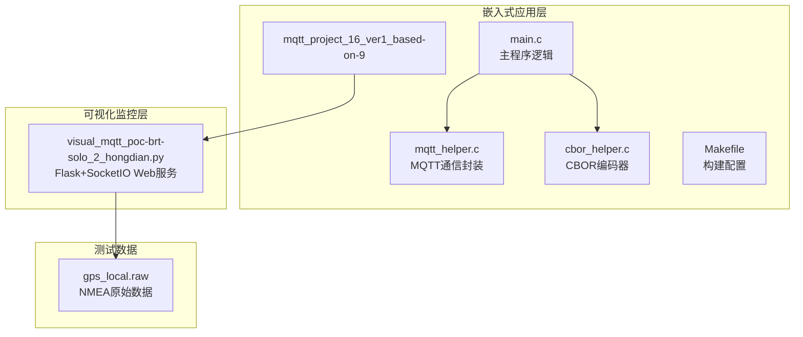
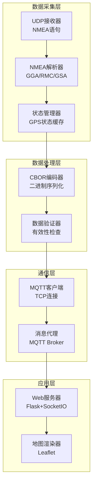
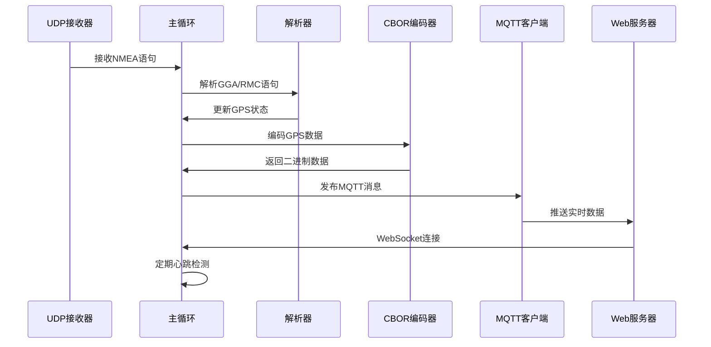
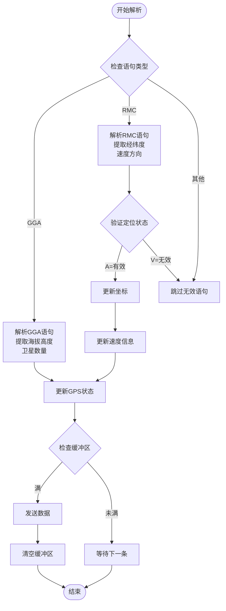
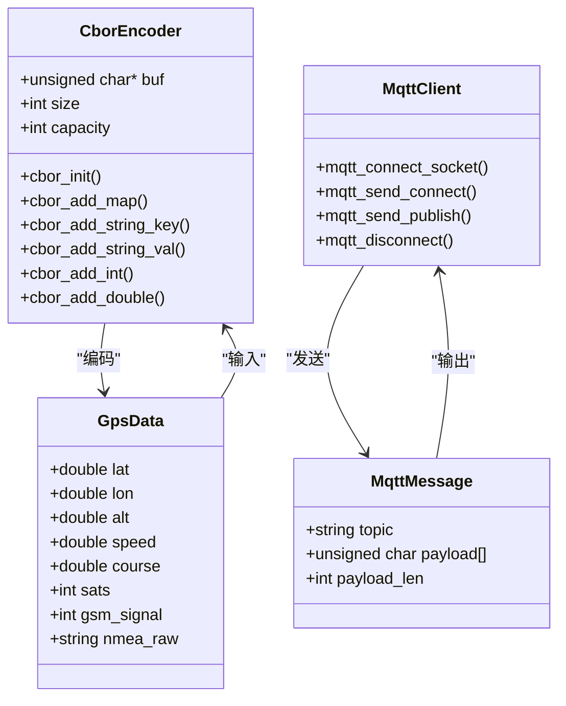
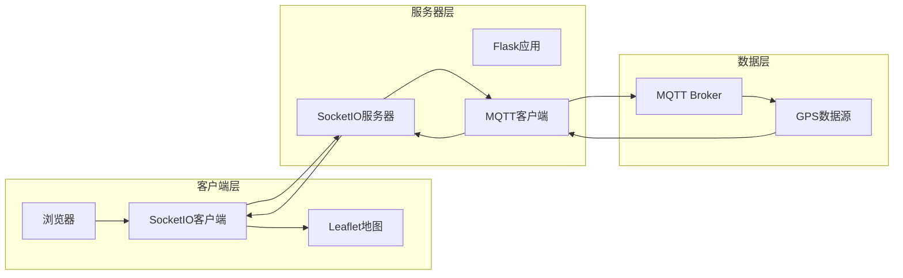
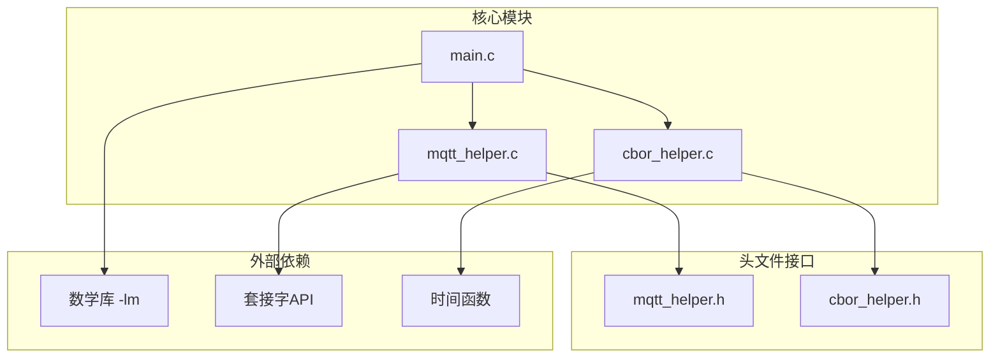

# 项目概述

<cite>
**本文档引用的文件**
- [main.c](file://dev_code/dev_code/mqtt_project_16_ver1_based-on-9/main.c)
- [mqtt_helper.c](file://dev_code/dev_code/mqtt_project_16_ver1_based-on-9/mqtt_helper.c)
- [cbor_helper.c](file://dev_code/dev_code/mqtt_project_16_ver1_based-on-9/cbor_helper.c)
- [mqtt_helper.h](file://dev_code/dev_code/mqtt_project_16_ver1_based-on-9/mqtt_helper.h)
- [cbor_helper.h](file://dev_code/dev_code/mqtt_project_16_ver1_based-on-9/cbor_helper.h)
- [Makefile](file://dev_code/dev_code/mqtt_project_16_ver1_based-on-9/Makefile)
- [visual_mqtt_poc-brt-solo_2_hongdian.py](file://OPENSDT_none-armhf_plugin_mqtt-dummy-16-based-on-15_nmea-debug_16.15.0_2602051525-带rawdata/visual_mqtt_poc-brt-solo_2_hongdian.py)
- [Readme.md.txt](file://dev_code/dev_code/Readme.md.txt)
- [gps_local.raw](file://gps_local.raw)
</cite>

## 目录
1. [简介](#简介)
2. [项目结构](#项目结构)
3. [核心组件](#核心组件)
4. [架构总览](#架构总览)
5. [详细组件分析](#详细组件分析)
6. [依赖关系分析](#依赖关系分析)
7. [性能考虑](#性能考虑)
8. [故障排除指南](#故障排除指南)
9. [结论](#结论)

## 简介

本项目是为印度尼西亚公共交通车辆开发的GPS追踪系统，采用嵌入式设计实现GPS数据采集、NMEA语句解析、MQTT传输和Web可视化监控的完整链路。系统基于OpenSDT平台，通过UDP接收GPS设备输出的NMEA语句，实时解析定位信息，使用CBOR编码压缩数据，通过MQTT协议发布到消息代理，前端使用WebSocket实现实时地图展示。

该系统专为BRT（快速公交）等公共交通场景设计，具有以下特点：
- 实时GPS数据采集与处理
- 多卫星系统支持（GPS、GLONASS、Galileo等）
- GSM信号强度监测
- 原始NMEA数据保留用于调试
- 轻量级嵌入式实现
- 可扩展的可视化监控界面

## 项目结构

项目采用模块化设计，主要分为嵌入式应用层和可视化监控层：

**图表来源**
- [main.c](file://dev_code/dev_code/mqtt_project_16_ver1_based-on-9/main.c#L1-L259)
- [mqtt_helper.c](file://dev_code/dev_code/mqtt_project_16_ver1_based-on-9/mqtt_helper.c#L1-L115)
- [cbor_helper.c](file://dev_code/dev_code/mqtt_project_16_ver1_based-on-9/cbor_helper.c#L1-L89)
- [visual_mqtt_poc-brt-solo_2_hongdian.py](file://OPENSDT_none-armhf_plugin_mqtt-dummy-16-based-on-15_nmea-debug_16.15.0_2602051525-带rawdata/visual_mqtt_poc-brt-solo_2_hongdian.py#L1-L217)

**章节来源**
- [main.c](file://dev_code/dev_code/mqtt_project_16_ver1_based-on-9/main.c#L1-L259)
- [Makefile](file://dev_code/dev_code/mqtt_project_16_ver1_based-on-9/Makefile#L1-L23)

## 核心组件

### 嵌入式GPS数据采集器

系统的核心是一个轻量级的嵌入式应用程序，负责：
- UDP端口监听（默认9999端口）
- NMEA语句接收与缓冲
- GPS数据解析与验证
- CBOR格式化数据打包
- MQTT协议数据发布

### MQTT通信模块

独立的MQTT客户端实现，提供：
- TCP连接管理
- MQTT协议握手
- 二进制负载发送
- 连接断开处理

### CBOR编码器

自实现的CBOR（Concise Binary Object Representation）编码器，支持：
- 键值对映射编码
- 字符串、整数、浮点数编码
- 大端字节序处理
- 内存安全的缓冲区管理

### Web可视化监控

基于Flask和SocketIO的实时监控界面：
- Leaflet地图集成
- 实时GPS轨迹绘制
- 车辆状态信息显示
- 历史轨迹回放

**章节来源**
- [mqtt_helper.h](file://dev_code/dev_code/mqtt_project_16_ver1_based-on-9/mqtt_helper.h#L1-L13)
- [cbor_helper.h](file://dev_code/dev_code/mqtt_project_16_ver1_based-on-9/cbor_helper.h#L1-L27)

## 架构总览

系统采用分层架构设计，确保各组件职责清晰且易于维护：

**图表来源**
- [main.c](file://dev_code/dev_code/mqtt_project_16_ver1_based-on-9/main.c#L179-L259)
- [mqtt_helper.c](file://dev_code/dev_code/mqtt_project_16_ver1_based-on-9/mqtt_helper.c#L38-L115)
- [cbor_helper.c](file://dev_code/dev_code/mqtt_project_16_ver1_based-on-9/cbor_helper.c#L38-L89)
- [visual_mqtt_poc-brt-solo_2_hongdian.py](file://OPENSDT_none-armhf_plugin_mqtt-dummy-16-based-on-15_nmea-debug_16.15.0_2602051525-带rawdata/visual_mqtt_poc-brt-solo_2_hongdian.py#L1-L217)

## 详细组件分析

### 主程序流程

主程序采用事件驱动的循环架构，实现了完整的GPS数据处理流水线：

**图表来源**
- [main.c](file://dev_code/dev_code/mqtt_project_16_ver1_based-on-9/main.c#L201-L259)
- [mqtt_helper.c](file://dev_code/dev_code/mqtt_project_16_ver1_based-on-9/mqtt_helper.c#L59-L108)

### NMEA语句解析算法

系统实现了高效的NMEA语句解析机制，支持多种卫星导航系统：

**图表来源**
- [main.c](file://dev_code/dev_code/mqtt_project_16_ver1_based-on-9/main.c#L86-L133)
- [main.c](file://dev_code/dev_code/mqtt_project_16_ver1_based-on-9/main.c#L224-L249)

### 数据发布流程

系统采用CBOR二进制编码优化网络传输效率：

**图表来源**
- [cbor_helper.h](file://dev_code/dev_code/mqtt_project_16_ver1_based-on-9/cbor_helper.h#L7-L27)
- [mqtt_helper.h](file://dev_code/dev_code/mqtt_project_16_ver1_based-on-9/mqtt_helper.h#L4-L12)
- [main.c](file://dev_code/dev_code/mqtt_project_16_ver1_based-on-9/main.c#L132-L180)

**章节来源**
- [main.c](file://dev_code/dev_code/mqtt_project_16_ver1_based-on-9/main.c#L132-L180)
- [cbor_helper.c](file://dev_code/dev_code/mqtt_project_16_ver1_based-on-9/cbor_helper.c#L38-L89)

### Web可视化架构

前端采用现代Web技术栈实现实时GPS监控：

**图表来源**
- [visual_mqtt_poc-brt-solo_2_hongdian.py](file://OPENSDT_none-armhf_plugin_mqtt-dummy-16-based-on-15_nmea-debug_16.15.0_2602051525-带rawdata/visual_mqtt_poc-brt-solo_2_hongdian.py#L1-L217)

**章节来源**
- [visual_mqtt_poc-brt-solo_2_hongdian.py](file://OPENSDT_none-armhf_plugin_mqtt-dummy-16-based-on-15_nmea-debug_16.15.0_2602051525-带rawdata/visual_mqtt_poc-brt-solo_2_hongdian.py#L1-L217)

## 依赖关系分析

系统采用松耦合设计，各模块间依赖关系清晰：

**图表来源**
- [Makefile](file://dev_code/dev_code/mqtt_project_16_ver1_based-on-9/Makefile#L4-L5)
- [main.c](file://dev_code/dev_code/mqtt_project_16_ver1_based-on-9/main.c#L1-L11)
- [mqtt_helper.c](file://dev_code/dev_code/mqtt_project_16_ver1_based-on-9/mqtt_helper.c#L1-L8)

**章节来源**
- [Makefile](file://dev_code/dev_code/mqtt_project_16_ver1_based-on-9/Makefile#L1-L23)

## 性能考虑

系统在设计时充分考虑了嵌入式环境的性能限制：

### 内存管理
- 使用固定大小缓冲区避免动态内存分配
- 实现缓冲区溢出保护机制
- 定期清理临时数据减少内存占用

### 网络优化
- CBOR二进制编码减少数据体积约60%
- 心跳机制确保连接稳定性
- 异步处理提高并发性能

### 实时性保证
- 150ms超时控制响应延迟
- 选择性发送避免网络拥塞
- 状态缓存提升查询效率

## 故障排除指南

### 常见问题诊断

**GPS数据异常**
- 检查NMEA语句完整性
- 验证卫星数量是否充足
- 确认定位状态为A（有效）

**MQTT连接失败**
- 验证Broker地址和端口配置
- 检查用户名密码认证
- 确认网络连通性

**Web界面无数据**
- 检查WebSocket连接状态
- 验证MQTT主题订阅
- 确认浏览器控制台错误

**章节来源**
- [main.c](file://dev_code/dev_code/mqtt_project_16_ver1_based-on-9/main.c#L42-L61)
- [visual_mqtt_poc-brt-solo_2_hongdian.py](file://OPENSDT_none-armhf_plugin_mqtt-dummy-16-based-on-15_nmea-debug_16.15.0_2602051525-带rawdata/visual_mqtt_poc-brt-solo_2_hongdian.py#L143-L187)

## 结论

该印尼GPS追踪系统展现了优秀的工程实践，成功实现了从嵌入式数据采集到Web可视化的完整解决方案。系统的主要优势包括：

**技术优势**
- 模块化设计便于维护和扩展
- CBOR编码显著降低网络开销
- 实时性强满足交通监控需求
- 跨平台兼容性良好

**应用场景**
- 公共交通车辆实时追踪
- 车队管理与调度优化
- 交通流量分析与预测
- 应急救援响应支持

**未来发展建议**
- 增加数据加密和安全机制
- 扩展多语言支持
- 优化移动端用户体验
- 集成AI预测分析功能

该系统为印尼公共交通智能化建设提供了可靠的技术基础，具有良好的推广价值和应用前景。