# 4G/5G自动切换功能 - 详细流程图

> 基于 `doc_4G_5G_auto_switch_design.md` 设计文档生成
> 
> 文档版本：2.0 | 生成日期：2025-12-31

---

## 流程图索引

- [4G/5G自动切换功能 - 详细流程图](#4g5g自动切换功能---详细流程图)
  - [流程图索引](#流程图索引)
  - [1. 监控系统初始化与生命周期](#1-监控系统初始化与生命周期)
  - [2. 主监控循环流程](#2-主监控循环流程)
  - [3. 质量判断与决策逻辑](#3-质量判断与决策逻辑)
  - [4. 场景1：5G→4G切换流程](#4-场景15g4g切换流程)
  - [5. 场景2：4G→5G切换流程（质量差）](#5-场景24g5g切换流程质量差)
  - [6. 场景3：4G→5G回归流程（定期尝试）](#6-场景34g5g回归流程定期尝试)
  - [7. 完整状态机总览](#7-完整状态机总览)
  - [8. 异常处理流程](#8-异常处理流程)
  - [9. 配置与启动条件流程](#9-配置与启动条件流程)
  - [10. 质量检测详细流程](#10-质量检测详细流程)
  - [11. 防抖与冷却机制详细流程](#11-防抖与冷却机制详细流程)
  - [12. 时间轴示例场景](#12-时间轴示例场景)
    - [场景A：5G质量持续差，切换到4G并保持](#场景a5g质量持续差切换到4g并保持)
    - [场景B：4G质量差，立即回切5G](#场景b4g质量差立即回切5g)
    - [场景C：4G正常，定期尝试回归5G](#场景c4g正常定期尝试回归5g)
  - [13. 参数配置对比表](#13-参数配置对比表)
  - [附录：关键数据结构](#附录关键数据结构)
  - [流程图使用说明](#流程图使用说明)

---

## 1. 监控系统初始化与生命周期

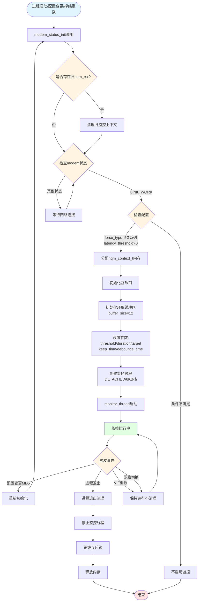

**关键点说明**：
- ✅ **创建时机**：首次进入LINK_WORK + 5G模式 + threshold>0
- ✅ **清理时机**：进程启动/配置变更/掉线重拨/进程退出
- ❌ **禁止清理**：VIF重拨、网络切换（保持连续性）

---

## 2. 主监控循环流程

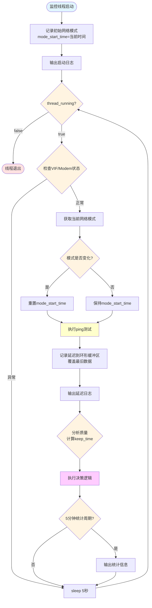

**关键参数**：
- 📊 **采样间隔**：5秒（固定）
- 📊 **缓冲区大小**：12个点（覆盖60秒）
- 📊 **统计周期**：5分钟输出一次统计

---

## 3. 质量判断与决策逻辑

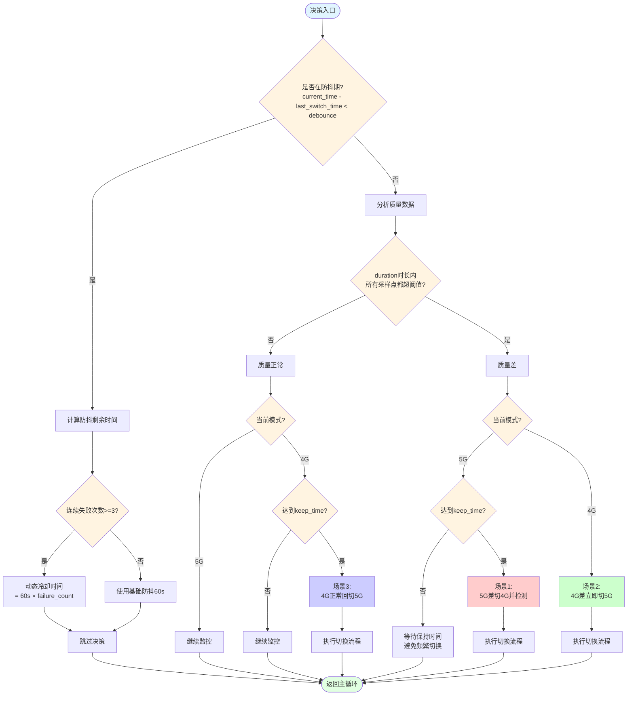

**决策核心**：
- 🔹 **防抖机制**：60秒基础 + 失败次数动态延长
- 🔹 **质量判断**：duration时长内所有点都超阈值
- 🔹 **保持时间**：5G需等待，4G差立即切

---

## 4. 场景1：5G→4G切换流程

```mermaid
graph TD
    Start([5G质量差检测]) --> CheckKeep{达到keep_time?<br/>默认600秒}
    CheckKeep -->|否| Wait[继续等待]
    CheckKeep -->|是| LogSwitch[输出切换日志]
    
    LogSwitch --> SetSkipFreq[设置skip_freq_lock=1<br/>跳过锁频加快切换]
    SetSkipFreq --> SetNetMode[设置网络模式为4G<br/>MDM_CTRL_NET_CUSTOM]
    SetNetMode --> TriggerVIF[触发VIF RULE_UPDATE<br/>启动重拨]
    TriggerVIF --> ResetSkipFreq[恢复skip_freq_lock=0]
    
    ResetSkipFreq --> WaitAttach[等待4G附网<br/>max 120秒]
    WaitAttach --> CheckLoop{循环检查VIF状态}
    
    CheckLoop --> CheckTimeout{超时120秒?}
    CheckTimeout -->|是| AttachFailed[附网失败]
    CheckTimeout -->|否| CheckVIFStatus{VIF状态?}
    
    CheckVIFStatus -->|LINK_WORK| AttachSuccess[附网成功]
    CheckVIFStatus -->|其他| Sleep1s[sleep 1秒]
    Sleep1s --> CheckLoop
    
    AttachFailed --> LogError1[记录超时错误]
    LogError1 --> IncrementFailure1[增加失败计数]
    IncrementFailure1 --> SwitchBack5G1[切回5G模式]
    SwitchBack5G1 --> UpdateTime1[更新last_switch_time<br/>更新mode_start_time]
    UpdateTime1 --> End1([切换失败结束])
    
    AttachSuccess --> LogAttach[输出附网成功日志<br/>记录耗时]
    LogAttach --> StableWait[稳定等待10秒]
    StableWait --> StartDetection[开始4G质量检测<br/>duration=60秒]
    
    StartDetection --> DetectLoop{检测循环}
    DetectLoop --> CheckNetStatus{网络状态?}
    CheckNetStatus -->|断开| NetBroken[网络断开]
    CheckNetStatus -->|正常| DoPing[执行ping测试]
    
    DoPing --> RecordPing[记录延迟]
    RecordPing --> CheckDetectTime{检测满60秒?}
    CheckDetectTime -->|否| Sleep5s[sleep 5秒]
    Sleep5s --> DetectLoop
    CheckDetectTime -->|是| AnalyzeResult[分析检测结果]
    
    NetBroken --> LogError2[记录断网错误]
    LogError2 --> IncrementFailure2[增加失败计数]
    IncrementFailure2 --> SwitchBack5G2[切回5G模式]
    SwitchBack5G2 --> UpdateTime2[更新时间戳]
    UpdateTime2 --> End2([切换失败结束])
    
    AnalyzeResult --> CheckResult{4G质量?}
    CheckResult -->|质量差| Log4GPoor[输出4G质量差日志]
    CheckResult -->|质量好| Log4GGood[输出4G质量好日志]
    
    Log4GPoor --> IncrementFailure3[增加失败计数]
    IncrementFailure3 --> SwitchBack5G3[切回5G模式]
    SwitchBack5G3 --> UpdateTime3[更新时间戳]
    UpdateTime3 --> End3([切换失败结束])
    
    Log4GGood --> ResetFailure[重置失败计数=0]
    ResetFailure --> UpdateSuccess[更新last_switch_time<br/>更新mode_start_time<br/>switch_count++]
    UpdateSuccess --> End4([切换成功，保持4G])
    
    Wait --> EndWait([继续监控])
    
    style Start fill:#e1f5ff
    style End1 fill:#ffcccc
    style End2 fill:#ffcccc
    style End3 fill:#ffcccc
    style End4 fill:#ccffcc
    style EndWait fill:#e1ffe1
    style CheckKeep fill:#fff4e1
    style CheckTimeout fill:#fff4e1
    style CheckVIFStatus fill:#fff4e1
    style CheckNetStatus fill:#fff4e1
    style CheckDetectTime fill:#fff4e1
    style CheckResult fill:#fff4e1
    style StartDetection fill:#ffffcc
```

**流程特点**：
- ⏱️ **保持时间**：600秒（避免频繁切换）
- 🔍 **4G检测**：60秒质量检测（必须通过）
- ⏳ **附网超时**：120秒上限
- 🔄 **失败处理**：切回5G，增加失败计数

---

## 5. 场景2：4G→5G切换流程（质量差）

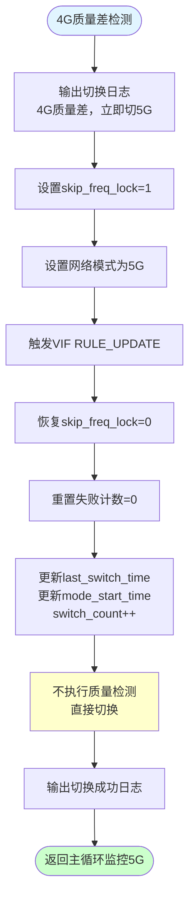

**流程特点**：
- ⚡ **立即切换**：无需等待keep_time
- 🚫 **无质量检测**：避免检测期间抖动误判
- 🎯 **优先回归**：5G是主用网络
- 🔁 **后续监控**：由主循环监控5G质量

**设计理念**：
- 4G是临时备用网络，质量差应快速回到主用5G
- 若5G仍质量差，会通过场景1再次切回4G
- 形成"5G优先，动态调整"的策略

---

## 6. 场景3：4G→5G回归流程（定期尝试）

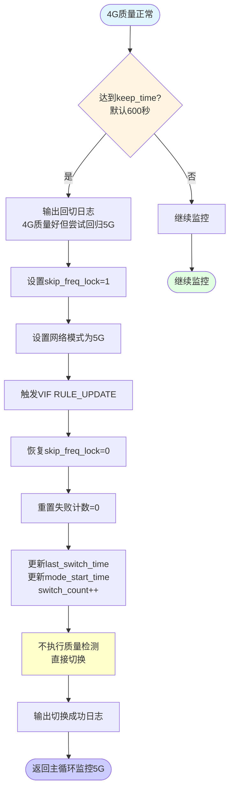

**流程特点**：
- ⏱️ **定期尝试**：600秒周期性回归
- 🎯 **5G优先策略**：即使4G好也要尝试5G
- 🚫 **无质量检测**：直接切换
- 🔁 **后续监控**：由主循环监控5G质量

**设计理念**：
- 避免长期停留在备用网络（4G）
- 定期尝试主用网络（5G）是否恢复
- 平衡网络质量和优先级策略

---

## 7. 完整状态机总览
![[Pasted image 20251231111045.png]]
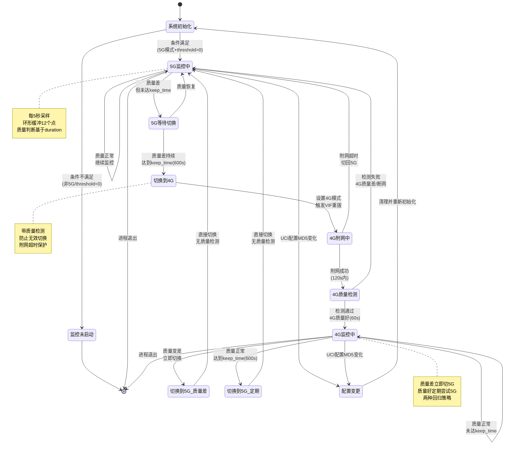


**状态说明**：
- 🟢 **5G监控中**：主状态，优先网络
- 🟡 **5G等待切换**：质量差但未达切换条件
- 🔄 **切换到4G**：执行切换并检测
- 🟠 **4G监控中**：备用状态
- 🔙 **切换到5G**：回归主网络（两种触发）

---

## 8. 异常处理流程

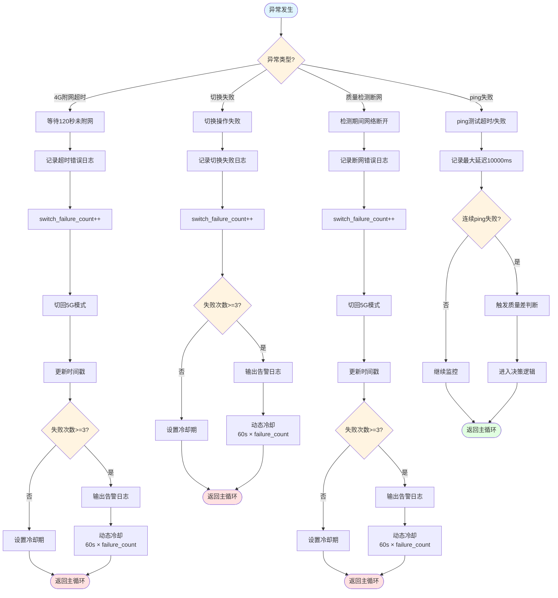

**异常处理机制**：
- ⚠️ **附网超时**：120秒保护，防止长时间等待
- ⚠️ **断网保护**：检测期间断网立即中止
- ⚠️ **失败计数**：记录连续失败，触发动态冷却
- ⚠️ **动态冷却**：60秒 × 失败次数（最小60s）
- ⚠️ **ping失败**：记录最大值，触发质量差判断

---

## 9. 配置与启动条件流程

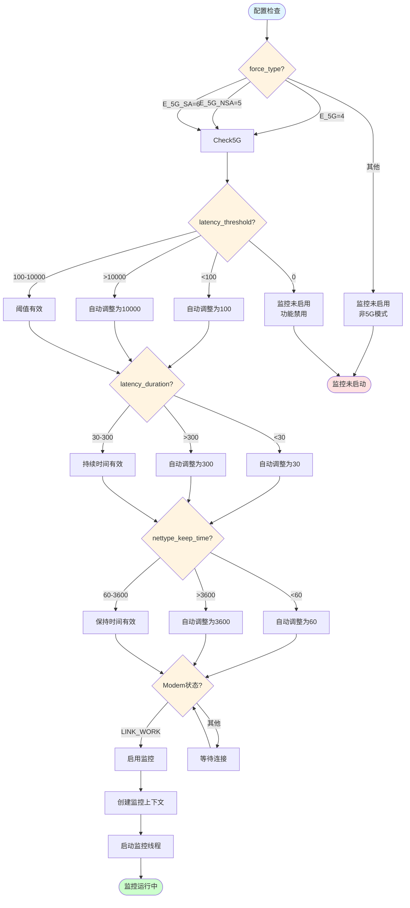

**配置要求**：
- ✅ **force_type**：必须是5G系列（4/5/6）
- ✅ **latency_threshold**：100-10000ms（0=禁用）
- ✅ **latency_duration**：30-300秒
- ✅ **nettype_keep_time**：60-3600秒
- ✅ **状态**：必须LINK_WORK（已连接）

---

## 10. 质量检测详细流程

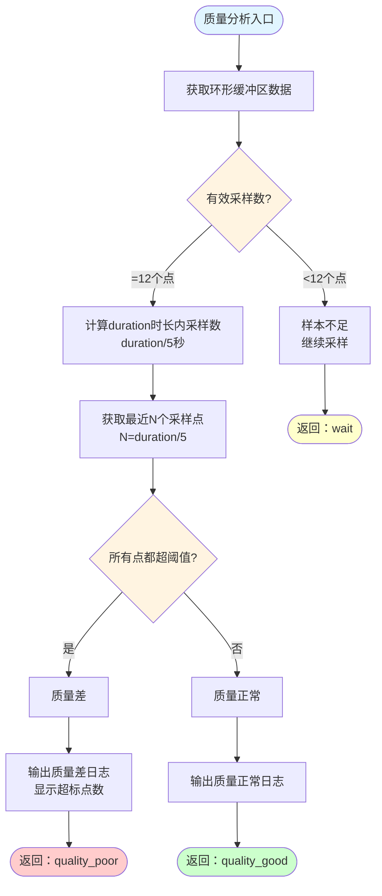

**判定算法**：
```
1. 环形缓冲区容量：12个点（覆盖60秒）
2. 检测窗口：duration秒（默认60秒 = 12个点）
3. 判定条件：窗口内所有采样点都超阈值
4. 采样频率：5秒/次（固定）

示例（duration=60秒）：
- 需要12个连续采样点都超阈值
- 任何一个点低于阈值，判定为质量正常
- 确保质量确实持续变差，避免误判
```

---

## 11. 防抖与冷却机制详细流程

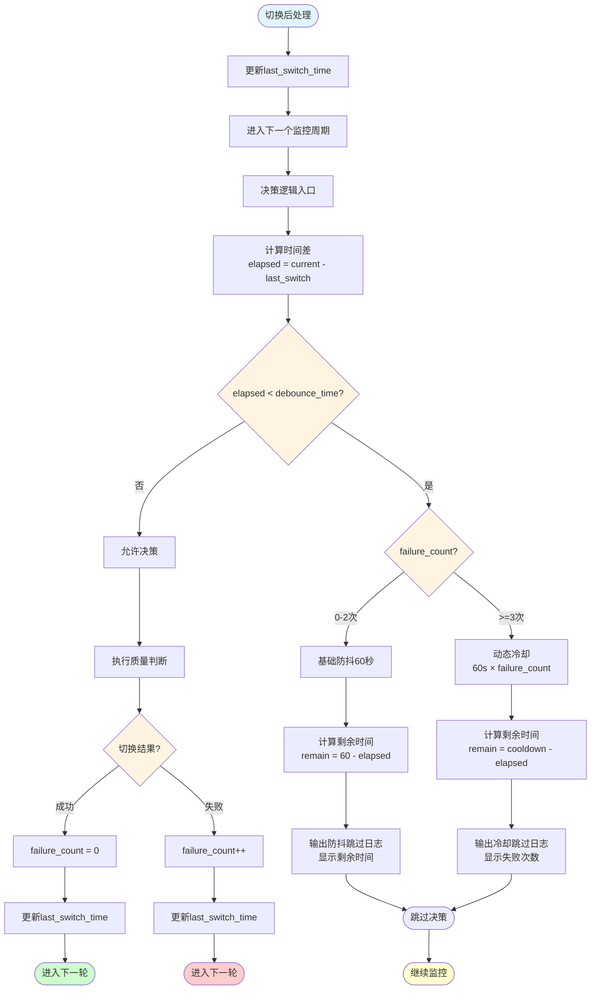

**防抖策略**：
- 🕒 **基础防抖**：60秒（固定）
- 🕒 **动态冷却**：60秒 × 失败次数
- 🕒 **示例冷却时间**：
  - 失败1次：60秒
  - 失败2次：120秒
  - 失败3次：180秒
  - 失败4次：240秒
  - ...以此类推

---

## 12. 时间轴示例场景

### 场景A：5G质量持续差，切换到4G并保持

```mermaid
gantt
    title 场景A：5G→4G切换时间轴
    dateFormat  ss
    axisFormat %S秒
    
    section 5G阶段
    5G正常运行           :done, 00, 60s
    5G质量开始变差       :active, 60, 120s
    质量差持续(未达keep_time) :crit, 60, 600s
    达到keep_time，触发切换 :milestone, 660, 0s
    
    section 切换阶段
    设置4G模式           :active, 660, 5s
    等待4G附网           :active, 665, 15s
    稳定等待10秒         :active, 680, 10s
    4G质量检测60秒       :active, 690, 60s
    
    section 4G阶段
    4G质量合格，保持4G   :done, 750, 300s
```

### 场景B：4G质量差，立即回切5G

```mermaid
gantt
    title 场景B：4G→5G立即回切时间轴
    dateFormat  ss
    axisFormat %S秒
    
    section 4G阶段
    4G正常运行           :done, 00, 60s
    4G质量开始变差       :active, 60, 120s
    质量差持续60秒       :crit, 60, 60s
    达到duration，触发切换 :milestone, 120, 0s
    
    section 切换阶段
    立即设置5G模式       :active, 120, 5s
    无需质量检测         :active, 125, 0s
    
    section 5G阶段
    切换完成，5G运行     :done, 125, 300s
```

### 场景C：4G正常，定期尝试回归5G

```mermaid
gantt
    title 场景C：4G正常定期回切5G时间轴
    dateFormat  ss
    axisFormat %S秒
    
    section 4G阶段
    4G质量正常运行       :done, 00, 600s
    达到keep_time        :milestone, 600, 0s
    
    section 切换阶段
    设置5G模式           :active, 600, 5s
    无需质量检测         :active, 605, 0s
    
    section 5G阶段
    切换完成，5G运行     :done, 605, 300s
```

---

## 13. 参数配置对比表

| 参数 | 快速响应模式 | 默认均衡模式 | 稳定优先模式 |
|------|-------------|-------------|-------------|
| **latency_threshold** | 1000ms | 1000ms | 2000ms |
| **latency_duration** | 30s | 60s | 120s |
| **nettype_keep_time** | 300s (5分钟) | 600s (10分钟) | 1800s (30分钟) |
| **切换灵敏度** | 高（快速切换） | 中等（平衡） | 低（减少切换） |
| **适用场景** | 延迟敏感应用 | 通用场景 | 稳定网络环境 |

---

## 附录：关键数据结构

```c
// 监控上下文结构
typedef struct {
    // 配置参数
    uint32_t latency_threshold;       // 延迟阈值(ms)
    uint32_t latency_duration;        // 持续时间(s)
    char latency_target[64];          // ping目标
    uint32_t nettype_keep_time;       // 保持时间(s)
    uint32_t debounce_time;           // 防抖时间(s，固定60)
    
    // 运行时状态
    struct {
        pthread_t monitor_thread;     // 监控线程ID
        pthread_mutex_t mutex;        // 互斥锁
        int thread_running;           // 线程运行标志
        
        uint32_t latency_buffer[12];  // 环形缓冲区
        uint32_t buffer_index;        // 当前索引
        
        time_t last_switch_time;      // 上次切换时间
        time_t mode_start_time;       // 模式开始时间
        uint32_t switch_count;        // 切换次数
        uint32_t switch_failure_count;// 失败次数
        
        netmode_t current_mode;       // 当前网络模式
    } runtime;
    
    modem_t *modem;                   // 关联的modem对象
} nqm_context_t;
```

---

## 流程图使用说明

1. **在线渲染**：复制Mermaid代码块到以下工具渲染
   - [Mermaid Live Editor](https://mermaid.live/)
   - GitHub/GitLab（原生支持）
   - VS Code + Mermaid插件

2. **导出图片**：使用Mermaid CLI或在线工具导出为PNG/SVG

3. **修改建议**：根据实际代码实现，微调流程细节

---

**文档说明**：
- ✅ 基于设计文档v2.0生成
- ✅ 包含所有关键流程和异常处理
- ✅ 使用Mermaid标准语法
- ✅ 可直接在支持工具中渲染
- ✅ 建议结合设计文档阅读

**生成日期**：2025-12-31  
**作者**：AI Assistant

